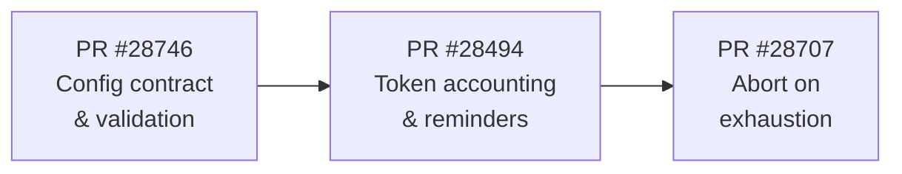
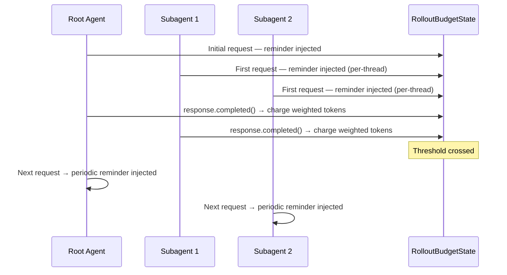
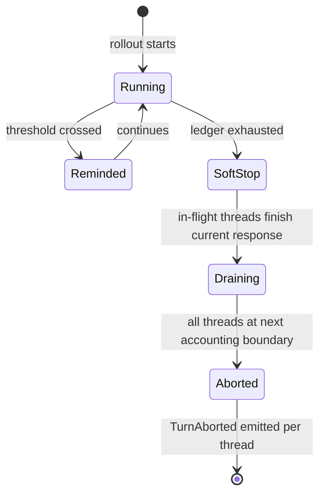

# Rollout Token Budgets in Codex CLI: Cross-Thread Cost Governance for Multi-Agent Workflows


Multi-agent orchestration in Codex CLI delivers real throughput gains — fanning out eight subagents over a large codebase shrinks wall-clock time significantly. The catch is that token consumption scales roughly linearly with thread count[^1]. A parent agent spawning eight workers at o3 produces nine concurrent billing streams, and without a shared spending cap, a runaway subagent or an unexpectedly deep task tree can exhaust a daily quota before noon.

The `rollout_budget` feature, landing in v0.150.0-alpha (August 2026) via a three-PR implementation series[^2][^3][^4], introduces a cross-thread token ledger that aggregates usage across all agent threads in a single Codex session, delivers periodic budget reminders, and aborts turns when the limit is exhausted. It is the first native cost-governance primitive in Codex CLI that operates at the rollout level rather than the single-turn level.

---

## The Problem: Per-Turn Budgets Do Not Compose

The existing `token_budget` feature in Codex CLI controls context-window consumption at the level of a single model call[^5]. Raise it too low and tasks stall; raise it to match your largest task and every small task is unconstrained. Neither approach gives you a meaningful ceiling on what a multi-session orchestration run can spend in total.

With `multi_agent_v2`, a single `codex exec` invocation can spawn several layers of subagents. Each thread has its own context, its own approval mode, and its own per-turn budget — but there is no shared counter across the tree. A five-level fan-out running in parallel can produce dozens of simultaneous turns, each charging against the same API key, with no visibility into the aggregate until the invoice arrives.

`rollout_budget` addresses this by introducing a single atomic ledger (`RolloutBudgetState`) shared across every thread in a rollout, tracking a single `weighted_tokens_used` floating-point accumulator.[^3]

---

## Implementation Architecture

The feature was shipped as three sequential pull requests:



**PR #28746** defines the configuration contract: a new `[features.rollout_budget]` section in `config.toml` with full validation. It deliberately contains no runtime behaviour — no tracking, no reminders, no stopping.[^2]

**PR #28494** implements the accounting loop and reminder injection. Token charges occur when `response.completed()` executes, using usage data from the Responses API. Reminders are injected into the model's context at configured intervals.[^3]

**PR #28707** propagates budget exhaustion through `CodexErr::TurnAborted`, the same error path used for user-initiated stops. The implementation is a soft boundary: in-flight threads complete their current response before observing the exhausted ledger, but every subsequent accounting boundary returns `TurnAborted`.[^4]

---

## Configuration Reference

Add a `[features.rollout_budget]` block to `~/.codex/config.toml`:

```toml
[features.rollout_budget]
enabled = true
limit_tokens = 200000
reminder_interval_tokens = 20000
sampling_token_weight = 1.0
prefill_token_weight = 0.1
```

### Field Reference

| Key | Type | Default | Description |
|-----|------|---------|-------------|
| `enabled` | bool | `false` | Activates the rollout budget feature |
| `limit_tokens` | integer | required | Maximum weighted tokens for this rollout |
| `reminder_interval_tokens` | integer | 10% of limit | Reminder injection threshold |
| `sampling_token_weight` | float | `1.0` | Multiplier applied to sampling (output) tokens |
| `prefill_token_weight` | float | `0.1` | Multiplier applied to prefill (input) tokens |

### Weighting Rationale

Separating sampling and prefill weights reflects the actual cost structure of frontier model APIs: output tokens are typically billed at 3–5× the rate of input tokens[^5]. The defaults weight sampling at 1.0 and prefill at 0.1, so a turn that generates 1,000 output tokens and reads 10,000 input tokens charges `(1000 × 1.0) + (10000 × 0.1) = 2,000` weighted tokens — approximating the relative cost impact rather than raw token count.

You can flatten to equal weighting (`prefill_token_weight = 1.0`) if you prefer a simpler model, or zero out prefill entirely (`prefill_token_weight = 0.0`) to track output-only consumption.

### Config Lock Files

Resolved defaults are materialised into config lock files at session start, preventing behavioural drift during replay operations[^2]. This follows the precedent established by `multi_agent_v2` config persistence — if you replay a session log, the budget parameters are identical to the original run.

---

## Reminder System Mechanics

The reminder system injects budget status into the model's context so it can self-regulate pacing — stopping early, coarsening searches, or compacting proactively.

### Reminder Format

```
You have weighted 42,000 tokens left in the shared session token budget.
```

### Delivery Rules

- **Initial reminder**: Delivered with the first request in each thread context, so every subagent starts aware of the budget ceiling.[^3]
- **Periodic reminders**: Trigger when aggregate weighted usage crosses a configured interval boundary. If multiple thresholds are crossed before a thread sends its next request, a single reminder with the current remainder is inserted (no accumulation of stale reminders).
- **Post-compaction reminders**: Appended after the compaction summary, preserving the initial context stability phase. Compaction events do not reset the delivery counter — the budget reminder follows the compaction note rather than replacing it.
- **Per-thread delivery tracking**: The system tracks each thread's observation state independently to ensure every active thread in the fan-out observes all crossed thresholds.



---

## Abort Mechanics: Soft Boundary Design

When the shared ledger is exhausted, the implementation propagates `CodexErr::TurnAborted` through the standard task wrapper rather than using a custom error path[^4]. The task wrapper emits normal `aborted-turn` events, so session logs, the agents dashboard, and any PostToolUse hooks observe the abort with the same structure as a user-initiated stop.

### Soft Boundary, No Fanout

The design explicitly avoids immediate cross-thread `Op::Interrupt` fanout. In-flight threads that have already started generating a response can complete that response. Budget exhaustion is observed at the next `response.completed()` accounting call — typically the boundary between one model turn and the next.

This means a rollout that hits the limit may continue briefly as in-flight work finishes, but will not start new turns. The window is at most one generation step per active thread.



### Compaction Abort

If compaction is triggered while the ledger is exhausted, the compaction process itself aborts without retrying or emitting generic errors[^4]. This prevents a compaction cycle from burning additional budget on a rollout that has already exceeded its ceiling.

---

## Interaction with Multi-Agent v2

The `rollout_budget` feature is additive to the `multi_agent_v2` orchestration system. `agents.max_threads` (defaulting to 6, configurable up to 8 spawned threads plus the root) controls concurrency; `rollout_budget` controls aggregate spend.

A practical configuration for a bounded parallel review run:

```toml
[features.multi_agent_v2]
enabled = true

[agents]
max_threads = 4
max_depth = 3

[features.rollout_budget]
enabled = true
limit_tokens = 500000
reminder_interval_tokens = 50000
sampling_token_weight = 1.0
prefill_token_weight = 0.1
```

With this setup, Codex will spawn at most four concurrent subagents to depth three, and the entire tree will abort cleanly once 500,000 weighted tokens are consumed — regardless of which thread crosses the boundary first.

The `codex agents` dashboard introduced in v0.149.0 displays per-thread status but does not yet surface aggregate rollout budget consumption[^6]. ⚠️ Budget monitoring currently requires parsing `rollout.jsonl` manually or instrumenting a PostToolUse hook.

---

## Indexed Web Search: A Related Governance Tool

Shipped in the same v0.150.0-alpha cycle[^7], `web_search = "indexed"` adds a fourth option alongside the existing `disabled`, `cached`, and `live` modes:

```toml
web_search = "indexed"

[features]
standalone_web_search = true
```

Indexed mode permits live search queries while restricting direct page fetches to URLs admitted by OpenAI's server-side index gate (`index_gated_web_access: true`). It occupies the middle ground between `cached` (pre-indexed snapshot, no live fetches) and `live` (unrestricted current-web access):

| Mode | Search currency | Page fetch | Network risk |
|------|----------------|-----------|-------------|
| `cached` | Snapshot | None | None |
| `indexed` | Live query | Server-gated URLs | Low |
| `live` | Live query | Any URL | High |

From a cost-governance perspective, indexed mode matters alongside `rollout_budget` because live web fetches can trigger recursive browsing patterns that consume tokens aggressively. Restricting page fetches to server-gated URLs caps the blast radius of web tool calls within a multi-agent rollout.

---

## Identified Gaps

The three-PR series ships the core primitive, but several workflow integration points are absent from the initial implementation:

- **No aggregate dashboard visibility**: The `codex agents` dashboard shows per-thread task status but does not display rollout budget consumption in real time.[^6]
- **No rollout.jsonl budget events**: The structured session log does not emit budget-crossing or abort events as queryable records — you cannot grep for budget exhaustion in post-hoc analysis.
- **No per-thread budget allocation**: The ledger is shared without weighting threads differently. You cannot allocate 60% of the budget to a primary task and 40% to background verification subagents.
- **No carry-over between forks**: `codex exec fork` creates a new session; the rollout budget counter resets to zero rather than inheriting the parent session's consumption.
- **Prefill weight default asymmetry**: The default `prefill_token_weight = 0.1` means a high-context session (large AGENTS.md, many files in context) has effectively cheaper prefill charges than a lean session. Teams with large repositories may want to tune this upward to prevent underestimating cost.

---

## Practical Patterns

### Pattern 1: Hard Cap for CI Pipelines

In CI, you want a hard ceiling — not reminders. Set `reminder_interval_tokens` very low (or to 1) to ensure the model never runs far past any threshold:

```toml
[features.rollout_budget]
enabled = true
limit_tokens = 100000
reminder_interval_tokens = 1000
sampling_token_weight = 1.0
prefill_token_weight = 0.0   # ignore input tokens in CI
```

### Pattern 2: Model-Tier-Aware Budgeting

o3 and o4-mini have different cost profiles. Override the budget in named profiles:

```toml
[profiles.expensive]
model = "o3"

[profiles.expensive.features.rollout_budget]
enabled = true
limit_tokens = 100000

[profiles.lean]
model = "o4-mini"

[profiles.lean.features.rollout_budget]
enabled = true
limit_tokens = 400000
```

Invoke as `codex --profile expensive` or `codex --profile lean`. The budget scales inversely with model cost, keeping spend bounded across model tiers.

### Pattern 3: PostToolUse Budget Hook

Until the agents dashboard surfaces budget consumption natively, a PostToolUse hook can log weighted token usage to a local counter:

```json
{
  "hooks": {
    "PostToolUse": [{
      "matcher": ".*",
      "handler": {
        "type": "command",
        "async": true,
        "command": ["bash", "-c", "jq -r '.usage // empty' >> /tmp/rollout-usage.log"]
      }
    }]
  }
}
```

Note the `async: true` flag — budget logging should not block the model's next turn. This is a workaround until native dashboard integration arrives.

---

## Citations

[^1]: [Codex CLI Multi-Agent Orchestration v2: Complete Guide — Codex Knowledge Base](https://codex.danielvaughan.com/2026/04/11/codex-cli-multi-agent-orchestration-v2-complete-guide/) — "raising max_threads beyond 6 increases token consumption roughly linearly"

[^2]: [PR #28746 — [codex] add rollout token budget configuration (1/N) — openai/codex](https://github.com/openai/codex/pull/28746) — defines configuration contract, validation, and config lock-file materialisation

[^3]: [PR #28494 — [codex] rollout budget implementation (2/N) — openai/codex](https://github.com/openai/codex/pull/28494) — implements `RolloutBudgetState`, accounting loop, reminder injection mechanics and per-thread delivery tracking

[^4]: [PR #28707 — [codex] abort turns when rollout budgets expire (token budget 3/3) — openai/codex](https://github.com/openai/codex/pull/28707) — propagates `CodexErr::TurnAborted` on ledger exhaustion; soft boundary design with no cross-thread fanout

[^5]: [Codex CLI Rate-Limit Reset Banking and Usage Optimisation — Codex Knowledge Base](https://codex.danielvaughan.com/2026/06/12/codex-cli-rate-limit-reset-banking-usage-optimisation-cost-control-profiles-token-budgets/) — per-turn `token_budget` feature and API tier cost structures

[^6]: [The Codex Agents Dashboard: Interactive Task Management Arrives in v0.149.0 — Codex Knowledge Base](https://codex.danielvaughan.com/2026/08/21/codex-agents-dashboard-v0149/) — dashboard capabilities and identified gaps including absence of aggregate cost metrics

[^7]: [PR #28489 — Add indexed web search mode — openai/codex](https://github.com/openai/codex/pull/28489) — introduces `web_search = "indexed"` with `index_gated_web_access: true` server-side gating
