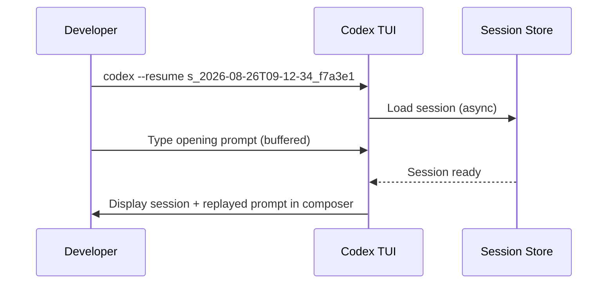

# What You Can See, You Can Steer: Codex CLI v0.148.0's `/export`, Cost Visibility, and `codex exec fork`


Codex CLI v0.148.0, shipped on 18 August 2026, bundled four session-workflow improvements that often get overshadowed by the headline async hooks and Bedrock Runtime stories.[^1] Taken individually, `/export`, cost estimates in `/status`, startup prompt drafting, and `codex exec fork` are incremental quality-of-life additions. Taken together they represent a coherent shift in how Codex CLI treats a session: from an ephemeral, opaque conversation to something that is **observable, branchable, and portable**. This article unpacks each feature, explains the mechanics, and shows how they compose into a workflow that senior developers will actually want to use.

## The Problem Being Solved

Prior to v0.148.0 a Codex CLI session had an unfortunate property: you could not see what it was costing until it was over, you could not save it for later review without screen-recording hacks, and the only way to explore an alternative approach was to start fresh or accept that you had muddied the current thread. The session was a black box with one exit — the terminal scrollback.

Three classes of friction drove feature requests:

1. **Post-hoc discovery of cost** — developers hit `/status` expecting a spend summary and found nothing actionable.[^2]
2. **Knowledge evaporation** — valuable reasoning chains in multi-hour sessions simply scrolled off and were never captured.[^3]
3. **Fear of branching** — forking a session programmatically required knowing an internal session ID and invoking undocumented flags.[^4]

v0.148.0 addresses all three directly.

## `/export`: Portable Conversation Markdown

The `/export` slash command (PR #37358) writes the full TUI conversation — both user turns and agent responses — to Markdown.[^1] Two destinations are supported:

- **Clipboard** — type `/export` with no argument; the session lands in your system clipboard, ready to paste into a GitHub issue, Confluence page, or Slack thread.
- **File** — type `/export path/to/output.md` to write to disk.

The output is clean Markdown: code blocks are typed fenced blocks, tool calls are represented as collapsed sections, and compaction boundaries are marked. A typical 50-turn debugging session produces a readable 4–8 KB file that serves as both documentation and audit trail.

### Practical Uses

```bash
# During a session: export to the repo's docs directory
/export docs/sessions/2026-08-26-auth-refactor.md

# Or grab to clipboard, then paste into GitHub issue description
/export
```

The export captures the conversation at point-in-time. Unlike the raw `~/.codex/sessions/<id>/` JSONL rollout files, the Markdown rendering is immediately human-readable. Teams running regulated workflows — SOC 2 audit trails, architectural decision records — now have a frictionless path from agent session to durable artefact.

## Cost Visibility in `/status`, Status Lines, and Terminal Titles

PRs #38281 and #38282 surface estimated thread credits or cost across three surfaces:[^1]

| Surface | How It Appears |
|---|---|
| `/status` output | Line item with current thread spend estimate |
| TUI status bar | Running tally visible at bottom of screen |
| Terminal title | Prefixed to the window/tab title for at-a-glance monitoring |

The estimate updates after each turn completion. For workspaces connected to the token-based billing model introduced in 2026, the figure is shown in credits; for API key users it reflects approximate token cost.[^2]

```
 codex v0.148.0 · session s_2026-08-26T09-12-34_f7a3e1 · ~$0.84 · 12 turns
```

This single addition changes the economics of long-horizon tasks. Previously, a developer discovering a \$40 session cost at the end of the day had no mid-run signal to trigger a pause-and-review. Now the signal is ambient — in the terminal title — without requiring any explicit monitoring step.

### What "Eligible Workspaces" Means

The release notes mention "eligible workspaces" without specifics.[^1] In practice, cost visibility requires that your workspace is configured with a billing-integrated model provider (either the OpenAI API with a key that has billing metadata, or Bedrock Runtime with a cost-allocation tag). ⚠️ Workspaces using local or custom providers that do not expose token counts will show `--` instead of a figure.

## Draft Prompts During Startup

PRs #38642 and #38788 allow the composer to accept input while the TUI is still initialising.[^1] Before this change, the keyboard was locked during the resume or fork boot sequence — sometimes a multi-second wait on large sessions. Developers lost keystrokes, which meant retyping the opening prompt after the ready signal.

The fix is simple: input is buffered from the moment the TUI launches and replayed once the composer is ready. Progress indicators for resume and fork operations display in the status bar so you can see what is happening without the blank-screen anxiety.



For session resume workflows in CI or scripted pipelines, the buffered input means `codex --resume <id> --message "..."` launches and delivers the first message without a synchronisation delay.

## `codex exec fork` and the TUI Archive/Restore Cycle

Session forking existed before v0.148.0 but required knowing the session ID and invoking `codex --fork <id>` from the shell.[^4] PRs #37367, #37369, and #37371 add two improvements:[^1]

1. **`codex exec fork`** — a non-interactive command that forks a session by ID into a new session, usable from shell scripts, CI pipelines, and subagent orchestration.
2. **TUI archive and restore** — in the resume picker (`codex --resume`), sessions can now be archived (hidden from the default list) or unarchived without leaving the interface.

### Fork Syntax

```bash
# Fork from the end of a session
codex --fork s_2026-08-26T09-12-34_f7a3e1

# Fork from a specific event index (e.g. before the agent took a wrong turn)
codex --fork s_2026-08-26T09-12-34_f7a3e1 --at 23

# Non-interactive fork into a new session, then pass an opening message
codex exec fork s_2026-08-26T09-12-34_f7a3e1 --message "Try the alternative approach using Redis instead of Postgres"
```

The session ID format is `s_YYYY-MM-DDTHH-MM-SS_[random]`.[^4] Forking is copy-on-write: the original session is never mutated, so the fork is genuinely safe to experiment with.

### The Hypothesis Exploration Pattern

The canonical use-case is branching before a risky or expensive agent step:

```mermaid
flowchart TD
    A[Session in progress\ns_2026-08-26_main] -->|Agent proposes approach A| B{Branch point}
    B -->|Keep going| C[Main session\napproach A]
    B -->|Fork before approach B| D[Forked session\napproach B]
    C --> E[/export docs/approach-a.md]
    D --> F[/export docs/approach-b.md]
    E --> G[Compare artefacts\nPick winner]
    F --> G
```

Combined with `/export`, the pattern is: fork before a divergence, let both branches run, export each to Markdown, and compare. This is the session equivalent of `git worktree add` — same project, isolated execution context, no shared state pollution.

### Archive/Restore for Session Hygiene

The resume picker accumulates sessions rapidly during active development. The archive feature is a soft-delete: archived sessions are hidden from the picker but remain on disk and are fully restorable. A practical housekeeping workflow:

```bash
# Archive all sessions older than 7 days (shell one-liner using the JSONL index)
codex sessions list --json | jq -r '.[] | select(.created_at < "2026-08-19") | .id' \
  | xargs -I{} codex sessions archive {}
```

⚠️ The `codex sessions list --json` flag and `codex sessions archive` sub-command syntax is based on community documentation and may differ from the shipped implementation — verify with `codex sessions --help` on your installed version.

## Putting It Together: A Post-Incident Workflow

Consider a production incident workflow that combines all four features:

1. **Resume the overnight triage session** — start typing the morning debrief prompt before the TUI finishes loading (draft during startup).
2. **Check the spend** — glance at the terminal title to confirm you are not already at the daily budget ceiling before issuing expensive tool calls.
3. **Fork before the risky migration step** — `codex exec fork <triage-session-id>` to preserve the investigation state.
4. **Run the migration in the fork** — if it goes wrong, the original session is untouched.
5. **Export both sessions** — `/export docs/incident-2026-08-26-triage.md` and `/export docs/incident-2026-08-26-migration.md` for the post-mortem.
6. **Archive the superseded branch** — keep the resume picker clean.

This loop — observe, branch, export, archive — is only possible because all four features shipped together.

## Identified Gaps

v0.148.0 does not address everything:

- **No `/export` for non-TUI sessions** — `codex -p "..."` non-interactive runs cannot be exported via the slash command; you must parse the rollout JSONL manually.
- **Cost estimates are per-thread, not per-agent** — in multi-agent sessions (`multi_agent_v2`), the `/status` figure reflects the orchestrator thread only; subagent spend is not aggregated. The v0.150.0-alpha rollout token budget feature adds cross-thread tracking but as a hard cap, not a visibility primitive.[^5]
- **Archive is CLI-only** — the desktop app resume picker does not yet surface archive/restore controls; sessions archived via CLI appear hidden in the desktop UI with no restore path.
- **Fork permission profile restoration** is handled (a separate bug fix in the release[^1]) but the restored profile is logged only in the JSONL trace, not displayed in the TUI status bar.

## Citations

[^1]: OpenAI. "Release 0.148.0 · openai/codex." GitHub, 18 August 2026. <https://github.com/openai/codex/releases/tag/rust-v0.148.0>
[^2]: Releasebot. "Codex Updates by OpenAI — August 2026." <https://releasebot.io/updates/openai/codex>
[^3]: openai/codex Issue #17241. "Export chat session in the Codex Desktop App as a markdown file." GitHub. <https://github.com/openai/codex/issues/17241>
[^4]: Vaughan, Daniel. "Codex CLI Session Lifecycle: Archive, Resume, Fork, and Compact." Codex Knowledge Base, 5 June 2026. <https://codex.danielvaughan.com/2026/06/05/codex-cli-session-lifecycle-archive-resume-fork-compact-management/>
[^5]: Codex CLI v0.150.0-alpha rollout token budget coverage: see `2026-08-26-codex-cli-rollout-token-budget-cross-thread-cost-governance-multi-agent.md` in this knowledge base.
