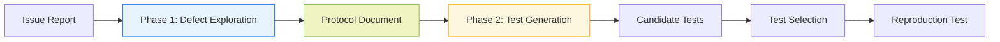

# DPIAgent: Divide, Protocol, Isolate — What Agentic Test Generation Teaches Us About Multi-Phase Codex CLI Workflows


---

Agentic systems fail in a particular way when tasks are too long: the agent drifts from its original objective mid-trajectory, becomes distracted by intermediate artefacts, and arrives at outputs that are superficially plausible but functionally wrong. Liu et al. at Microsoft call this **goal drift**, and their DPIAgent framework — submitted to arXiv on 24 August 2026 — demonstrates that the solution is architectural rather than prompting-based.[^1]

The context is SWT-Bench Verified, a 433-instance benchmark that inverts SWE-Bench's question: instead of asking whether an agent can *fix* a bug, it asks whether the agent can write a test that *reproduces* it — a test that fails on the original code and passes after the developer's patch is applied.[^2] Reproduction test generation is unglamorous compared to full issue resolution, yet it is arguably the more commercially relevant capability: a reliable reproduction test is the precondition for every safe automated repair, regression suite, and CI gate.

DPIAgent achieves **81.76 % success rate on SWT-Bench Verified using GPT-5**, rising to **86.17 % with test selection optimisation**, for an improvement of up to **11.88 percentage points over the strongest baselines on GPT-5-Mini**.[^1] Those numbers are competitive with the top of the public leaderboard (TEX-T at 87.0 %, LogicStar L*Agent at 84.0 %)[^2], and they arrive without a custom model — purely from structural changes to the agentic harness.

## The Goal-Drift Problem in Long-Horizon Agent Tasks

Reproduction test generation is a natural stress-test for goal drift. A monolithic agent loop must simultaneously:

1. Understand the issue report and localise the relevant code paths
2. Construct hypothesis-driven test cases
3. Execute those tests and interpret failures
4. Refine based on execution feedback

When these concerns are entangled in a single context, the agent routinely confuses exploratory tool calls with confirmatory ones, overwrites useful intermediate state, and substitutes proximate sub-goals for the original objective.[^1] The longer the trajectory, the higher the probability of drift — a compounding problem as repositories grow more complex.

## The DPI Framework: Three Structural Principles

DPIAgent decomposes reproduction test generation into two clearly bounded phases governed by three design principles:



### Divide

The task is split into two distinct phases with explicit handoff boundaries:

- **Phase 1 — Defect Exploration:** The agent reads issue descriptions, traces call graphs, instruments code paths, and forms a causal hypothesis about where and how the bug manifests. It does *not* write tests in this phase.
- **Phase 2 — Test Generation:** Armed with the hypothesis, a fresh agent context writes, runs, and refines tests against the reproduction specification. It does *not* revisit the exploration artefacts beyond the protocol document.

The boundary prevents the exploratory context from contaminating the generative context and vice versa.[^1]

### Protocol

Between phases, DPIAgent writes a structured **handoff document** that captures:

- The localised fault hypothesis (file, function, line range)
- The reproduction strategy (which code path to exercise, what state to set up)
- The expected failure signature (exception type, assertion mismatch, exit code)
- Negative constraints (anti-patterns confirmed *not* to reproduce the fault)

This document is the sole shared context between phases. It prevents information loss — a recurring failure mode in phase-partitioned systems where Phase 2 loses the insights discovered in Phase 1 — while keeping the two contexts genuinely separate.[^1]

### Isolate

Each phase receives a **phase-specific toolset**. Phase 1 gets repository navigation, call-graph analysis, and code-search tools. Phase 2 gets test scaffolding, execution, and assertion helpers. Neither phase has access to the other's tools.

This prevents the common failure where an agent in Phase 2, blocked on test construction, regresses to re-doing exploration rather than following the protocol.[^1] Constraining the action space is equivalent to narrowing the policy: fewer degrees of freedom forces adherence to the intended strategy.

## Results in Context

DPIAgent's performance sits at the frontier of SWT-Bench Verified without requiring any model fine-tuning:[^1][^2]

| System | Backbone | SWT-Bench Verified |
|---|---|---|
| TEX-T | Claude 4 | 87.0 % |
| LogicStar L*Agent | — | 84.0 % |
| **DPIAgent + selection** | GPT-5 | **86.17 %** |
| **DPIAgent** | GPT-5 | **81.76 %** |
| Best prior baseline | GPT-5-Mini | ~70 % (inferred)[^1] |

The consistent gains across three LLM backbones confirm the improvement comes from architecture, not from one model's idiosyncratic strengths.[^1] The test selection optimisation — which uses a second-pass classifier to rank candidate tests before returning the final result — adds a further ~4.4 percentage points at modest cost.

## Mapping DPI to Codex CLI

The DPI pattern is not benchmark-specific. Any Codex CLI workflow involving a prolonged exploration phase followed by a generative phase benefits from the same decomposition. Here is how to approximate each principle with current Codex CLI primitives.

### Divide: Named Profiles for Phase Separation

Use `config.toml` named profiles to encode phase intent:

```toml
[profile.explore]
model = "codex-mini-latest"
model_reasoning_effort = "high"
approval_policy = "on-request"

[profile.generate]
model = "o4-mini"
model_reasoning_effort = "medium"
approval_policy = "auto-edit"
```

Invoke each phase explicitly:

```bash
# Phase 1 — exploration
codex --profile explore --prompt "Explore the issue at #4821 and write a hypothesis document to /tmp/dpi-protocol.md"

# Phase 2 — generation
codex --profile generate --prompt "Using /tmp/dpi-protocol.md, write a fail-to-pass reproduction test"
```

The explicit `--profile` flag makes the phase boundary visible and auditable.

### Protocol: AGENTS.md as the Handoff Anchor

Instruct Phase 1 to write the protocol document to a predictable path and make Phase 2 read it before acting:

```markdown
# AGENTS.md (Phase 2 context)

## Mandatory Pre-Flight

Before writing any test code, read `/tmp/dpi-protocol.md` in full.
Do not use any exploratory tools (grep, find, read) unless explicitly
called for by the protocol document. Treat the fault hypothesis as fixed.

## Protocol Document Schema

The document must contain:
- fault_location: file + function + line range
- reproduction_strategy: call path and state setup
- expected_failure: exception or assertion pattern
- negative_constraints: approaches confirmed not to reproduce
```

This hard-codes the Phase 2 contract into the instruction context, reducing the probability that the agent skips the handoff step.[^3]

### Isolate: Tool Restriction via hooks.json

Use `PreToolUse` hooks to enforce phase-specific tool access. During Phase 2, block exploratory tools with exit code 2:

```json
{
  "hooks": {
    "PreToolUse": [
      {
        "matcher": "shell",
        "handler": {
          "type": "command",
          "command": [
            "bash", "-c",
            "echo $CODEX_TOOL_INPUT | grep -qE '(grep|find|cat|ls)' && echo '{\"decision\":\"block\",\"reason\":\"Exploration tools disabled in generation phase\"}' && exit 2 || exit 0"
          ]
        }
      }
    ]
  }
}
```

### Test Selection: PostToolUse Classification

DPIAgent's test selection optimisation maps to a `PostToolUse` hook on `apply_patch` that runs a lightweight classifier against the generated test before committing:

```bash
#!/usr/bin/env bash
# post_test_selection.sh — invoked by PostToolUse after apply_patch
PATCH_FILE=$(echo "$CODEX_TOOL_OUTPUT" | jq -r '.path')
python3 classify_reproduction_test.py "$PATCH_FILE" \
  --protocol /tmp/dpi-protocol.md \
  --threshold 0.75 || {
  echo '{"decision":"block","reason":"Test does not match protocol reproduction strategy"}'
  exit 2
}
```

Exit code 2 causes Codex to surface the block as a tool-use failure, triggering automatic retry without human intervention.[^4]

## Identified Gaps When Applying DPI in Codex CLI

The DPI pattern exposes limitations in current Codex CLI primitives:

- **No phase-tagging in rollout JSONL.** Phase transitions are invisible in execution traces, making it impossible to measure exploration vs. generation token spend separately.
- **No native protocol schema enforcement.** AGENTS.md cannot enforce that the protocol document conforms to a required schema before Phase 2 starts; this must be done by a PreToolUse hook on the `read_file` event.
- **PostToolUse cannot inspect test execution results directly.** The hook receives the patch content, not the test runner output; a separate shell step is needed to run the test and feed results back.
- **Profile switching within a session is not supported.** The `--profile` flag applies to the session at start; switching mid-session requires a new `codex exec` invocation or session fork.[^5]
- **Tool isolation is approximate.** PreToolUse hooks block at the shell level; MCP tools require a separate policy server to enforce catalog restrictions.

## Why Architecture Beats Prompting

DPIAgent's core finding — that structural decomposition outperforms monolithic prompting by 11.88 percentage points on the same model — mirrors results from prior work on agent scaffold design.[^6] The mechanism is straightforward: a constrained action space and bounded context cannot drift as far as an unconstrained one. Codex CLI's hooks, profiles, and AGENTS.md together form a harness layer capable of encoding DPI-style constraints, but only if developers deliberately use them for phase separation rather than as a monolithic instruction document.

For teams running automated test-generation pipelines on top of Codex CLI, adopting the DPI pattern means the difference between an agent that occasionally produces useful reproduction tests and one that does so reliably at scale.

## Citations

[^1]: Liu, H., Liu, S., Zhang, X., Luo, J., Kang, Y., Wu, J., Yang, F., Huang, Y., Gao, P., Li, S., & Lu, Y. (2026). *DPIAgent: Divide, Protocol, Isolate for Agentic Reproduction Test Generation*. arXiv:2608.23341. https://arxiv.org/abs/2608.23341

[^2]: SWT-Bench. (2026). *SWT-Bench: Assessing capabilities at Unit Test Generation*. Retrieved 26 August 2026 from https://swtbench.com/

[^3]: Gao, X., & Chen, Y. (2026). *From Agent Behaviour to Agent-Friendly Documentation: An Empirical Study of How Coding Agents Discover, Read, and Write Technical Documentation*. arXiv:2608.20195. https://arxiv.org/abs/2608.20195

[^4]: OpenAI. (2026). *Codex CLI v0.148.0 Release: Async Hooks and MCP Tool Hooks*. GitHub Releases. https://github.com/openai/codex/releases/tag/rust-v0.148.0

[^5]: OpenAI. (2026). *Codex CLI v0.149.0 Release: Agents Dashboard, Working Directory Commands, Queue*. GitHub Releases. https://github.com/openai/codex/releases/tag/rust-v0.149.0

[^6]: Zheng, X. et al. (2026). *Echo: Graph-Enhanced Retrieval and Execution Feedback for Issue Reproduction Test Generation*. arXiv:2603.07326. https://arxiv.org/abs/2603.07326
