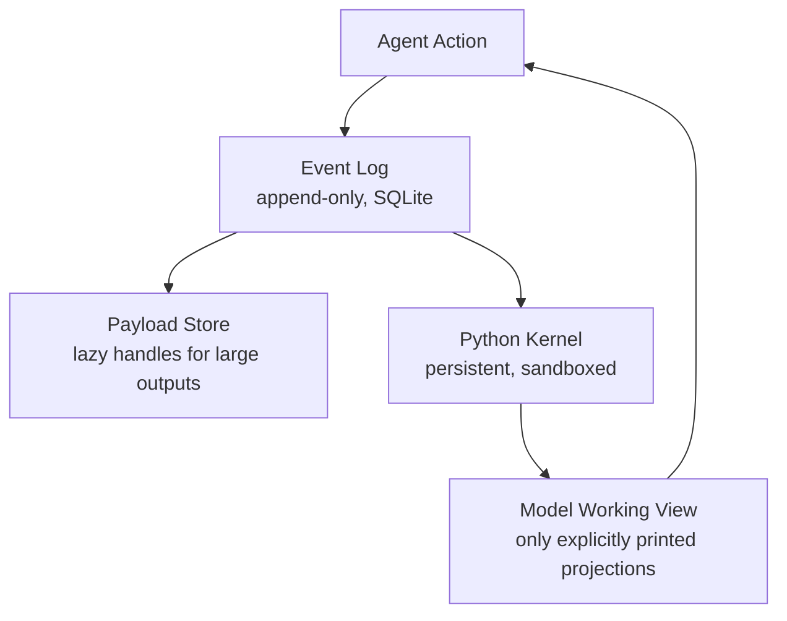

# Scroll: What Treating Context as an Executable Environment Tells Us About Codex CLI's Compaction Limits


Codex CLI's automatic context compaction works by summarising older conversation turns into a compressed representation, discarding detail to free token headroom.[^1] That is the industry default. Lin et al. (Alibaba Group / Columbia University, arXiv:2608.21690, August 2026) argue it is the wrong default — and their *Scroll* system, which treats context as a *programmatically queryable environment* rather than a prompt to be shrunk, achieves 37.4 percentage-point improvements on the hardest long-horizon benchmarks.[^2] This article unpacks the architecture, evaluates its implications for how you configure Codex CLI today, and identifies where the gap will eventually need to close.

## The Core Problem: Compaction Is Amnesia by Another Name

When Codex CLI reaches `model_auto_compact_token_limit`, it fires a summarisation pass using the active `compact_prompt`.[^1] The summary replaces the raw history. Detail that was not explicitly captured in the summary is permanently lost from the agent's working memory.

This is fine for short tasks. For long-horizon workflows — multi-day migrations, deep refactors across hundreds of files, iterative research loops — the cumulative information loss across multiple compaction cycles becomes a primary failure driver. Agents re-explore already-explored paths, re-read already-read files, and make decisions that contradict conclusions reached hours earlier.[^3]

The paper frames the underlying problem precisely: "What long-horizon agents lack is not a shorter view of their history but an explicit account of their own execution state."[^2]

## Scroll's Architecture

Scroll introduces a three-component **Session Environment** that replaces the conventional prompt window:



**Event Log** — An append-only SQLite store assigns every interaction a stable address. Tool outputs, observations, and model responses are entries with stable IDs. Nothing is ever deleted from the log.[^2]

**Payload Store** — Large tool outputs (file contents, test results, diffs) are externalised as lazy handles. The Event Log entry holds only metadata and a pointer; the payload is fetched on demand. This prevents routine operations from bloating the log.[^2]

**Persistent Python Kernel** — A sandboxed kernel persists across model calls, maintaining a typed namespace. Tool outputs can be bound to Python variables. Derived computations (diffs, summaries, filtered lists) can be stored as named objects rather than re-serialised into each subsequent prompt.[^2]

### The Four Operations

Models interact with the Session Environment through four primitives written as executable code:

| Operation | Purpose | Mechanism |
|-----------|---------|-----------|
| `locate` | Find relevant events | BM25 search over Event Log |
| `materialize` | Recover exact content | Fetch payload by Event Log address |
| `compute` | Transform session state | Python expressions over kernel namespace |
| `expose` | Inject into working view | Explicit `print()` output only |

The critical constraint is the last one: **only printed output enters the model's working context for the next call**. The agent must be intentional about what it surfaces. This prevents the context window from filling with tool outputs that are present but irrelevant to the current step.[^2]

## Eviction Without Amnesia

As the working view approaches budget limits, Scroll evicts stale spans — but the originals remain in the Event Log and remain addressable. A tiered **eviction index** maintains "headlines" (compact landmarks tied to exact Event Log addresses), allowing the agent to navigate directly to evicted regions via `materialize` rather than scanning the full log.[^2]

The space complexity of the eviction index is O(k log_k n), where n is total event count and k is the branching factor of the headline tree. This is the key architectural claim: you can manage unbounded session history with a bounded overhead structure, and the agent never truly forgets — it merely needs to re-materialise on demand.[^2]

Ablation results confirm each component's contribution:

- **Lossy variant** (no original records, only summaries): BEAM_10M score degrades to 19.9 (from 73.1) — compaction-style amnesia catastrophically damages compositional recall tasks.[^2]
- **No persistent kernel**: –7.3 points on scenarios requiring derived state (computed diffs, aggregated metrics).[^2]
- **No eviction index**: –1.8 points, concentrated in scattered-evidence tasks where the agent must retrieve across multiple non-adjacent log segments.[^2]

The lossy-variant collapse is the most striking result. It directly quantifies the cost of what Codex CLI does today.

## Benchmark Results

Evaluated using Qwen3.8-Max as the backbone across six model variants:

| Benchmark | Scroll | Prior Best | Delta |
|-----------|--------|-----------|-------|
| LongMemEval_S | 94.8% | — | Competitive |
| BEAM_10M | 73.1% | 68.0% | +5.1pp |
| LOCA_256K | 86.7% | 49.3% | +37.4pp |

LOCA_256K is the most relevant to software engineering: it tests whether agents can answer queries about 256K-token repository snapshots after extended interaction.[^2] The 37.4pp gain over the prior best published long-horizon agent represents a qualitative shift — agents can now reliably reason over repository-scale history without systematic forgetting.

## What This Means for Codex CLI Today

Scroll's architecture is a research system; it is not an available Codex CLI configuration. But its results inform how you should configure and structure Codex CLI sessions today to minimise compaction damage.

### Tune Compaction Thresholds

```toml
# config.toml
[model.gpt-5-codex]
model_auto_compact_token_limit = 160000   # Fire earlier, preserve more context pre-summary
```

Firing compaction earlier means each summary has more headroom for detail.[^1] Counterintuitively, more frequent but richer summaries outperform infrequent summaries that must compress heavily.

### Use a Structured Compact Prompt

The `experimental_compact_prompt_file` parameter accepts a path to a custom compaction prompt.[^1] Encoding Scroll's insight — explicitly request a structured handoff that preserves execution state, not just a narrative summary:

```toml
# config.toml
experimental_compact_prompt_file = ".codex/compact_prompt.md"
```

```markdown
<!-- .codex/compact_prompt.md -->
You are compacting a Codex session. Produce a structured handoff with these sections:
1. CURRENT_TASK: What the agent was doing at the point of compaction
2. FILES_MODIFIED: List of files changed, with one-line change descriptions
3. DECISIONS: Key decisions made and their rationale
4. PENDING: Next steps not yet taken
5. CONTEXT_VARS: Key variable values (branch names, PR numbers, test counts, etc.)

Preserve exact values (numbers, filenames, hashes) over prose summaries.
```

This mirrors Scroll's `expose` primitive — forcing the model to be intentional about what state must survive the compaction boundary.

### Use PostToolUse Hooks as a Manual Event Log

Until Codex CLI has native execution-state tracking, a PostToolUse hook can append structured entries to a session ledger that the agent can re-read across compaction boundaries:

```json
{
  "hooks": {
    "PostToolUse": [
      {
        "matcher": ".*",
        "handler": {
          "type": "command",
          "command": [
            "bash", "-c",
            "echo '{\"ts\":\"'$(date -u +%Y-%m-%dT%H:%M:%SZ)'\",\"tool\":\"'$CODEX_TOOL_NAME'\",\"file\":\"'$CODEX_TOOL_ARG_PATH'\"}' >> .codex/session-ledger.jsonl"
          ],
          "async": true
        }
      }
    ]
  }
}
```

The ledger file accumulates across compaction cycles. Including `.codex/session-ledger.jsonl` in AGENTS.md with an instruction to read it at session start provides approximate Event Log semantics.[^2]

### Session Forking for Clean-Context Subtasks

Codex CLI v0.148.0 introduced session forking.[^4] Where Scroll materialises historical state on demand, you can approximate the same pattern by forking a session before a large subtask, passing the parent session's summary as the initial prompt, and merging conclusions back. This gives fresh-context execution without full context loss.

## Gaps That Remain

Scroll's architecture exposes several Codex CLI limitations that configuration alone cannot bridge:

- **No append-only trace store** — `rollout.jsonl` records turns in chronological order but is not designed for random-access retrieval by address.[^2]
- **No persistent kernel** — There is no cross-turn Python namespace. State computed in one turn must either be written to disk or re-serialised into the prompt.
- **No BM25 index over session history** — The `locate` operation has no native equivalent. Agents must re-read files or rely on compacted summaries.
- **Compaction is destructive** — There is no mechanism to retain original event records whilst evicting them from the working context window. Once compacted, fine detail is irretrievable without re-running the generating steps.

These are architectural gaps, not configuration issues. Scroll's results suggest they matter materially at session lengths that are increasingly common in production agentic workflows.

## The Broader Implication

The lossy-variant ablation — BEAM_10M collapsing from 73.1 to 19.9 when original records are discarded — is effectively a controlled experiment on what summarise-and-forget compaction costs. The 53-point penalty is not an edge case; it reflects the systematic information loss that occurs every time a coding agent hits a context limit and compacts.

Scroll's primary contribution is not just the 37.4pp gain on LOCA_256K. It is the demonstration that a principled, programmatically-addressable event log with explicit state management is qualitatively different from compression. For Codex CLI practitioners running long-horizon tasks, the practical takeaway is clear: structured compact prompts, earlier compaction thresholds, and hook-based ledgers are mitigations, not solutions. The solution is architecturally closer to Scroll than to the current summarise-and-forget model.

## Citations

[^1]: OpenAI Codex CLI documentation — `model_auto_compact_token_limit`, `compact_prompt`, and `experimental_compact_prompt_file` configuration: <https://github.com/openai/codex/issues/4106>
[^2]: Lin, Y., Zhu, E., Ang, E., Ding, B., & Zhou, J. (2026). *Context as an Environment: Programmatic Context Management for Long-Horizon Agents*. arXiv:2608.21690. <https://arxiv.org/abs/2608.21690>
[^3]: Empirical study on context compression instability in long-horizon agents: Min et al. (2026). *Toward Reliable Context Compression for Long-Horizon Agents*. arXiv:2608.06503. <https://arxiv.org/abs/2608.06503>
[^4]: Codex CLI v0.148.0 release — session forking and restoration controls: <https://releases.sh/openai/codex>
[^5]: LongHorizon-Harness: Manage-Execute-Audit loop for long-horizon coding agents. arXiv:2608.01964. <https://arxiv.org/abs/2608.01964>
[^6]: Ledger: Runtime state tracking for long-horizon coding agents. Wang et al. (2026). arXiv:2608.00808. <https://arxiv.org/abs/2608.00808>
[^7]: Codex CLI context compaction architecture and configuration deep-dive: <https://codex.danielvaughan.com/2026/03/31/codex-cli-context-compaction-architecture/>
