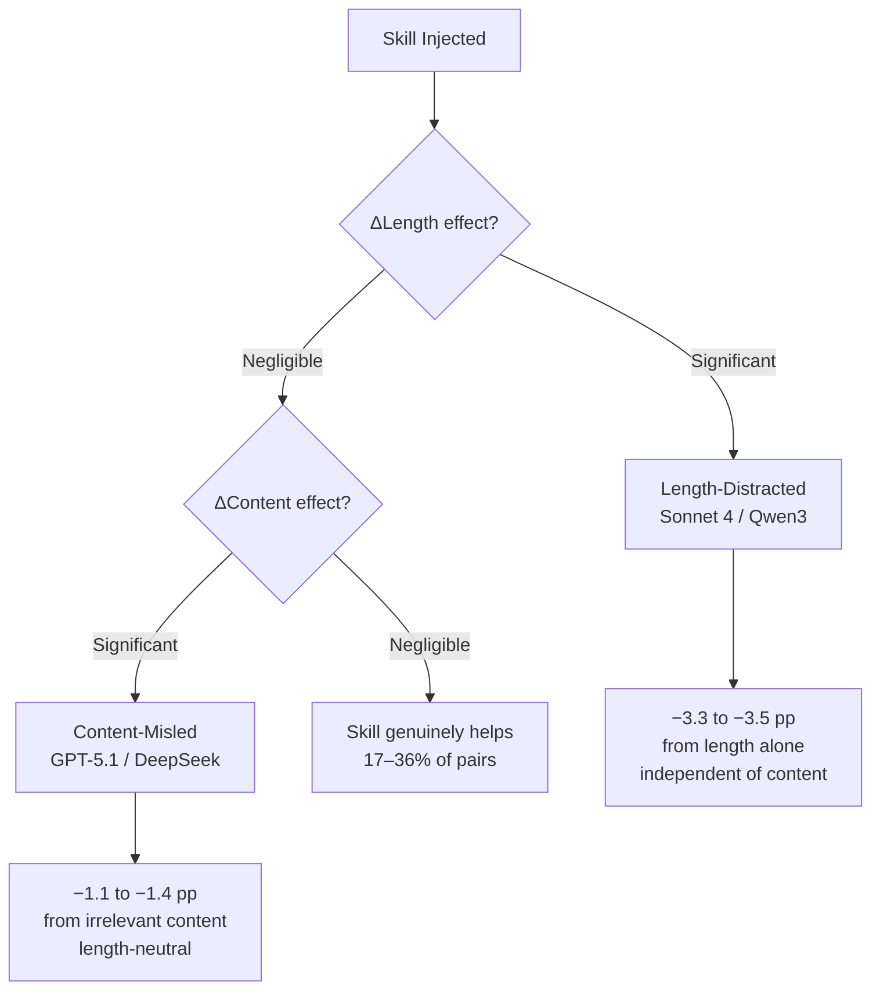
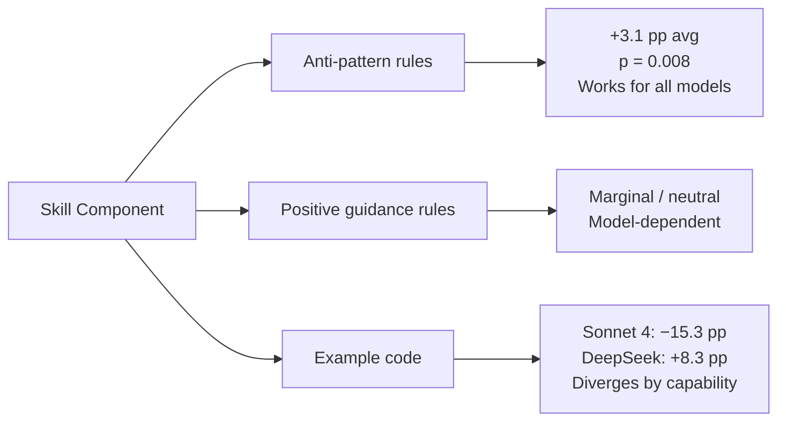
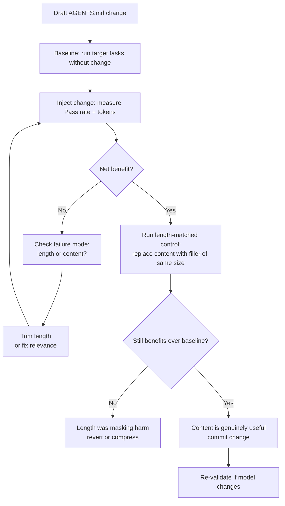

# Signal or Noise? What WebDev-Skills-Bench Teaches Us About Calibrating Your Codex CLI AGENTS.md


## The Skill Injection Assumption

There is a comfortable consensus in agentic development circles: more context is better. Add your framework conventions to `AGENTS.md`. Include worked examples. Document the anti-patterns. The agent will be smarter, more consistent, faster to converge. This assumption has driven a flourishing ecosystem of community-authored skill files, teams with multi-kilobyte `AGENTS.md` configurations, and tooling built around injecting ever-richer guidance into agent sessions.

A paper published on 24 August 2026 challenges that consensus with empirical rigour. *Signal or Noise? A Benchmark Study of Agent Skills in Web Development* by Ziyue Yang and Ding Fan (Baidu NLP)[^1] introduces **WebDev-Skills-Bench** — a controlled benchmark of 31 public WebDev Skills across 50 projects and 1,000 sequentially dependent tasks — and finds that skill injection is, on average, actively harmful. The implications for how you structure `AGENTS.md` in Codex CLI are significant.

## What WebDev-Skills-Bench Found

### Study Design

The study evaluated four matched conditions for each of 117 core skill–project pairs[^2]:

| Condition | Description |
|-----------|-------------|
| **C0** | Baseline — no skill injected |
| **C1** | Target skill injected |
| **C2** | Length-matched *irrelevant* skill (isolates content effects from prompt-length artefacts) |
| **C3** | Leave-one-out ablation (removes positive rules, anti-patterns, or example code in turn) |

Four frontier models were evaluated: Claude Sonnet 4, GPT-5.1, DeepSeek V4 Flash, and Qwen3 Coder 30B. The benchmark used a workspace-aware injection protocol where only the `SKILL.md` entered the prompt while auxiliary files mounted to the agent's filesystem, enabling valid length-matched controls.

### Headline Results

Across all four models, target skill injection **reduced** mean Pass@2[^1]:

| Model | Pass@2 Change | Token Cost Increase |
|-------|---------------|---------------------|
| Claude Sonnet 4 | −4.2 pp | +394% |
| Qwen3 Coder 30B | −2.3 pp | +220% |
| DeepSeek V4 Flash | −2.0 pp | +178% |
| GPT-5.1 | −1.3 pp | +72% |

Skills provided a net benefit in only **17–36% of skill–project combinations**, depending on the model. The majority of injections reduced performance while simultaneously inflating costs.

Task difficulty mediated the damage. Easy tasks suffered the most — losses of 4.0 to 10.7 percentage points — while hard tasks showed neutral or mildly positive effects. This is a counterintuitive inversion: the tasks where a practitioner is most tempted to add guidance (easy, well-understood work) are precisely where injected context causes the greatest harm.

## Two Failure Modes: Length vs Content

The study decomposed skill injection effects into two orthogonal failure mechanisms[^3]:



**Length-distracted models** (Sonnet 4, Qwen3) degrade simply because the prompt grew longer. The content of the skill is largely irrelevant — appending a length-matched file about an entirely unrelated topic produces similar losses. These models appear to dilute attention across the expanded context and lose focus on the actual task.

**Content-misled models** (GPT-5.1, DeepSeek) are length-neutral but degrade when semantically incorrect or irrelevant content is injected. For these models, what matters is not prompt length per se but the accuracy and relevance of the injected material.

The practical consequence: the two failure modes require different mitigations. You cannot write a single `AGENTS.md` policy and expect it to perform consistently across the models you rotate through.

## Cross-Model Non-Transferability

Perhaps the most striking finding is how little skill effectiveness transfers between models. Pearson correlations between per-pair effects across model pairs approached zero — the maximum observed was |r| ≤ 0.12[^4]. A skill that yields +33 percentage points for Sonnet 4 on a specific project can simultaneously produce −22 percentage points for DeepSeek and Qwen3 on the same project.

This finding has immediate implications for teams that switch models mid-project or run multi-agent pipelines with heterogeneous model selections. An `AGENTS.md` calibrated against one model is not a general asset — it is a model-specific configuration file that will actively harm performance when the model changes.

## What Actually Works: Anti-Pattern Rules

The leave-one-out ablations revealed a clear hierarchy of skill component effectiveness[^3]:



**Anti-pattern rules** — explicit statements of what *not* to do — are the single most cost-effective component. They contribute +3.1 pp on average with statistical significance (p = 0.008) and do not exhibit the model-capability inversion seen elsewhere.

**Example code** shows the sharpest capability split. For the strongest model tested (Sonnet 4), example code in a skill file reduced Pass@2 by 15.3 percentage points. For weaker models (DeepSeek), the same example code improved performance by 8.3 percentage points. The implication: if you are running Codex CLI with a frontier model, example-heavy `AGENTS.md` files may be degrading every session.

## Mapping to Codex CLI AGENTS.md

Codex CLI loads instruction files from a hierarchical discovery path — global `~/.codex/AGENTS.md`, repository root, then sub-directory overrides — concatenating matches up to a combined 32 KiB limit (`project_doc_max_bytes`)[^5]. This is functionally equivalent to the skill injection paradigm studied by Yang and Fan: context is prepended to the model's system prompt before any task begins.

The WebDev-Skills-Bench findings therefore apply directly:

**File hierarchy as scoping mechanism.** Rather than loading all guidance globally, place anti-pattern rules in the root `AGENTS.md` and reserve worked examples for nested `AGENTS.override.md` files in directories where the relevant framework is actually used[^6]. A sub-directory working on a React frontend should load React anti-patterns; the global file should not carry Django examples.

```bash
project/
├── AGENTS.md               # global anti-patterns, project constraints
├── frontend/
│   └── AGENTS.override.md  # React-specific anti-patterns only
└── api/
    └── AGENTS.override.md  # FastAPI-specific anti-patterns only
```

**Prefer anti-patterns over examples.** Given the +3.1 pp contribution of anti-pattern rules versus the −15.3 pp effect of example code for frontier models, a Codex CLI `AGENTS.md` targeting models like o4 or claude-opus-5 should be restructured around explicit *do not* directives rather than illustrative examples.

**Model-specific tuning via named profiles.** Because skill effectiveness does not transfer between models, use Codex CLI named profiles to pair different `AGENTS.md` configurations with different model selections. A session running with `o3` may warrant a different instruction file than one running with `claude-sonnet-4`. ⚠️ Codex CLI does not natively support per-profile AGENTS.md overrides; approximate this via named profiles that source different working directories with distinct `AGENTS.md` files.

**Budget the 32 KiB limit deliberately.** If token cost increased 72–394% from a single skill injection in the benchmark, a sprawling multi-kilobyte `AGENTS.md` is compounding that cost at every session start. Treat the 32 KiB ceiling not as headroom to fill but as a guard rail. Measure what you inject: run `codex --ask-for-approval never "Summarise your current instructions"` to audit what the model has actually received.

## Practical AGENTS.md Calibration Protocol

The study suggests a structured evaluation approach before stabilising any `AGENTS.md` configuration:



The length-matched control step (G) is the discipline most practitioners skip. If removing the *content* of a section while preserving its token volume produces equivalent results to the full injection, the section's words are noise — the model is responding to prompt shape, not meaning.

## Identified Gaps in Codex CLI Tooling

WebDev-Skills-Bench exposes several operational gaps in current Codex CLI:

- **No built-in instruction-file A/B evaluation.** There is no native mechanism to run the same task with and without a specific `AGENTS.md` section and compare outcomes across a task set.
- **No per-model instruction caching.** Every session reloads the full instruction hierarchy regardless of whether the model's performance profile warrants the loaded content.
- **No token-cost attribution per instruction section.** `rollout.jsonl` records session token totals but does not attribute cost to specific injected sections. Practitioners cannot identify which part of `AGENTS.md` is driving overhead.
- **No task-difficulty signal for selective loading.** The benchmark found easy tasks suffer most from skill injection. Codex CLI has no mechanism to skip instruction sections for tasks it classifies as low-complexity.

## Conclusion

The received wisdom that more guidance equals better agent performance does not survive empirical scrutiny. Yang and Fan's WebDev-Skills-Bench demonstrates that skill injection is harmful on average, expensive always, and non-transferable across models. The clearest practical recommendation is also the simplest: **prefer anti-pattern rules over examples, scope content as narrowly as possible, and validate every change against a length-matched control.**

For Codex CLI users, this means auditing existing `AGENTS.md` files with fresh scepticism — particularly those that have grown organically with worked examples, boilerplate guidance, and model-agnostic conventions. The 32 KiB budget is not an invitation to fill; it is a limit on harm.

## Citations

[^1]: Yang, Z. & Fan, D. (2026). *Signal or Noise? A Benchmark Study of Agent Skills in Web Development*. arXiv:2608.23067. https://arxiv.org/abs/2608.23067

[^2]: WebDev-Skills-Bench: 31 public WebDev Skills, 50 Web-Bench projects, 1,000 sequentially dependent tasks, four evaluation conditions (C0–C3). Reported in Yang & Fan 2026 (arXiv:2608.23067).

[^3]: Leave-one-out component ablation results (anti-pattern rules +3.1 pp, p=0.008; example code Sonnet 4 −15.3 pp / DeepSeek +8.3 pp). Reported in Yang & Fan 2026 (arXiv:2608.23067).

[^4]: Cross-model Pearson correlation of per-pair skill effects: |r| ≤ 0.12 across all model pairs. Reported in Yang & Fan 2026 (arXiv:2608.23067).

[^5]: Codex CLI AGENTS.md documentation — 32 KiB combined limit via `project_doc_max_bytes`. OpenAI Codex documentation. https://learn.chatgpt.com/docs/agent-configuration/agents-md

[^6]: Codex CLI hierarchical AGENTS.md loading: global `~/.codex/AGENTS.md` → repository root → sub-directory overrides. OpenAI Codex documentation. https://learn.chatgpt.com/docs/agent-configuration/agents-md

[^7]: WebDev-Skills-Bench benchmark open-sourced with evaluation code and per-pair outputs. arXiv:2608.23067. https://arxiv.org/abs/2608.23067
