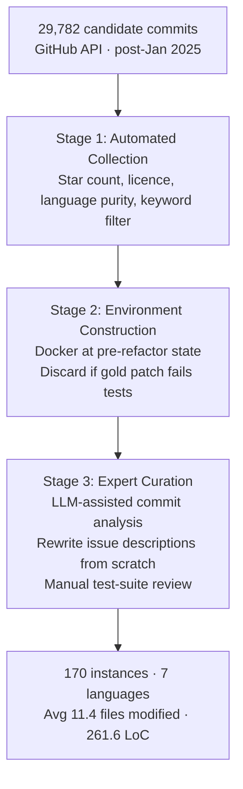

# SWE-Bench ProMax: What Multilingual Large-Scale Refactoring Tells Us About Codex CLI's Hardest Workflow


A benchmark accepted at COLM 2026 puts a number on something many practitioners already suspect: coordinated, multi-file refactoring is categorically harder for AI coding agents than the single-file bug fixes that dominate existing evaluations. SWE-Bench ProMax[^1] delivers 170 expert-curated instances across seven programming languages, holds the best frontier model to a 41.2% resolve rate, and in doing so exposes two agent failure modes with direct consequences for how you configure Codex CLI on refactoring workloads.

## Why Existing Benchmarks Are Breaking Down

SWE-bench Verified is saturating fast, but saturation is only part of the problem. A recent audit found that nearly 60% of its unsolved instances contain material test defects: 35.5% have overly narrow tests that reject functionally correct solutions by enforcing implementation details, and 18.8% have overly broad tests that check behaviour never stated in the task description.[^2] Frontier models can also reproduce gold patches verbatim from training data, so high resolve rates on older commits do not straightforwardly imply generalisation.[^1]

SWE-Bench ProMax addresses both issues: every instance is drawn from commits made after January 2025, issue descriptions are rewritten from scratch, and test suites are manually reviewed to remove the narrow/broad failure modes.

## Benchmark Construction

The curation pipeline starts with 29,782 candidate commits—repositories with ≥500 stars, an open-source licence, primary language accounting for ≥80% of codebase, and commit messages containing "refactor" but not "bug fix". Three stages reduce the pool to 170 instances.[^1]



The scale contrast with SWE-bench Verified is stark: 86% of Verified instances modify a single file, whereas 30% of ProMax instances modify more than ten and 32% require over 200 lines of code. The mean gold patch spans 8,179 tokens.[^1]

## Performance Results

Two agent scaffolds—Mini-SWE-Agent and OpenHands—evaluated across six frontier models. OpenHands with GPT-5.2 achieves the top overall resolve rate of 41.2%, but the per-language breakdown is more informative than the headline.[^1]

| Model (OpenHands) | Overall | Python | Java | TypeScript | Go | C | C++ | Rust |
|---|---|---|---|---|---|---|---|---|
| GPT-5.2 | **41.2%** | 48.3 | 19.2 | 35.7 | 26.1 | 75.0 | 36.4 | 54.5 |
| Claude Sonnet 4.6 | 38.8% | 17.2 | 30.8 | 53.6 | 26.1 | 50.0 | 36.4 | **63.6** |
| Qwen3.5 | 36.5% | 37.9 | 26.9 | 17.9 | 39.1 | 65.0 | **54.5** | 22.7 |
| GLM-5 | 36.5% | 20.7 | **34.6** | 28.6 | 34.8 | 65.0 | 45.5 | 36.4 |
| Kimi-K2.5 | 32.9% | 24.1 | 30.8 | 10.7 | **43.5** | 70.0 | 45.5 | 18.2 |
| Gemini-3-Pro | 19.4% | 13.8 | 19.2 | 0.0 | 8.7 | 45.0 | 36.4 | 22.7 |

No model dominates across all languages. GPT-5.2 leads on Python and C; Claude Sonnet 4.6 leads on TypeScript and Rust; Kimi-K2.5 leads on Go; Qwen3.5 leads on C++. The authors attribute this to differences in language-specific training data composition rather than inherent language difficulty.[^1] Mini-SWE-Agent scores 10–15 percentage points lower across the board, confirming that scaffold quality has outsized impact when tasks require sustained multi-step coordination.

## The Two Failure Modes

### Incomplete Refactoring: Partial Propagation

The dominant failure mode is **incomplete propagation**: an agent correctly identifies and edits the core files containing the refactoring target, but stops before applying the same transformation to peripheral call sites, configuration files, documentation references, and test fixtures.[^1] The agent does the hard semantic work—locating the primary change—then declares victory prematurely.

### Unproductive Exploration: Edit–Revert Cycling

The secondary failure mode is **edit–revert cycling**: failed attempts consume substantially more rounds than successes, exhibiting repetitive edit-then-revert sequences that neither expand the scope of modifications nor converge on a solution.[^1] These spirals expand token consumption without measurable progress.

## Mapping to Codex CLI

### Named Profiles for Language-Specific Model Routing

The cross-language non-dominance result is directly actionable. Claude Sonnet 4.6 leads on TypeScript and Rust; GPT-5.2 leads on Python and C. Named profiles route tasks to the empirically strongest backbone per language.[^3]

```toml
# config.toml
[profile.refactor-typescript]
model = "claude-sonnet-4-6"
model_reasoning_effort = "high"

[profile.refactor-python]
model = "gpt-5.2"
model_reasoning_effort = "high"

[profile.refactor-go]
model = "kimi-k2.5"
model_reasoning_effort = "high"
```

Invoke with `codex --profile refactor-typescript "Rename Widget to Component throughout"`.

### AGENTS.md: Encoding the Propagation Obligation

The incomplete-propagation failure mode is precisely the structural gap that AGENTS.md is designed to close. A mandatory pre-completion checklist prevents the agent from halting at the core files.[^4]

```markdown
## Refactoring Invariants

Before marking any refactoring task complete, you MUST:
1. Search for ALL references to the renamed/moved symbol with `grep -rn`.
2. List every file that imports, invokes, or documents the symbol.
3. Apply the transformation to ALL locations — call sites, config files,
   docstrings, README references, and test fixtures.
4. Run the full test suite. A pass on core tests alone is insufficient.

Do NOT declare a refactoring complete until `grep -rn <old_symbol>` returns
zero results outside of changelogs and migration notes.
```

This instruction survives compaction because AGENTS.md is reloaded from disk at every session start, not stored in the rolling context window.[^4]

### PostToolUse Hook: Automated Propagation Audit

A PostToolUse hook on `apply_patch` automates the residual-reference check and feeds the count back as `additionalContext`, providing a forcing function to continue rather than halt.[^5]

```json
{
  "hooks": [
    {
      "event": "PostToolUse",
      "matcher": "apply_patch",
      "handler": {
        "type": "command",
        "command": "bash -c 'OLD=$(cat /tmp/refactor_symbol 2>/dev/null); COUNT=$(grep -rn \"$OLD\" . --include=\"*.{py,ts,go,rs,java,c,cpp}\" --exclude-dir=.git 2>/dev/null | grep -v CHANGELOG | wc -l); echo \"{\\\"additionalContext\\\": \\\"Residual occurrences of $OLD: $COUNT\\\"}\";'"
      }
    }
  ]
}
```

### Rollout Token Budget: Capping Edit–Revert Spirals

The v0.150.0-alpha `[features.rollout_budget]` configuration block provides a hard weighted-token ceiling that aborts sessions exhibiting the edit–revert cycling pattern before costs become unbounded.[^6]

```toml
[features.rollout_budget]
enabled = true
limit_tokens = 400_000
reminder_interval_tokens = 40_000
sampling_token_weight = 1.0
prefill_token_weight = 0.1
```

## Identified Gaps in Codex CLI

SWE-Bench ProMax exposes four current tooling limitations:

- **No symbol-reference primitive**: `grep -rn` works, but a structured `codex search --refs <symbol>` command would directly bridge the locate-then-propagate gap.
- **No propagation completeness in rollout.jsonl**: The session trace records tool calls but not semantic coverage; residual-occurrence counts are not emitted as structured events.
- **PostToolUse cannot intercept test execution results**: The hook fires after `apply_patch` but not after the model invokes the test runner. A hook on `shell` with exit-code awareness would enable automatic retry on failure. ⚠️
- **Profile switching within session is unsupported**: A polyglot refactoring that starts in Python and moves to TypeScript call sites cannot change model mid-session; the multi_agent_v2 orchestrator pattern is the current workaround.[^7]

## Conclusion

SWE-Bench ProMax (arXiv:2608.09802, COLM 2026) is the first benchmark to take multilingual, large-scale code refactoring seriously as a primary evaluation axis. Its curation pipeline eliminates the test-quality problems endemic to SWE-bench Verified, its cross-language performance table reveals complementary model strengths, and its failure-mode analysis names the two root causes—incomplete propagation and edit–revert cycling—that account for most lost resolves at this scale.

The actionable configuration response for Codex CLI: treat refactoring as a graph traversal, not a single-shot edit. The AGENTS.md propagation invariant closes the premature-completion gap; the PostToolUse residual-count hook enforces it mechanically; language-specific named profiles exploit the per-language model advantage the benchmark quantifies; and the rollout token budget prevents spirals from consuming unbounded resources.

## Citations

[^1]: Shi, Y. et al. (2026). *SWE-Bench ProMax: Benchmarking Agents on Large-Scale Multilingual Code Refactoring*. COLM 2026. arXiv:2608.09802. <https://arxiv.org/abs/2608.09802>

[^2]: SWE-Bench ProMax abstract: "a recent audit found that nearly 60% of unsolved SWE-bench Verified instances contain flawed tests—either overly narrow tests that reject correct solutions or overly broad tests that check unstated requirements." 35.5% narrow + 18.8% broad breakdown extracted from the full paper HTML at <https://arxiv.org/html/2608.09802v1>.

[^3]: OpenAI Codex CLI named profiles configuration: `codex --profile <name>` flag, documented in v0.147.0+ release notes. <https://releasebot.io/updates/openai/codex>

[^4]: OpenAI Codex CLI AGENTS.md specification — hierarchical instruction files reloaded from disk at session start, surviving context compaction. <https://codex.danielvaughan.com/2026/03/27/codex-cli-in-2026-whats-new/>

[^5]: OpenAI Codex CLI v0.148.0 — PostToolUse hook handler with `additionalContext` output envelope. <https://releasebot.io/updates/openai/codex>

[^6]: OpenAI Codex CLI v0.150.0-alpha — `[features.rollout_budget]` configuration block with weighted token accounting. <https://github.com/openai/codex/releases>

[^7]: OpenAI Codex CLI — `multi_agent_v2` parallel subagent pattern for polyglot orchestration; `agents.max_threads` concurrency control. <https://codex.danielvaughan.com/2026/03/27/codex-cli-in-2026-whats-new/>
