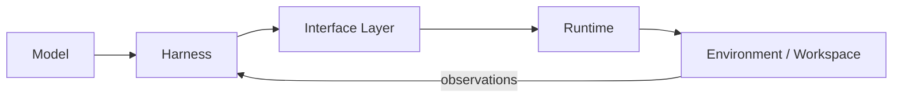
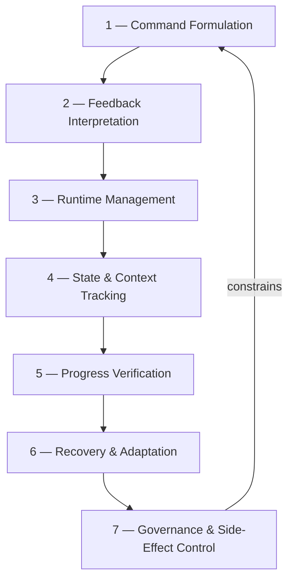
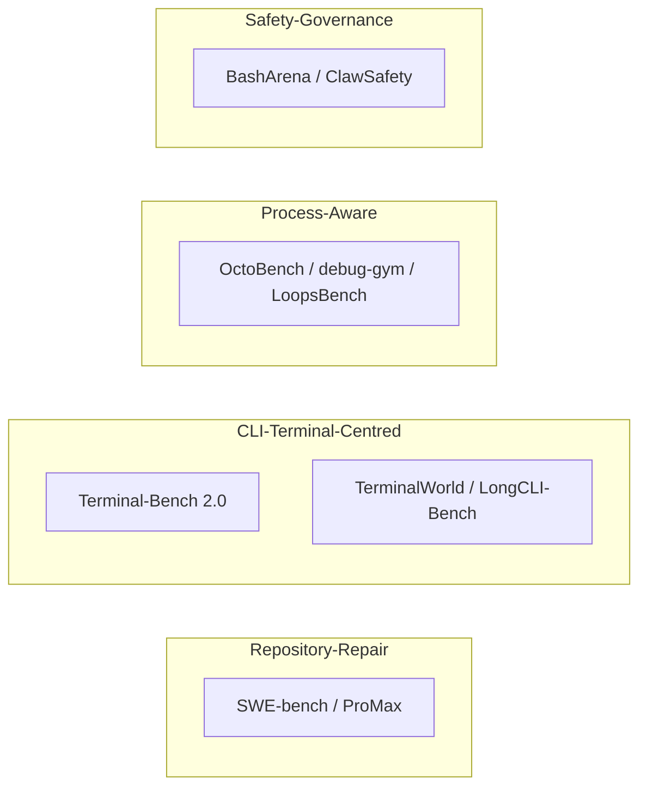

# Terminal Agents: A Taxonomy of AI Agents in Command-Line Environments and Where Codex CLI Sits


A 52-page survey published this week treats the terminal itself — not the task category, not the benchmark domain — as the primary subject of study for LLM-based agents. "Terminal Agents: A Survey of AI Agents in Command-Line Environments" by Yi Bin, Xiaoyang Yuan, Haoxi Zeng, and nine co-authors[^1] arrives at a moment when Codex CLI has consolidated into a mature terminal agent with defined harness, runtime, and governance layers. The survey's taxonomy maps directly onto Codex CLI's architecture in ways that expose both its strengths and its remaining gaps.

## Why the Terminal Deserves Its Own Survey

Earlier surveys cluster by domain: software engineering agents, web agents, computer-use agents. The unifying observation in arXiv:2608.20485 is that a qualitatively distinct class of agent exists when "the dominant progress-bearing action–observation loop is mediated by terminal command execution, textual feedback, and stateful environment interaction."[^1] Command output is the primary evidence channel. Workspace state — files, processes, installed packages — is the persistent record. Consequences may be irreversible.

This framing immediately clarifies what Codex CLI is: not a code-completion tool with a CLI wrapper, but a system in which every turn is grounded in command execution and textual feedback from the repository.

## The Five-Component Architecture

The survey identifies five interconnected system components whose coupling determines agent behaviour[^1]:



| Component | Survey Definition | Codex CLI Mapping |
|-----------|------------------|-------------------|
| **Model** | LLM providing reasoning and decision-making | `model` in `config.toml`; `model_reasoning_effort` |
| **Interface Layer** | Action units available to the model | Shell + `apply_patch` + MCP tool surface |
| **Harness** | Packages history, manages context windows | Codex CLI core; `experimental_compact_prompt_file`; rollout JSONL |
| **Runtime** | Filesystem, processes, resource boundaries | Sandbox: `writable_roots`, `network_access`, `cgroups` |
| **Environment** | Repository, installed packages, persistent state | Working directory; AGENTS.md; Memories |

The survey's key insight: performance is not a model property — it emerges from the coupled configuration of all five. A model capable of 85% on SWE-bench Verified may perform at 40% under a poorly designed interface layer that forces line-number diffs rather than search-and-replace.[^2]

## Seven Dimensions of Terminal Competence

The survey's core contribution is a **seven-dimensional competence profile**[^1] that replaces single-number pass rates with a structured capability map:



**Dimension 1 — Command and Action Formulation.** Converting goals into executable commands. Codex CLI's `apply_patch` is a structured action that reduces formulation noise versus raw shell expressions. `writable_roots` constrains the action space, serving as both a governance mechanism and a formulation aid.[^1]

**Dimension 2 — Feedback and Artifact Interpretation.** Extracting signal from stdout, stderr, exit codes, and stack traces. The survey notes that long-horizon degradation frequently originates here: agents skim output rather than anchor on exit codes.[^3] The `additionalContextLimit` parameter in `hooks.json` is the primary tuning point — it controls how much hook output feeds back into the model's context window.

**Dimension 3 — Runtime and Environment Management.** Dependency installation, service startup, cgroup constraints. SetupBench results diverge sharply from SWE-bench results because environment bootstrap is a distinct competence not captured by issue resolution.[^4] The Codex CLI sandbox (`network_access`, `cgroups`, Docker) is the runtime layer, but it is statically configured — network access during bootstrap versus lockdown during execution requires manual profile switching, a gap the survey classifies as a missing runtime-phase transition primitive.

**Dimension 4 — State, Task, and Context Tracking.** Maintaining environment state and interaction history across extended sessions. Context compaction is the canonical threat: summarisation to fit the context window degrades state tracking.[^5] `model_auto_compact_token_limit` and `experimental_compact_prompt_file` address this, but the Scroll paper (arXiv:2608.21690) showed that compaction without lossless retrieval costs up to 53 percentage points on compositional recall.[^5]

**Dimension 5 — Progress Verification.** Executing validity checks of intermediate states. PostToolUse hooks are the primary Codex CLI mechanism — a hook on `apply_patch` that runs the affected test file converts end-state verification into continuous verification:

```toml
# hooks.json — continuous verification
[[hooks]]
event = "PostToolUse"
matcher = "apply_patch"
run = "bash -c 'python -m pytest $(git diff --name-only HEAD | grep test) -x -q 2>&1 | tail -20'"
```

**Dimension 6 — Recovery and Adaptation.** Diagnosing failures and retrying from grounded evidence. LoopsBench (arXiv:2608.00267)[^3] found that the best agents maintained 25% task resolution on dependency-DAG tasks by recovering from prerequisite failures without discarding completed work. Codex CLI's `codex exec` fork primitive creates clean-context subagents for recovery attempts while preserving parent-thread state.

**Dimension 7 — Governance and Side-Effect Control.** Respecting permissions, sandboxes, and resource limits. The survey assigns this dimension primary importance for production deployment, noting that most benchmarks evaluate governance separately from task success.[^1] Codex CLI's governance layers span sandbox constraints, PreToolUse exit-code-2 denials, the approval policy hierarchy (`suggest` → `full-auto`), and the rollout token budget introduced in v0.150.0-alpha.

## Benchmark Landscape

The survey groups benchmarks by design emphasis[^1]:



Terminal-Bench 2.0 — 89 tasks with unique sandbox per task and human-written verification — is the most directly relevant to Codex CLI workflows; frontier agents score below 65%.[^6] LongCLI-Bench reports pass rates below 20% on multi-category programming tasks.[^2] The survey's critique: benchmarks are repository-repair concentrated — operational and scientific domains remain fragmented. Codex CLI is frequently evaluated on SWE-bench but rarely on CI/CD orchestration or infrastructure management where Dimension 3 and Dimension 7 capabilities are most exercised.

## Four Structural Evaluation Gaps

The survey identifies four gaps directly relevant to Codex CLI practitioners[^1]:

**No common trace schema.** Codex CLI's `rollout.jsonl` is proprietary. Tool calls, observations, and approval events are logged, but not in a schema interoperable with SWE-bench replays or LoopsBench dependency graphs.

**Static task pools.** Mutation strategies — semantics-preserving transformations[^7] — remain peripheral to standard evaluation. Codex CLI has no built-in task-freshness mechanism.

**Safety evaluated separately.** A session achieving 90% issue resolution while triggering ten PreToolUse denials gets the same score as one that achieves 90% cleanly. Governance and task success are not jointly evaluated anywhere in the current benchmark landscape.

**Trajectory-filtered acquisition.** Training datasets retain successful traces; failed commands and recovery decisions are discarded. The survey argues recoverable failures carry the most useful learning signal.

## Codex CLI Dimension Summary

| Dimension | Provision | Assessment |
|-----------|-----------|:----------:|
| 1 — Formulation | `apply_patch`, shell, MCP | ✅ Strong |
| 2 — Feedback Interpretation | Raw output + hook injection | ⚠️ Adequate |
| 3 — Runtime Management | Static sandbox config | ⚠️ Phase-blind |
| 4 — Context / State Tracking | Compact config, session fork | ⚠️ Lossy compaction |
| 5 — Progress Verification | PostToolUse hooks | ✅ Strong |
| 6 — Recovery | `codex exec` fork | ⚠️ No structured retry |
| 7 — Governance | Sandbox + PreToolUse + policy + budget | ✅ Leading |

Codex CLI leads on Dimension 7 — it has more governance primitives than any system the survey examined in the open ecosystem. Its weakest dimension is 3 (phase-aware runtime) followed by 4 (lossless state tracking).

**Practical takeaways.** Profile your agent across all seven dimensions, not just pass rate — hook frequency, denial rate, and retry count are all already in `rollout.jsonl`. Match `model_reasoning_effort` to the dominant dimension for your task. Separate bootstrap from execution via two named profiles. Add PostToolUse async hooks to log dimension-specific signals until a standard trace schema exists.

## Citations

[^1]: Yi Bin, Xiaoyang Yuan, Haoxi Zeng, Wencheng Ye, Wenqi Shao, Chen Qian, Wei Ye, Yujuan Ding, Zheng Wang, Pengpeng Zeng, Jingkuan Song, Heng Tao Shen. "Terminal Agents: A Survey of AI Agents in Command-Line Environments." arXiv:2608.20485, August 2026. <https://arxiv.org/abs/2608.20485>
[^2]: Feng et al. "LongCLI-Bench: Benchmarking Agents on Multi-Category Long-Horizon CLI Tasks." 2026. Referenced via arXiv:2608.20485. ⚠️ Primary source not independently accessed.
[^3]: Han Li, Zhemin Fang, Rili Feng, et al. "LoopsBench: From Harness Engineering to Loop Engineering in Coding Agent Evaluation." arXiv:2608.00267, August 2026. <https://arxiv.org/abs/2608.00267>
[^4]: SetupBench. Referenced via arXiv:2608.20485 taxonomy. ⚠️ Primary source not independently accessed.
[^5]: Lin, Zhu, Ang, Ding & Zhou. "Context as an Environment: Programmatic Context Management for Long-Horizon Agents." arXiv:2608.21690, August 2026. <https://arxiv.org/abs/2608.21690>
[^6]: Terminal-Bench 2.0. <https://arxiv.org/abs/2601.11868>; leaderboard at <https://tbench.ai>
[^7]: Mahmud, Gupta, Chaudhary, et al. "A Jagged Frontier: Evaluating Robustness of Code Agents to Semantics-Preserving Transformations." arXiv:2608.18389, August 2026. <https://arxiv.org/abs/2608.18389>
