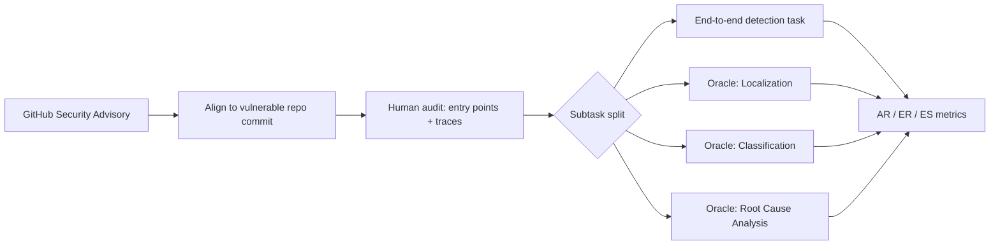
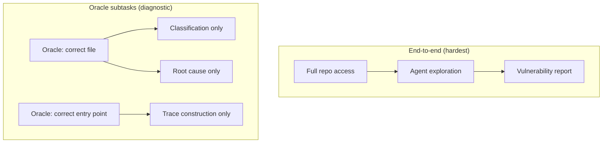

# VulnGym: What Repository-Level Vulnerability Detection Tells Us About Coding Agents' Security Gap


A new benchmark from Tencent makes an uncomfortable argument explicit: the same coding agents that can resolve GitHub issues and refactor large codebases at impressive rates are largely unable to find real-world security vulnerabilities on their own.[^1] VulnGym, submitted to arXiv in August 2026, puts a precise number on that gap — and the implications for how you configure Codex CLI for security-adjacent work are worth unpacking carefully.

## Why Function-Level Benchmarks Mislead

Most existing vulnerability-detection benchmarks evaluate agents on preselected, isolated code snippets — a function, a diff, a single file. That design choice is understandable; it eliminates confounds. But it also sidesteps the most expensive cognitive work: autonomous repository exploration to *find* where a vulnerability lives in the first place.[^1]

VulnGym inverts this. Agents receive access to a complete, real-world repository at a vulnerable commit and must report which files and lines are affected, without being told where to look. The benchmark draws from reviewed GitHub Security Advisories, aligning each advisory with the precise repository version it describes.[^1]



## Dataset Composition

The benchmark contains 184 advisories and 408 annotated vulnerability entries distributed across 23 repositories.[^2] The human-verification rate is striking: 393 of 408 entries (96.3%) and 178 of 184 advisories (96.7%) have been manually audited by security researchers.[^2] Each entry carries line-level entry points, critical operations, and a ground-truth vulnerability trace — providing fine-grained enough annotations to distinguish *whether* an agent found the right file from *whether* it understood the exploit path.

The vulnerability distribution departs from what most function-level datasets would lead you to expect:

| Category | Share |
|---|---|
| Business logic (all types) | 71.2% |
| — Broken authorisation logic | 23.7% of business-logic |
| — Missing authorisation | 17.6% of business-logic |
| Traditional (injection, path traversal, XSS) | 28.8% |

Business-logic flaws dominate because they were overrepresented in real-world GitHub advisories during the curation period.[^2] That matters for agent evaluation: business-logic vulnerabilities require understanding *intent* as much as syntax, which puts a higher load on contextual reasoning across multiple files.

## Evaluation Protocol: Three Metrics, Four Tasks

VulnGym defines three core metrics:

- **Answer Recall (AR)**: the fraction of advisories for which an agent reports at least one correct vulnerable file
- **Entry Recall (ER)**: the fraction of individual entry points (line-level) correctly identified
- **Entry Score (ES)**: a stricter combined measure requiring accurate file, line (±5-line tolerance), and trace coherence

The end-to-end task gives agents no hints. The three oracle subtasks each provide ground truth for earlier stages, letting evaluators isolate where the pipeline breaks: localisation, classification, or root-cause reasoning.[^1]



## Results: The 22% Ceiling

The headline finding is bleak. The best-performing configuration — DeepSeek-V4-Flash running inside OpenHands — achieves just 22.58% AR, 15.22% ER, and 11.63% ES on the end-to-end task.[^1] The second-best pairing tested, Qwen3.5-27B with Claude Code, reaches 12.90% AR, 8.70% ER, and 4.55% ES.[^1]

Even accepting that recall without a precision penalty is a generous metric, these numbers describe a tool that misses roughly four in five exploitable issues it encounters in the wild. The oracle subtask results confirm the bottleneck: agents fail earliest and hardest at the *localisation* step — identifying the correct file — before classification or root-cause analysis even becomes relevant.

This connects to findings from adjacent work. VulnAgent-R2 (arXiv:2603.13384) demonstrated that cross-file data flow, build options, and framework conventions each independently collapse isolated classifiers, and that multi-agent pipelines with evidence reweighting are required to approach credible F1 scores on established datasets like Devign and PrimeVul.[^3] ExploitGym (arXiv:2605.11086) showed the inverse: frontier models *do* have meaningful exploit-construction capability once handed a known vulnerable target — the bottleneck is the detection and localisation step, not the exploitation reasoning.[^4]

VulnGym makes that bottleneck quantitative.

## Failure Mode Analysis

The paper identifies two compounding failure modes that together account for the majority of missed detections:

**1. Code localisation failures.** Agents struggle to trace data flow across module boundaries in unfamiliar codebases. Without an explicit symbol reference or call-graph navigation tool, agents rely on grep-style pattern matching, which fails on indirect dispatch, framework-mediated callbacks, and anything requiring multi-hop reasoning across three or more files. Business-logic vulnerabilities — the majority in VulnGym — are particularly susceptible because the relevant code is often spread across controllers, middleware, and database layers with no syntactic similarity to known exploit patterns.[^1]

**2. Evidence construction failures.** When agents *do* locate the right file, they frequently fail to construct a coherent trace linking the entry point through critical operations to the vulnerability's effect. The entry score (ES) metric captures this: an agent that finds the right file but produces an incoherent trace scores zero on ES. The gap between ER (15.22%) and ES (11.63%) for the best agent quantifies how often localisation succeeds but explanation fails.[^1]

A third, subtler failure appeared in oracle experiments: agents that were given the correct entry point still struggled with root-cause reasoning for business-logic flaws, suggesting that even perfect tooling cannot compensate for the gap between syntactic pattern-matching and semantic intent understanding.

## Codex CLI Implications

Codex CLI's sandbox and hook system gives you meaningful leverage over *how* you run security-adjacent workflows — but VulnGym's results should calibrate your expectations about what the model layer can be expected to contribute.

### Configuring the Sandbox for Read-Only Audit Mode

For a vulnerability triage workflow, you almost certainly want the agent in read-only mode to prevent accidental modification of evidence during exploration:

```toml
# config.toml
[sandbox]
writable_roots = []
network_access = false

[tool_output]
max_tokens = 8192
```

The `writable_roots = []` constraint forces the agent into pure read mode.[^5] Combined with `network_access = false`, you eliminate the blast radius of any prompt-injection attempt embedded in the repository content — a real concern when analysing advisories that may themselves contain malicious payloads.[^5]

### PreToolUse Hooks for Scope Enforcement

Use a PreToolUse hook to restrict the agent to the repository under audit and prevent lateral movement:

```json
{
  "hooks": {
    "PreToolUse": [
      {
        "matcher": ".*",
        "handler": {
          "type": "command",
          "command": ["bash", "-c", "echo '{\"decision\":\"deny\",\"reason\":\"read-only audit session\"}' && exit 2"],
          "match_conditions": {
            "tool_name": "^(write_file|apply_patch|run_command)$"
          }
        }
      }
    ]
  }
}
```

This enforces that any attempt to write or execute is intercepted at the hook layer before reaching the sandbox.[^5] The exit code 2 signals a deny decision; Codex CLI will surface the hook's `reason` to the model.

### PostToolUse Hook for Evidence Chain Logging

VulnGym's results show that evidence construction is the hardest step. A PostToolUse hook can build a structured evidence log, compensating for the model's tendency to lose trace coherence across a long session:

```bash
#!/usr/bin/env bash
# posttooluse-vuln-log.sh
# Appends tool call metadata to a structured evidence log

TOOL="${CODEX_TOOL_NAME}"
RESULT_SUMMARY="${CODEX_TOOL_RESULT_SNIPPET}"
TIMESTAMP=$(date -u +"%Y-%m-%dT%H:%M:%SZ")

cat >> /tmp/vuln-audit-evidence.jsonl <<EOF
{"ts":"${TIMESTAMP}","tool":"${TOOL}","snippet":${RESULT_SUMMARY}}
EOF
```

```toml
# hooks.json
{
  "hooks": {
    "PostToolUse": [
      {
        "matcher": ".*",
        "handler": {
          "type": "command",
          "command": ["/path/to/posttooluse-vuln-log.sh"],
          "async": true
        }
      }
    ]
  }
}
```

The `async: true` flag prevents the logging hook from adding latency to each tool call while still capturing the evidence chain.[^5]

### AGENTS.md: Structured Audit Protocol

Because localisation is the dominant failure mode, your `AGENTS.md` should front-load the exploration protocol:

```markdown
## Security Audit Protocol

You are operating in read-only vulnerability audit mode.

### Step 1: Understand the advisory
Read the advisory description carefully before touching any files.

### Step 2: Map the entry point
Identify the public-facing entry point described in the advisory.
Trace the call graph: which controller/handler receives the input?

### Step 3: Trace data flow
Follow the data from the entry point through middleware, services,
and persistence layers. Record each hop explicitly before moving on.

### Step 4: Identify the critical operation
Locate the point where untrusted data reaches a security-sensitive
operation (SQL, file system, authorisation check, serialisation).

### Step 5: Construct evidence
Report: entry file + line, critical operation file + line,
vulnerability class, and a one-paragraph root-cause summary.

Do not report until you have a complete four-point evidence chain.
```

This directly addresses VulnGym's finding that agents fail at localisation before classification ever becomes relevant. By forcing explicit multi-hop trace construction before reporting, you push the agent to do the work that the benchmark shows current agents skip.[^1]

### Named Profile for Security Audit Workloads

```toml
# config.toml
[profile.vuln_audit]
model = "o4"
model_reasoning_effort = "high"
sandbox_network_access = false
approval_policy = "on-request"
```

The `model_reasoning_effort = "high"` flag enables extended reasoning, which helps with the multi-hop data-flow tracing that VulnGym identifies as the critical bottleneck.[^5] Use `approval_policy = "on-request"` so you can inspect the agent's exploration steps before it produces a final report.

## What Codex CLI Cannot Do (Yet)

VulnGym's results expose gaps that configuration cannot fix:

**No call-graph navigation tool.** The agents evaluated in VulnGym rely on file search and grep-style pattern matching. Codex CLI has no built-in MCP tool for navigating a language server's call graph — the kind of inter-procedural analysis that a human security researcher would use as a first step. An MCP server wrapping a language server (LSP) or a static analysis tool (e.g., CodeQL, Semgrep) would directly address the localisation failure mode.[^1]

**No trace persistence across compaction.** Even with the PostToolUse evidence log described above, the model's in-context representation of the vulnerability trace is lost during auto-compaction. The `experimental_compact_prompt_file` can partially mitigate this, but the structured evidence chain is not natively exempt from compaction pressure.[^5]

**Recall-only evaluation.** VulnGym measures recall without precision penalties. In a real triage workflow, false positives are expensive — each one requires a human to review and dismiss. Codex CLI has no built-in mechanism to calibrate the agent's reporting threshold, which means a high-recall configuration will also flood the log with false positives.

## Summary

VulnGym quantifies a gap that security practitioners have suspected: coding agents are not yet reliable vulnerability detectors at repository scale. The 22% advisory recall ceiling, combined with the finding that business-logic flaws (71% of the benchmark) are systematically harder than traditional injection-style vulnerabilities, suggests that the model capability needed for autonomous security audit is qualitatively different from what drives SWE-bench performance.

For Codex CLI users, the practical takeaway is two-fold: (1) use sandbox constraints and hook-based evidence logging aggressively to get the most out of what the model *can* do; and (2) treat the agent as a first-pass explorer that surfaces candidate files for human review, not as a complete automated security scanner.

The dataset is publicly available at [github.com/Tencent/VulnGym](https://github.com/Tencent/VulnGym) for teams that want to evaluate their own harness configurations against a grounded benchmark.[^2]

## Citations

[^1]: Ji, K., Liu, J., Hu, E., Gao, C., Lian, K., Liu, Y., Zhang, L., Dong, T., Chen, H., & Bin, W. (2026). *VulnGym: Benchmarking Coding Agents for Repository-Level Vulnerability Detection*. arXiv:2608.02001v1. https://arxiv.org/abs/2608.02001

[^2]: Tencent VulnGym Dataset Repository. https://github.com/Tencent/VulnGym

[^3]: VulnAgent-R2: Evidence-Calibrated Multi-Agent Auditing for Repository-Level Vulnerability Detection. arXiv:2603.13384. https://arxiv.org/html/2603.13384

[^4]: ExploitGym: Can AI Agents Turn Security Vulnerabilities into Real Attacks? arXiv:2605.11086. https://arxiv.org/html/2605.11086v1

[^5]: Codex CLI Security Hardening Guide. https://codex.danielvaughan.com/2026/03/27/security-hardening-codex-cli/
