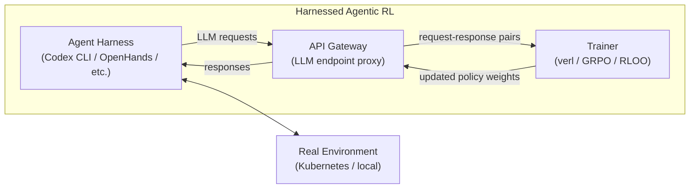

# Agent Lightning v1.0: What Harnessed Agentic RL Means for Codex CLI as a Training Harness


Traditional agentic reinforcement learning trains a model against a simulated environment, then wraps it in a deploy-time harness that the model has never seen. Agent Lightning v1.0 inverts this: the harness you ship is the harness you train with.[^1] This paradigm — *harnessed agentic RL* — changes what your Codex CLI configuration actually is. It is no longer just a runtime envelope; it is a training environment specification.

## What Is Harnessed Agentic RL?

In standard agentic RL, the training engine owns the environment interaction loop. The harness is bolted on afterwards, creating a distributional shift between the training context and the deployment context. Tools appear with different descriptions, tool-call schemas differ, approval prompts are absent, and context structure is unfamiliar.

Harnessed agentic RL flips the ownership model: the harness owns the interaction loop, and the training engine observes only sequences of LLM request–response pairs.[^1] The harness handles tool execution, context management, approval flows, and all the scaffolding that real deployments use. The trainer never touches any of that; it just sees token streams.



Agent Lightning v1.0 (He et al., Microsoft, arXiv:2608.17528, August 2026) provides the open-source infrastructure for this pattern in approximately 3,500 lines of code under an MIT licence.[^1]

## Architecture

The framework has three components:

**API Gateway** — A stateful service that acts as an OpenAI-compatible proxy between the harness and vLLM inference. It stores rollouts, model metadata, and events. The harness thinks it is calling the OpenAI API; the gateway intercepts every call and routes it to the current policy checkpoint.

**Rollout Controller** — Manages agent execution via Kubernetes Jobs or local processes using standard controller-reconciliation patterns. It launches harness instances, assigns tasks, collects trajectories, and handles timeouts and failures.

**Trainer** — Built on VERL, implements the RL algorithm (GRPO and RLOO are demonstrated) and incorporates four design choices specific to the harnessed setting (described below). Includes trajectory monitoring to detect reward hacking.

The framework also implements *collocated async RL*, which shares GPU capacity between rollout and training phases rather than dedicating separate fleets. The paper reports approximately 2× speedup over synchronous RL whilst using fewer GPUs than traditional async approaches.[^1]

## Four Technical Challenges Unique to This Paradigm

Harnessed agentic RL cannot simply apply standard RL algorithms unchanged. The paper identifies and solves four problems that emerge specifically because the harness owns the interaction loop.

### 1. Retokenisation and Sample Merging

A real harness makes multiple sequential LLM calls per task. The assistant output from call *n* becomes part of the prompt for call *n+1*, but retokenising that output can produce different token boundaries due to chat-template non-compositionality and decode–retokenise drift (e.g., `having` tokenised as `[h, aving]` on one pass and `[hav, ing]` on another).

Agent Lightning uses *best-effort sequence merging*: calls are merged into a single training sample only when exact token-prefix overlap is verified. In the SWE-bench coding task, only 36% of rollouts collapsed to a single merged sample; the remaining 64% required multi-sample representation.[^1] This means your harness call granularity directly affects training sample structure.

### 2. Rollout-Level Advantage Calculation

A single harness rollout produces a variable number of training samples — averaging 2.41 for the coding task. Computing advantages at the sample level allows incidental retokenisation differences to distort gradient normalisation. The paper argues for rollout-level advantage calculation and validates this empirically.[^1]

### 3. Loss Normalisation

Three strategies were compared:

| Strategy | Behaviour |
|---|---|
| Token-mean loss | Dominated by long sequences |
| Seq-mean–token-mean | Problematic per-sample weighting |
| Rollout-level token-mean | Equal rollout weight — preferred |

The rollout-level token-mean loss ensures each task contributes equally regardless of how many harness calls it generates.

### 4. Backend Scheduling

Variable sample counts per rollout must be mapped onto fixed GPU configurations whilst preserving rollout membership (for rollout-level advantage) and statistical boundaries. The trainer implements custom scheduling logic to handle this.

## Results

Agent Lightning validates across three distinct agent types:

| Agent type | Model | Metric | Before | After | Gain |
|---|---|---|---|---|---|
| Coding (SWE-bench Verified) | Qwen3.5-9B | Solve rate | 41.8% | 56.4% | +14.6 pp |
| Search (HotpotQA) | Llama-3.2-3B | Val reward | 25.1% | 41.7% | +16.6 pp |
| Instruction-following (LLM-in-Sandbox) | Qwen3-4B | Val reward | 51.9% | 70.2% | +18.3 pp |

The coding result is striking: a 14.6 percentage point absolute gain on SWE-bench Verified using only 6,000 training examples.[^1] The training set was curated from the SWE-smith dataset of 59,136 tasks[^2] by removing empty problem statements (18,033 removed), missing branches (1,265 removed), large test suites, and tasks where the model either always succeeded or always failed — leaving approximately 6,000 examples with mixed success and failure patterns that provide meaningful gradient signal.

Security controls applied during training rollouts included disabling Git history inspection, blocking `.git` directory access, and enforcing Kubernetes network policies that block outbound traffic except whitelisted services — preventing the model from bypassing problems by downloading solutions.[^1]

## The Harness Design Problem

A concurrent paper from Kim et al. (arXiv:2606.25447, June 2026) establishes that harness configuration has a direct causal effect on post-training outcomes.[^3] Using ALFWorld as a controlled testbed, the authors show that post-training on a *minimal-effort harness* (one that exposes tools with sparse descriptions, no auxiliary context, loose approval flows) produces models that suffer "a drastic performance drop under stronger tool environment shifts" when deployed with a different harness.

Conversely, *harness-aware post-training* — where the training harness matches the deployment harness — improves not only in-distribution performance but also out-of-distribution robustness.[^3]

The practical implication is uncomfortable: if you fine-tune a model with one tool set and deploy it inside a richer harness, you have introduced a capability gap. The model has internalised the minimal harness as the expected context and will not exploit the richer environment correctly.

## Mapping to Codex CLI

Agent Lightning explicitly lists Codex CLI among its supported harnesses.[^1] OpenForge RL (arXiv:2607.21557, July 2026), a competing framework from Microsoft Research, also targets Codex as a training harness alongside ZeroClaw, OpenClaw, and Kimi-Agent.[^4]

This creates a concrete implication for Codex CLI configuration: every element of your deployment configuration is a potential training environment dimension.

### Sandbox Settings Shape the Action Space

```toml
# config.toml — training harness configuration
[sandbox]
network_access = false          # removes outbound network from the action space
writable_roots = ["/workspace"] # constrains filesystem mutation to one root

[features]
approval_policy = "on-failure"  # approval prompts appear in training trajectories
```

If you train with `network_access = false`, the model never learns to use network tools. Deploying with `network_access = true` later gives access to tools the policy has no learned behaviour for. This is exactly the distribution shift Kim et al. demonstrate is harmful.[^3]

### AGENTS.md Is a Training Signal

During Agent Lightning rollouts, the harness loads AGENTS.md before the first tool call. The instructions in that file become part of the prompt distribution the model is trained on. Anti-pattern rules that produce better outcomes during training will be reflected in the policy weights — the model learns to apply them without being reminded.

This reframes the design goal for AGENTS.md: it is not only runtime guidance; it is a specification of the behavioural environment during training. Vague or internally inconsistent AGENTS.md content produces noisy training signal.

### Hooks Constrain Rollout Behaviour

```json
// hooks.json — will be active during training rollouts
{
  "hooks": [
    {
      "event": "PreToolUse",
      "matcher": { "tool": "shell" },
      "handlers": [{ "type": "command", "command": "validate-command.sh ${tool.cmd}" }]
    }
  ]
}
```

A `PreToolUse` hook that blocks dangerous shell commands will prevent those commands from appearing in training trajectories entirely. The model trained in this environment will not learn to rely on them — a more durable safety constraint than post-hoc filtering.

### Rollout Budget as Training Horizon

The `[features.rollout_budget]` block introduced in v0.150.0-alpha sets a weighted token cap across multi-agent threads. During training rollouts, this cap functions as the maximum episode horizon. Shorter episodes produce less noisy value estimates; excessively long rollouts increase variance. Setting the budget during training to approximately match expected production episode length is sound practice.

## Gaps and Limitations

The current gap between Codex CLI and Agent Lightning training is that there is no automated bridge from `rollout.jsonl` session traces to an Agent Lightning training corpus. You cannot yet point Agent Lightning at a directory of Codex CLI sessions and produce a training run without custom tooling.

Additionally, Codex CLI does not expose a harness configuration mode that locks settings for a training session — a profile switching mid-run, for example, would corrupt the training environment assumptions. A dedicated `training` named profile that forces immutable settings for the session duration would close this gap.

The paper also does not validate harnessed agentic RL with the full Codex CLI feature surface (async hooks, MCP tool hooks, multi_agent_v2 subagents). Whether the retokenisation and sample merging challenges scale to multi-turn multi-agent rollouts involving hook callbacks and subagent spawning remains an open question.

## Summary

Agent Lightning v1.0 demonstrates that the deploy-time harness should be the training-time harness — and provides the open infrastructure to make that true. For Codex CLI users, the implication is that sandbox settings, AGENTS.md content, hook definitions, and approval policies are not just operational choices. They are specifications of the environment your model learns inside. Getting those specifications right before training matters as much as the training algorithm itself.

## Citations

[^1]: He, Z. et al. (2026). *Agent Lightning v1.0: Towards Harnessed Agentic RL*. arXiv:2608.17528. https://arxiv.org/abs/2608.17528

[^2]: SWE-smith training dataset. https://github.com/SWE-bench/SWE-smith

[^3]: Kim, K. et al. (2026). *The Interplay of Harness Design and Post-Training in LLM Agents*. arXiv:2606.25447. https://arxiv.org/abs/2606.25447

[^4]: OpenForge RL: Train Harness-native Agents in Any Environment. arXiv:2607.21557. https://arxiv.org/abs/2607.21557

[^5]: Agent Lightning GitHub repository (microsoft/agent-lightning). https://github.com/microsoft/agent-lightning

[^6]: OpenAI Codex CLI v0.150.0 release notes. https://github.com/openai/codex/releases
