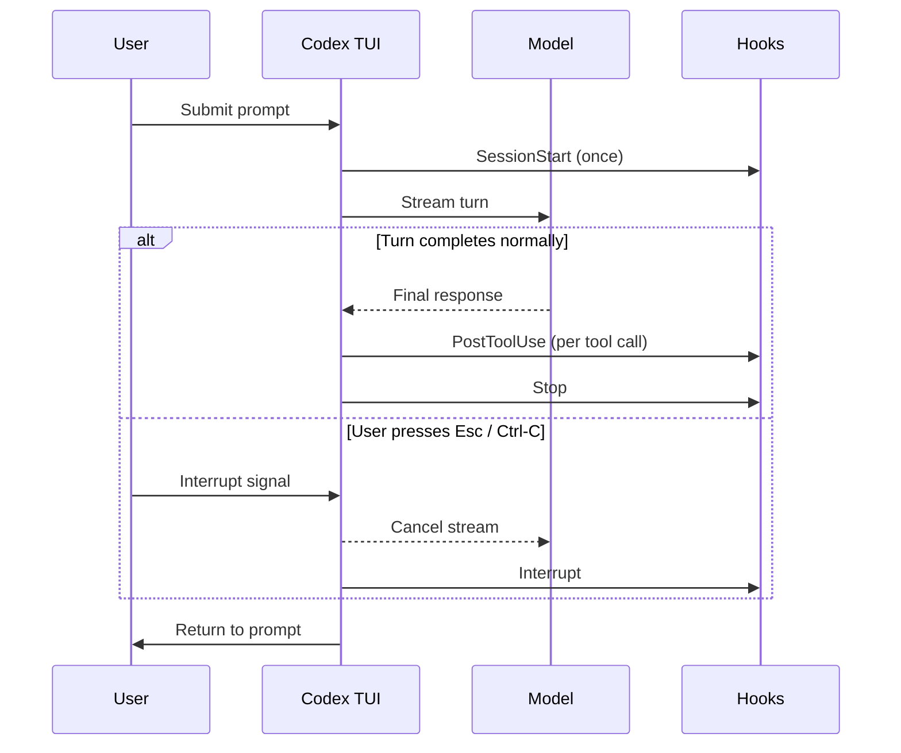

# Interrupt Hooks in Codex CLI v0.150.0: Handling Ctrl-C as a First-Class Lifecycle Event


Codex CLI v0.150.0, released on 26 August 2026, ships a new `Interrupt` hook event that fires whenever an active top-level turn is cancelled by the user — Ctrl-C or Esc — before it completes normally.[^1] For anyone running automated workflows, CI pipelines, or long-running multi-agent sessions, this fills a gap that has existed since hooks were introduced: the inability to cleanly intercept aborted turns.

## The Problem: Stop Hooks Did Not Fire on Interrupted Turns

Since hook support landed in March 2026, the `Stop` event has been the canonical endpoint for turn teardown — telemetry flush, audit trails, state commits. The problem, filed in GitHub issue #22858, was that `Stop` only ran on the *normal* completion path.[^2] Press Esc mid-turn and nothing fired. Integrations that tracked session state could silently desync; CI pipelines lost their abort signal; audit logs had gaps where interrupted turns should appear as entries.

The root cause was straightforward: `run_turn_stop_hooks` was only called after the model returned a final response. If a user interrupted before that, the function was never reached. A minimal fix ensured stop hooks fired regardless of exit path, but the community feedback was clear: interrupted turns deserve their own event, not a retrofitted `Stop`. The `Interrupt` hook event is that resolution.[^2]

## What the Interrupt Hook Is — and Is Not

`Interrupt` fires when an active **top-level** turn is interrupted. Subagent turns have their own `SubagentStop` event. The distinction matters:

| Event | When it fires | Scope |
|---|---|---|
| `Stop` | Top-level turn completes normally | Top-level thread only |
| `Interrupt` | Top-level turn cancelled (Esc / Ctrl-C) | Top-level thread only |
| `SubagentStop` | Any subagent turn ends (normal or otherwise) | Spawned subagents |
| `SessionEnd` | Main thread session closes entirely | Whole session |

`Interrupt` does **not** fire for subagent cancellations. It does **not** fire for `codex exec` forked sessions — those are independent threads. It fires exactly once per interrupted turn, synchronously, before the TUI returns to the prompt.[^1]

## Turn Lifecycle with Interrupt Hooks



## Configuring an Interrupt Hook

Hook configuration lives in `~/.codex/hooks.json` (global) or `.codex/hooks.json` at project root. The `Interrupt` event follows the same handler schema as all other events — `command` or `mcp_tool`.[^3]

### Command Handler

```json
{
  "hooks": {
    "Interrupt": [
      {
        "matcher": "*",
        "hooks": [
          {
            "type": "command",
            "command": "~/.codex/hooks/on-interrupt.sh",
            "timeout": 10,
            "statusMessage": "Recording interrupted turn..."
          }
        ]
      }
    ]
  }
}
```

The `matcher` field is a regex matched against the tool name for tool-scoped events; for `Interrupt` (which has no tool context) `"*"` is the conventional catch-all. The `timeout` is in seconds and defaults to 600 — set it short for interrupt handlers so the TUI returns promptly.

### MCP Tool Handler

```json
{
  "hooks": {
    "Interrupt": [
      {
        "matcher": "*",
        "hooks": [
          {
            "type": "mcp_tool",
            "server": "observability",
            "tool": "record_abort",
            "input": {
              "session_id": "${session.id}",
              "thread_id": "${thread.id}",
              "timestamp": "${interrupt.timestamp}"
            },
            "timeout": 5,
            "statusMessage": "Logging abort event..."
          }
        ]
      }
    ]
  }
}
```

MCP tool handlers use `${field.nested}` template variable expansion from the hook event payload.[^3] The available fields for `Interrupt` are consistent with other session-scoped events: `session.id`, `thread.id`, and a timestamp. ⚠️ The exact payload schema for `Interrupt` is not yet documented in the stable reference — treat specific field names as subject to change in 0.151.x.

### Async Handlers

`Interrupt` handlers can be marked `async: true` to run in the background, matching the async hook capability introduced in v0.148.0.[^3] This is appropriate for telemetry sinks where you want the TUI to return immediately:

```json
{
  "type": "command",
  "command": "~/.codex/hooks/async-abort-telemetry.sh",
  "async": true,
  "timeout": 30
}
```

Note: `SessionEnd` is always synchronous regardless of the `async` flag. `Interrupt` does not have this constraint.

## Practical Patterns

### 1. Audit Trail Completeness

The canonical use case is closing audit gaps. Previously, interrupted turns produced no hook output, leaving a gap between the `UserPromptSubmit` event and the next `SessionStart` or `Stop`. An `Interrupt` hook lets you emit a structured abort record:

```bash
#!/usr/bin/env bash
# ~/.codex/hooks/on-interrupt.sh
TIMESTAMP=$(date -u +"%Y-%m-%dT%H:%M:%SZ")
jq -n \
  --arg ts "$TIMESTAMP" \
  --arg sid "${CODEX_SESSION_ID:-unknown}" \
  '{"event":"turn_interrupted","session_id":$sid,"timestamp":$ts}' \
  >> ~/.codex/audit.jsonl
```

### 2. CI Pipeline Abort Signal

In non-interactive (`--no-tty`) CI runs, `Interrupt` becomes the reliable abort detector. Without it, a SIGTERM to the Codex process during a long turn would leave downstream steps uncertain whether the turn was in progress. With the hook:

```json
{
  "hooks": {
    "Interrupt": [
      {
        "matcher": "*",
        "hooks": [
          {
            "type": "command",
            "command": "touch /tmp/codex-turn-aborted",
            "timeout": 2,
            "async": false
          }
        ]
      }
    ]
  }
}
```

Your CI step can then check for `/tmp/codex-turn-aborted` and handle it accordingly — emit a Slack notification, mark the run as cancelled rather than failed, or requeue the task.

### 3. State Checkpoint Before Abort

For long-horizon tasks that accumulate intermediate state (scratch files, partial diffs), an `Interrupt` hook can commit a checkpoint:

```bash
#!/usr/bin/env bash
# Stash any in-progress work so the next session can resume
git stash push --include-untracked -m "codex-interrupted-$(date +%s)" 2>/dev/null || true
```

Pair this with a `SessionStart` hook that checks for such stashes and surfaces them via `systemMessage` in the hook output.

## Combining Interrupt with @Task References (v0.150.0)

v0.150.0 also ships task referencing via `@` mentions, which lets agents read, create, or message other Codex tasks from the terminal.[^1] In orchestrated pipelines where a parent task spawns subtasks via `multi_agent_v2`, an `Interrupt` on the parent can now send a cancellation message to running subtasks by referencing them with `@<task-name>` in the hook command output — bridging the gap between hook signals and the agent messaging layer.

This is experimental territory: the `@` mention mechanism targets the TUI prompt context, not a formal message queue. Treat any cross-task messaging from hooks as best-effort rather than guaranteed delivery. ⚠️

## Gaps and Limitations

**No `Interrupt` payload documentation yet.** The stable hooks reference at `learn.chatgpt.com/docs/hooks` lists 11 events but does not yet include `Interrupt` in the event table as of 27 August 2026.[^3] The feature shipped in the v0.150.0 release notes, but the reference documentation trails the release. Use the release notes and the `hooks` section of `codex doctor` output to confirm the event name is recognised.

**Subagent interruptions are not covered.** If a user interrupts a parent turn that has spawned subagents via `multi_agent_v2`, the subagents receive their own `SubagentStop` events but the `Interrupt` event fires only on the top-level turn.[^1] There is no cascading interrupt event tree.

**`codex exec` forks are excluded.** Turns running in forked sessions (spawned via `codex exec`) are independent threads. Interrupting them does not trigger `Interrupt` hooks in the parent session.

**`continue: false` is not meaningful.** Because `Interrupt` fires after the turn is already cancelled, the standard `continue: false` output key has no effect — there is nothing left to block. Hook output is informational only for this event.

## Summary

The `Interrupt` hook in Codex CLI v0.150.0 closes a long-standing gap: interrupted turns now have a dedicated lifecycle event, separate from `Stop`, that gives operators a clean integration point for telemetry, audit logs, CI abort signals, and state checkpoints. Configuration follows the standard hooks.json schema with either `command` or `mcp_tool` handlers, and async mode is supported for non-blocking teardown. The full payload schema is not yet in the stable reference docs — treat field names as provisional until the 0.151.x cycle stabilises.

## Citations

[^1]: OpenAI, "Codex CLI v0.150.0 Release Notes," GitHub Releases, 26 August 2026. <https://github.com/openai/codex/releases/tag/rust-v0.150.0>
[^2]: microHoffman, zdtango et al., "Clarify or fire Stop hook when a turn is interrupted with Esc," GitHub Issue #22858, openai/codex. <https://github.com/openai/codex/issues/22858>
[^3]: OpenAI, "Hooks — Codex CLI Reference," ChatGPT Learn Docs, 2026. <https://learn.chatgpt.com/docs/hooks>
[^4]: Releasebot, "Codex Updates by OpenAI — August 2026," Releasebot.io. <https://releasebot.io/updates/openai/codex>
[^5]: Gradually.ai, "Codex CLI Changelog (August 2026)," Gradually.ai. <https://www.gradually.ai/en/changelogs/codex-cli/>
[^6]: OpenAI, "Codex CLI v0.148.0: Async Command Hooks and MCP Tool Handlers," GitHub Releases, August 2026. <https://github.com/openai/codex/releases/tag/rust-v0.148.0>
