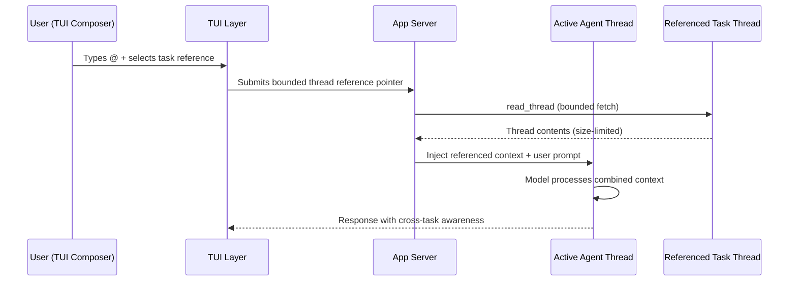
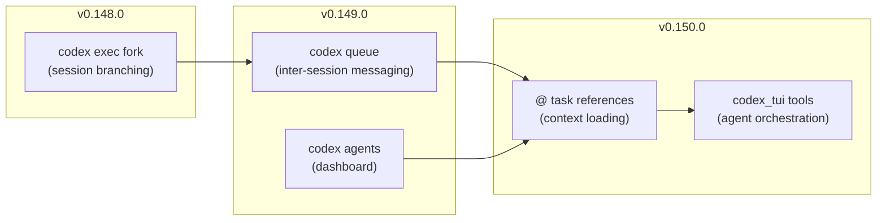

# Task References in Codex CLI v0.150.0: Cross-Task Context Without Copy-Paste


Codex CLI v0.150.0, released on 26 August 2026, ships a genuinely new cross-task coordination primitive: `@` task references in the TUI composer.[^1] For the first time, you can mention another running or archived Codex task by name inside the composer, have the model load that task's thread contents, and orchestrate across sessions without leaving the terminal or copy-pasting context manually.

This article covers how the feature works at the implementation level, what the underlying `codex_tui` tool namespace exposes to agents, practical multi-task workflow patterns, and where the current design still leaves gaps.

## Context Siloing Was the Real Problem

Codex CLI's session model has always been intentionally isolated: each task runs in its own thread, with its own approval policy, its own working directory, and its own context window. That isolation is a feature when you want parallel agents to avoid stepping on each other. It becomes friction when you want to do something like:

- Have a code-review task pull the changes a separate implementation task just committed
- Resume a debugging session with full awareness of the architecture decisions made in a planning task
- Ask a summarisation task to aggregate the output of three specialist subagents after they complete

Before v0.150.0, the only options were manual: copy-paste from one TUI window to another, write intermediate artefacts to shared files (the classic `board.md` anti-pattern from issue #21027[^2]), or use `codex queue` to send free-text messages between sessions without structured context loading. None of these allowed the model to natively load another task's conversation thread.

## How `@` Mentions Work in the Composer

When you type `@` in the TUI composer, a popup appears listing matching Codex tasks.[^3] The popup prioritises tasks from the current working directory, then other local tasks. Tasks can be filtered by typing additional characters after the `@` symbol.

When you select a task from the popup, it is submitted as a **bounded live thread reference** — a structured pointer that instructs the model to load the task's thread contents via the `read_thread` internal operation before processing your prompt.[^3] The reference persists across composer history and across thread lifecycle events: starting a new thread, resuming a paused session, or forking an existing one.

The bounding is important: the reference carries size limits on both the request sent to the task and the response loaded from it. This prevents a single cross-task reference from flooding the active context window with an unbounded conversation history.

```
# Example: type in the TUI composer
@auth-refactor-task review the changes I've made here and confirm they're consistent
```

The model resolves `@auth-refactor-task` to the live thread contents of that task and incorporates them as context before responding. From the model's perspective, it now has both the current task's thread and the referenced task's thread available simultaneously — without you having to copy anything.

## The `codex_tui` Tool Namespace

PR #40308 adds something more powerful still: a `codex_tui` tool namespace that exposes task management capabilities *to the agent itself*, not just to the user.[^1] When a TUI session supports task tools, the agent can invoke nine operations autonomously:

| Tool | What it does |
|------|-------------|
| `list_tasks` | List tasks visible from the current session |
| `read_task` | Load a task's thread contents (bounded) |
| `wait_for_task` | Block until a task reaches a terminal state |
| `create_task` | Spawn a new Codex task with a given prompt |
| `fork_task` | Fork an existing task into a new thread |
| `send_message` | Send a message to a running task |
| `rename_task` | Rename a task (supports the new auto-naming flow) |
| `archive_task` | Archive a task (hide from the default session list) |
| `restore_task` | Restore an archived task back to the active list |

This is a material shift from the previous model. Previously, agents could spawn subagents through `multi_agent_v2` — but only as a strict parent-to-child hierarchy. With `codex_tui` tools, an agent in the TUI can reason about, read from, and message *any* task visible to the session, not just its own children.

The routing goes through the app-server's thread operations with an authenticated local MCP server mediating the calls. Approval prompts are raised for tool invocations that cross task boundaries, consistent with Codex's existing MCP approval model.[^1] Managed MCP policies from `requirements.toml` apply, which means enterprise deployments can restrict which cross-task operations are permitted.

## Architecture: How Cross-Task Context Loads



The bounded fetch is the key safety mechanism. The app-server enforces size limits on both the outbound reference request and the inbound thread payload, preventing runaway context consumption. If the referenced task's thread exceeds the bound, the payload is truncated — which means very long tasks may only deliver partial context through an `@` reference.[^1] ⚠️ The exact truncation strategy is not yet documented in stable release notes.

## Practical Workflow Patterns

### Pattern 1: Specialist → Reviewer Handoff

Run a specialist implementation task to completion, then open a fresh review session and reference it:

```
# In a new reviewer session
@implement-payment-gateway-task
Review the changes in that task against our API contract spec.
Flag any endpoint divergences.
```

The reviewer agent loads the implementation task's thread, including all tool calls, apply_patch outputs, and reasoning — then proceeds with the review.

### Pattern 2: Multi-Specialist Aggregation

After three parallel specialist tasks complete, use an aggregator task to synthesise:

```
@backend-task @frontend-task @db-schema-task
Summarise the design decisions made in each task.
Identify any inconsistencies across the three implementations.
```

All three tasks are resolved as bounded references and injected into context before the model responds.

### Pattern 3: Agent-Driven Task Orchestration

With `codex_tui` tools available to the agent, you can ask it to coordinate other tasks autonomously:

```
Audit our three open feature branches.
Create a separate Codex task for each branch,
wait for them to complete their static analysis,
then aggregate their findings here.
```

The agent calls `create_task` three times, then `wait_for_task` for each, then `read_task` to pull results — all without you manually managing the parallel sessions.

### Pattern 4: Resume with Full Prior Context

When resuming a paused session that depends on a separate planning task:

```
@architecture-planning-task
Continue the implementation described in that planning session.
We're starting on the authentication module.
```

The model rehydrates the planning context from the archived task thread before proceeding — more reliable than relying on `memory_summary.md` reconstructions.

## Configuration and Security Model

Cross-task tools are gated by the MCP approval model. In practice:

- **`allow` profile**: Cross-task reads and messages are auto-approved; creates and forks still prompt ⚠️
- **`on-request` profile**: Every `codex_tui` tool call raises an approval prompt
- **`requirements.toml` restrictions**: Enterprise operators can deny specific `codex_tui` operations via managed MCP policy[^4]

If the session connects to an older app-server that pre-dates `codex_tui`, the tools fall back gracefully and are simply not offered — the `@` mention popup will still appear but without task tool support, the reference is treated as a plain-text mention rather than a live thread load.[^1]

The untrusted project isolation fix shipped alongside this feature in v0.150.0 is relevant: project-level `AGENTS.md` instructions are no longer supplied for untrusted projects, which limits the attack surface if a cross-task reference pulls in context from an untrusted task thread.[^5]

## Integration with the Cross-Task Ecosystem

Task references join three existing cross-task primitives introduced across recent releases:



| Primitive | Coupling | Direction | Structured? |
|-----------|----------|-----------|-------------|
| `codex exec fork` | Loose | One-shot branch | No |
| `codex queue` | Loose | Fire-and-forget message | Partial |
| `codex agents` dashboard | Loose | Human control plane | N/A |
| `@` task references | Tight | Bidirectional context load | Yes |
| `codex_tui` tools | Tight | Agent-driven orchestration | Yes |

The spectrum moves from loose human-mediated coordination towards tight agent-driven orchestration. Task references are the first primitive where the model — not just the human — can proactively resolve and load cross-task context.

## Current Gaps

Several limitations are worth tracking:

**No subagent cascade**: `codex_tui` tools are only available in top-level TUI sessions, not inside `multi_agent_v2` subagents. An orchestrator spawned via `spawn_agent` cannot call `create_task` or `wait_for_task` through this interface.[^1]

**`codex exec` exclusion**: Non-interactive `codex exec` sessions do not have access to `codex_tui` tools. CI pipelines cannot leverage cross-task orchestration through this path.

**Truncation opacity**: When a referenced task's thread exceeds the size bound, the truncation behaviour is not surfaced to the user or the model. There is no indication of how much context was dropped. ⚠️

**No `rollout.jsonl` events**: Cross-task references and `codex_tui` tool calls do not appear as structured events in the rollout JSONL log, making post-session auditing of cross-task interactions difficult.

**No priority or filtering**: The `@` mention popup does not support filtering by task status (running vs archived), date, or working directory subtree beyond cwd-first prioritisation.

**`wait_for_task` timeout**: The `wait_for_task` tool has no documented timeout parameter. An agent waiting on a stalled task has no automatic escape hatch. ⚠️

## Summary

`@` task references and the `codex_tui` tool namespace represent v0.150.0's most significant architectural addition. They break the strict isolation model that has characterised Codex CLI sessions since launch — intentionally and selectively — to enable both human-driven cross-task context loading and agent-driven multi-task orchestration. The bounded fetch and MCP approval gating keep the security model intact. The gaps (no subagent support, no CI path, truncation opacity) indicate this is a first iteration of what will likely become a richer inter-agent coordination layer.

## Citations

[^1]: OpenAI, "Codex CLI v0.150.0 Release Notes — Task References, codex_tui tools, Interrupt Hooks," GitHub Releases, 26 August 2026. <https://github.com/openai/codex/releases/tag/rust-v0.150.0>

[^2]: GlebGlebovAKAJJ, "Shared workspace/message bus for Codex subagents," GitHub Issue #21027, openai/codex. <https://github.com/openai/codex/issues/21027>

[^3]: OpenAI, "PR #40315: Include Codex tasks in `@` mention popup as bounded live thread references," openai/codex. <https://github.com/openai/codex/pull/40315>

[^4]: OpenAI, "Codex CLI v0.149.0 Release Notes — agents dashboard, codex queue, codex doctor," GitHub Releases, 20 August 2026. <https://github.com/openai/codex/releases/tag/rust-v0.149.0>

[^5]: OpenAI, "PR #40308: TUI tools for managing Codex tasks (codex_tui namespace)," openai/codex. <https://github.com/openai/codex/pull/40308>

[^6]: OpenAI, "Codex CLI v0.148.0 Release Notes — codex exec fork, /export, cost visibility," GitHub Releases, 18 August 2026. <https://github.com/openai/codex/releases/tag/rust-v0.148.0>

[^7]: OpenAI Codex Community, "Feature Request: CLI Agent Dashboard / Thread View," GitHub Issue #30713, openai/codex. <https://github.com/openai/codex/issues/30713>
