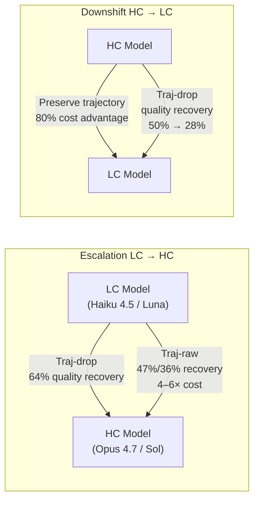
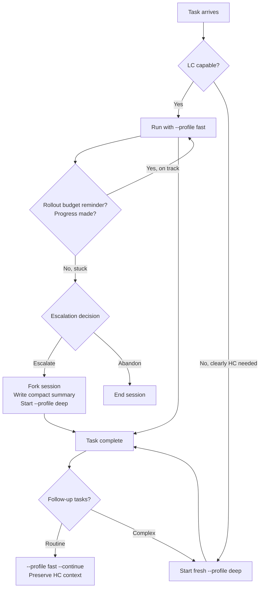

# The Handoff Tax: Why Mid-Session Model Escalation Costs More Than Starting Fresh in Codex CLI


## The Intuition That Doesn't Hold

The model-switching intuition seems sensible: start a session with a fast, cheap model; detect when the task is harder than expected; hand the accumulated trajectory off to a stronger model to finish the job. Pay LC (low-cost) prices for the easy first half, HC (high-cost) prices only for the difficult second half. Net result: better quality at lower overall cost than using the strong model throughout.

Ganz, Shpigel Nacson, Kalyanpur & Litman put this intuition to the test in a large-scale empirical study and found it substantially wrong.[^1] Their evaluation — 58,000 agent runs, 2 million LLM API calls, 36 billion tokens across 500 SWE-bench Verified instances — reveals a persistent penalty they term the **handoff tax**: the cost of handing a non-native trajectory to a new model is high enough that naïve escalation is almost never the right strategy.

## Quantifying the Tax

The study examined two model pairs: Claude Haiku 4.5 (LC) escalating to Opus 4.7 (HC), and GPT-5.6 Luna (LC) escalating to GPT-5.6 Sol (HC).[^1]

**Raw escalation** — passing the full LC trajectory verbatim to the HC model — recovered only **47% of the Claude quality gap** and **36% of the GPT quality gap** between the two models. Cost premiums were severe: **4.0× for Claude** and **6.1× for GPT** relative to running LC throughout.[^1]

The critical insight emerges when comparing raw escalation against the obvious alternative:

> "For Claude, even after paying for the LC prefix, abandoning the attempt and restarting with HC is cheaper and more accurate than raw continuation."[^1]

A fresh HC session dominates raw mid-session escalation on both quality and cost. Naïve escalation wastes the already-paid prefix tokens *and* the HC budget, while delivering worse output than simply starting over.

A complementary study, "The Replay Gap" (arXiv:2608.08239), corroborates this from a different angle: in branching rollout experiments, model swaps rewrote 61–94% of post-fork agent actions, and replay-based routing evaluation was valid for only 3–8% of swap decisions.[^2] Non-native trajectories fundamentally alter subsequent behaviour — the handoff tax is not a token-accounting artefact, it is a capability degradation.

## Interface Design: Direction Determines Optimal Strategy

The paper tests three trajectory interface designs beyond raw handoff:[^1]

- **Traj-raw**: pass the full LC trajectory verbatim
- **Traj-compact**: pass a compressed/summarised transcript
- **Traj-drop**: discard the LC trajectory entirely; preserve only workspace state (files modified, tests executed)

The headline finding is a **directional duality**: the optimal interface design reverses depending on whether you are escalating up or downshifting down.



### For Escalation: Drop the Trajectory

Remove the LC transcript before handing off to HC. HC models navigate an alien reasoning trace less effectively than they navigate a clean workspace state. Traj-drop achieves **64% quality recovery** for Claude escalation — 17 percentage points above raw — while traj-compact offers a cost-intermediate position.[^1]

Even 64% is a meaningful tax: if the quality gap matters to the task, the economics still favour restarting HC from scratch over escalating mid-session.

### For Downshift: Preserve the Context

Retain the HC trajectory when routing follow-up tasks to an LC model. Removing HC context during downshift drops Claude quality recovery from 50% to 28%.[^1] LC models depend on the stronger model's prior reasoning to perform above their native baseline. Raw downshift — passing full HC context to LC — retains **80% of the LC cost advantage** while improving LC pass rates from 54.6% to 65.6%.

## Beyond Coding: Where the Tax Shrinks

The tax diminishes when agent steps are less sequentially dependent. On the **Lost in Conversation** benchmark (requirements arriving late in context), escalation recovers 86% of the quality gap because HC simply reads the requirements and responds without depending on prior tool-call reasoning chains.[^1]

On **BrowseComp** (progressive web research), escalation nearly closes the gap (95.8% recovery) but remains cost-negative at the studied model prices.[^1] The structural driver of the handoff tax is agentic sequential tool use; tasks with less inter-step dependency suffer a smaller penalty.

## Mapping to Codex CLI v0.150.0

Codex CLI does not yet support native mid-session model switching, which means the paper's findings govern session architecture decisions rather than in-session configuration.

### Named Profiles as Tier Gates

Define LC and HC tiers explicitly:

```toml
[profiles.fast]
model = "claude-haiku-4-5"
model_reasoning_effort = "low"

[profiles.deep]
model = "claude-opus-4-7"
model_reasoning_effort = "high"

[profiles.fast_gpt]
model = "gpt-5.6-luna"

[profiles.deep_gpt]
model = "gpt-5.6-sol"
```

Start task sessions with `codex --profile fast` for triage and initial investigation. When escalation is warranted, the paper's evidence says: **do not continue the LC session with HC via `--continue`**. The traj-drop result shows that abandoning the LC trajectory and preserving only workspace state delivers better outcomes than raw handoff.

### Session Fork as Traj-drop Equivalent

Codex CLI's session fork (available since v0.148.0) is the closest available primitive to the paper's traj-drop interface.[^3] A fork inherits the filesystem state — all applied edits, test artefacts — while opening a clean context window:

```bash
# Stage 1: LC triage
codex --profile fast "Investigate the failing auth middleware — locate the root cause and affected files"

# Escalation decision: fork with a human-authored summary, drop LC trajectory
codex --profile deep "Auth middleware failure is in src/middleware/auth.ts lines 84–112 — the token refresh handler silently swallows 401 responses from the upstream IdP. Fix it, update tests, and verify the session-expiry edge case in the integration suite."
```

The compact natural-language handoff summary is the manual traj-drop equivalent: workspace state (all file edits already applied by the LC session) is inherited; the LC reasoning chain is not.

### Compaction as Traj-compact

Codex CLI's compaction (`model_auto_compact_token_limit`, `experimental_compact_prompt_file`) approximates the traj-compact interface. For escalation scenarios, lowering the compaction threshold before the HC handoff reduces prefix cost:

```toml
[model]
model_auto_compact_token_limit = 30000
experimental_compact_prompt_file = ".codex/compact-prompt.md"
```

⚠️ The paper's results for traj-compact are marginal for Claude escalation (48% quality recovery vs 47% for traj-raw — essentially noise). Compaction alone is insufficient for escalation handoffs. Traj-drop (session fork with human summary) delivers 64% recovery; compaction does not approach that. Do not rely solely on `model_auto_compact_token_limit` to solve the escalation problem.

### Rollout Budget as Escalation Trigger

The rollout token budget introduced in v0.150.0-alpha (`[features.rollout_budget]`) provides an objective trigger:[^4]

```toml
[features.rollout_budget]
enabled = true
limit_tokens = 60000
reminder_interval_tokens = 12000
```

When the first reminder fires at roughly 20% of budget, assess progress. If the LC session has not resolved the task, the paper's economics are clear: fork and restart with HC, consuming no further LC tokens. Late escalation maximises prefix cost with no quality improvement.

### Downshift Pattern: Preserve Context

For routine follow-up tasks after an HC session, use `--continue` to give the LC model the HC reasoning context it needs:

```bash
# HC deep session resolved a complex architectural change
# Follow-up tasks suit LC — but retain HC context
codex --profile fast --continue "Update CHANGELOG.md and README.md to reflect the auth middleware refactor"
```

This aligns with the finding that LC models retain a meaningful quality uplift when HC trajectory is preserved.

## Gap Matrix

| Paper Mechanism | Codex CLI v0.150.0 |
|---|---|
| Automated escalation detection | ❌ No native signal |
| Traj-drop interface | ⚠️ Manual: session fork + human summary |
| Traj-compact interface | ⚠️ Compaction approximates; insufficient for escalation |
| Mid-session profile switch | ❌ Requires fork |
| HC→LC context preservation (downshift) | ✅ `--continue` retains session |
| Rollout budget as escalation trigger | ✅ v0.150.0-alpha |

## Practical Decision Framework



Key rules from the paper's numbers:

1. **Decide early**: The escalation decision loses value as the LC prefix grows. Make it within the first budget reminder window.
2. **Fork, don't continue**: When escalating, session-fork and write a terse human summary. Never pass the raw LC transcript to HC.
3. **Preserve context on downshift**: LC models need HC context to exceed their native ceiling.
4. **Restart HC when genuinely stuck**: If the LC session is making no progress, a fresh HC session is cheaper *and* more accurate than mid-session raw escalation — counterintuitive but borne out across 58,000 runs.

## Citations

[^1]: Ganz, R., Shpigel Nacson, M., Kalyanpur, A., & Litman, R. (2026). *The Handoff Tax: Continuing Non-Native Trajectories in LLM Agents*. arXiv:2608.24358. https://arxiv.org/abs/2608.24358

[^2]: Govindaiah, A., et al. (2026). *The Replay Gap: Static Evaluation of Model Switching in LLM Agents Scores the Wrong World*. arXiv:2608.08239. https://arxiv.org/html/2608.08239

[^3]: OpenAI. (2026). *Codex CLI v0.148.0 — Session Forking*. GitHub Releases. https://github.com/openai/codex/releases/tag/v0.148.0

[^4]: OpenAI. (2026). *Codex CLI v0.150.0 — Rollout Token Budgets*. GitHub Releases. https://github.com/openai/codex/releases/tag/v0.150.0
