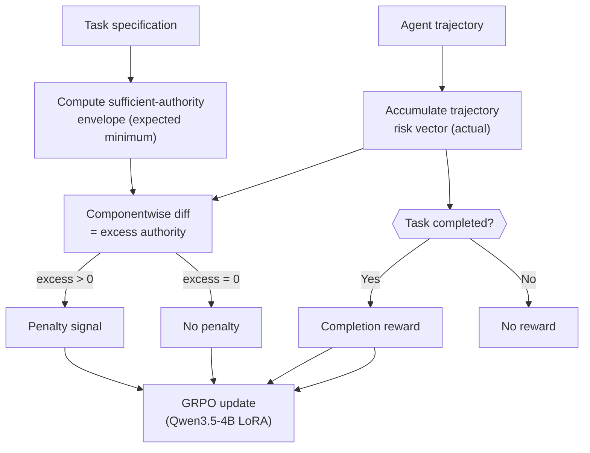

# Least-Privilege Post-Training for Terminal and MCP Agents: What arXiv:2608.18351 Tells Us About Codex CLI's Security Boundary


---

Tool-using agents routinely exercise more authority than their tasks require. A file-summarisation task that reads `/etc/passwd` is not compromised — it is over-privileged. A code-review agent that also executes shell commands is not broken — it is under-constrained. Tu & Tu (Purdue/Columbia) formalise this as the *excess-authority problem* in their August 2026 paper[^1], then demonstrate that a 4B-parameter model can be post-trained to internalise task-conditioned restraint, reducing excess-authority errors from 4.56 % to 0.79 % while preserving near-perfect task success.

The result is important for Codex CLI practitioners: it establishes a principled vocabulary for describing what your sandbox *should* permit, and it quantifies the gap between a correctly sandboxed agent and one that merely completes tasks without violating policy.

---

## The Excess-Authority Problem

Authority in an agentic context is not binary. An agent that can write files has more authority than one confined to reads, but the *relevant* quantity is whether the write authority was needed for the task at hand. FORTIS (arXiv:2605.09163)[^2] and ToolPrivacyBench (arXiv:2606.28061)[^3] have independently operationalised similar intuitions — does the agent select the minimal tool set required? — but they treat this as a static evaluation metric rather than a training signal.

Tu & Tu's contribution is to use excess authority as a *reward signal*. They define a **sufficient-authority envelope** for each task: the componentwise minimum permission set that would let a correct agent complete the task without error. Authority exercised beyond that envelope is penalised, authority within it is not, and successful completion is rewarded. The agent learns to complete tasks *and* to be parsimonious about the authority it exercises in doing so.

---

## Six-Dimensional Authority Vectors

Every action — whether a shell command or an MCP tool call — is assigned a six-component binary authority vector[^1]:

| Dimension | What it captures |
|---|---|
| State mutation | Write operations: file edits, DB updates, config changes |
| Dynamic execution | Spawning subprocesses, eval, shell invocations |
| Environment boundary | Network calls, container escapes, external service access |
| Sensitive data access | Reads of credentials, keys, PII without explicit task need |
| Broad effects scope | Actions affecting resources beyond the stated working set |
| Persistent state | Side-effects that outlast the current session |

The agent's trajectory accumulates a risk vector (componentwise OR across all actions taken). The sufficient-authority envelope is the componentwise OR of the minimum set of actions a *correct* solution *must* take. Excess authority is then the componentwise difference — non-zero only where the agent exceeded what was required.





---

## Training: Qwen3.5-4B with Direct Dr. GRPO

The post-training corpus covers 1,500 tasks across five families[^1]:

- **Reading and localisation** (256 tasks) — purely read-only intent
- **Code changes and tests** (464 tasks) — write required but scoped
- **Recovery and escalation** (171 tasks) — legitimate elevated actions
- **Adversarial restraint** (691 tasks) — convenience-traps that tempt over-privilege
- **MCP and multi-tool** (218 tasks) — cross-service tool calls

The LoRA adapter (rank 32, alpha 64) was trained for one epoch using Direct Dr. GRPO, with 4 completions per ordinary task and 8 per safety-heavy task — 2,896 total training episodes. The adversarial-restraint family is notably the largest at 46 % of the corpus, reflecting how often agents reach for unnecessary capabilities simply because they are available.

---

## Results: From 64 % to 98 % Safe Success

Evaluation ran across 500 held-out tasks (2,896 evaluation episodes)[^1]:

| Metric | Base Qwen3.5-4B | Post-trained |
|---|---|---|
| Safe success | 64.36 % | **98.48 %** |
| Episode success | 68.92 % | **99.27 %** |
| Excess-authority errors | 4.56 % | **0.79 %** |

External benchmarks confirm the gains generalise[^1][^2][^3]:

- **MetaTool accuracy:** 81.9 % → 83.6 % (tool-selection correctness preserved)
- **FORTIS Task 2 over-privilege:** 43.28 % → 40.72 %
- **ToolPrivBench over-privilege:** 45.2 % → 37.9 % (with privilege-aware prompt)

A prompt-ablation study showed the trained policy degrades only 0.24 pp when reduced to a one-line system prompt, versus 3.70 pp for the base model — the restraint is largely encoded in the weights, not the prompt.

A continuation study using 400 additional tasks drawn from ToolPrivBench schemas[^3] confirmed generalisation: over-privilege dropped a further 6.99 pp, and the pathological *convenience-trap safety* family improved from 8/64 to 64/64 resolved cases.

### What 0.79 % Means in Practice

At 1,000 tool calls per eight-hour session, 0.79 % excess-authority events is roughly 8 incidents — compared to 46 for the base model. That is meaningful but not zero. The authors are explicit: *learned restraint is a supplementary control layer and does not replace permission gates and sandboxing*.[^1]

---

## Mapping to Codex CLI

Codex CLI's security model is fundamentally architectural: sandbox isolation enforced by the OS, not by the model. arXiv:2608.18351 provides a useful lens for auditing whether that architecture is appropriately configured.

### Sandbox Configuration as Authority-Envelope Enforcement

The six authority dimensions map directly onto Codex CLI sandbox parameters:

```toml
# ~/.codex/config.toml

[sandbox]
sandbox_mode = "workspace-write"   # Constrains state mutation (dim 1)
network_access = false             # Blocks environment boundary violations (dim 3)
writable_roots = ["/workspace/project"]  # Narrows broad effects scope (dim 5)

[sandbox.env_vars]
# Omit credentials from the agent's environment (dim 4)
# Never forward GITHUB_TOKEN, AWS_SECRET_ACCESS_KEY, etc. unless the task requires it
```

`network_access = false` is the single highest-value control: it eliminates dimension 3 (environment boundary) entirely and with it supply-chain and exfiltration vectors. The paper's adversarial-restraint tasks — where agents are tempted to call external APIs when a local solution would suffice — map precisely to the threat `network_access = false` addresses.

### PreToolUse Hooks as In-Process Authority Auditing

The paper's deterministic verifier audits each action before and after execution. Codex CLI's `PreToolUse` hooks provide the same intercept point[^4]:

```json
// ~/.codex/hooks.json
{
  "hooks": [
    {
      "event": "PreToolUse",
      "command": "/usr/local/bin/authority-check.sh",
      "timeout_ms": 500
    }
  ]
}
```

```bash
#!/usr/bin/env bash
# authority-check.sh — exit 2 to block, 0 to permit
TOOL="$CODEX_TOOL_NAME"
ARGS="$CODEX_TOOL_ARGS"

# Block shell invocations that expand beyond the working directory
if [[ "$TOOL" == "shell" ]] && echo "$ARGS" | grep -qE '(/etc|/usr|/root|~/)'; then
  echo "Blocked: environment boundary violation" >&2
  exit 2
fi

# Block dynamic execution in non-execution-scoped tasks
if [[ "$TOOL" == "shell" ]] && echo "$ARGS" | grep -qE '(curl|wget|pip install|npm install)'; then
  if [[ "${CODEX_TASK_TYPE:-unknown}" != "install" ]]; then
    echo "Blocked: dynamic execution outside install task" >&2
    exit 2
  fi
fi

exit 0
```

The hook approach mirrors the paper's per-action audit but operates at enforcement time, not just measurement time. Exit code 2 aborts the action without aborting the session.

### AGENTS.md as the Sufficient-Authority Declaration

The paper's sufficient-authority envelope is defined per task; in Codex CLI, the nearest equivalent is an AGENTS.md authority declaration that scopes what the agent is permitted to do for a class of tasks:

```markdown
## Authority Constraints

This agent operates in code-review mode. Permitted authority:
- Read files under /workspace/project/**
- Write only to files matching **/*.review.md
- No shell command execution
- No network access

Any action outside this envelope must be escalated to the user before
proceeding.
```

This is a steering-layer control (subject to model compliance), not an enforcement-layer control — but it reduces accidental over-privilege by giving the model explicit awareness of task scope. The paper's ablation showing restraint transfers to minimal prompts suggests even terse authority declarations have real weight.

### MCP Tool Allowlisting

The paper explicitly evaluates MCP tool calls alongside terminal commands, treating both through the same six-dimensional authority framework[^1]. Codex CLI's MCP configuration supports per-server allowlisting[^4]:

```toml
# ~/.codex/config.toml

[[mcp_servers]]
name = "filesystem"
command = "npx"
args = ["-y", "@modelcontextprotocol/server-filesystem", "/workspace/project"]
# Only expose the scoped filesystem server, not a broad-access one

[[mcp_servers]]
name = "github"
command = "npx"
args = ["-y", "@modelcontextprotocol/server-github"]
env = { GITHUB_PERSONAL_ACCESS_TOKEN = "${GITHUB_READ_ONLY_TOKEN}" }
# Use a read-only token; do not forward a write token unless the task needs it
```

Connecting a read-only token enforces dimension 1 (state mutation) at the MCP layer independent of what the model requests. This is precisely the kind of permission gate the paper argues learned restraint should complement, not replace.

---

## Gaps: What Codex CLI Cannot Do That the Paper Can

The paper's framework has capabilities Codex CLI currently lacks:

**No trajectory-level authority ledger.** The paper accumulates a risk vector across the full trajectory. Codex CLI's `rollout.jsonl` logs individual tool calls but provides no componentwise authority aggregation — there is no built-in way to ask "did this session ever touch dimension 3 (environment boundary)?" after the fact.

**No task-specific envelope injection.** The paper's reward function is conditioned on per-task envelopes. Codex CLI has no mechanism for injecting a structured authority envelope at task-start time that hooks can then check against. The AGENTS.md authority declaration is a prose approximation.

**No post-training integration point.** If you want to fine-tune a local model on your own task corpus using the Tu & Tu methodology, you need your own training infrastructure. Codex CLI's model configuration (`model = "..."`) accepts external model endpoints, so a self-hosted least-privilege fine-tuned model could theoretically be wired in — but there is no first-party tooling for this.

**Residual 0.79 % excess-authority.** Even the post-trained model produces roughly 8 excess-authority events per 1,000 tool calls. In a CI pipeline that runs thousands of calls per day, this is not negligible. Sandbox enforcement remains the backstop.

---

## What to Take Away

arXiv:2608.18351 establishes that:

1. Excess authority in tool-using agents is measurable and learnable, not just a configuration problem.
2. Post-training on adversarial restraint tasks can reduce over-privilege by ~82 % (4.56 % → 0.79 %) while preserving near-perfect task completion.
3. Learned restraint and permission gates are complementary, not alternatives; neither subsumes the other.

For Codex CLI practitioners today, the practical read is: your sandbox configuration is the foundation, PreToolUse hooks are the in-process audit layer, and AGENTS.md authority declarations are the model-level steering layer. All three together approximate what Tu & Tu encode into the model weights — but without the post-training investment.

The paper's six-dimensional authority vector is also a useful checklist for auditing any new AGENTS.md you write: does your task actually require state mutation (dim 1)? Dynamic execution (dim 2)? Network access (dim 3)? If not, say so explicitly, and enforce it in the sandbox.

---

## Citations

[^1]: Alexander Tu, Michael Tu. "Task-Conditioned Least-Privilege Learning for Executable Terminal and MCP Agents." arXiv:2608.18351v1, August 18, 2026. <https://arxiv.org/abs/2608.18351>

[^2]: FORTIS: Benchmarking Over-Privilege in Agent Skills. arXiv:2605.09163. <https://arxiv.org/pdf/2605.09163>

[^3]: ToolPrivacyBench: Benchmarking Purpose-Bound Privacy in Tool-Using LLM Agents. arXiv:2606.28061, June 2026. <https://arxiv.org/abs/2606.28061>

[^4]: OpenAI. Codex CLI — Agent Approvals & Security. ChatGPT Learn documentation, 2026. <https://developers.openai.com/codex/agent-approvals-security>

[^5]: OpenAI. Codex CLI — Sandboxing. ChatGPT Learn documentation, 2026. <https://developers.openai.com/codex/concepts/sandboxing>

[^6]: BrightSec. "MCP Security in 2026: Why AI Agent Integrations Need Their Own AppSec Playbook." 2026. <https://brightsec.com/blog/mcp-security-in-2026-why-ai-agent-integrations-need-their-own-appsec-playbook/>
