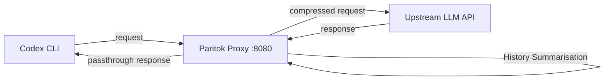

# Paritok-4B: Intent-Conditioned Context Compression as a Drop-In for Codex CLI's Token Overhead


Coding agents have a structural billing problem: they re-send large file reads and tool outputs to a frontier LLM on every turn. In a long Codex CLI session, that repeated context dominates the invoice long before any intelligent work happens. Paritok-4B (arXiv:2608.24188)[^1] — a 264 MB LoRA adapter released under Apache 2.0 by Jiayu Shi and Luzhuo Chen — attacks this at the proxy layer, compressing agent context to roughly a quarter of its original size without paraphrasing identifiers or hallucinating paths.

This article covers the paper's findings, the underlying compression mechanism, the cost economics that make self-hosting sensible, and the concrete steps to wire Paritok into a Codex CLI workflow.

## The Problem: Why General Compressors Fail on Code

General-purpose prompt compressors are trained predominantly on prose. When they see a 4,000-line Python file, they behave like a summariser: they collapse variable names, omit stack frames, and rewrite error strings. The resulting "compressed" context breaks the coding agent's patch application, which needs exact line numbers and identifier spellings.

Paritok-4B's response is an extractive design: 96.0% of identifier-like tokens it emits are already present verbatim in the input, holding at 96.2% on held-out SWE-bench Lite output.[^1] Rather than rewriting, it selects which lines survive — and the selection is conditioned on the agent's current task intent.

## Architecture: Three Levers, One Proxy

Paritok exposes three independent compression levers through an HTTP proxy that sits between the coding agent and the upstream LLM API:



**Lever 1 — Tool-Schema Filter (~21K tokens saved per turn).**
Most agent frameworks inject the full MCP or built-in tool schema into every request. Paritok uses a local `BAAI/bge-small-en-v1.5` embedding model (CPU-only) to semantically score schemas against the current task, keeping only the relevant tools in full and stubbing the rest.[^2] The proxy exposes a `gateway_search_tools` call so the agent can recover any stubbed schema on demand.

**Lever 2 — Content Compression (files, tool output, conversation history).**
The 4B LoRA adapter, fine-tuned on Qwen3-4B-Instruct-2507 at rank-32, receives a per-segment classification (file_read, bash_command, log_output, etc.) plus the agent's current task, then emits a compressed span. Deleted lines are replaced with a structural marker from a closed vocabulary — no free generation. Compressed content is recoverable via a `read_original` API call, making the gateway non-destructive.[^1]

**Lever 3 — History Summarisation.**
For saturated contexts, Paritok summarises older turns once the window approaches capacity, allowing sessions that would otherwise stall at context-length limits to continue running.[^2]

## Intent-Conditioning: How Task Context Shapes Selection

The paper's most interesting finding is that intent-conditioning does not operate at the coarse segment level. Whether a segment survives at all is "governed mostly by kind and rule" — a file_read from the current working file survives, a distant tool output is a candidate for removal. Within a surviving segment, retained lines are +0.067 more intent-relevant than removed ones (paired 95% CI [+0.056, +0.078]).[^1] In other words, the model uses the task description as a line-level sieve, not a binary segment gate.

This design has a practical implication for Codex CLI sessions: the quality of the task description you give Codex at the start of a session directly influences which lines the compressor keeps. A vague prompt leads to noisier compression.

## Results: Compression Ratios and Quality Retention

The paper evaluates on 300 SWE-bench Lite instances.[^1]

| Configuration | Compression Ratio | Quality Retention |
|---|---|---|
| Raw source input | 25.7% | 86.5% |
| Line-numbered input | 27.8% | 89.3% |
| gpt-4.1-mini compressor | 50.2% | — |
| gpt-5 compressor | 61.9% | — |

Paritok compresses 2.0–2.4× more aggressively than LLM-based compressors and retains significantly more identifiers. The McNemar test on solve rate shows `p=0.079` at n=300, confirming that compressing to roughly a quarter of context size does not significantly reduce task success.[^1]

The savings compound over turns:

| Session length | Approximate saving |
|---|---|
| 1 turn | ~25% |
| 5 turns | ~39–40% |
| 20+ turns (saturated) | ~85%+ |

The per-session cost reduction at Claude Sonnet (\$3.00/M input tokens) runs from \$0.12→\$0.09 at one turn to \$0.75→\$0.28 at twenty turns.[^2]

## Cost Economics: Why Self-Hosting Beats LLM Compressors

Using a frontier model as a compressor creates a negative ROI problem: a gpt-5 compressor costs \$6.30 net more per 1M tokens than it saves downstream. A gpt-4.1-mini compressor saves only \$0.29.[^1] Paritok-4B breaks even when the self-hosting cost is below \$2.23/M tokens — achievable on a \$0.75/hour GPU at approximately 10⁷ tokens/second throughput. A hosted tier at \$0.30/M tokens is also available, free through August 2026.[^2]

## Wiring Paritok Into Codex CLI

Paritok ships a PyPI package with optional dependency groups for the proxy and tool selector:

```bash
pip install "paritok[proxy,toolselect]"
paritok up
```

`paritok up` pulls the Q4-quantised model (~2.5 GB), starts the proxy on port 8080, and — critically for Codex users — **automatically writes `~/.codex/config.toml`** with the correct `base_url` override.[^2] No manual config editing is required.

To verify the rewrite:

```bash
cat ~/.codex/config.toml | grep base_url
# → base_url = "http://127.0.0.1:8080"
```

For OpenAI-compatible routing (if you run Codex with a non-Anthropic upstream), point the proxy at your provider:

```bash
paritok proxy --openai-url https://api.openai.com/v1
export OPENAI_BASE_URL=http://127.0.0.1:8080
```

Health and live compression metrics are available without any agent involvement:

```bash
curl http://127.0.0.1:8080/health
curl http://127.0.0.1:8080/stats
```

## Interaction With Codex CLI's Native Compaction

Codex CLI's native compaction fires at `model_auto_compact_token_limit`, replacing the full conversation history with a summarised version. This is destructive: as the Scroll paper demonstrated, summarise-and-forget can cost 53 percentage points on compositional recall tasks.[^3]

Paritok operates upstream of that gate. By reducing per-turn token volume, it pushes the compaction trigger further into the session — or eliminates it entirely for moderate-length tasks. A sensible configuration pairs both:

```toml
# ~/.codex/config.toml (after paritok up)
base_url = "http://127.0.0.1:8080"

[model]
model_auto_compact_token_limit = 150000   # raise threshold; paritok handles earlier turns
```

For multi_agent_v2 sessions with a rollout token budget, the reduction in per-thread token consumption translates directly into more work per budget ceiling before `CodexErr::TurnAborted` fires.[^4]

## Limitations

Four limitations are worth tracking before production use:

**Patch application failures.** The paper reports 16 of 300 compressed patches failed application, versus 5 for uncompressed runs.[^1] At 5.3% vs 1.7%, this is a measurable degradation — particularly relevant for complex multi-file patches. A PostToolUse hook that retries failed `apply_patch` calls with `read_original` as fallback is a reasonable mitigation.

**Python-heavy training bias.** The 67,074 OpenHands trajectories used for training skew heavily toward Python repositories.[^1] Performance on Go, Rust, or C++ heavy codebases should be treated as ⚠️ unverified until further benchmarks are published.

**Identifier guarantee weakens inside dropped segments.** The 96% extractiveness figure applies to tokens the model emits, not to the full input. Roughly 60% of identifier-like tokens within a segment that is dropped entirely do not survive compression.[^1] Segments that matter to the current task should survive, but the model makes no hard guarantee for peripheral file reads.

**Intent quality dependence.** Because task intent drives line-level selection, a vague or misaligned initial prompt produces less accurate compression. This interacts with AGENTS.md preambles: dense context that precedes the user task may dilute the intent signal.

## Verification and Reproducibility

The full pipeline — data funnel scripts, training configuration, three tested backbone variants, extractiveness audit (`eval/extractiveness.py`), and an end-to-end SWE-bench harness integrated with Ollama — is released at the GitHub repository under Apache 2.0.[^2] The paper's claim that "everything behind the numbers in this paper is released" is unusual in the compressor literature, where training data and distillation pipelines are often proprietary.

## Citations

[^1]: Shi, J. & Chen, L. (2026). *Paritok-4B: Intent-Conditioned Context Compression for Coding Agents*. arXiv:2608.24188. <https://arxiv.org/abs/2608.24188>

[^2]: Paritok-official. (2026). *paritok-4b-v1: Non-destructive compression gateway for AI coding agents*. GitHub. <https://github.com/Paritok-official/paritok-4b-v1>

[^3]: Lin, Y. et al. (2026). *Context as an Environment: Programmatic Context Management for Long-Horizon Agents*. arXiv:2608.21690. <https://arxiv.org/abs/2608.21690>

[^4]: OpenAI. (2026). *Codex CLI v0.150.0 — rollout token budgets, task references, interrupt hooks*. GitHub Releases. <https://github.com/openai/codex/releases/tag/v0.150.0>
