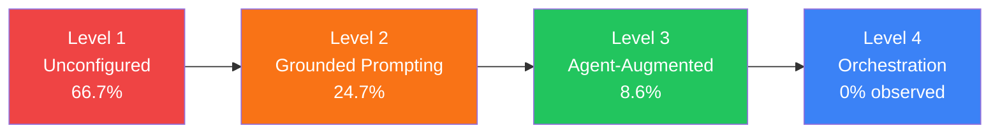

# RAMP: What Repository AI Maturity Tells Us About Codex CLI Configuration Quality


---

A new empirical study from Stanford, CMU, and MIT (Denisov-Blanch et al., arXiv:2608.25241, August 2026) asked a deceptively simple question: does committing AI configuration to version control actually improve outcomes?[^1] The answer is yes — and the magnitude is large enough to change how you think about `AGENTS.md`, `config.toml`, and every other file Codex CLI reads at session start.

The paper introduces **RAMP (Repository AI Maturity Profile)**, a four-level cumulative scale grounded entirely in version-controlled artefacts.[^1] Across 441 repositories spanning 12 AI coding tools — including OpenAI Codex, Claude Code, Cursor, Aider, and Gemini CLI — RAMP shows that repositories lacking committed configuration show roughly **2× the increase in cognitive complexity** and **1.7× the increase in static-analysis warnings** compared to configured counterparts, both at statistically significant levels.[^1]

---

## The RAMP Framework

RAMP defines four cumulative levels. The Guttman coefficient of reproducibility across 441 repositories is CR = 0.997, coefficient of scalability CS = 0.983 — essentially perfect scalability.[^1] Independent human annotators reproduced the model's labels on 97.1% of a held-out sample (Krippendorff's α = 0.572).[^1]



**Level 1 — Unconfigured (66.7%):** No AI-related files committed. The agent starts each session from scratch with no project knowledge. In Codex CLI terms: no `AGENTS.md`, no `config.toml` in version control.[^1]

**Level 2 — Grounded Prompting (24.7%):** Context artefacts that make the agent project-aware: behavioural `rules`, `configuration` (JSON/YAML settings), `architecture` docs, and `code-style` guides with examples. At this level, AI outputs align with team conventions across all contributors because the context is shared via version control.[^1]

In Codex CLI terms: a committed `AGENTS.md` with behavioural rules, a `config.toml` pinning model and approval policy, and architecture docs referenced from `AGENTS.md`.

**Level 3 — Agent-Augmented (8.6%):** Capability artefacts for structured, repeatable tasks via specialised roles: `agents` (YAML persona definitions with tool restrictions), `commands` (slash-command templates, typically under 25 lines), and `skills` (200–600 line methodology guides). `AGENTS.md` is classified at Level 3 when it contains named agent definitions.[^1]

In Codex CLI terms: named profiles in `config.toml` with per-role `model`, `approval_policy`, and `sandbox` settings; `hooks.json` with `PreToolUse`/`PostToolUse` handlers; skill documents referenced from `AGENTS.md`.

**Level 4 — Orchestration (0% observed):** Coordination artefacts for multi-agent workflows: executable `flows` with task assignments and phase dependencies, and forensic `session-logs`.[^1] In Codex CLI terms: `multi_agent_v2` configuration, aggregated `rollout.jsonl` pipelines, and `codex_tui` task pipelines via the v0.150.0 agent dashboard.[^2]

---

## The Quality Cost Finding

The panel study covers 509 agent-first repositories. After controlling for age, language, and pre-adoption baselines:[^1]

| Metric | Level 1 (Unconfigured) | Level 2+ (Configured) | Ratio |
|---|---|---|---|
| Cognitive complexity increase | +52.70% (p < 0.001) | +26.68% (p < 0.01) | **2.0×** |
| Static-analysis warnings increase | +24.08% (p < 0.01) | +14.04% (p < 0.05) | **1.7×** |
| Duplicated line density increase | +15.44% (p < 0.05) | +14.23% (p < 0.01) | 1.1× |

The duplicated-line ratio barely moves — committed configuration does not primarily prevent copy-paste debt. The large wins are in **reasoning constraints** (cognitive complexity) and **static analysis alignment**, both of which depend on the agent knowing team standards.[^1]

Velocity effects are more nuanced: commits increase at both levels (L1: +37.56%; L2+: +27.52%), but lines added tell the opposite story (L1: +48.07%; L2+: +68.72%).[^1] Configured agents produce more code per commit — fewer but larger, more purposeful changes.

---

## Adoption Dynamics: Where Teams Stall

Three dynamics stand out:[^1]

- **Configuration is set-and-forget.** 73.8% of repositories commit AI artefacts exactly once, never modifying them. The initial `AGENTS.md` is written on day one and then drifts out of sync.
- **Level jumps are rare.** 83.1% of repositories adopt at exactly one RAMP level and never progress. Only 14.9% make the L2→L3 transition (median: 154 days). No reversals were observed.
- **Level 3 is a team-size gate.** L3 repositories average 3.4 contributors versus 1.0–1.5 at lower levels. Named agent definitions require enough contributors that role specialisation has value.

The median time from repository creation to first AI artefact commit is **633 days** — almost two years.[^1] Most teams are starting later than they think, and starting later means a longer window of unconfigured-agent quality debt.

---

## Mapping RAMP Levels to Codex CLI

A minimal Level 2 configuration commits both a `config.toml` and an `AGENTS.md` rules section:

```toml
# .codex/config.toml — Level 2 baseline
model = "claude-sonnet-4-6"
approval_policy = "unless-allow-listed"

[sandbox]
  network_access = false
  writable_roots = ["."]
```

```markdown
## Behaviour Rules
- All new functions require a docstring and at least one unit test.
- Never modify files under `vendor/` or `generated/`.
- Run `npm test` before marking any task complete.
- Static analysis: `eslint .` must exit 0 before applying any patch.
```

Level 3 adds named profiles and a `PostToolUse` verification hook:

```toml
# .codex/config.toml — Level 3 addition
[profiles.reviewer]
  model = "claude-haiku-4-5"
  approval_policy = "auto-approve-unless-deny-listed"
  [profiles.reviewer.sandbox]
    writable_roots = []    # read-only reviewer role
```

```json
{
  "hooks": [
    {
      "event": "PostToolUse",
      "tool_name": "apply_patch",
      "command": "bash -c 'eslint $(git diff --name-only HEAD) && exit 0 || exit 2'",
      "async": false
    }
  ]
}
```

Exit code 2 causes Codex CLI to surface the lint failure as a blocking tool-use error, steering the agent to fix it before proceeding.[^3] This hook is the canonical Level 3 capability artefact: it encodes a repeatable, structured verification task the agent cannot skip.

---

## The Level 4 Gap

The paper found no Level 4 repositories in its 441-repo sample.[^1] Orchestration artefacts require infrastructure most teams have not built:

| L4 Artefact | Codex CLI Status |
|---|---|
| Executable orchestration flows | Partial — `multi_agent_v2` + `codex_tui` task pipelines (v0.150.0)[^2] |
| Forensic session logs | Partial — `rollout.jsonl` exists but is per-session only[^4] |
| Cross-agent handoff schema | Gap — no structured handoff format in rollout JSONL |

Closing the session-log gap requires a PostToolUse async hook that appends to a shared log store. This does not deliver full L4 capability, but it starts the forensic audit trail needed to make orchestration observable.

---

## Practical Implications

The RAMP data gives empirical weight to four previously intuition-based practices:

1. **Committed configuration is a quality tax if absent.** The 2.0× cognitive complexity ratio accumulates regardless of model quality. RAMP Level 1 is not a neutral starting point.[^1]

2. **First commit matters most.** 73.8% of teams never modify their initial configuration. Make the first `AGENTS.md` count: behavioural rules, model pin, sandbox settings, at least one PostToolUse verification gate.[^1]

3. **Level 3 is a team milestone.** The 3.4-contributor average for L3 suggests named roles pay off only when multiple contributors run agents in the same repository. A solo developer gains more from rigorous Level 2 than premature named roles.[^1]

4. **Configuration drift is a bug.** Add a self-referential maintenance rule to `AGENTS.md`: when you modify the build system, test runner, or architecture, the agent must also update the relevant section of the file.[^1]

---

## Citations

[^1]: Denisov-Blanch, Y., Agarwal, S., Azaletskiy, P., He, H., Schaeffer, R., Miranda, B., Vasilescu, B., & Koyejo, S. (2026). *A Few Pages of Markdown: Committed AI Configuration and Lower Quality Cost after Coding-Agent Adoption*. arXiv:2608.25241. https://arxiv.org/abs/2608.25241

[^2]: OpenAI (2026). *Codex CLI v0.150.0 — Task References and codex_tui Agent Dashboard*. https://github.com/openai/codex/blob/main/CHANGELOG.md

[^3]: OpenAI (2026). *Codex CLI Hooks Reference — exit code semantics for PostToolUse handlers*. https://github.com/openai/codex/blob/main/docs/hooks.md

[^4]: OpenAI (2026). *Codex CLI rollout.jsonl session trace format*. https://github.com/openai/codex/blob/main/docs/rollout.md

[^5]: Agentic AI Foundation (2025). *AGENTS.md Open Specification v1.0*. https://agenticai.foundation/agents-md-spec

[^6]: morphllm.com (2026). *AGENTS.md Spec 2026: Recommended Sections and Cross-Tool Compatibility*. https://www.morphllm.com/agents-md-guide
