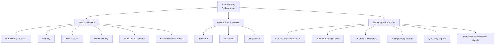
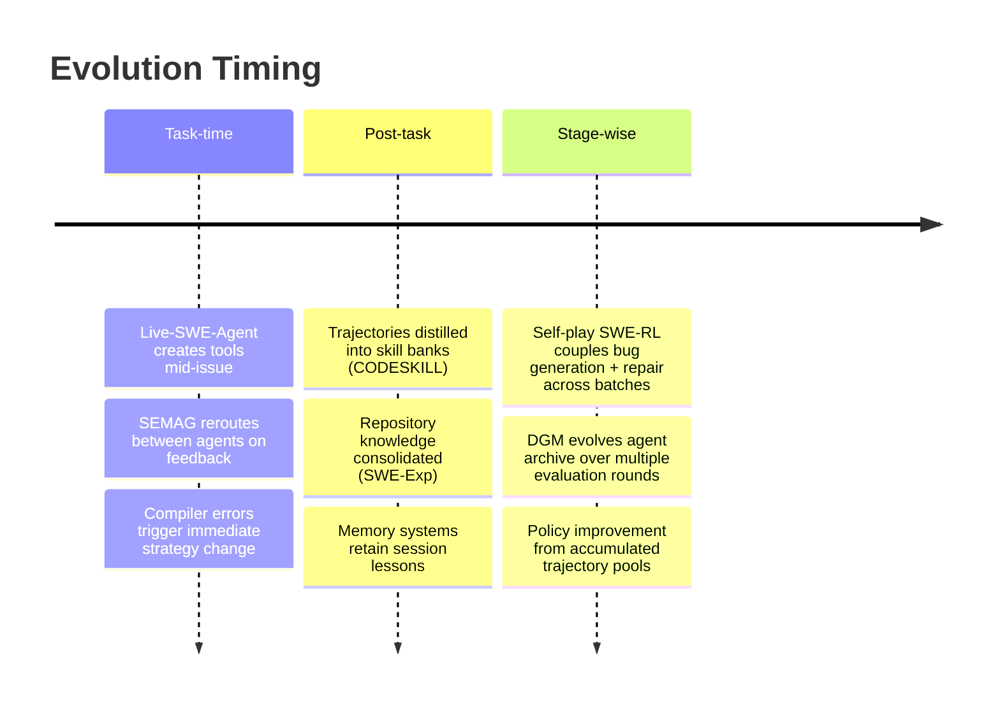
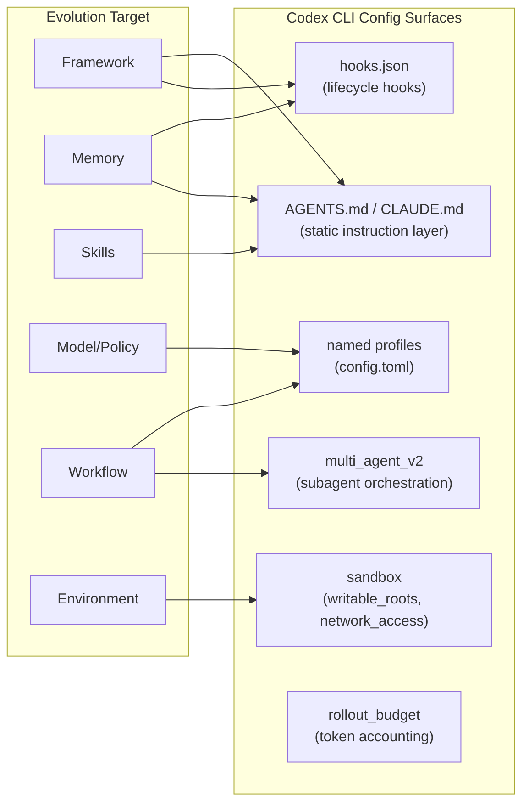

# Self-Evolving Coding Agents: Taxonomy, Signals, and What Codex CLI Can Do Today


## The Static Agent Problem

Most deployed coding agents are frozen artefacts. A session ends, the context evaporates, and the agent begins the next task with no memory of what just happened — the same patterns, the same blind spots, the same repeated mistakes. Software development, however, is an unusually feedback-rich discipline: tests pass or fail deterministically, compilers produce precise diagnostics, CI pipelines emit structured signals, and commit history encodes decades of collective intent. Every one of these signals could drive adaptation. Almost none of them do, in the average agent deployment.

Zhou, Hu, Shang & Zhang (Nanjing University of Science and Technology / Nanjing University) survey the emerging class of **self-evolving coding agents** that break this pattern.[^1] The paper, submitted to arXiv on 4 August 2026 and revised on 20 August, analyses 65 papers (73.8% published in 2026), proposes a structured taxonomy covering *what* evolves, *when*, and via *which signals*, and identifies seven open challenges. This article works through that taxonomy and maps each layer to Codex CLI's current capabilities and gaps.

## A Three-Axis Taxonomy

The paper organises self-evolving coding agents along three orthogonal axes.



### What Evolves: Six Persistent Targets

**1. Agent Framework Self-Evolution**
The agent's own scaffold — the code that wires together models, tools, prompts, and execution policy — becomes mutable. The Darwin Gödel Machine (DGM, ICLR 2026) is the headline example: it maintains a population archive of agent variants and uses SWE-bench and Polyglot as fitness functions, improving SWE-bench from 20.0% to 50.0% and Polyglot from 14.2% to 30.7%.[^2] The SICA system similarly performs self-improving scaffold rewriting; Argus and CCA retain agent state across task sequences rather than discarding it at session end.[^1]

**2. Memory Self-Evolution**
Agents accumulate software-specific experience: issue-resolution trajectories, prior localisation strategies, failed patches, test outcomes, and compiler diagnostics. SWE-Exp reuses localisation strategies from past issues to guide new ones. Libra improves repository catalogues through localisation failures, making the information surface adaptive. The key distinction from general agent memory is that repository commit history provides temporal, structured, long-running signals unavailable in text-only environments.[^1]

**3. Skill and Tool Self-Evolution**
Trajectories transform into reusable procedural capabilities. CODESKILL (arXiv:2605.25430) extracts multi-granularity skills from agent trajectories and maintains an evolving skill bank, improving average pass rate by **9.69 pp over the no-skill baseline** and **4.01 pp over the strongest memory baseline** on EnvBench, SWE-Bench Verified, and Terminal-Bench 2.[^3] Live-SWE-Agent goes further, synthesising *custom tools* — bespoke editors and code-search utilities — during issue-solving, not just before it.[^1]

**4. Model and Policy Self-Evolution**
The base model, adapter, or verifier updates through software-generated training signals. Self-play SWE-RL couples bug generation, repair, and executable verification into a closed feedback loop. Coder–verifier systems like ReVeal and CURE co-evolve patch generation and test generation, each strengthening the other's training signal.[^1]

**5. Workflow and Topology Self-Evolution**
The *structure* of the multi-agent system becomes adaptive. SEMAG coordinates planning, coding, debugging, and discussion agents but re-routes work based on task difficulty. AFlow searches workflow graphs using execution feedback, treating collaboration topology as a variable rather than a fixed configuration. AgentConductor generates task-adaptive communication DAGs, dynamically wiring agents for each new problem class.[^1]

**6. Environment and Context Self-Evolution**
The information surface itself adapts. TACO learns observation-compression rules from terminal trajectories, reducing context noise over time. SWE-Pruner develops learned skimmers that retain the code lines most relevant to explicit goals. EvoConfig revises environment-construction priorities based on prior setup failures.[^1]

### When Evolution Occurs



Task-time evolution is the most responsive but most expensive per-decision. Post-task evolution is the most practical for production deployments — the computation runs asynchronously, the session is not blocked. Stage-wise evolution requires batching infrastructure but enables the largest capability jumps (DGM's SWE-bench improvement of +30 pp required multiple archive generations).[^2]

### Six Code-Specific Evolution Signals

The survey's most useful contribution for practitioners is identifying *why* software engineering is an unusually good domain for self-evolution:[^1]

| Signal | Symbol | Source in a coding agent session |
|--------|--------|----------------------------------|
| Executable verification | **E** | Unit test exit codes, compilation success/failure |
| Software diagnostics | **D** | Compiler errors, lint warnings, runtime traces, CI output |
| Coding trajectories | **T** | Sequences of edits, tool calls, test runs |
| Repository/artifact signals | **R** | Commit history, dependency graphs, file co-evolution |
| Quality signals | **Q** | Maintainability metrics, performance, security properties |
| Human-development signals | **H** | Code review feedback, developer interaction logs |

The E and D signals are especially valuable because they are **concrete, repeatable, and machine-readable** — unlike conversational feedback, a failing test cannot be argued with or misinterpreted.

## Seven Open Challenges

The survey identifies challenges that apply directly to any team deploying a self-evolving agent on real repositories:[^1]

1. **Benchmark contamination**: Agents evolving against public benchmarks like SWE-bench risk overfitting to known issues. Internal evaluation corpora become necessary.
2. **Feedback reliability**: Incomplete test suites and ambiguous CI logs can drive adaptation in harmful directions — a patch that passes every existing test may still degrade maintainability.
3. **Reversibility**: Evolved harnesses and AGENTS.md files accumulate changes that are difficult to isolate or roll back. Which update caused the regression?
4. **System complexity**: When model, workflow, memory, and tools all evolve simultaneously, understanding which change drove an improvement becomes intractable.
5. **Cost**: Stage-wise evolution through self-play or large trajectory collection is computationally expensive. Most teams cannot afford continuous DGM-style archive evolution.
6. **Generalisation**: Skills, workflows, and compressed memories evolved on one repository or one codebase often do not transfer to new contexts.
7. **Evaluation beyond benchmarks**: Short-horizon benchmarks (SWE-bench Verified, Terminal-Bench) measure task success but not maintainability, security, or long-term code health.

## Mapping to Codex CLI

Codex CLI v0.150.x provides partial support for each evolution axis. The table below maps the six targets to specific configuration surfaces, then identifies the gaps.



### Memory Evolution — Partial Support

AGENTS.md is the static analogue of a memory system: facts you remembered to write down survive across sessions, but nothing the agent *encountered* during a session does by default.[^4] Three third-party approaches close this gap:

- **MCP memory servers** (mem0, Hindsight) hook into `UserPromptSubmit` to inject past context and into `PostToolUse` or `SessionEnd` to persist new experience.[^5]
- **PostToolUse hooks** can write structured logs to a repository-local experience file after every `apply_patch` event.
- **Session forking** (introduced in v0.148.0) enables clean-context subtasks while preserving workspace state — a post-task clean boundary before consolidation.

```toml
# config.toml — hook-based experience accumulation
[[hooks]]
event = "PostToolUse"
matcher = "apply_patch"
command = ["bash", "-c", "echo \"$(date -u +%Y-%m-%dT%H:%M:%SZ) | $CODEX_TOOL_INPUT\" >> .codex/experience.log"]
run_in_background = true
```

```bash
# AGENTS.md — prime next session with experience log
## Session Bootstrap
If `.codex/experience.log` exists, read the last 50 entries before responding to any request.
```

**Gap**: There is no append-only trace store native to Codex CLI, no BM25 query interface over past sessions, and no automatic injection of experience from prior sessions without third-party MCP tooling.

### Skill Evolution — Manual Only

Codex CLI has no native skill distillation mechanism. The practical approximation is maintaining skill sections in AGENTS.md that are manually updated after a session produces a reusable procedure:

```markdown
## Learned Skills

### Database Migration Pattern (learned 2026-08-15)
When asked to migrate a schema: (1) read existing alembic heads, (2) generate upgrade+downgrade pair,
(3) run `alembic upgrade head` in sandbox, (4) verify with `psql -c '\d tablename'`.
```

CODESKILL's RL-trained skill manager (+9.69 pp) remains out of reach without a post-training pipeline.[^3] The gap between writing a bullet in AGENTS.md and an autonomously evolving skill bank is significant.

### Workflow Evolution — Named Profiles as Static Approximation

Codex CLI's named profiles let you define different model, sandbox, and hook configurations for different task classes — the closest static approximation to adaptive workflow topology:

```toml
[profiles.debug]
model = "claude-sonnet-4-6"
model_reasoning_effort = "high"

[profiles.review]
model = "claude-haiku-4-5"

[profiles.security_audit]
model = "o4"
sandbox = { network_access = false, writable_roots = [] }
```

But profiles are static; the agent cannot *switch* profiles mid-session or generate new profiles based on task feedback. SEMAG's dynamic routing and AFlow's graph search have no equivalent in Codex CLI today.

### Framework Evolution — Hooks as Mutable Scaffold

The hooks system (PreToolUse, PostToolUse, SubagentStart, SessionEnd etc.) is the surface closest to scaffold evolution. A PostToolUse hook can rewrite parts of AGENTS.md or hooks.json based on observed outcomes, creating a basic self-modifying harness:

```json
{
  "hooks": [
    {
      "event": "PostToolUse",
      "matcher": "shell",
      "command": ["bash", ".codex/scripts/update-agents-md.sh"],
      "run_in_background": true
    }
  ]
}
```

The critical caveat: a hook that modifies hooks.json requires a session restart to take effect. Codex CLI does not hot-reload hook configuration, so true task-time framework evolution is not yet possible.

### Executable Verification Signals — Native via Sandbox

This is Codex CLI's strongest alignment with the taxonomy. The sandbox executes tests, compiles code, and returns exit codes and stdout/stderr — all of E and D signals flow naturally back to the model within a session. No configuration is required; the agent observes test failures and compiler diagnostics as first-class tool outputs.

**Gap**: these signals are ephemeral within a session. Without a hook logging them to a persistent store, nothing accumulates into an experience bank across session boundaries.

## What a Production Self-Evolving Pattern Looks Like

Assembling these partial capabilities into a coherent self-evolving Codex CLI setup requires four components:

1. **Experience accumulation**: PostToolUse hook writes structured JSONL to `.codex/experience.log` after every patch and shell command with exit code.
2. **Session bootstrap**: AGENTS.md instructs the agent to read the last N experience entries on startup.
3. **Skill crystallisation**: A weekly PostCompact hook (or manual session) reads the experience log, identifies repeated patterns, and appends them to AGENTS.md skill sections.
4. **Hook evolution**: A periodic review compares hook configurations against PostToolUse failure logs and updates hooks.json for the next session.

This is not DGM-style archive evolution — it is manual, asynchronous, and limited by what the practitioner has time to review. The framework gap between Codex CLI and a true self-evolving agent remains large.

## Evaluation Snapshot

The survey reports that 52.3% of the 65 surveyed papers evaluate on repository-level benchmarks (SWE-bench family), 18.5% on code generation tasks (HumanEval, LiveCodeBench), and 16.9% on harness/terminal interaction benchmarks (Terminal-Bench 2.0, τ-bench).[^1] The DGM's +30 pp SWE-bench improvement and CODESKILL's +9.69 pp average pass-rate gain are the two strongest quantitative results available at time of writing.[^2][^3]

Notably, the survey finds evaluation "predominantly emphasises short-term task success." Long-term robustness, cross-repository generalisation, and maintainability of evolved outputs remain almost entirely unmeasured — which means production teams adopting self-evolving patterns are flying partially blind.

## Conclusion

The self-evolving coding agent paradigm is empirically compelling and conceptually well-structured: software's executable, repeatable, structured feedback makes it a natural environment for adaptation. The taxonomy from arXiv:2608.03392 — six evolution targets, three timing patterns, six signal classes — provides a clear framework for evaluating any agent deployment against its self-improvement potential.

Codex CLI provides solid coverage of executable verification signals (E, D) through its sandbox, and reasonable partial support for memory and skill evolution through AGENTS.md and the hook system. The significant gaps are in automated skill distillation, dynamic workflow adaptation, cross-session experience accumulation without third-party tooling, and framework hot-reload. Closing those gaps — or integrating purpose-built self-evolution tooling via MCP — is where the meaningful productivity delta sits for teams running Codex at scale.

## Citations

[^1]: Zhou, H., Hu, H., Shang, Y., & Zhang, Q. (2026). *Self-Evolving Coding Agents*. arXiv:2608.03392. https://arxiv.org/abs/2608.03392

[^2]: Zhang, J., et al. (Sakana AI). (2026). *Darwin Gödel Machine: Open-Ended Evolution of Self-Improving Agents*. ICLR 2026. arXiv:2505.22954. https://arxiv.org/abs/2505.22954

[^3]: CODESKILL authors. (2026). *CODESKILL: Learning Self-Evolving Skills for Coding Agents*. arXiv:2605.25430. https://arxiv.org/abs/2605.25430

[^4]: OpenAI Codex CLI documentation — AGENTS.md specification. https://github.com/openai/codex

[^5]: Hindsight. (2026). *Adding Persistent Memory to OpenAI Codex with Hindsight*. https://hindsight.vectorize.io/blog/2026/04/08/adding-memory-to-codex-with-hindsight
