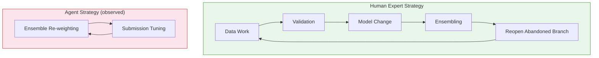

# TraceML: Why Coding Agents Collapse Into Narrow Loops in ML Development — and How to Configure Codex CLI for Strategic Versatility


AI coding agents perform impressively on isolated tasks — write a function, fix a bug, explain a class — but something structurally different happens when you hand them an open-ended machine learning development workflow. Yan et al. (Carnegie Mellon University) released TraceML this week (arXiv:2608.26086, August 26, 2026), the first large-scale empirical comparison of human and agent planning trajectories on real Kaggle ML competitions.[^1] The result is both clarifying and alarming: agents do not explore; they spiral.

## What TraceML Found

TraceML is a dataset of 4,465 human Kaggle trajectories across 134 competitions, augmented with 430 paired human trajectories and 207 agent trajectories from 7 competitions where both groups worked on identical tasks.[^1] Each code version is labelled with score, timestamp, action type, intent, edit size, and score impact — enough granularity to characterise planning style rather than just final performance.

The authors tested two representative agent scaffolds: Codex (the OpenAI coding agent) and MLEvolve (a code-mutation agent). The comparison against the human baseline is stark.

**Human experts** exhibit strategic versatility: they alternate between data work, validation, model architecture changes, and ensembling. Critically, they *return to approaches they had previously set aside* when the current direction stalls — something the authors term strategic reversion. Experts do not commit to a single axis of improvement; they treat the problem as a portfolio.

**Agents collapse into narrow loops.** Codex gravitates towards ensemble re-weighting and submission tuning. MLEvolve mutates its current model in place, making incremental local changes without ever escaping the local neighbourhood. Neither scaffold pivots at the human rate, and neither ever reopens an approach it had abandoned. The paper's language is precise: agents "neither pivot at the human rate nor reopen abandoned work."[^1]



## Why Planning Prompts Are Insufficient

The natural response to discovering a planning deficiency in an LLM is to inject a planning prompt. The TraceML study includes exactly this intervention: a structured planning prompt encouraging agents to switch strategies, consider alternatives, and revisit prior approaches.

The result is instructive. Planning prompts *partially* close the gap — agents with planning prompts exhibit marginally more diverse action sequences — but the structural difference persists. The authors conclude that the performance gap stems from "fundamental planning deficiencies rather than code generation capability alone."[^1]

This is meaningful for practitioners: you cannot AGENTS.md your way to human-level strategic versatility by writing better instructions. The deficiency is in the agent's internal planning loop, not its instruction-following. That does not mean configuration is useless — it means it has to work *architecturally* rather than instructionally.

## Mapping to Codex CLI

Codex CLI's harness primitives offer several levers that address the structural problem, even if they cannot fully solve it.

### Named Profiles for Phase Separation

The narrow-loop failure occurs because agents treat the ML task as a single homogenous activity. Humans implicitly phase their work: exploration, model building, validation, ensembling. Encoding this phasing into Codex CLI named profiles forces phase transitions at the infrastructure level rather than the instruction level.

```toml
# ~/.codex/config.toml

[profile.ml_explore]
model = "o4-mini"
model_reasoning_effort = "high"
instructions = "Exploration phase. Enumerate diverse approaches: feature engineering variants, model families, preprocessing strategies. Do NOT optimise the current model. Focus on breadth. Stop after 3 experiments per approach family."

[profile.ml_train]
model = "o4"
model_reasoning_effort = "medium"
instructions = "Training phase. Implement the single most promising approach from exploration. Write clean, parameterised training code."

[profile.ml_validate]
model = "o4-mini"
model_reasoning_effort = "low"
instructions = "Validation phase. Run cross-validation, analyse error patterns, identify ceiling and floor. Write findings to validation_log.md."

[profile.ml_ensemble]
model = "o4"
model_reasoning_effort = "high"
instructions = "Ensembling phase. Combine the top N validated approaches. Use hill-climbing over held-out validation. Do NOT modify individual models."
```

Using `codex --profile ml_explore` at the start of each work block enforces phase boundaries that the agent cannot elide. Each profile is a different contract with the model.

### Rollout Budget as a Loop Breaker

The narrowing behaviour is self-reinforcing: the agent makes a small improvement, repeats the same action, makes another small improvement, and never escapes. A rollout token budget creates a hard forcing function.

```toml
[features.rollout_budget]
enabled = true
limit_tokens = 80_000
reminder_interval_tokens = 20_000
sampling_token_weight = 1.0
prefill_token_weight = 0.1
```

When the budget fires its reminder, include an AGENTS.md instruction that treats the reminder as a mandatory pivot trigger: "Upon receiving a token budget reminder, halt the current strategy, summarise findings, and switch to the next phase profile." Budget exhaustion becomes a phase clock rather than a failure.[^2]

### Session Forking for Abandoned Hypotheses

TraceML's most underappreciated finding is the human behaviour of *returning to abandoned work*. Humans set aside a hypothesis, develop another, observe diminishing returns, then retrieve and continue the first. Agents never do this.

Codex CLI's `codex exec fork` (introduced in v0.148.0) enables exactly this pattern at the session layer.[^2] When you pivot away from a strategy, fork the session before pivoting. The fork preserves the full context of the abandoned branch. When you want to revisit, resume the fork rather than starting over from memory.

```bash
# Preserve the gradient-boosting branch before switching to neural approach
codex exec fork --name "xgb-branch-aug27"

# Continue in a fresh session with neural approach
codex --profile ml_train "Switch to PyTorch transformer baseline"

# Two days later, retrieve the abandoned branch
codex resume xgb-branch-aug27
```

### AGENTS.md Strategy Protocol

Rather than instructions that attempt to change agent reasoning (which TraceML shows is insufficient), structure AGENTS.md as a *decision protocol* that encodes the strategic switching logic externally:

```markdown
## ML Development Protocol

### Strategy Rotation Rule
After every 3 runs without ≥0.5% validation score improvement, you MUST:
1. Append a summary of the current approach to `strategy_log.md`
2. Read `strategy_log.md` and select the next untried approach family
3. Run `codex exec fork --name "strategy-$(date +%Y%m%dT%H%M)"` to preserve the current branch
4. Begin the new approach family

### Approach Families (try in order, cycle if needed)
- Feature engineering (raw features → derived features → embeddings)
- Model family change (tree → linear → neural → ensemble)
- Data-level interventions (augmentation, cleaning, resampling)
- Ensembling (voting → stacking → blending)

### Mandatory Reversion Check
Before submitting, read `strategy_log.md`. If any approach family was abandoned without full exploration, resume its fork and evaluate before final submission.
```

This externalises the strategic reversion behaviour that humans perform implicitly. The agent is not being asked to *decide* when to pivot — it is executing a protocol that mandates pivoting.

### PostToolUse Hook for Strategy Diversity Logging

A lightweight PostToolUse hook on `apply_patch` can emit a structured record of every strategy attempted, creating the index that makes mandatory reversion tractable:

```json
{
  "hooks": {
    "PostToolUse": [
      {
        "name": "strategy-logger",
        "matcher": { "tool_name": "apply_patch" },
        "command": "python3 .codex/log_strategy.py",
        "async": true
      }
    ]
  }
}
```

The `log_strategy.py` script reads the patch content, classifies the action type (feature, model, preprocessing, ensemble, tuning), and appends a JSONL record to `strategy_log.jsonl`. Over a session, this builds an auditable record of what was tried and when — the foundation for the reversion check in AGENTS.md.

## Identified Gaps in Codex CLI

TraceML's findings reveal structural limitations that harness configuration cannot fully address:

- **No loop-detection primitive.** Codex CLI has no built-in mechanism to detect that the last N iterations are semantically similar (same action type, same file path, same code region). Loop detection would require a PostToolUse hook with cross-iteration memory, which is possible but manual.
- **No strategy-diversity metric in rollout JSONL.** The rollout log records tool calls and tokens but does not emit action-type diversity statistics. You cannot currently query "what percentage of this session's patches were ensemble re-weighting?" without post-processing.
- **Session fork is manual.** The human behaviour of seamlessly returning to an abandoned approach depends on having preserved it. Codex CLI requires explicit fork invocation at the right moment. An automatic pre-pivot fork on AGENTS.md trigger would close this gap.
- **No phase-aware model auto-selection.** Named profiles solve phase separation, but the agent cannot dynamically switch profiles mid-session based on observed outcomes. Profile switching requires a new session invocation.

## What This Means for ML Practitioners

TraceML's contribution is diagnostic precision: the planning gap is not a knowledge problem or an instruction problem — it is a structural exploration-versus-exploitation problem that manifests as loop collapse. Agents optimise the metric they are currently tracking using the tools immediately in front of them. Humans carry a mental portfolio of hypotheses and manage it dynamically.

Codex CLI cannot replicate human strategic cognition, but its configuration primitives — named profiles, rollout budgets, session forks, and AGENTS.md protocols — can encode the external scaffolding that mimics strategic versatility. The combination functions as a *prosthetic planning layer*: explicit, auditable, and tunable, where the agent's internal planning loop is implicit and fixed.

The corpus, schema, and labelling pipeline for TraceML are available on Hugging Face under a CC BY 4.0 licence, making it straightforward to evaluate your own Codex CLI ML workflows against the human baseline.[^1]

## Citations

[^1]: Yan, J., Sun, W., Li, S., Li, W., & Yang, Y. (2026). *TraceML: An Empirical Analysis of Human-Agent Planning in Machine Learning Development*. arXiv:2608.26086. https://arxiv.org/abs/2608.26086

[^2]: OpenAI. (2026). *Codex CLI Releases — v0.148.0 through v0.150.1*. GitHub. https://github.com/openai/codex/releases

[^3]: Chan, J., Chowdhury, N., Jaffe, O., Aung, J., Sherburn, D., Mays, E., Starace, G., Liu, K., Maksin, L., Patwardhan, T., Weng, L., & Goel, S. (2024). *MLE-bench: Evaluating Machine Learning Agents on Machine Learning Engineering*. arXiv:2410.07095. https://arxiv.org/abs/2410.07095

[^4]: Li, S., Abdelmoniem, A. M., & Wang, S. (2026). *ProgRouter: Online Progress-Guided Orchestration for Multi-Agent LLM Workflows*. arXiv:2608.25992. https://arxiv.org/abs/2608.25992

[^5]: OpenAI. (2026). *Codex CLI Features and Configuration Reference*. OpenAI Developers. https://developers.openai.com/codex/cli/features
