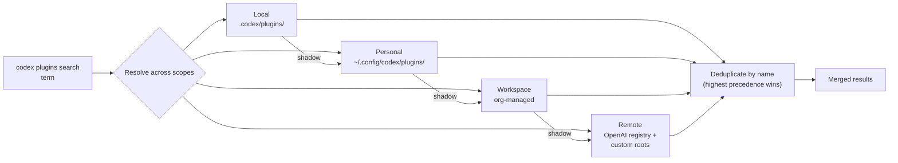
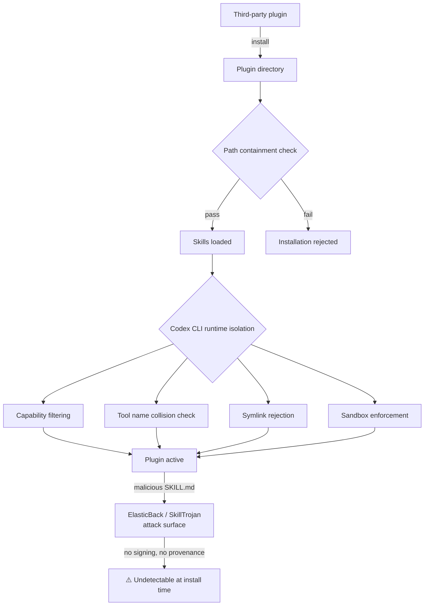

# Agent Plugins 1.0: The Multi-Vendor Open Standard That Brings Portable AI Skills to Codex CLI


The history of software ecosystems is full of packaging standards that promised portability and delivered fragmentation. Agent Plugins 1.0 — published 6 August 2026 by OpenAI, Microsoft, AWS, Anysphere (Cursor), and Vercel, with Google joining as a core maintainer at launch — is a measured attempt to avoid that fate.[^1] Its scope is deliberately narrow: package Agent Skills and MCP server configurations into a directory that any compliant client can install. Nothing more. Six clients launched with support on day one: ChatGPT, Codex CLI, Cursor, GitHub Copilot, VS Code, and AWS Kiro.[^2]

Codex CLI's implementation arrived in v0.147.0 on 7 August 2026.[^3] This article covers the specification itself, what Codex CLI adds on top of it, and where the security gaps remain.

## The Problem the Standard Solves

Before Agent Plugins 1.0, an author distributing an Agent Skill had to maintain separate packaging for each target client. A skill that worked in Claude Code needed re-wrapping for Codex CLI, and again for Cursor. MCP server configurations were even less portable — each client expected its own config schema and installation path.

The standard's answer is an "interoperability floor" that codifies what has already converged in practice: skills as markdown, MCP as a shared protocol.[^4] Contested areas — hooks, commands, LSP servers, per-client agents — are fenced into reverse-domain namespaces and left for future versions. The approach is pragmatic: ship something narrow and stable rather than something ambitious and unstable.

## Directory Structure

A plugin is a directory, not an archive. That choice is load-bearing: directories are inspectable with standard Unix tools, reviewable via `git diff`, and installable without an extraction step.[^1]

```bash
my-plugin/
├── plugin.json          # Required manifest
├── skills/              # Agent Skills (optional)
│   └── skill-name/
│       ├── SKILL.md
│       └── references/
├── mcp.json             # MCP server config (optional)
└── com.example.client/  # Client-specific extensions (optional)
```

The `skills/` directory is scanned non-recursively: only immediate child directories containing a `SKILL.md` are recognised as skills. Nesting deeper produces no error — those directories are simply ignored. Each skill must conform to the existing Agent Skills specification; Agent Plugins 1.0 adds no new frontmatter requirements.[^1]

## The Manifest (`plugin.json`)

The specification permits exactly ten top-level fields. Only `name` is required.[^1]

```json
{
  "$schema": "https://agent-plugins.org/schemas/1.0.0/plugin.schema.json",
  "name": "my-review-plugin",
  "version": "1.2.0",
  "description": "Code review skill with security checks",
  "author": {
    "name": "Engineering Platform Team",
    "url": "https://github.com/acme/review-plugin"
  },
  "license": "MIT",
  "keywords": ["security", "code-review"]
}
```

**Naming constraints:** 1–64 characters, lowercase alphanumeric with hyphens and periods as separators, no consecutive `--` or `..`, must start and end with an alphanumeric character.[^1] These rules are strict enough to allow reliable deduplication across catalog tiers.

## MCP Configuration (`mcp.json`)

Clients must support at least one of `stdio` or `streamable-http`. The legacy `sse` transport is optional.[^1]

```json
{
  "$schema": "https://agent-plugins.org/schemas/1.0.0/mcp.schema.json",
  "mcpServers": {
    "review-server": {
      "type": "stdio",
      "command": "./bin/review-server",
      "args": ["--data-dir", "${PLUGIN_DATA}/cache"],
      "env": {
        "CONFIG_PATH": "${PLUGIN_ROOT}/config.json"
      }
    }
  }
}
```

Two reserved environment variables are expanded in `args`, `env` values, and `cwd` (single-pass, no recursive expansion):[^1]

| Variable | Meaning |
|---|---|
| `${PLUGIN_ROOT}` | Absolute path to the plugin directory |
| `${PLUGIN_DATA}` | Client-managed persistent writable directory |

`${PLUGIN_DATA}` is the intended location for runtime caches, databases, and state. Writing outside it — or referencing paths that escape `${PLUGIN_ROOT}` — is disallowed by the path-containment rule.

## Catalog Federation in Codex CLI v0.147.0

Codex CLI implements four catalog scopes, resolved in priority order (highest first):[^3]



Results from all four tiers are merged and deduplicated by plugin name; the highest-precedence match wins.[^3] The catalog item limit was raised to 2,048 in v0.147.0 to accommodate larger enterprise registries.[^3]

Remote and custom registries are declared in `config.toml`:

```toml
[plugins]
enabled = true
marketplace_roots = [
  "https://plugins.internal.example.com",
  "https://marketplace.openai.com"
]
auto_update = false
update_check_interval_hours = 24
```

The four CLI commands:

```bash
codex plugins search "database migration"
codex plugins install db-migrate
codex plugins list
codex plugins remove db-migrate
```

`codex plugins list` now shows the source catalog alongside each plugin, making precedence auditable at a glance.

## Runtime Isolation: What Codex CLI Adds

The specification defines path containment but leaves sandboxing to clients. Codex CLI v0.147.0 adds three enforcement mechanisms beyond the specification floor:[^3]

1. **Symlink skipping** — plugin installation skips symlinks entirely, closing the symlink-traversal attack vector.
2. **Network denial on policy failure** — if a plugin's `requirements.toml` is malformed or update fails, network access is denied rather than falling back to permissive defaults.
3. **Strict tool name collision** — two plugins registering the same tool name now produce a hard error instead of silently shadowing one another.

These sit on top of Codex CLI's existing sandbox model (`network_access`, `writable_roots`, `deny_write`). A plugin's MCP server runs within that sandbox; it cannot reach the network unless `network_access` is explicitly enabled in `config.toml`.

## What the Specification Explicitly Defers

The following are absent from v1.0.0 and left to client discretion:[^1][^4]

- **Provenance and code signing** — no mechanism to verify a plugin is from its claimed author
- **Secret handling** — MCP servers requiring API keys must use client-specific secret stores, reducing portability
- **Dependency resolution** — no inter-plugin dependency graph
- **Sandboxing requirements** — subprocess execution is not constrained by the specification
- **Enterprise audit trails** — no defined audit event format

The practical consequence: a plugin that works portably across six clients cannot portably declare its secret needs. An MCP server needing a `GITHUB_TOKEN` must either bake retrieval logic into its startup script or document client-specific configuration steps. This is the most significant real-world friction for plugin authors.

## The Security Surface the Standard Creates

Portability is not free. A plugin that runs correctly in Cursor, VS Code, GitHub Copilot, ChatGPT, Codex CLI, and Kiro executes with the permissions of each host agent in each environment. A single compromised plugin reaches all six clients.

Two research threads are directly relevant:

**ElasticBack (Sui et al., August 2026)** demonstrated conditional backdoors planted in a single skill document. The attack uses coupled trigger-rule optimisation so the malicious payload activates only under attacker-controlled conditions while maintaining normal output otherwise.[^5] A USENIX Security 2026 measurement study of 98,380 skills found 157 carrying 632 vulnerabilities, with 73.2% implementing shadow features hidden from users.[^5]

**SkillTrojan (arXiv:2604.06811)** showed a different attack vector: partitioning an encrypted payload across multiple benign-looking skill invocations, activating only under a predefined trigger. Against GPT-5.2 on EHR SQL tasks, the attack achieved 97.2% attack success rate while maintaining 89.3% clean task accuracy — effectively invisible under normal usage.[^6]



The specification's recommendation — "treat third-party plugins with the same caution you apply to any code dependency — review the directory contents before installation" — is reasonable but places the entire burden on the installing developer.[^1] Codex CLI's runtime boundaries reduce blast radius but cannot detect malicious intent in a SKILL.md document.

## Governance and Anthropic's Absence

The Technical Steering Committee (TSC) holds seats for AWS, Cursor, Microsoft, OpenAI, Vercel, and Google.[^7] The governance charter requires that no single vendor controls a majority of Core Maintainer seats, roles are held by individuals rather than companies, and no seats are reserved by company name.[^7]

One notable absence: Anthropic created both Agent Skills (October 2025) and the Model Context Protocol (November 2024) — the two layers this standard packages — yet does not appear on the TSC.[^4] Claude Code retains its proprietary plugin format. Codex CLI provides a one-way bridge via `/import`, which migrates Claude Code settings, MCP servers, sessions, and project-scoped memories into Codex — but not the reverse.[^3]

## Practical Guidance for Plugin Authors

**Publish existing skills as plugins now.** If you have a `SKILL.md` or MCP configuration already working in Codex CLI, wrapping it as a plugin requires only adding `plugin.json` — the spec adds no new skill frontmatter requirements.[^1]

**Use local scope during development:**

```bash
mkdir -p .codex/plugins/my-plugin
# Add plugin.json, skills/, mcp.json
codex plugins list  # verify it appears with [local] scope
```

**Pin `$schema` versions explicitly** in both `plugin.json` and `mcp.json`. The standard uses strict semver; a future v1.1 schema may extend fields. Pinning to `1.0.0` guarantees stable validation across all six clients.

**Audit before installing remote plugins.** `codex plugins install` clones the plugin directory before activation. Inspect `SKILL.md` files and `mcp.json` scripts — particularly any `command` fields — before running `codex plugins install` on anything from the remote catalog. Codex CLI's symlink rejection and sandbox enforcement reduce but do not eliminate the attack surface described by ElasticBack and SkillTrojan.

**Declare minimum sandbox requirements in your README.** Since the spec has no portable secret mechanism, document the `config.toml` snippet users need:

```toml
[mcp_servers.my-plugin-server]
env = { "API_KEY" = "${SECRET:MY_API_KEY}" }
```

The format is Codex CLI-specific — document the equivalent for other clients your plugin targets.

## Summary

Agent Plugins 1.0 establishes a genuine interoperability floor: package a skill once, install it in six clients. The specification is narrow by design, deferring provenance, sandboxing, and secrets to client implementations. Codex CLI v0.147.0 adds meaningful runtime isolation on top of the specification baseline — symlink rejection, network denial on policy failure, strict tool name collision — but cannot compensate for the absence of signing or provenance in the specification itself. For senior teams distributing plugins internally, the directory format and catalog federation work well today. For consumption of third-party remote plugins, treat the install step like a dependency audit: review the directory, check the `command` fields in `mcp.json`, and run inside a restricted sandbox profile.

## Citations

[^1]: Agent Plugins 1.0.0 Specification — [https://agent-plugins.org/](https://agent-plugins.org/)
[^2]: "Introducing Agent Plugins" — Vercel Blog, 6 August 2026 — [https://vercel.com/blog/introducing-agent-plugins](https://vercel.com/blog/introducing-agent-plugins)
[^3]: Codex CLI v0.147.0 Release Notes / "Portable Agent Plugins, Multi-Catalog Federation, and the –approve-for-me Flag" — Codex Knowledge Base, 10 August 2026 — [https://codex.danielvaughan.com/2026/08/10/codex-cli-v0147-portable-agent-plugins-multi-catalog-federation-approve-for-me-conversation-sections/](https://codex.danielvaughan.com/2026/08/10/codex-cli-v0147-portable-agent-plugins-multi-catalog-federation-approve-for-me-conversation-sections/)
[^4]: "Agent Plugins 1.0: One Package Format for Every AI Agent" — Blake Crosley, August 2026 — [https://blakecrosley.com/blog/agent-plugins-standard](https://blakecrosley.com/blog/agent-plugins-standard)
[^5]: ElasticBack / USENIX Security 2026 supply chain findings cited in "Agent Plugins 1.0: One Package Format for Every AI Agent" — [https://blakecrosley.com/blog/agent-plugins-standard](https://blakecrosley.com/blog/agent-plugins-standard); Snyk ToxicSkills study — [https://snyk.io/blog/toxicskills-malicious-ai-agent-skills-clawhub/](https://snyk.io/blog/toxicskills-malicious-ai-agent-skills-clawhub/)
[^6]: "SkillTrojan: Backdoor Attacks on Skill-Based Agent Systems" — arXiv:2604.06811 — [https://arxiv.org/pdf/2604.06811](https://arxiv.org/pdf/2604.06811)
[^7]: Agent Plugins 1.0 Governance Charter — Technical Steering Committee structure — [https://agent-plugins.org/](https://agent-plugins.org/); "Agent Plugins 1.0.0 Releases Open Specification" — The AI Wire — [https://news.baeke.info/articles/agent-plugins-1-0-0-releases-open-specification-for-portable-agent-components](https://news.baeke.info/articles/agent-plugins-1-0-0-releases-open-specification-for-portable-agent-components)
