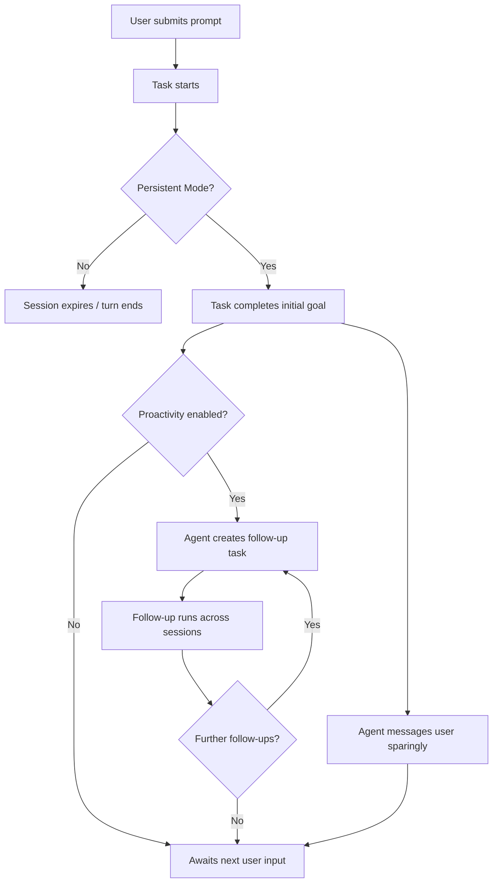
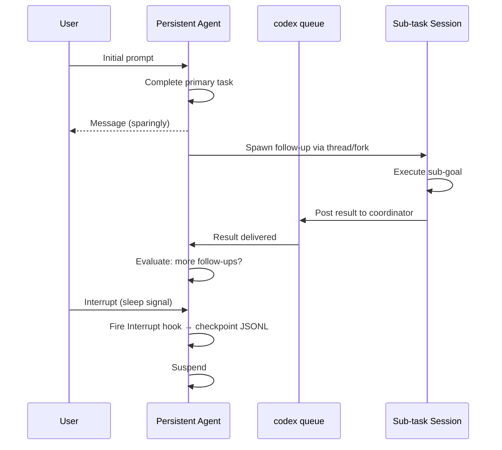

# Codex CLI's Persistent Mode: What WIRED Found in the Codebase and What It Means for Always-On Development Agents

On 27 August 2026, WIRED published a code review of OpenAI's Codex CLI repository revealing development of a feature called **Persistent Mode**.[^1] The coverage arrived as alpha builds of v0.151.0 began circulating, and it puts a name to something developers have been anticipating: an agent that keeps working until you explicitly tell it to stop, rather than expiring after the current turn or timing out mid-task.

This article unpacks what the code shows, how it connects to the primitives already shipped in v0.149.0–v0.150.x, and where the gap between today's stable CLI and an always-on development agent actually lies.

## What the Code Review Revealed

The WIRED review identified three distinct components in the Codex CLI codebase:[^1][^2]

1. **Persistent Mode toggle** — a new entry in the reasoning-effort selection menu that allows the system "to use computing power, tokens and time for longer than existing modes, which stop after minutes or hours even when a task is unfinished."[^2]
2. **Proactivity** — a related feature that instructs the agent to create follow-up tasks for itself without user prompting, continuing to work after the initial task completes.
3. **User messaging tool** — described in the code as a tool for the agent to message users without being asked, with an explicit instruction to do so "sparingly."[^1]

A spokesperson confirmed OpenAI is testing the feature but stated there are "no immediate plans to launch it."[^1]

## Safety Constraints as Documented

The code is explicit on what Persistent Mode does *not* change:[^2]

- It does **not expand what the agent is allowed to do** — sandbox permissions, `approval_policy`, and writable roots remain unchanged.
- Anything outside the user's own system **requires approval**, preserving the existing human-in-the-loop gate for external-facing actions.
- Users retain an explicit **sleep mechanism** to pause autonomous operation.

This means Persistent Mode is positioned as a scheduling and lifecycle extension, not a privilege escalation. The existing `approval_policy` settings (`suggest`, `auto-edit`, `full-auto`) continue to govern individual tool calls.[^3]

## The Infrastructure Already in Place

Persistent Mode in v0.151.0 alpha is not appearing in a vacuum — it lands on top of primitives shipped across the preceding two releases.

### codex queue and task @ mentions (v0.149.0–v0.150.0)

`codex queue` allows one session to send a message to another, identified by UUID or exact session name.[^4] Ambiguous name collisions are rejected. Combined with task `@` mentions (v0.150.0), the CLI now has the building blocks for a coordinator session to spawn workers, monitor them via `@worker-name` queries, and push instructions via `codex queue <session-id> "..."`.

A Persistent Mode agent could use exactly this pattern to delegate sub-goals across the task graph without requiring a live user connection.

### Session forking and thread continuity

`codex app-server` (which replaced `codex mcp-server` in August 2026)[^5] exposes a `thread/fork` method that creates a named branch of an existing session's conversation state. A persistent agent could checkpoint the canonical thread, fork it for each follow-up task, and preserve the root thread as a coordination point — achieving cross-session continuity without polluting the primary context window.

### The Interrupt hook boundary

v0.150.0 introduced an `Interrupt` lifecycle hook that fires when a user interrupts an active turn.[^6] In a persistent session, this becomes the de facto sleep signal: user interrupts → Interrupt hook fires → agent saves checkpoint JSONL → session suspends until `codex queue` delivers a wake instruction or the user reopens the task.

## The Gap Between Alpha Code and Today's Stable CLI

Understanding what is *not yet* in v0.150.1 (the current stable release) is as important as understanding what the alpha hints at.

| Capability | Current stable (v0.150.1) | Persistent Mode (alpha) |
|---|---|---|
| Multi-session task messaging | ✅ `codex queue` | ✅ |
| Cross-task @ mentions | ✅ v0.150.0 | ✅ |
| Agent-initiated follow-up tasks | ⚠️ Manual only | ✅ Proactivity |
| Sleep/wake lifecycle API | ❌ | ✅ |
| Agent-initiated user messaging | ❌ | ✅ (sparingly) |
| Persistent reasoning-effort tier | ❌ | ✅ |
| Token-budget management for overnight runs | ⚠️ `rollout_budget` partial | ⚠️ Reasoning-effort selector |

The critical missing piece is **autonomous task creation**: today, a follow-up task requires a human (or an explicit post-task hook script) to create it. Proactivity would move this decision entirely into the model's loop.

## What Developers Should Anticipate

### Token and cost governance will matter more

Persistent Mode introduces a session that, by design, accumulates tokens across an indefinite horizon. The reasoning-effort selector visible in the code is almost certainly a cost-control lever. Developers integrating Persistent Mode should plan for:

- Explicit `rollout_budget` caps in `config.toml` to prevent runaway spend
- Async PostToolUse hooks writing cost telemetry to a JSONL ledger before each sub-task
- Rolling compaction thresholds set more aggressively than today's defaults[^3]

### Proactivity requires a well-specified AGENTS.md

When an agent decides unilaterally what to work on next, the quality of its decisions is bounded by what it knows about the project. An AGENTS.md that clearly documents the project's goals, out-of-scope changes, and preferred task-sequencing heuristics becomes the primary constraint on proactive behaviour — effectively the Authorization Root against which self-generated tasks should be evaluated.[^7]

### The untrusted project AGENTS.md lockout is load-bearing

v0.150.0 introduced a security fix: untrusted projects no longer supply project-level `AGENTS.md` instructions.[^6] In a persistent agent that clones and then works on remote repositories, this lockout prevents a malicious repo from injecting follow-up tasks into the agent's autonomous work queue — a vector that would otherwise be particularly dangerous in a never-stop execution model.

## Competitive Context

OpenAI is not alone in this direction. Microsoft and Meta are both developing persistent, always-on agent products.[^2] The architectural difference with Codex CLI is that the implementation is layered on an open, hackable terminal primitive (session lifecycle events, hooks, `codex queue`) rather than a fully managed cloud service. That gives developers inspection and control points that fully opaque persistence products do not.

Whether that openness survives into a productised Persistent Mode remains to be seen — but the existing hook and queue infrastructure suggests OpenAI is building for composability, not lock-in.

## Summary

The WIRED code review confirms three things shipping in Codex CLI's alpha pipeline: a Persistent Mode reasoning-effort tier, a Proactivity system that generates follow-up tasks autonomously, and a tool for the agent to message users without prompting. All three land on top of the `codex queue`, task `@` mentions, and Interrupt hook infrastructure already in v0.149.0–v0.150.0. Safety constraints remain unchanged — sandbox, approval policy, and external-change gating all persist. The primary gaps are autonomous task creation and the sleep/wake lifecycle API. When Persistent Mode ships to stable, the configuration levers most worth understanding will be `rollout_budget`, compaction thresholds, and a carefully specified AGENTS.md that bounds what the proactivity system decides to work on next.

## Citations

[^1]: Maxwell Zeff, "OpenAI Tests Persistent Codex Mode That Can Keep Working Across Sessions," WIRED / CryptoBriefing, 27 August 2026. <https://cryptobriefing.com/openai-codex-persistent-ai-agent/>
[^2]: Gizmodo, "Nevertheless, OpenAI Persists With New Always-On Agent," 27 August 2026. <https://gizmodo.com/nevertheless-openai-persists-with-new-always-on-agent-2000804088>
[^3]: OpenAI Codex CLI documentation — config.toml reference. <https://codex.danielvaughan.com/2026/04/19/openai-codex-cli-official-documentation-guide/>
[^4]: OpenAI Codex CLI v0.149.0 release notes — codex queue and agents dashboard. <https://github.com/openai/codex/releases/tag/rust-v0.149.0>
[^5]: Codex Knowledge Base, "`codex mcp-server` Deprecated — `codex app-server` Migration Guide," 28 August 2026. <https://codex.danielvaughan.com/>
[^6]: OpenAI Codex CLI v0.150.0 release notes — Interrupt hooks, AGENTS.md untrusted project lockout. <https://github.com/openai/codex/releases/tag/rust-v0.150.0>
[^7]: Ground News, "OpenAI's Persistent Codex Agent: From Chatbot to Always-On Digital Colleague," 27 August 2026. <https://ground.news/article/openai-is-developing-a-persistent-ai-agent>
