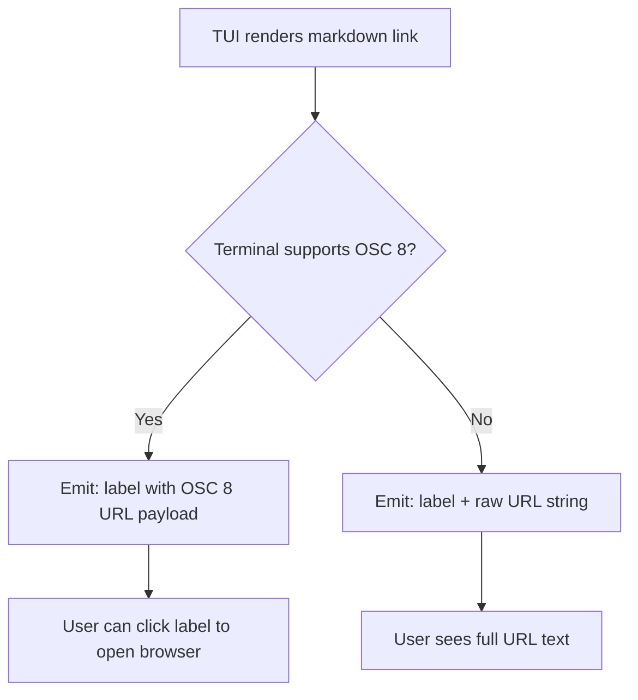

# Codex CLI v0.150.0 TUI Ergonomics: Smart Copy Picker, Session Auto-Titling, and OSC 8 Clickable Links


Codex CLI v0.150.0, released 26 August 2026, ships several headline features — Interrupt hooks and task `@` mentions among them — but three quieter additions deserve equal attention for developers who live inside the TUI all day.[^1] The `/copy` command now presents a granular picker rather than copying the entire last turn; unnamed terminal sessions receive AI-generated descriptive titles automatically; and markdown links render as OSC 8 clickable hyperlinks in terminals that support the standard. None of these changes affects the agent runtime itself, but collectively they remove friction that accumulates over long, complex sessions.

This article covers the mechanics and configuration of all three, plus the permission-mode shortcut cycling that arrived in the same release.

---

## The Problem with Wholesale Copy

Before v0.150.0, `/copy` in the Codex TUI captured the full content of the most recent assistant turn and placed it on the system clipboard. For short exchanges this is fine. For long agentic runs — where a turn might contain a multi-paragraph explanation, several fenced code blocks, and references to tool output — it is nearly useless. You got everything or you navigated away to scrape content manually.

The v0.150.0 `/copy` command opens an interactive picker that presents three discrete targets:[^1]

| Target | What is copied |
|---|---|
| **Full response** | The entire assistant turn, verbatim |
| **Code block** | A selectable list of every fenced block in the turn |
| **Blockquote** | A selectable list of every blockquote segment |

```bash
# Invoke the picker inside the TUI
/copy
```

The picker is keyboard-navigable. Arrow keys move between targets; when "Code block" or "Blockquote" is selected, a secondary list renders the available segments so you can choose the specific one you want. Pressing `Enter` copies to the clipboard and dismisses the overlay.

This is a small interaction design win with outsized practical impact. Copying a single bash snippet from a dense turn now takes three keystrokes rather than requiring a mouse selection across a rendered code block. For developers piping Codex output into scripts or documentation, the picker eliminates a constant context switch to the mouse.

### Keyboard shortcut note

The prior `Ctrl+O` hotkey that copied as markdown is preserved; `/copy` is the new canonical command for the full picker flow.[^2]

---

## Session Auto-Titling and AI-Suggested `/rename`

### The naming gap

Session management has evolved substantially since v0.146.0 introduced `--name`, thread pinning, and side conversations.[^3] The persistent gap was unnamed sessions: any session started without `codex --name my-task` received a UUID-based identifier that survived compaction but told you nothing about its contents. The agents dashboard (v0.149.0) made the problem more visible — a list of twenty UUIDs is not a meaningful task overview.[^4]

### Auto-titling in v0.150.0

Unnamed terminal tasks now receive a descriptive title automatically, generated from the first substantive exchange in the session.[^1] The title is written to the thread's metadata in the local app-server store so it persists across compaction cycles and appears in:

- The `/agents` dashboard
- The `codex resume` picker
- The thread list in the ChatGPT desktop app when sessions are synced

The auto-titling happens server-side after the first assistant turn completes. There is no user-visible delay; the title simply appears in the TUI header on the next render cycle.

### `/rename` with AI suggestion

For sessions that were already named (or whose auto-generated title you want to refine), `/rename` now pre-populates an editable field with an AI-suggested title derived from the conversation so far:[^1]

```bash
/rename
# Opens: [Refactor auth middleware for JWT RS256 validation_]
#         ↑ cursor positioned for editing
```

You can accept as-is (`Enter`), edit inline, or clear and type a fresh name. The suggestion is generated on-demand when you invoke `/rename` rather than being cached, so it reflects the full conversation at that point — useful when a session's focus has shifted since the auto-title was first set.

### Interaction with `codex resume`

The `codex resume` command resolves user-defined titles as well as auto-generated ones:

```bash
codex resume "Refactor auth"
# Fuzzy-matches against all stored session names
```

If multiple sessions match the query, the resume picker presents them in recency order with their full titles. This makes `--name` optional for most workflows; auto-titling provides a reasonable default that explicit naming can override.

---

## OSC 8 Clickable Links in the TUI

### What OSC 8 is

OSC 8 is the terminal hyperlink standard, first described by Egmont Koblinger in 2017 and now supported by the majority of modern terminal emulators.[^5] It encodes a URL in an escape sequence so that the visible text (the label) can be anything while the link target is preserved invisibly. Clicking the label in a supporting terminal opens the URL exactly as a browser anchor tag does.

Terminals with OSC 8 support include Ghostty, iTerm2 (since 3.1), kitty (since v0.19), WezTerm, Alacritty (since v0.11), Windows Terminal, and Warp.[^5]

### The rendering problem it solves

Before v0.150.0, Codex TUI rendered markdown `[label](url)` in plain text: the full URL was emitted as a visible string. In narrow terminals or when a URL appeared inside a table cell, the URL could be split across multiple rows by terminal line-wrapping — making it impossible to click or even copy reliably.

PR #24472 introduced OSC 8 support across the TUI's rich content layer:[^6]

- Assistant responses
- Proposed-plan markdown
- Status and onboarding notices

The implementation validates that the destination uses `http://` or `https://` (non-web destinations are excluded), sanitises the terminal payload, and preserves the URL target through table wrapping, streaming updates, transcript overlay rendering, and terminal resize events.

In a terminal that supports OSC 8, the result is:

```
# Before v0.150.0 (plain text):
See the OpenAI docs at https://developers.openai.com/codex/cli for the full reference.

# After v0.150.0 (OSC 8 — rendered as clickable label):
See the [OpenAI docs] for the full reference.
```

In terminals without OSC 8 support, the raw URL is retained as before — no regression for users on older or minimal terminals.

### Fallback behaviour

The detection is terminal-capability-driven, not configuration-driven. Codex reads the terminal's capability signals at startup; no `config.toml` knob is required or available to force one mode over the other.



---

## Permission Mode Shortcuts

v0.150.0 also adds the ability to bind a keyboard shortcut that cycles through permission modes, removing the need to open the settings menu to switch between `suggest`, `auto-edit`, and `full-auto`:[^1]

```toml
# ~/.codex/config.toml
[keybindings]
cycle_permission_mode = "ctrl+p"
```

Each press advances to the next mode in order: `suggest` → `auto-edit` → `full-auto` → `suggest`. The current mode is displayed in the TUI status bar, so the transition is visible without any additional confirmation step.

This is especially useful in sessions that start with exploratory prompts under `suggest` and transition to autonomous execution under `full-auto` once you have reviewed the agent's plan. The shortcut keeps you in the TUI rather than sending you to the config menu.

### Vim `.` repeat

Also shipped in v0.150.0: the Vim-mode `.` key repeats the last edit command in the input bar.[^1] The existing `cw`, `c$`, and `cc` change motions (added in v0.149.0) now compose correctly with `.` repeat, making complex prompt editing inside the TUI substantially faster for developers who live in Vim keymap mode.

---

## Operational Summary

These four additions form a coherent ergonomics layer for high-frequency Codex TUI users:

| Feature | Problem solved | Availability |
|---|---|---|
| `/copy` picker | Selective clipboard from dense turns | All platforms |
| Auto-titling + `/rename` | Unnamed session discovery | All platforms |
| OSC 8 clickable links | URL usability in narrow/table contexts | OSC 8 terminals |
| Permission mode shortcut | Mode switching without menu navigation | All platforms |

None requires AGENTS.md changes or configuration beyond the optional keybinding. Auto-titling is fully automatic. OSC 8 rendering is capability-detected. The `/copy` picker replaces a previously unconditional copy action with no behavioural regression.

### Updating

```bash
npm install -g @openai/codex@latest
codex --version  # Expect: 0.150.0 or 0.150.1
```

v0.150.1, released 27 August 2026, patches remote compaction token budgeting for sessions containing retained images and carries all the same TUI improvements.[^1]

---

## Citations

[^1]: OpenAI, "Release 0.150.0 · openai/codex," GitHub, 26 August 2026. <https://github.com/openai/codex/releases/tag/rust-v0.150.0>
[^2]: fcoury-oai, "feat(tui): Ctrl+O copy hotkey and harden copy-as-markdown behavior," GitHub Pull Request #16966, openai/codex. <https://github.com/openai/codex/pull/16966>
[^3]: OpenAI, "Codex CLI v0.146 Session Management: Named Sessions, Thread Pinning, and Side Conversations," codex.danielvaughan.com, 29 July 2026. <https://codex.danielvaughan.com/2026/07/29/codex-cli-v0146-session-management-named-sessions-thread-pinning-side-conversations-forking/>
[^4]: OpenAI, "Release 0.149.0 · openai/codex — Interactive Agents Dashboard," GitHub, 20 August 2026. <https://github.com/openai/codex/releases/tag/rust-v0.149.0>
[^5]: "OSC 8 — hyperlink," Can I use terminal?, retrieved 28 August 2026. <https://can-i-use-terminal.github.io/features/osc8.html>
[^6]: fcoury-oai, "feat(tui): add OSC 8 web links to rich content," GitHub Pull Request #24472, openai/codex. <https://github.com/openai/codex/pull/24472>
