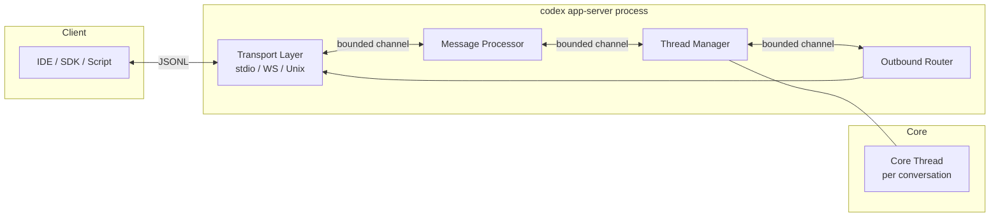
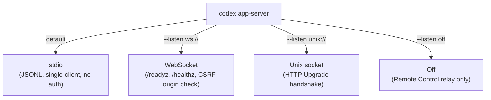
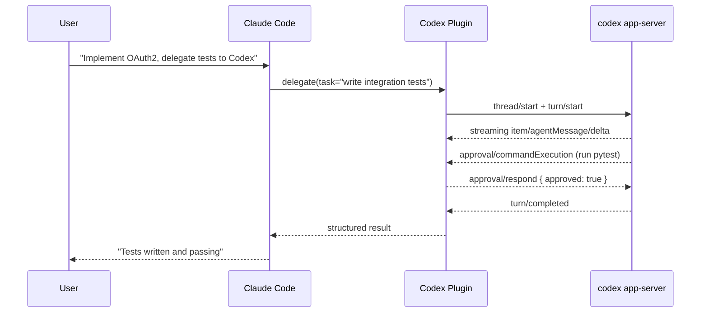

# From `codex mcp-server` to `codex app-server`: Migrating Your Integrations to Codex's Native Protocol


If you have built tooling around `codex mcp-server` — orchestration pipelines, Agents SDK wrappers, or Claude Code delegations — you need to act: as of August 2026, `codex mcp-server` is deprecated.[^1] A warning now fires to `stderr` on every invocation, and removal is coming in a future release.[^2] The replacement is `codex app-server`, a richer JSON-RPC 2.0 service that ships the same protocol the desktop app, VS Code extension, and web surface all use. This article explains the architecture, the migration path, and the practical implications.

## Why MCP Was Not Enough

OpenAI initially exposed Codex as an MCP server, but the tool-oriented MCP model could not accommodate several first-class requirements: streaming diffs from `apply_patch`, server-initiated approval requests (the agent asking *you* before running a command), durable thread persistence across restarts, and thread forking for speculative branches.[^3] MCP connects external *tools* to an agent; the app server connects *clients* to Codex's full execution engine. They solve different problems.

The old `codex mcp-server` exposed exactly two tools — `codex` (start a session) and `codex-reply` (continue one by `threadId`).[^4] That was sufficient for simple delegation but gave integrators no access to streaming events, approval workflows, filesystem operations, or turn-level controls. The app server exposes all of those.

## App Server Architecture

The app server is a long-lived Rust process that multiplexes all Codex surfaces over a single JSON-RPC 2.0 channel (wire format drops the `"jsonrpc":"2.0"` header to save bytes).[^5] Internally it runs four async tasks connected by bounded `mpsc` channels with capacity 128:



Three primitives organise every interaction:[^6]

| Primitive | Description |
|-----------|-------------|
| **Thread** | Durable conversation container; survives restarts; forkable |
| **Turn** | One exchange — user input plus all resulting agent work |
| **Item** | Atomic output: message delta, command execution, file change |

When ingress saturates the 128-message channel, the server returns JSON-RPC error `-32001` (`"Server overloaded; retry later"`). Back off with exponential jitter.

## Transport Options

The app server supports three transports with different security profiles:[^7]



```bash
# stdio (default) — child-process embedding
codex app-server --stdio

# WebSocket with capability token
codex app-server --listen ws://127.0.0.1:8000 \
  --ws-auth capability-token \
  --ws-token-file ~/.codex/ws-token

# WebSocket with JWT (enterprise shared instance)
codex app-server --listen ws://0.0.0.0:9090 \
  --ws-auth signed-bearer-token \
  --ws-shared-secret-file /run/secrets/hmac-key
```

WebSocket auth supports two schemes: a capability token (SHA-256 constant-time comparison) and a signed bearer JWT (HMAC-SHA256, 30-second clock skew tolerance).[^8] Use capability tokens for a single-developer remote setup; use JWTs when multiple users share a central instance.

## Initialisation Handshake

Every new connection must send `initialize` before any other method, then follow with an `initialized` notification.[^9] Calling other methods beforehand returns `"Not initialized"`; calling `initialize` twice returns `"Already initialized"`.

```json
// Request
{ "method": "initialize", "id": 0, "params": {
    "clientInfo": { "name": "my-tool", "version": "1.0.0" },
    "capabilities": { "experimentalApi": true }
  }
}

// Response includes server metadata
{ "id": 0, "result": {
    "userAgent": "codex/0.150.1",
    "codexHome": "/Users/daniel/.codex",
    "platformFamily": "macos"
  }
}

// Notification (no response expected)
{ "method": "initialized" }
```

## Migrating from `codex mcp-server`

### Old pattern: two-tool MCP delegation

```python
# Old — via MCP client calling codex / codex-reply tools
result = mcp_client.call_tool("codex", {
    "prompt": "Refactor auth module",
    "approval_policy": "never",
    "sandbox_mode": "workspace-write"
})
thread_id = result["threadId"]

followup = mcp_client.call_tool("codex-reply", {
    "thread_id": thread_id,
    "prompt": "Also add rate limiting"
})
```

### New pattern: `thread/start` + `turn/start`

```python
from codex_app_server import AppServerClient, AppServerConfig

config = AppServerConfig(client_name="my-tool", experimental_api=True)
with AppServerClient(config) as client:
    # Equivalent to the old "codex" tool call
    thread = client.thread_start(
        instructions="You are a coding assistant.",
        sandbox={"type": "workspaceWrite"},
    )

    # First turn — equivalent to the prompt in the old "codex" call
    turn = client.turn_start(
        thread_id=thread.thread_id,
        message="Refactor auth module"
    )

    # Continuation — equivalent to the old "codex-reply" tool call
    turn2 = client.turn_start(
        thread_id=thread.thread_id,
        message="Also add rate limiting"
    )
```

The key differences: you receive streaming `item/agentMessage/delta` notifications during each turn, and approval requests arrive as `approval/commandExecution` notifications that your client must respond to via `approval/respond`. The old MCP surface had no mechanism for either.[^10]

### Method equivalence table

| Old `codex mcp-server` | New `codex app-server` |
|------------------------|------------------------|
| `codex` tool (start) | `thread/start` + `turn/start` |
| `codex-reply` tool | `turn/start` with existing `threadId` |
| `threadId` response field | Same; persisted across restarts |
| `approval_policy: "never"` | `permissions: { autoApprove: true }` on `thread/start` |
| `sandbox_mode: "workspace-write"` | `sandbox: { type: "workspaceWrite" }` |
| No streaming | `item/agentMessage/delta` notifications |
| No approval hooks | `approval/commandExecution`, `approval/fileChange` |

## For Claude Code Users: The Codex Plugin

If you were using `codex mcp-server` specifically to call Codex from Claude Code, the replacement is the Codex plugin for Claude Code, which connects to the app server instead of the stdio MCP interface.[^11] The plugin enables bidirectional in-session communication: Claude Code can delegate a subtask to Codex and receive structured results mid-turn, rather than spinning up a separate MCP child process for each call.



## Generating Type Definitions

The app server ships a schema generation command that matches the running binary version — useful for typed SDK wrappers:[^12]

```bash
# TypeScript definitions
codex app-server generate-ts --out ./src/codex-types/

# JSON Schema (for any language)
codex app-server generate-json-schema --out ./schemas/
```

Generate these once during CI setup and commit them alongside your integration code. Version-pinning your Codex binary and regenerating on upgrade prevents silent wire-compatibility breaks.

## What Has Not Changed

- `codex mcp` (MCP *client* management — connecting Codex to external MCP servers) is unaffected and stable.[^13]
- Thread IDs created by `codex mcp-server` are compatible with `thread/resume` in the app server, so existing persisted threads can be reopened.
- `AGENTS.md` configuration, sandbox policy, and `hooks.json` behaviour are unchanged — they apply regardless of which surface starts the thread.

## Gaps and Caveats

**`experimentalApi: true` required for key methods.** `thread/fork`, `thread/queue/*`, `thread/goal/*`, and realtime methods all require clients to declare `capabilities.experimentalApi: true` during initialisation. Omitting it causes graceful rejection or field stripping, not an error — silent capability loss is the failure mode to watch for.[^14]

**WebSocket transport carries a CSRF caveat.** The `GET /healthz` endpoint returns 403 when an `Origin` header is present, by design. Browser-origin WebSocket connections from arbitrary web pages are rejected; programmatic clients sending no `Origin` header are fine.

**Backpressure is your responsibility.** Unlike MCP, which serialises requests through the client library, the app server drops requests with `-32001` under load. Build retry logic with bounded retries and jitter into any integration that issues concurrent `turn/start` calls.

## Migration Checklist

- [ ] Replace `codex mcp-server` process spawn with `codex app-server --stdio` (child) or `--listen ws://` (remote)
- [ ] Implement `initialize` / `initialized` handshake before all other calls
- [ ] Replace `codex` tool call with `thread/start` + `turn/start`
- [ ] Replace `codex-reply` tool call with `turn/start` using persisted `threadId`
- [ ] Subscribe to `item/agentMessage/delta` for streaming output
- [ ] Handle `approval/commandExecution` and `approval/fileChange` notifications
- [ ] Add `-32001` retry logic with exponential back-off
- [ ] Run `codex app-server generate-ts` and commit schemas to version control
- [ ] If using Claude Code delegation: install the Codex plugin for Claude Code

## Citations

[^1]: OpenAI Codex team, "Warn when launching the deprecated MCP server," GitHub pull request #39657, openai/codex, August 2026. <https://github.com/openai/codex/pull/39657>

[^2]: OpenAI, "Developer Commands Reference — `codex mcp-server`," ChatGPT Learn documentation, August 2026. <https://learn.chatgpt.com/docs/developer-commands?surface=cli>

[^3]: OpenAI, "The Codex App Server: A Complete Guide to the Protocol That Powers Every Surface," Codex Knowledge Base, April 2026. <https://codex.danielvaughan.com/2026/04/15/codex-app-server-complete-guide/>

[^4]: OpenAI, "MCP Server — Use Codex with the Agents SDK," ChatGPT Learn documentation (archived), August 2026. <https://learn.chatgpt.com/docs/mcp-server>

[^5]: OpenAI, "codex-rs/app-server/README.md," GitHub repository openai/codex, main branch. <https://github.com/openai/codex/blob/main/codex-rs/app-server/README.md>

[^6]: Ibid. Thread / Turn / Item primitives section.

[^7]: Ibid. Transport and authentication sections.

[^8]: Ibid. WebSocket authentication: capability token and signed bearer token.

[^9]: Ibid. Initialisation handshake and error semantics.

[^10]: OpenAI, "MCP Server — Use Codex with the Agents SDK" (see [^4]). The `codex` and `codex-reply` tools had no streaming or approval callbacks.

[^11]: OpenAI Codex team, "Claude Code Channels (MCP) now talks bidirectionally to Codex App Server in the same live session," GitHub Discussion #15374, openai/codex. <https://github.com/openai/codex/discussions/15374>

[^12]: OpenAI, "codex-rs/app-server/README.md" (see [^5]). Schema generation commands.

[^13]: OpenAI, "Developer Commands Reference" (see [^2]). `codex mcp` listed as Stable; `codex mcp-server` listed as Deprecated.

[^14]: OpenAI, "codex-rs/app-server/README.md" (see [^5]). `experimentalApi` capability flag behaviour.
