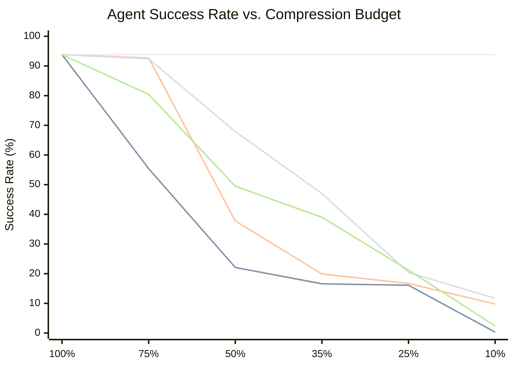
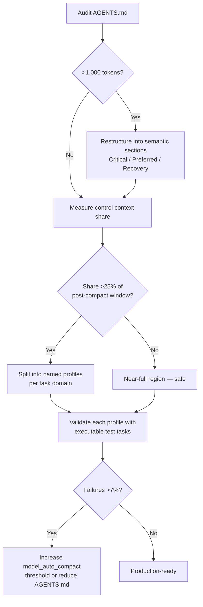

# Control Under Compression: What CompressAgent Reveals About AGENTS.md Structure and Codex CLI Compaction Reliability


Most discussions of Codex CLI compaction focus on *what* gets summarised — conversation turns, tool outputs, file reads. A new empirical study called CompressAgent (arXiv:2608.01056)[^1] examines a more dangerous compression target: the *control context* — the system instructions, tool descriptions, and policy rules that tell the agent what it is allowed to do and how to do it. When those compress badly, agents do not merely produce worse answers. They fail to call tools at all, silently drop safety policies, and generate malformed action envelopes. Understanding the reliability frontier that CompressAgent maps is essential for any Codex CLI operator who touches `model_auto_compact_token_limit` or writes AGENTS.md.

## What Is an Agent Control Context?

CompressAgent defines an **agent control context** (ACC) as "the static system-side specification presented to the model for agent p: natural-language instructions and model-visible tool-use documentation."[^1] It decomposes each ACC into six obligation types:

1. **Tool preconditions** — conditions that must hold before a tool call
2. **Argument constraints** — valid argument ranges and formats
3. **Policies** — access controls, escalation rules, refusal conditions
4. **Planning rules** — sequencing and dependency constraints between steps
5. **Output requirements** — format, completeness, and citation obligations
6. **Recovery rules** — fallback behaviour when tools fail

The executable tool schemas (JSON Schema), environment validators, and sandbox implementations are held constant during compression experiments — only the natural-language control layer is compressed. This is precisely the layer that corresponds to AGENTS.md in Codex CLI: the portion of the system context that encodes invariants, workflow rules, and tool-use policies.

## The Compression Benchmark

CompressAgent evaluates five compression strategies against nine independently constructed ACCs across three task families:

| Strategy | Mechanism |
|---|---|
| Mechanical Truncation (MT) | Tokeniser-bounded prefix; discards tail |
| LLMLingua | Perplexity-guided token removal (v0.2.2, GPT-2) |
| Generic LLM Rewriting (GLR) | Gemma-4-12b rewrites preserving tools, policies, and JSON envelope |
| Section-Based Compression (SBC) | Weighted round-robin over semantic sections; preserves source order |
| Obligation-Aware Compression (OAC) | Greedy dependency-closed obligation selection under token budget |

The three task families — tool use, policy enforcement, and protocol-grounded workflows — span calendar/email routing, PII export controls, access delegation, evidence citation, incident triage, and inventory restocking. Nine ACCs range from 1,187 to 1,890 tokens at full length. The full benchmark runs 15,525 evaluation tasks, testing three Qwen API models at temperature 0 with ten-action limits.[^1]

## The Reliability Frontier

The headline result: **compression is not merely a quality degradation problem — it is a reliability cliff problem.**



In tabular form (full-context baseline: 93.8%)[^1]:

| Budget | MT | GLR | SBC | OAC |
|---|---|---|---|---|
| 75% | 55.4% | 92.7% | 92.4% | 80.4% |
| 50% | 22.1% | 37.8% | 67.9% | 49.5% |
| 35% | 16.6% | 19.9% | 47.0% | 39.0% |
| 25% | 16.1% | 16.7% | 20.4% | 21.2% |
| 10% | 0.3% | 9.8% | 11.7% | 2.4% |

Three operational regions emerge:

**Near-full region (75% retention):** GLR and SBC hold within 1.4 percentage points of baseline, delivering meaningful token savings (19–22% input-token reduction) with negligible reliability cost.

**Transition region (35–50%):** Method choice dominates. SBC at 50% achieves 67.9% vs GLR's 37.8%. The crossing point is context-dependent — for incident-triage ACCs, OAC at 35% beats GLR by 84 percentage points; for calendar/email ACCs, the rankings invert.

**Failure region (≤25%):** All strategies collapse. "Executable protocols become fragile."[^1] No strategy sustains above 21.2% success.

### What Fails

Of 9,992 total failures across the benchmark, **79.7% were tool-execution failures** and 20.0% were output-parsing failures.[^1] Compression does not primarily manifest as reasoning errors or factual drift — it manifests as broken action envelopes: the agent attempts to call a tool with an invalid argument structure, omits a required precondition check, or emits a response that cannot be parsed as a valid tool call. At severe compression, the action-format specification itself disappears from the context.

## Why No Universal Compressor Ranking Exists

A critical finding for Codex CLI operators: "reliability also varies substantially across ACCs, making universal compressor rankings inappropriate and motivating per-context qualification."[^1]

At 35% budget, OAC beats GLR by 84 percentage points on incident-triage ACCs but *loses* by 22.7 points on access-delegation ACCs. At 25% budget, calendar/email ACCs favour GLR by 82.7 points; evidence-citation ACCs favour OAC by 52 points. There is no single best strategy. The correct approach is to qualify each ACC–strategy pairing on executable tasks representative of production behaviour.

## Mapping to Codex CLI

### AGENTS.md as the Agent Control Context

Codex CLI presents AGENTS.md to the model as part of the system-side context that persists across turns. It is not conversation history — it does not get summarised away by turn-level compaction. But it does participate in the **remote compaction** pass that fires when the full context (system + history) approaches the model window limit.[^2]

When remote compaction fires, the compaction summary model receives the entire current context — including AGENTS.md — and produces a compressed replacement. If AGENTS.md contains obligations that the compaction model does not recognise as high-priority, they may be collapsed or omitted in the summary. The v0.150.1 patch (August 27, 2026) fixed remote compaction to count retained images toward its token budget[^3] — but the underlying structural problem that CompressAgent identifies applies to any compaction that touches the control layer.

### Section Structure Is a Control-Preservation Primitive

CompressAgent's SBC strategy outperforms GLR at aggressive compression ratios specifically because it preserves **semantic section boundaries**. When the compactor selects whole sections rather than trimming prose within sections, obligation integrity survives at ratios that break prose-level rewriting.

This maps directly to AGENTS.md authoring practice. An AGENTS.md structured as:

```markdown
## Tool Preconditions
- Always read the file before patching it.
- Check branch name matches `feature/*` before pushing.

## Policies
- Never write to `config.toml` directly; use the update-config tool.
- Escalate to approval if the patch touches >10 files.

## Recovery Rules
- If apply_patch fails, run `git diff` and report the conflict before retrying.
```

…is intrinsically more compression-resistant than an equivalent AGENTS.md that mixes preconditions, policies, and recovery guidance in flowing prose. The section headers act as retention anchors. A compaction model selecting by semantic unit can drop the entire "Recovery Rules" section and preserve everything else, whereas a model trimming prose may silently elide the recovery guidance mid-paragraph.

### Hard vs Optional Obligations

OAC's weighted-obligation approach distinguishes hard obligations (must be retained) from optional ones. In CompressAgent's nine ACCs, hard obligations account for 15–25 of the 15–26 total obligations per ACC — roughly 90% are classified hard.[^1]

AGENTS.md authors can approximate this by front-loading critical obligations and using explicit ordering:

```markdown
## Critical Invariants (must survive any session summary)
1. sandbox_mode = workspace-write enforced — do not disable.
2. Never commit directly to main.
3. Every shell command must be echoed to the audit log hook.

## Preferred Practices (may be compressed in long sessions)
- Use descriptive commit messages with issue references.
- Prefer `pytest -x` for fast feedback loops.
```

Compaction models that summarise by semantic salience tend to preserve numbered lists in explicit "Critical" sections. The separation also serves a documentation function: it makes it clear to human reviewers which obligations are load-bearing.

### Named Profiles as Pre-Compressed Specialist ACCs

CompressAgent's finding that universal compressor rankings do not hold suggests a Codex CLI workflow implication: rather than maintaining one large AGENTS.md and relying on compaction to handle long sessions, consider maintaining **named profiles** with focused, domain-specific ACCs.

```toml
# ~/.config/codex/config.toml

[profiles.review]
model = "codex-mini-latest"
model_reasoning_effort = "medium"
# AGENTS.md for review tasks is smaller — only review obligations
# → lower compression pressure, higher reliability

[profiles.deep]
model = "o3"
model_reasoning_effort = "high"
# Accepts larger AGENTS.md because fewer total turns per session
```

A profile used for short, focused review tasks carries less compression pressure than a long free-form exploration session. CompressAgent's transition region (50–35%) is where the method choice matters most — and the practical way to stay in the near-full region is to reduce ACC size for the task, not to rely on compaction quality.

### model_auto_compact_token_limit Configuration

Codex CLI's `model_auto_compact_token_limit` can be lowered (but not raised) from its default, which varies by model between 180k and 244k tokens.[^2] Lowering this threshold triggers compaction earlier, giving the post-compaction context more headroom before the next compaction — but also means compaction fires more frequently.

CompressAgent's data suggests a practical guideline: if your AGENTS.md + system prompt + tool schemas consume >25% of the post-compaction context budget, you are operating in the transition region on any compaction pass that touches the control context. The budget math:

```
Post-compaction target window = model_window × (1 - compact_threshold_ratio)
Control context share = (AGENTS.md + tool schemas) / post-compaction target window
```

If the control context share exceeds ~25–35%, section-based structuring of AGENTS.md becomes load-bearing for reliability.

### The v0.150.1 Image Token Fix

The v0.150.1 patch (August 27, 2026) fixed remote compaction to count retained images toward its token budget by default, trimming older images as needed.[^3] This is directly relevant to CompressAgent's findings: before the fix, images were not counted, meaning the compaction budget calculation underestimated context size. The post-compaction context could silently exceed the effective window, forcing earlier and more aggressive recompaction of the control layer.

After the fix, the effective headroom estimate is more accurate — which means the control context share calculation above is more reliable, and compaction triggers are more predictable.

## Production Checklist

Translating CompressAgent's findings into operational Codex CLI practice:



1. **Structure AGENTS.md with semantic sections** — tool preconditions, policies, planning rules, output requirements, recovery rules. This replicates SBC's structural advantage.
2. **Front-load hard obligations** — critical invariants in a numbered list before preferred practices.
3. **Measure control context share** — calculate (AGENTS.md + active tool schemas) as a fraction of post-compaction headroom.
4. **Use named profiles for domain focus** — smaller, purpose-specific ACCs stay in the near-full reliability region.
5. **Validate with executable tasks** — run test prompts against each profile after any AGENTS.md restructure; do not rely on theoretical compression quality.
6. **Upgrade to v0.150.1** — the image token fix makes compaction trigger calculations more accurate.

## Key Takeaway

CompressAgent's empirical finding — that section structure is "a strong control-preservation primitive"[^1] — reframes AGENTS.md authoring as not merely a documentation practice but an **engineering practice with measurable reliability consequences**. At 75% context retention, a well-structured ACC and a prose-rewritten ACC perform almost identically. At 50%, the gap is 30 percentage points. At 35%, section-based structure is the difference between a 47% success rate and a 20% success rate. Codex CLI operators who run long sessions, use many MCP tools, or work with large codebases will routinely enter the transition region. The structure of AGENTS.md determines which side of that reliability cliff they land on.

## Citations

[^1]: Mansoor, I.K., Phadke, A., & Rana, P. (2026). "Control Under Compression: Reliability Frontiers for Tool-Using Agents." *arXiv:2608.01056*. [https://arxiv.org/abs/2608.01056](https://arxiv.org/abs/2608.01056)

[^2]: Codex CLI Documentation. "Context Compaction." OpenAI. [https://github.com/openai/codex](https://github.com/openai/codex)

[^3]: OpenAI. "Codex CLI v0.150.1 Release Notes." GitHub, August 27, 2026. [https://github.com/openai/codex/releases/tag/rust-v0.150.1](https://github.com/openai/codex/releases/tag/rust-v0.150.1)

[^4]: OpenAI. "Codex CLI v0.150.0 Release Notes." GitHub, August 26, 2026. [https://github.com/openai/codex/releases/tag/rust-v0.150.0](https://github.com/openai/codex/releases/tag/rust-v0.150.0)

[^5]: CompressAgent CompressAgent Benchmark Dataset. "Nine ACC Domains and Obligation Distributions." *arXiv:2608.01056*, Table 1. [https://arxiv.org/html/2608.01056](https://arxiv.org/html/2608.01056)

[^6]: Codex CLI Community. "Context Compaction in Codex CLI, Claude Code, and OpenCode." GitHub Gist, 2026. [https://gist.github.com/badlogic/cd2ef65b0697c4dbe2d13fbecb0a0a5f](https://gist.github.com/badlogic/cd2ef65b0697c4dbe2d13fbecb0a0a5f)
