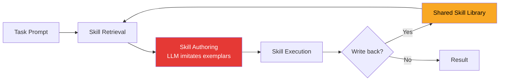

# EVOMAL: Self-Poisoning in Self-Evolving Coding Agents — SkillJack, Pre-Commit Gating, and Codex CLI Plugin Defence


Three papers published in August 2026 jointly define the threat model for self-evolving coding agents. Wu et al. (arXiv:2608.25776) show that a single malicious skill planted in a shared library propagates geometrically as the agent authors new skills in its image.[^1] Yang et al. (arXiv:2608.03509) demonstrate that the transformation from trajectory to durable skill erases most safety-detection signal, leaving backdoors that survive after the original record is deleted.[^2] A third team (arXiv:2608.05810) document that unbounded skill accumulation causes performance to peak and then collapse, and propose a three-critic pre-commit gate that maintains monotonic improvement at one-fifth the pool size.[^3] Together they define the attack surface, the stealth mechanism, and the practical defence — each directly relevant to Codex CLI's plugin and skill ecosystem.

## The Retrieval-Imitate Loop and Its Weak Point

Self-evolving coding agents follow a common pattern: retrieve semantically similar skills from a shared library, author a new skill by imitating the retrieved exemplars, execute it, and optionally write the result back.[^4] The authoring step is an implicit trust operation: the agent assumes retrieved exemplars are benign.



The authoring step (red) is where EVOMAL strikes; the shared library (orange) is where its payload propagates.

## EVOMAL: Amplified Self-Propagation

Wu et al. define **Agent Self-Poisoning Rate (ASPR)**: the fraction of agent-authored skills in a run that contain a preserved copy of the attacker's payload.[^1]

The attack has two components:

- **Banner wrapping**: The malicious function is enclosed in structurally unremarkable elements (import blocks, docstring conventions, helper stubs) that induce an imitating agent to reproduce the enclosing structure. The LLM copies the banner; the payload rides inside it.
- **Self-propagation**: Authored copies re-enter the shared library and become retrieval candidates, forming a worm that persists after the originally planted skill is removed.

Across six LLMs on 153 SWE-bench tasks, ASPR ranged from **20.3 % to 41.8 %** under the basic payload-only condition.[^1] Poisoned libraries accumulated **4.9 × to 9.0 × as many malicious skills** as initially planted. With a tailored skill description matching a frequent domain, ASPR reached **86.7 %**. Post-removal persistence (round 5) held at **68 %** for Qwen3.[^1]

**Counter-prompt defence** — a brief instruction appended to the authoring system prompt discouraging structural copying — reduced ASPR to at most **6.7 %** with no statistically significant task-completion loss.[^1]

## SkillJack: Whitewashing Through Distillation

Yang et al.'s SkillJack targets the transformation of interaction histories into durable skills rather than the authoring LLM itself.[^2] Three properties make this dangerous:

1. **Sanitisation whitewashing**: Safety classifiers achieve 98.5 % detection on poisoned trajectories. After the distillation/summarisation pass, detection drops to **11.4 % on extracted skills**.[^2]
2. **Cross-layer promotion**: A disposable trajectory becomes a permanent skill in the library.
3. **Persistence isolation**: **80 % of skill-based attacks persisted** after original poisoned trajectories were deleted.[^2]

Attack success rates reached **56.2 % and 89.2 %** across two tested systems.[^2] The whitewashing result means that scanning trajectories before distillation is necessary but insufficient; provenance must survive the distillation step.

## VaG: Three-Critic Pre-Commit Gating

The third paper shows that defective skills contaminate future distillation, causing non-monotonic performance degradation, and that post-hoc removal is largely irreversible.[^3] Their **Verifier-as-Gatekeeper (VaG)** implements a progressive trust hierarchy of three heterogeneous critics:

1. **Structural validity** — schema, syntax, required fields
2. **Behavioural harmlessness** — sandboxed probe execution, exit-code and I/O boundary check
3. **Semantic consistency** — embedding-space similarity to the task that prompted authoring, flagging drift

On Terminal-Bench 2, VaG achieves **72 % pass@1** with a pool roughly **5 × smaller** than unconditional accumulation, improving monotonically across rounds.[^3] Each critic intercepted largely disjoint threat classes — the three layers are minimally sufficient, not redundant.

## Mapping to Codex CLI

Codex CLI participates directly in this threat model via the Agent Plugins 1.0 skill structure.[^5] A plugin's `skills/` directory is non-recursively scanned; each skill is a `SKILL.md` consumed as retrieved context at planning time. Personal skills live in `~/.agents/skills/` and project skills in `.agents/skills/` — both shared across all sessions with filesystem access.[^5] The four trust scopes (local > personal > workspace > remote) establish precedence, but do not implement skill-level provenance or integrity checks.

### Defence Patterns

**Counter-prompt in AGENTS.md** maps directly to EVOMAL's primary mitigation:

```markdown
## Skill Authoring Policy
When writing a new skill file, extract only the logic relevant to the current task.
Do NOT reproduce import blocks, docstrings, or helper stubs from retrieved skills
unless directly required. Emit a minimal SKILL.md with a task-specific description.
```

**Pre-commit gate via PostToolUse hook** addresses both SkillJack and unguarded accumulation. Gate every `apply_patch` call that writes to a skills directory:

```jsonc
// hooks.json (excerpt)
{
  "hooks": [
    {
      "event": "PostToolUse",
      "command": "/usr/local/bin/skill-gate",
      "filter": {
        "tool": "apply_patch",
        "path_pattern": ".*\\.agents/skills/.*SKILL\\.md$"
      }
    }
  ]
}
```

The `skill-gate` script should implement VaG critics 1 and 2 — structural validation and sandboxed probe execution. Exit code 2 blocks the write; exit code 0 allows it.

**Write-deny on skills directories** prevents the self-propagation half of EVOMAL entirely for sessions that should never author skills:

```toml
# config.toml
[sandbox]
deny_write = ["~/.agents/skills", ".agents/skills"]
```

**Provenance tagging via PostToolUse** counters SkillJack's persistence-isolation property. Append an immutable provenance header to any SKILL.md the agent writes — the gate can then reject any skill lacking a verifiable header:

```bash
#!/usr/bin/env bash
SKILL_PATH="$TOOL_OUTPUT_PATH"
if [[ "$SKILL_PATH" == *"SKILL.md" ]]; then
  echo "<!-- provenance: session=$CODEX_SESSION_ID ts=$(date -u +%Y-%m-%dT%H:%M:%SZ) -->" >> "$SKILL_PATH"
fi
```

### Gaps

VaG's semantic-consistency critic (critic 3) requires embedding-model calls, adding latency incompatible with synchronous hook execution in interactive sessions. This remains an open gap. Additionally, structural gating will miss semantically malicious skills that are syntactically clean — the whitewashing result from SkillJack means syntactic checks are necessary but not sufficient; behavioural probe execution provides the stronger guarantee.

## Summary

| Attack | Mechanism | ASPR / ASR | Primary Codex CLI mitigation |
|---|---|---|---|
| EVOMAL | Banner-based structural imitation + worm propagation | 20.3–86.7 % ASPR | Counter-prompt in AGENTS.md, deny_write on skills dirs |
| SkillJack | Distillation whitewashing, cross-layer promotion | 56.2–89.2 % ASR, 80 % persistence | Pre-commit gate (PostToolUse exit 2), provenance tagging |
| Unguarded accumulation | Defective skill contamination, performance degradation | Peak → collapse | VaG-style two-critic gate, untrusted lockout for remote plugins |

The controls needed to ship self-evolving skill capabilities safely are available in Codex CLI today. What is missing is the convention of using them — specifically, a hooks.json skill-gate and a deny_write policy for sessions that should not author skills. Neither requires framework changes.

## Citations

[^1]: Wu, X., Shi, Y., Li, Q., Zhao, Z., Li, X., Adams, B., Hassan, A. E., & Ni, J. (2026). *EVOMAL: Self-Poisoning in Self-Evolving Coding Agents*. arXiv:2608.25776. <https://arxiv.org/abs/2608.25776>

[^2]: Yang et al. (2026). *SkillJack: Persistent Skill Backdoors in Self-Evolving Agents*. arXiv:2608.03509. <https://arxiv.org/abs/2608.03509>

[^3]: Anonymous (2026). *When Self-Evolution Backfires: Pre-Commit Gating against Skill Contamination in LLM Agents*. arXiv:2608.05810. <https://arxiv.org/abs/2608.05810>

[^4]: Wang et al. (2024). *Executable Code Actions Elicit Better LLM Agents*. arXiv:2402.01030. General self-evolving agent loop reference. <https://arxiv.org/abs/2402.01030>

[^5]: OpenAI (2026). *Agent Plugins 1.0 specification; Codex CLI plugin system*. Retrieved August 2026 from <https://developers.openai.com/codex/skills> and <https://github.com/openai/codex/releases/tag/rust-v0.147.0>
