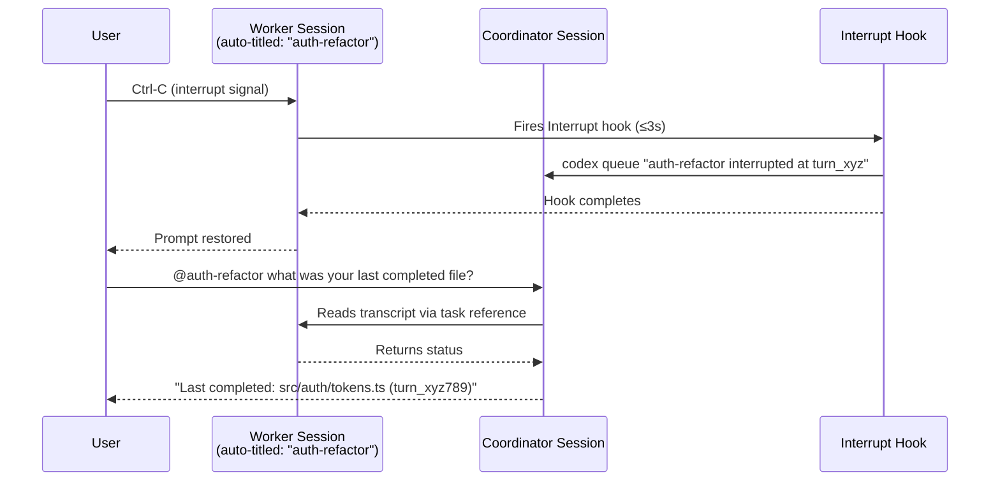
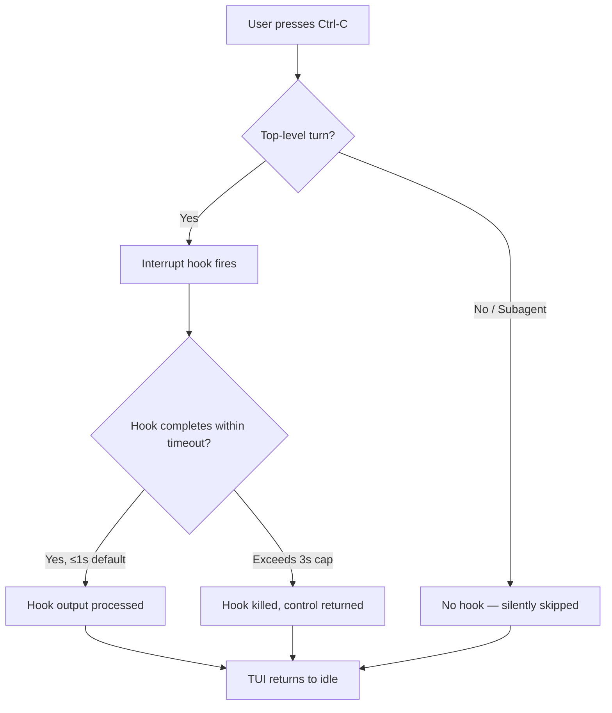

# Interrupt Hooks and Task @ Mentions in Codex CLI v0.150.0: Reactive Orchestration at the Turn Boundary


Codex CLI v0.150.0, released on 26 August 2026, ships two features that together close a significant gap in agent lifecycle control: the `Interrupt` hook event, which fires the instant a user interrupts a running top-level turn, and task `@` mentions, which let the TUI input bar address and coordinate with other live agent sessions.[^1] Neither feature is large on its own, but in combination they give you a reactive wiring layer between parallel agents that was previously impossible without bespoke MCP tooling or external scripting.

This article covers the technical mechanics of both, the configuration patterns they enable, and the constraints you need to understand before deploying them in production workflows.

---

## What Changed in v0.150.0

The v0.150.0 release is primarily a UX and lifecycle-management milestone.[^1] Alongside `Interrupt` hooks and task mentions, it also auto-titles unnamed terminal tasks, adds a `/copy` picker for selective response copying, renders Markdown links as clickable labels in capable terminals, and — importantly for security — locks out project-level `AGENTS.md` instructions for untrusted projects.[^1]

The interrupt and mention features deserve detailed treatment because they modify the fundamental execution model, not just the surface.

---

## The Interrupt Hook Event

### Context and Position

Before v0.150.0, the Codex CLI hook system exposed eleven lifecycle events: `SessionStart`, `SessionEnd`, `PreToolUse`, `PostToolUse`, `PermissionRequest`, `UserPromptSubmit`, `SubagentStart`, `SubagentStop`, `Stop`, `PreCompact`, and `PostCompact`.[^2] The `Interrupt` event is the twelfth entry in `HOOK_EVENT_NAMES`.[^3]

The existing hook vocabulary covered the tool boundary (Pre/PostToolUse), the turn boundary (UserPromptSubmit, Stop), session lifecycle (SessionStart/End), and agent spawning (SubagentStart/Stop). What it lacked was a hook for the *user-initiated cancellation path* — the moment a developer presses `Ctrl-C` or issues an interrupt signal to stop a turn mid-flight.

### How the Interrupt Event Fires

When a user interrupts an active top-level turn, the runtime:

1. Signals the turn to stop
2. Runs any registered `Interrupt` hooks synchronously before yielding control back to the prompt
3. Returns the TUI to the idle state

The hooks execute in the same process context as the interrupted turn, with access to the session state at the point of interruption.

**Critically: `Interrupt` hooks never fire for subagents.**[^3] If a top-level turn spawns a `multi_agent_v2` subagent tree and *that* subagent is interrupted, no `Interrupt` hook runs. The restriction is intentional — subagent interruption is an internal scheduler event, not a user-facing one.

### Timeout Constraints

The `Interrupt` hook has a default timeout of **1 second** and a hard cap of **3 seconds**.[^3] This is dramatically tighter than the 600-second default for most other hook types, and tighter even than `SessionEnd` (also 3 seconds maximum).

The reasoning is UX: the developer pressed Ctrl-C because they want the agent to *stop*. An interrupt hook that hangs for ten seconds would be worse than no hook at all. Design your interrupt handlers accordingly — anything that involves network I/O, disk writes to slow filesystems, or subprocess spawning with unbounded runtime will be silently killed.

### Configuration

Interrupt hooks follow the same `hooks.json` schema as other events:[^2]

```json
{
  "hooks": {
    "Interrupt": [
      {
        "matcher": "",
        "hooks": [
          {
            "type": "command",
            "command": "/usr/local/bin/codex-interrupt-handler.sh",
            "timeout": 2,
            "statusMessage": "Saving checkpoint…"
          }
        ]
      }
    ]
  }
}
```

The `matcher` field accepts a regex matched against the session's active tool name (or empty string to match unconditionally). For interrupt hooks, which run outside a tool context, use `""` or omit `matcher` entirely.

The full context payload delivered to the handler via `stdin` includes:[^2]

```json
{
  "session_id": "sess_abc123",
  "transcript_path": "/home/user/.codex/sessions/sess_abc123.jsonl",
  "cwd": "/home/user/myproject",
  "hook_event_name": "Interrupt",
  "model": "gpt-5.6-sol",
  "turn_id": "turn_xyz789",
  "permission_mode": "ask"
}
```

Note that `turn_id` is populated because `Interrupt` is turn-scoped — the interrupted turn's ID is available, which lets you correlate the interrupt with prior `PreToolUse`/`PostToolUse` events in the rollout JSONL.

### Trust Review

Non-managed interrupt hooks require the same hash-based trust review as all other hooks.[^2] When you add or modify an `Interrupt` entry in `hooks.json`, Codex marks it untrusted and skips it until you approve it via `/hooks`. This applies even to interrupt handlers — a malicious project that injects an interrupt hook could attempt to run arbitrary code the moment you cancel a task.

---

## Practical Patterns for Interrupt Hooks

### 1. Checkpoint Save

The most common use case: persist a state snapshot before the session loses its turn context.

```bash
#!/usr/bin/env bash
# codex-interrupt-checkpoint.sh
# Must complete in < 3 seconds

SESSION_ID=$(jq -r '.session_id' -)
CWD=$(jq -r '.cwd' -)
TURN_ID=$(jq -r '.turn_id' -)
TS=$(date -u +%Y%m%dT%H%M%SZ)

# Write a minimal checkpoint — only in-memory structures, no slow I/O
echo "{\"session\":\"$SESSION_ID\",\"turn\":\"$TURN_ID\",\"cwd\":\"$CWD\",\"ts\":\"$TS\"}" \
  >> "$HOME/.codex/checkpoints/interrupt.jsonl"
```

Keep it to a JSONL append — no git commits, no network calls. The 3-second cap is absolute.

### 2. Notify a Sibling Session via `codex queue`

Combined with the `codex queue` command introduced in v0.149.0,[^4] you can have an interrupted agent notify a coordinator session:

```bash
#!/usr/bin/env bash
# interrupt-notify.sh
SESSION_ID=$(jq -r '.session_id' -)
TURN_ID=$(jq -r '.turn_id' -)

# Send a queued message to the coordinator session (non-blocking, background)
# Must not block — fire-and-forget only
codex queue --session "coordinator" \
  "Worker $SESSION_ID was interrupted at turn $TURN_ID — check for partial work" &
```

The `&` background execution is essential here. `codex queue` itself may take tens of milliseconds to establish a connection; running it synchronously risks hitting the timeout cap.

### 3. Audit Logging

Regulatory and compliance workflows often need a record of every interruption with the reason (implicit: user-initiated) and the session state:

```python
#!/usr/bin/env python3
import json, sys, datetime, pathlib

ctx = json.load(sys.stdin)
log_path = pathlib.Path.home() / ".codex" / "audit" / "interrupts.jsonl"
log_path.parent.mkdir(parents=True, exist_ok=True)

entry = {
    "event": "interrupt",
    "ts": datetime.datetime.utcnow().isoformat() + "Z",
    **ctx
}
with log_path.open("a") as f:
    f.write(json.dumps(entry) + "\n")
```

---

## Task @ Mentions: The Other Half

### What @ Mentions Add

Alongside interrupt hooks, v0.150.0 makes tasks *addressable* from the TUI input bar.[^1] You can type `@task-name` in any terminal session to reference another running Codex task, and instruct the agent to interact with it:

> `@api-refactor — what's your current status and how many files have you changed so far?`

The agent can then:
- **Read** the referenced task's transcript or status
- **Create** a new task on your behalf
- **Message** the referenced task via the queue mechanism

This is a higher-level abstraction over `codex queue` — rather than scripting the queue manually, you express the cross-task intent in natural language and let the agent handle the mechanics.

### Automatic Task Titles

A companion feature makes @ mentions usable at scale: unnamed terminal tasks now receive AI-generated descriptive titles automatically.[^1] Without this, you would need to manually `/rename` every session before @ mentions become legible. With auto-titling, a session that starts with "refactor the auth module to use JWTs" will be titled something like `auth-jwt-refactor` — addressable immediately.

The `/rename` command now also suggests an editable title based on conversation content, reducing the friction of the naming step when you want something specific.

---

## Combining Interrupt + Queue + @ Mentions

The three features compose into a reactive orchestration pattern:



The coordinator does not need to poll — the interrupt hook *pushes* the event. The user can then query the coordinator for state without re-opening the worker session.

---

## The Untrusted Project AGENTS.md Fix

v0.150.0 also tightens a significant security boundary: untrusted projects no longer receive project-level `AGENTS.md` instructions, and the managed deny-read rules persist through permission changes.[^1]

Before this fix, a malicious repository could include an `AGENTS.md` that injected instructions into the agent's context even when the project was not yet trusted. Combined with interrupt hooks (which a malicious project could also attempt to inject), this was a potential vector for instruction poisoning on clone. Both are now gated behind the trust boundary.

For teams using Codex in CI or automated review pipelines, this means you should explicitly trust projects via the CLI before running them, rather than relying on implicit AGENTS.md loading.

---

## Constraint Summary



Key constraints at a glance:

| Constraint | Value |
|---|---|
| Default timeout | 1 second |
| Hard cap | 3 seconds |
| Fires for subagents? | Never |
| Fires for top-level turns? | Always, if registered |
| Hook types supported | `command`, MCP handler |
| Trust required? | Yes, hash-based review |
| Matcher context | No active tool — use `""` |

---

## What's Still Missing

The interrupt hook gives you a *signal* that the user cancelled, but it does not give you:

- **The reason for the interrupt.** There is no field distinguishing Ctrl-C, `SIGTERM`, a timeout expiry, or an API connection drop. All produce the same `Interrupt` event. ⚠️
- **Partial tool output.** If a tool was mid-execution when the interrupt fired, the hook receives the turn context but not the in-flight tool result. You cannot distinguish "interrupted before any tool ran" from "interrupted mid-apply_patch". ⚠️
- **Subagent interrupt hooks.** Teams running large `multi_agent_v2` trees have no hook to react when inner agents are cancelled. The restriction exists to prevent handler fan-out, but it leaves a monitoring gap.
- **Structured task addressing.** @ mentions are resolved by the agent model — they are natural language references, not typed identifiers. There is no guarantee that `@auth-refactor` resolves to exactly one session if two sessions have similar auto-generated titles.

---

## Citations

[^1]: OpenAI. "Release 0.150.0 · openai/codex." GitHub, 26 August 2026. <https://github.com/openai/codex/releases/tag/rust-v0.150.0>

[^2]: OpenAI. "Hooks." Codex Developer Documentation (learn.chatgpt.com), 2026. <https://learn.chatgpt.com/docs/hooks>

[^3]: "Codex CLI Changelog — August 2026." releases.sh, 2026. <https://releases.sh/openai/codex>

[^4]: OpenAI. "Release 0.149.0 · openai/codex." GitHub, 20 August 2026. <https://github.com/openai/codex/releases/tag/rust-v0.149.0>

[^5]: "Codex Updates by OpenAI — August 2026." Releasebot.io, 2026. <https://releasebot.io/updates/openai/codex>

[^6]: "codex queue and Inter-Session Messaging: What v0.149.0's New Primitive Means for Orchestration and Automation." Codex Knowledge Base, 21 August 2026. <https://codex.danielvaughan.com/2026/08/21/codex-queue-inter-session-messaging-codex-cli-v0149-orchestration-automation-agent-to-agent/>
