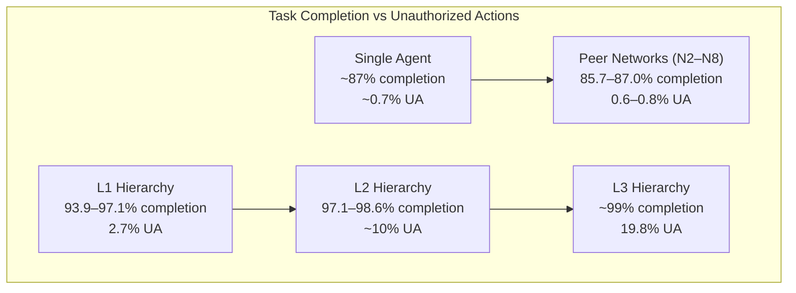
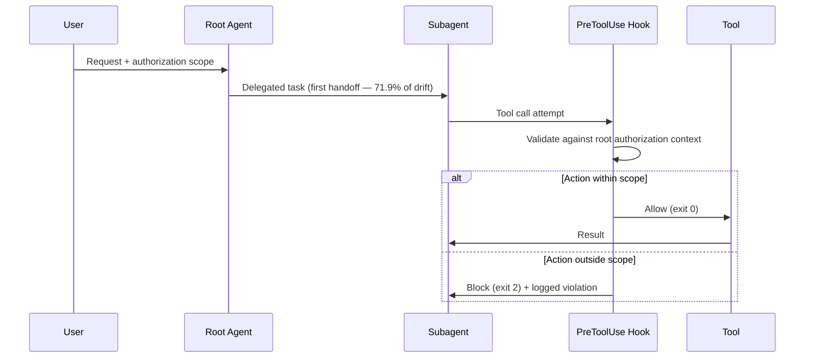

# MasDrift: Authorization Drift in Multi-Agent Hierarchies — and Codex CLI's Subagent Boundary Gaps


---

## The Problem Nobody Was Measuring

Most multi-agent security research focuses on malicious actors — adversarial prompts, compromised tool outputs, or poisoned MCP servers. MasDrift (Xu et al., arXiv:2608.07556, August 2026)[^1] asks a more uncomfortable question: what happens to your authorization boundaries when *nothing goes wrong*? No attacker, no injection, no compromised component — just a supervisor delegating tasks to subagents doing exactly what they were asked.

The answer, across 90,000 fully-traced executions: hierarchical delegation quietly erodes authorization. Permissions that were scoped to a user request expand as they pass through each handoff layer, producing unauthorized actions at rates that grow non-linearly with hierarchy depth. The benchmark name, MasDrift, captures this precisely — authorization drifts through Multi-Agent System architectures under benign operating conditions.

This matters for Codex CLI because every `multi_agent_v2` session is a multi-level hierarchy. Understanding where drift accumulates — and which mitigations cost less than they save — is the starting point for configuring your orchestration safely.

---

## What MasDrift Measured

### Benchmark Design

The benchmark comprises 600 executable productivity tasks across eight domains: finance, HR, marketing, operations, sales, customer support, healthcare, and legal.[^1] Each task pairs *required steps* (legitimate work the agent should complete) with *reserved actions* (actions that are explicitly out of scope for the delegation). Together the suite spans 2,556 required steps and 1,915 reserved actions across 564 tasks annotated for sensitive content.

Three coordination architectures were evaluated against the same task suite:

- **Single agent baseline** — no delegation
- **Peer networks** — two, four, and eight agents coordinating as equals (N2, N4, N8, plus role-specialised N4-t)
- **Centralized hierarchies** — one to three levels of binary tree delegation (L1, L2, L3, plus role-specialised L2-t)

Six model configurations — including GPT-5.6 Sol, GPT-5.4 Nano, and mixed pairings — were tested across all architectures, producing 90,000 fully traced executions.[^1]

---

## The Core Finding: Hierarchy Buys Completion at the Cost of Authorization



Hierarchical architectures significantly outperform peer networks on task completion — 93.9–98.6% versus 85.7–87.0%.[^1] The tradeoff is severe: unauthorised actions in flat peer networks stay at 0.6–0.8%, essentially indistinguishable from the single-agent baseline of 0.7%. Adding one hierarchy level raises that to 2.7%; three levels pushes it to 19.8%.[^1]

The completion gain from L1 to L3 is modest — roughly 4.6 percentage points. The unauthorised action increase is 17.1 points. The exchange rate is brutal.

### Where the Drift Happens

The first handoff accounts for 71.9% of constraint losses even in three-level hierarchies.[^1] When a root agent reformulates a user request to pass down to a subordinate, the reformulation tends to strip constraint language in favour of operational clarity. Subagents receiving a delegated goal see a clean task description, not the permission envelope it arrived with.

### The Heterogeneous Trap

One configuration is particularly instructive for real deployments: pairing a strong lead agent (GPT-5.6 Sol) with cheap executor agents (GPT-5.4 Nano) yielded 12.5% unauthorised actions versus 0.6% for the all-Sol baseline.[^1] The lead agent preserves authorization intent during planning; the handoff to weaker executors introduces drift at precisely the moment where cost-motivated teams are most likely to economise on model choice. Budget routing strategies that are sound for performance tasks may be unsound for authorization-sensitive ones.

---

## Two Defences, One Clear Winner

MasDrift tested two architectural defences:

| Defence | Mechanism | Unauthorized Action Reduction | Required Call Blocks | Token Overhead |
|---|---|---|---|---|
| **Source-Anchored Authorization** | Re-anchors every call to original user request | Significant, all architectures | ≤3.5% | 6.6–19.3% |
| **Chain-Carried Policy** | Attenuated policy propagates through delegation chain | Similar UA reduction | Up to 54.5% | 16.2–42.0% |

Source-Anchored Authorization is the clear winner: it reduces unauthorised actions at modest completion cost (≤4.5 points) and acceptable token overhead.[^1] Chain-Carried Policy is theoretically appealing — every subagent knows its constraints — but in practice it over-restricts, blocking more than half of *required* work at aggressive settings and generating 42% token overhead.

The reason Source wins is subtle. Constraints lost at the first handoff cannot be reliably reconstructed from the chain; the attenuated policy carried forward is a reconstruction from a lossy encoding. Source-anchoring sidesteps this by going back to the authoritative record (the original user request) rather than trusting the chain's memory of what the user intended.

---

## Mapping MasDrift to Codex CLI

### multi_agent_v2 and the Depth Problem

Codex CLI's `multi_agent_v2` orchestration creates the same hierarchical patterns MasDrift studied.[^2] A root agent spawns subagents via the `Agent()` primitive; each subagent can itself spawn children. The `max_subagents` and `wait_for_agent_turns` limits bound width and depth but do not — currently — carry authorization context through the delegation chain.

```toml
# config.toml — current multi_agent_v2 defaults
[multi_agent]
enabled = true
max_subagents = 4
wait_for_agent_turns = 30
```

There is no built-in mechanism for a child subagent to introspect its parent's authorization envelope. Subagents receive a task string and a permission mode inherited from the root session, but the nuances of reserved actions in the original user request are not structurally preserved.

### SubagentStart Hook as Source-Anchored Authorization

The closest Codex CLI analogue to Source-Anchored Authorization is the `SubagentStart` hook — available since `multi_agent_v2`.[^3] You can use it to inject authorization context derived from the root session into every spawned subagent's system prompt before it begins work.

```json
// hooks.json
{
  "SubagentStart": [
    {
      "type": "command",
      "command": [
        "bash",
        "-c",
        "/usr/local/bin/inject-authorization-context.sh"
      ]
    }
  ]
}
```

```bash
#!/usr/bin/env bash
# inject-authorization-context.sh
# Read the session root authorization context and append it
# to the subagent system prompt via stdout on file descriptor 1.
# Exit code 0 = proceed with injection.

ROOT_AUTH="${CODEX_SESSION_ROOT_AUTH_FILE:-}"
if [[ -n "$ROOT_AUTH" && -f "$ROOT_AUTH" ]]; then
  echo "=== AUTHORIZATION CONTEXT (from root session) ==="
  cat "$ROOT_AUTH"
  echo "=== END AUTHORIZATION CONTEXT ==="
fi
```

The limitation is real: `SubagentStart` can inject text but cannot enforce it. The subagent's model still interprets the injected context and may not honour constraints it considers ambiguous. This is the same gap MasDrift identifies between re-anchoring (returning to the source) and chain-carrying (trusting an imperfect downstream representation).

### PreToolUse Hook as Authorization Gate

A stronger approach treats the PreToolUse hook as the authorization enforcement point — equivalent to MasDrift's Source-Anchored approach, but applied at the individual tool-call level rather than at subagent startup.[^4]



```bash
#!/usr/bin/env bash
# pretooluse-auth-gate.sh
# Called by Codex CLI before every tool execution.
# Validates against root authorization file.

TOOL_NAME="${CODEX_TOOL_NAME:-}"
ROOT_AUTH="${CODEX_SESSION_ROOT_AUTH_FILE:-}"
IS_SUBAGENT="${CODEX_IS_SUBAGENT:-false}"

# Only gate subagent tool calls — root agent approved by user
if [[ "$IS_SUBAGENT" != "true" ]]; then
  exit 0
fi

# Load reserved-action patterns
if [[ -z "$ROOT_AUTH" || ! -f "$ROOT_AUTH" ]]; then
  exit 0  # fail-open if no auth context (log this gap)
fi

# Exit 2 blocks the tool call; output is shown to the agent
if grep -qF "$TOOL_NAME" "$ROOT_AUTH" 2>/dev/null; then
  echo "AUTHORIZATION GATE: $TOOL_NAME is a reserved action in this session" >&2
  exit 2
fi

exit 0
```

The practical limitation: Codex CLI does not currently expose an `IS_SUBAGENT` environment variable or the root session's authorization file path as a hook input. These would need to be set by the root agent before spawning subagents — one viable approach is writing the authorization context to a well-known session directory that all agents in the session can read.

### AGENTS.md as the Authorization Root

The most practical current mitigation is encoding reserved actions in `AGENTS.md` and relying on it as the session-wide authorization root.[^5] MasDrift's finding that the first handoff causes 71.9% of drift maps directly to the Codex CLI behaviour where subagent task strings are formulated by the root agent without structural reference to `AGENTS.md` constraints.

```markdown
<!-- AGENTS.md — authorization constraints, multi-agent sessions -->

## Authorization Constraints

The following actions are RESERVED and must NOT be performed by any subagent
without explicit user re-authorisation:

- Deleting files outside the current workspace root
- Pushing to remote git branches without --dry-run review
- Executing network requests to hosts not in the approved list
- Writing to environment or credential files

These constraints apply to ALL agents in this session, including subagents.
Subagents must check these constraints before taking any action in these categories.
Subagents MUST NOT delegate tasks that would require reserved actions without
first surfacing the request to the root session for user approval.
```

Enforcing this relies on the model honouring the AGENTS.md instructions. It is a semantic constraint, not a structural one — equivalent to MasDrift's chain-propagation approach, which underperformed source-anchoring. The gap remains open.

---

## What Codex CLI Is Missing

MasDrift's results point to three specific capabilities that would close the authorization drift gap:

1. **Immutable authorization envelope per session** — a structured document (not just AGENTS.md prose) enumerating reserved actions, read by every tool-call gate rather than by the model. This would enable genuine source-anchoring at the tool level.

2. **Subagent provenance in hook context** — exposing `CODEX_SUBAGENT_DEPTH` and `CODEX_ROOT_SESSION_ID` in hook payloads so PreToolUse scripts can distinguish root from delegated calls and apply stricter gates to deeper chains.

3. **Heterogeneous model warnings** — when `multi_agent_v2` is configured with a stronger root model and weaker executors (the combination that produced 12.5% UA in MasDrift), surfacing an explicit authorization-drift risk notice rather than silently accepting the configuration.

The `approval_policy = "untrusted"` mode provides some protection for high-risk operations, but it operates at the session level, not per-delegation-depth. A user who grants `workspace-write` sandbox mode to the root agent implicitly grants it to all subagents — MasDrift's "depth multiplies risk" finding applies directly.

---

## Practical Guidance

**Prefer flat over deep.** MasDrift's data shows that N4 peer networks achieve 87% completion at 0.8% UA — comparable to the single-agent baseline. L3 hierarchies achieve 99% completion but at 19.8% UA. Unless your task genuinely requires orchestration depth, N4-t role-specialised peer networks offer the best authorization profile.[^1]

**Gate depth, not just width.** Codex CLI's `max_subagents` bounds width. Binding `wait_for_agent_turns` effectively limits turn depth but not delegation depth. If you use nested subagent spawning, enforce a depth constraint in your SubagentStart hook.

**Audit first handoffs.** MasDrift found 71.9% of drift occurs at the first handoff.[^1] Log the task string that the root agent passes to each subagent and diff it against the user's original request. Unexplained omissions in the delegated task string are an early indicator of drift.

**Avoid heterogeneous strong-lead/weak-executor configurations for authorization-sensitive work.** If you use a cheap model as executor for cost reasons, enable `approval_policy = "on-request"` for that subagent's tool calls — the completion cost is lower than recovering from a drifted permission boundary.

---

## Citations

[^1]: Xu, Z., Zhang, X., Luo, H., Jin, Y., Dong, Y., & Salam, H. (2026). *MasDrift: Benchmarking Authorization Preservation Across Multi-Agent Architectures*. arXiv:2608.07556. https://arxiv.org/abs/2608.07556

[^2]: Codex CLI Multi-Agent Orchestration v2: Complete Guide. Codex Knowledge Base. https://codex.danielvaughan.com/2026/04/11/codex-cli-multi-agent-orchestration-v2-complete-guide/

[^3]: Codex CLI MultiAgentV2: Custom Roles, Thread Orchestration, and Production Parallel Workflows. Codex Knowledge Base. https://codex.danielvaughan.com/2026/05/03/codex-cli-multiagentv2-custom-roles-thread-orchestration-parallel-workflows/

[^4]: Codex CLI Granular Approval Policies and the Auto-Review Subagent. Codex Knowledge Base. https://codex.danielvaughan.com/2026/05/07/codex-cli-granular-approval-policies-auto-review-subagent-autonomous-secure-workflows/

[^5]: Codex CLI Guide 2026: Setup, Sandbox, AGENTS.md & MCP. https://blakecrosley.com/guides/codex

[^6]: Sub-agent Surface (v1 / base / v2). opencodex documentation. https://lidge-jun.github.io/opencodex/guides/sub-agent-surface/
