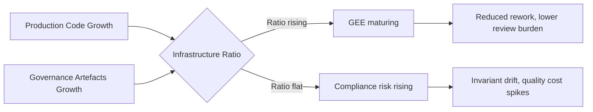

# Model-Based Agentic Software Engineering: The MAGE Framework and What It Reveals About Codex CLI's Configuration Layer


---

Coding agents break a comfortable assumption: that implementation is the scarce resource. When an agent can write, test, and submit code faster than a human can review it, the bottleneck shifts — to specifying intent, selecting abstractions, producing evidence, and determining acceptance. Davis, Kalu, Peng, and Patil formalise this shift in a 25 August 2026 preprint, *Model-Based Agentic Software Engineering* (MAGE, arXiv:2608.25174).[^1] Their framework is both a diagnosis and a prescription, and its two core problems — representation and authority — map almost exactly onto Codex CLI's existing configuration surface.

---

## The Representation Problem and the Authority Problem

MAGE identifies two coupled failures that emerge when teams adopt coding agents without structural change:

**The representation problem:** Coding agents increase implementation capacity without making project intent, system structure, or acceptance evidence explicit. The knowledge needed to make a sound decision gets reconstructed from code on every turn — by the model, and by the engineer reviewing it. When that reconstruction is expensive or inconsistent, velocity gains erode into rework.

**The authority problem:** Informal guidance — style guides, PR comments, team conventions — loses force when an agent is the primary implementor. Agents do not infer constraints from culture; they infer them from what is visible in the context window. If obligations have no operational enforcement, they are ignored or forgotten.

MAGE's response is a *Governed Engineering Environment* (GEE): the combination of *Modelling* (externalising the smallest purposeful representation needed to answer an engineering question) and *Alignment* (giving settled obligations proportionate authority through constraints, sensors, validators, and gates).[^1]

---

## The DocAble Case Study: Infrastructure Ratio as a Leading Indicator

The paper's primary evidence comes from DocAble, a document-accessibility system built over 20 weeks using coding agents as the dominant implementation medium.[^1] The system reached 540,000 lines of production code supported by 1.6 million lines of infrastructure (tests, validators, schema artefacts, constraint definitions). The key metric is the *infrastructure-to-production ratio*: it started at 0.85× and rose to 3.68× by project end.

That ratio is the fingerprint of a GEE taking shape organically. The team could not rely on the agent to hold engineering intent in its own memory across sessions; instead they externalised it into validators and schemas that the agent's own tooling ran on every change. The infrastructure growth was not waste — it was the accumulating representation and alignment layer that made the production code trustworthy.

Six independently reported industrial accounts corroborate the pattern: Cloudflare, Spotify, Shopify, Docker, Siemens, and Zenseact each converged on analogous structures under different organisational pressures.[^1] The paper argues this convergence is not coincidental — it is what governed agentic development looks like in practice.

---

## Four Propositions

MAGE's theoretical contribution rests on four propositions:[^1]

1. **Environment fit moderates capacity effectiveness.** A capable agent in a weak environment delivers less than the same agent in a strong one. Hiring better models does not substitute for better scaffolding.
2. **Representation leverage increases with reasoning burden.** The harder the decision, the more a well-chosen external representation is worth. Conversely, over-specifying simple decisions produces noise.
3. **Alignment mechanisms expand consequential surfaces.** Every gate or validator extends the reach of a settled obligation without requiring human attention at execution time.
4. **Engineering capital amortises judgment locally.** Good representations and alignment mechanisms let the agent (and reviewers) avoid re-deriving the same conclusion on every turn. They pay down the recurring judgment tax.

---

## Codex CLI as a GEE Construction Kit

Codex CLI's configuration surface — `AGENTS.md`, `hooks.json`, `config.toml`, the sandbox, MCP servers — is a concrete implementation of the MAGE stack. Mapping the abstractions:

### Representation Layer: `AGENTS.md`

`AGENTS.md` (and its hierarchical overrides, `AGENTS.override.md`) is Codex CLI's primary representation artefact.[^2] It externalises intent that would otherwise have to be reconstructed every session: domain context, invariants the agent must not violate, tool selection rationale, and acceptance criteria for common task families.

Under MAGE's Proposition 2, the quality of an `AGENTS.md` file should be calibrated to the reasoning burden of the tasks it covers. A file that lists every coding convention wastes context; one that specifies the non-obvious invariants (authorisation checks that must accompany every new endpoint, migration rules for database schema changes) delivers representation leverage.

```markdown
# AGENTS.md

## Domain Context
This repository serves a regulated financial API. Any route that exposes
user-account data MUST verify an active session token before returning
a response. The token check lives in `auth/middleware.py::require_session`.

## Acceptance Invariants
1. All new endpoints appear in `docs/openapi.yaml` before merge.
2. Database migrations follow the Audit-Drain-Promote pattern:
   audit the current violation count, drain existing errors to zero,
   then promote the new constraint.
3. Test coverage on `src/payments/` must not fall below 85 %.
```

The third item above (`Audit-Drain-Promote`) is one of MAGE's explicit techniques for brownfield adoption.[^1] Committing it to `AGENTS.md` converts a team norm into a representation the agent sees every session.

### Alignment Layer: Hooks

`hooks.json` PreToolUse and PostToolUse hooks are Codex CLI's alignment mechanism — they give obligations force at execution time rather than relying on model compliance alone.[^2]

```json
{
  "hooks": [
    {
      "event": "PreToolUse",
      "tool": "apply_patch",
      "command": "python scripts/check_invariants.py --patch-stdin",
      "blocking": true
    },
    {
      "event": "PostToolUse",
      "tool": "shell",
      "command": "python scripts/coverage_gate.py",
      "blocking": false,
      "async": true
    }
  ]
}
```

Under MAGE's Proposition 3, every validator added here expands the consequential surface of a settled obligation. The invariant-check script runs on every patch; the coverage gate runs asynchronously after every shell command. Neither requires the reviewer to look for violations manually.

### Authority Bounds: Sandbox Configuration

The sandbox (`network_access`, `writable_roots`, `deny_read`, `deny_write`) implements MAGE's authority distribution at the environment level.[^2] Narrowing `writable_roots` to the source tree and blocking network access during a refactoring session converts an aspirational constraint ("don't touch infrastructure") into an enforced one.

```toml
[sandbox]
network_access = false
writable_roots = ["src/", "tests/"]
deny_write = ["config/", "AGENTS.md", "hooks.json"]
```

`deny_write` on `AGENTS.md` itself is an alignment-of-the-alignment: it prevents the agent from revising its own governance during a session, a property MAGE's authority problem predicts becomes important as agents grow more capable.

### Reusable Governance Cycles: Named Profiles

MAGE proposes *Partial Automation* — packaging Modelling-Alignment cycles as reusable procedures agents can apply independently.[^1] Codex CLI's named profiles (`[profiles.<name>]` in `config.toml`) are a direct analogue:

```toml
[profiles.audit_mode]
model = "claude-sonnet-4-6"
model_reasoning_effort = "high"
approval_policy = "on-request"
instructions = "Run in audit mode: read-only, produce evidence reports only."

[profiles.fast_feature]
model = "o4-mini"
model_reasoning_effort = "low"
approval_policy = "auto-edit"
instructions = "Feature branch work; apply patches without approval for low-risk changes."
```

Each profile encodes a specific Modelling-Alignment configuration. Switching between them is, in MAGE terms, selecting the appropriate GEE for the task at hand.

---

## The Infrastructure Ratio as a Health Metric

The DocAble infrastructure ratio (0.85× → 3.68×) suggests a practical health metric for Codex CLI projects: track the ratio of governance artefacts (hook scripts, validator scripts, schema files, `AGENTS.md` word count) to production source lines. A flat ratio over time likely means the team is relying on model compliance rather than structural enforcement — which is fragile.



---

## Gaps in Codex CLI's Current GEE Support

MAGE identifies *Representation Recovery* — surfacing latent structure in existing codebases before applying enforcement — as a distinct practice.[^1] Codex CLI has no native command for this. `codex doctor` diagnoses endpoint and network health but not governance coverage. An agent instructed to produce a MAGE-style representation audit (enumerate implied invariants, map them to validator gaps) does so through a freeform task, not a structured primitive.

Similarly, MAGE's *Governance Conversion* — transforming recurring reconstruction and judgment into durable engineering structure — is currently entirely manual. The rollout JSONL (`--rollout-path`) captures trajectories, but there is no pipeline that mines those trajectories for recurring judgment patterns and proposes new `AGENTS.md` sections or hook scripts.

---

## Summary

MAGE names what practitioners have been building by instinct: the infrastructure ratio is a signal, not an accident. For Codex CLI users, the framework provides a vocabulary for design decisions that are otherwise made ad hoc:

- `AGENTS.md` = representation (externalise the non-obvious, calibrate to reasoning burden)
- `hooks.json` = alignment (give settled obligations operational force)
- Sandbox config = authority bounds (narrow scope to match task, protect governance artefacts)
- Named profiles = reusable GEE configurations

Proposition 1 is the most immediately actionable: environment fit moderates capacity effectiveness. Before switching to a larger model, ask whether the AGENTS.md is actually encoding the knowledge the agent needs, and whether the hooks are actually enforcing the invariants that matter.

---

## Citations

[^1]: Davis, J.C., Kalu, K., Peng, H., & Patil, P.V. (2026). *Model-Based Agentic Software Engineering*. arXiv:2608.25174. https://arxiv.org/abs/2608.25174

[^2]: OpenAI. (2026). *Codex CLI Documentation: Configuration Reference*. https://github.com/openai/codex/blob/main/codex-cli/AGENTS.md
