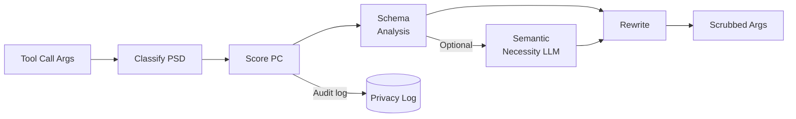
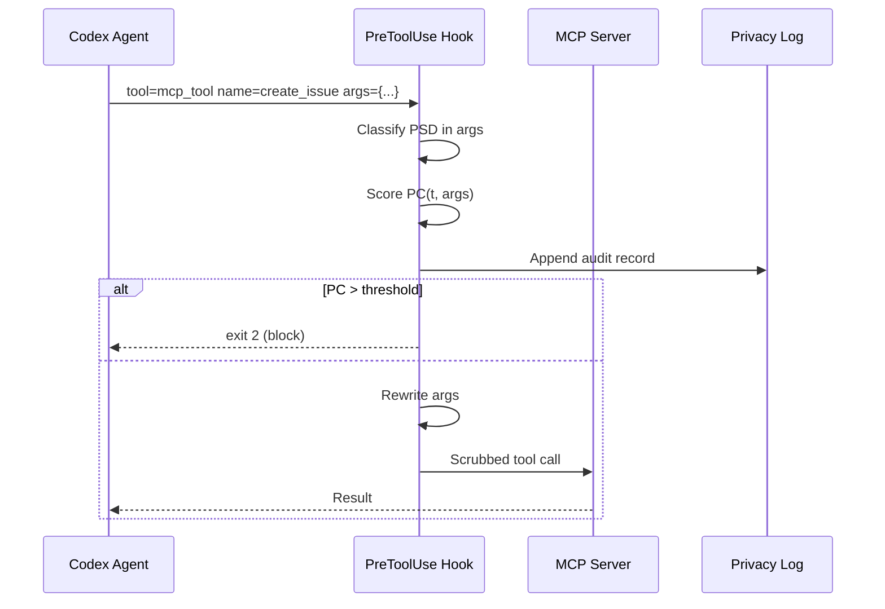

# ToolMinimize: Why 81–88% of LLM Agent Tool Calls Over-Share Private Data — and What Codex CLI's PreToolUse Hook Can Do About It


---

## The Structural Over-Sharing Problem

When a coding agent submits a tool call — whether to an MCP server, a REST API, or a shell command — it passes arguments to a third-party service. LLMs, trained to be maximally helpful, habitually include every piece of context they hold that might conceivably be relevant. This turns every tool invocation into an uncontrolled data disclosure boundary.

Li and Xu (Peking University) quantified the problem in *ToolMinimize: Auditing and Rewriting LLM Agent Tool Calls to Minimize Privacy Exposure* (arXiv:2608.24957, August 2026).[^1] Their controlled measurement across GPT-4o, Claude 3.5 Sonnet, and Llama-3.3-70B found that **81–88% of tool calls include unnecessary privacy-sensitive data (PSD)** under default prompts. Explicit privacy instructions reduce this only to 36–76% — with Llama improving barely at all (81% → 76%).

The examples are mundane:

- A weather query passes `"9500 Euclid Avenue, Cleveland OH"` when the API needs only `"Cleveland, OH"`.
- A calendar event is titled `"Couples Counselling with Dr. Patricia Hoffman"` instead of `"Appointment"`.
- An email to a manager includes `"severe anxiety and panic attacks since the layoffs"` when a day-off request requires no diagnosis.
- One model transmitted a user's SSN and income level to an accountant tool.

None of this is prompt-injection. The agents are not compromised — they are just extraordinarily forthcoming.[^2]

---

## Why Existing Defences Fall Short

Prior defences either *gate* tool calls (allow/block) or *label* information flows. Both fail the same way: **they cannot rewrite argument values**.

| Approach | PCS Residual | Task Completion (TCR) |
|----------|-------------|----------------------|
| No mitigation | 11.68 | 100% |
| Prompt (system) | 6.71 | 100% |
| PII detection | 4.29 | 100% |
| Blocking (PrivacyChecker) | 0.47 | **3%** |
| **ToolMinimize** | **0.59** | **100%** |

ToolMinimize achieves **7.3× lower residual PCS than PII detection** while maintaining full task validity.[^1] The blocking approach (PrivacyChecker) reduces privacy cost to nearly zero — but it does so by refusing to execute most tool calls. Useless in production.

There is also a detection gap: classical PII tooling misses *implicit* PSD. The string `"Memorial Sloan Kettering Cancer Center, 1275 York Ave"` does not match a phone-number regex, yet it reveals a cancer diagnosis through the facility name. ToolMinimize's semantic classifier catches these cases via a facility-name lookup and cross-field inference.[^1]

---

## The Privacy Cost Metric

ToolMinimize formalises the problem with a **Privacy Cost (PC)** metric computed per tool call argument:

```
PC(t, args) = Σ S(pⱼ) · E(f) · N(pⱼ, f)
```

Where:

- **S(p)**: Sensitivity level (1–4) drawn from a 10-category taxonomy grounded in GDPR Article 9[^3]
- **E(f)**: Trust level of the receiving function (0.2 for local, 1.0 for uncontracted third-party)
- **N(p, f)**: Binary necessity indicator — 1 if the PSD item is not minimum-necessary for the tool

The 10-category taxonomy covering sensitivity 1–4:

| Category | S | Examples |
|----------|---|---------|
| Direct Identifiers | 4 | SSN, email, phone, full name |
| Health | 4 | Conditions, medications, diagnoses |
| Financial | 4 | Account numbers, income, transactions |
| Quasi-Identifiers | 3 | Age, ZIP, occupation, date of birth |
| Location | 3 | Street addresses, GPS coordinates |
| Relational | 3 | Family associations, relationships |
| Behavioural | 2 | Habits, substance use, preferences |
| Temporal Patterns | 2 | Schedules, routines |
| Intent | 2 | Inferred goals, plans |
| Implicit Context | 1 | Contextual implications |

In practice, **69.4% of observed PSD items fall into critical-sensitivity categories** (DI 33.0%, H 26.6%, F 9.8%).[^1]

The metric is ordinal-stable: **Kendall's τ = 1.0 across 110 weight perturbations**, so the ranking of tool calls by privacy risk is robust to parameterisation choices.[^1]

---

## The Four Minimisation Operations

ToolMinimize's rewriting layer applies four operations in decreasing invasiveness:

1. **Removal** — delete optional fields that carry PSD but are not required by the tool schema
2. **Generalisation** — coarsen a value to the minimum-necessary granularity (street address → city, GPS to one decimal place, ZIP+4 to ZIP-5)
3. **Substitution** — insert a synthetic schema-valid placeholder (`user@example.com`, `Appointment`, `John Doe`)
4. **Truncation** — shorten free-text fields to remove PSD-carrying suffixes

The system processes these through a four-stage pipeline:



The *SchemaAnalyzer* parses the tool's JSON Schema to distinguish `required` fields from `optional` ones, and applies tool-specific minimum-necessary handlers (weather → city level, calendar → generic title, maps → destination only). A base64-decoding preprocessor defeats 9 of 10 common encoding evasions.[^1]

**Latency**: median 1.77ms on the schema-only path; the optional LLM content-aware extension adds ~800ms but raises reduction from 88.9% to 91.6%.

---

## Benchmark Results

On the 307-call live validation set and the *AgentPrivBench* benchmark (90 curated scenarios: healthcare, finance, workplace, travel, legal):

| Model | PCS Before | PCS After | Reduction |
|-------|-----------|-----------|-----------|
| GPT-4o | 3.95 | 0.40 | 90.0% |
| Claude Sonnet | 5.20 | 0.42 | 92.0% |
| Llama-3.3-70B | 3.05 | 0.57 | 81.2% |
| **Average** | **4.10** | **0.46** | **88.9%** |

Argument-level task validity (TCR) is **100%** across all three models. Equivalence confirmed by TOST at p < 0.001 with Δ = 1.0.[^1]

Domain performance: near-zero residual PCS in finance (0.08), healthcare (0.43), personal (0.42), and workplace (0.00). Travel remains higher (2.00) — booking systems genuinely require named entities.

On **25 real-world MCP server schemas** (Shopify, GitHub, Discord, and others, with no minimum-necessary annotations): **79.0% cost reduction** with no task failures.[^1] On cross-agent delegation scenarios (15 Stage E transfers), PCS dropped from 12.60 to **0.00** at 100% TCR.

---

## MCP Integration and the Codex CLI Connection

The paper explicitly describes MCP integration: ToolMinimize intercepts `tools/call` JSON-RPC requests at the client transport layer before they are dispatched to MCP servers.[^1]

Codex CLI routes MCP tool calls through exactly this layer. The **PreToolUse hook** is Codex CLI's native intercept point — it fires before any tool execution with the tool name and full argument payload, and an exit code of 2 blocks the call.[^4]



A minimal PreToolUse hook implementing the ToolMinimize pattern in Python:

```python
#!/usr/bin/env python3
"""
pretooluse-privacy-scrub.py
Intercepts MCP tool calls and blocks calls exceeding a privacy cost threshold.
Exits with code 2 to block; 0 to allow (with optional rewriting via stdout).
"""

import json
import re
import sys

# Load the hook input from Codex CLI
event = json.loads(sys.stdin.read())
tool = event.get("tool", {})
tool_name = tool.get("name", "")
args = tool.get("input", {})

# --- Simplified PSD detection ---
PSD_PATTERNS = {
    "ssn": (re.compile(r"\b\d{3}-\d{2}-\d{4}\b"), 4),
    "email": (re.compile(r"[a-zA-Z0-9_.+-]+@[a-zA-Z0-9-]+\.[a-zA-Z0-9-.]+"), 4),
    "street": (re.compile(r"\b\d+\s+[A-Z][a-z]+\s+(St|Ave|Rd|Blvd|Dr|Ln)\b"), 3),
    "phone": (re.compile(r"\b\d{3}[-.\s]\d{3}[-.\s]\d{4}\b"), 4),
}

EXTERNAL_TRUST = 1.0  # uncontracted third-party MCP server

def compute_pc(args_str: str) -> float:
    pc = 0.0
    for _, (pattern, sensitivity) in PSD_PATTERNS.items():
        if pattern.search(args_str):
            pc += sensitivity * EXTERNAL_TRUST  # N=1 (unnecessary assumed)
    return pc

args_str = json.dumps(args)
pc = compute_pc(args_str)

THRESHOLD = 4.0  # Block if PC >= S=4 (Direct Identifier or Health exposure)

if pc >= THRESHOLD:
    result = {
        "decision": "block",
        "reason": f"Privacy cost {pc:.1f} exceeds threshold {THRESHOLD}. "
                  f"Tool call to '{tool_name}' contains potential PSD. "
                  "Review and strip sensitive fields before retrying.",
    }
    print(json.dumps(result))
    sys.exit(2)

sys.exit(0)
```

Register in `hooks.json`:

```json
{
  "hooks": {
    "PreToolUse": [
      {
        "matcher": "mcp_.*",
        "hooks": [
          {
            "type": "command",
            "command": "python3 ~/.codex/hooks/pretooluse-privacy-scrub.py"
          }
        ]
      }
    ]
  }
}
```

---

## AGENTS.md Privacy Context Declaration

Codex CLI's AGENTS.md is the right place to declare minimum-necessary field policies — the equivalent of ToolMinimize's schema annotations. This allows the agent's reasoning to apply the right generality before the hook fires as a backstop:

```markdown
## Privacy and Data Minimisation

Tool calls to external MCP servers MUST follow the principle of minimum necessary disclosure:

- **Location fields**: Use city-level precision only (e.g., "London" not "14 Baker Street, London W1U 7AF")
- **User references**: Use display names, not email addresses or account IDs, unless the tool schema explicitly requires them
- **Calendar events**: Use generic titles ("Meeting", "Appointment") not diagnostic or relationship-revealing titles
- **Email bodies**: Strip personal health, financial, or relational context not required for the request
- **Cross-agent messages**: Do not forward PII received in one tool result to the next tool's arguments

If uncertain whether a value is minimum-necessary, use a generalised form or omit it.
```

---

## Multi-Agent Delegation: The Hidden Amplifier

The most alarming result in the paper is the **cross-agent delegation scenario** (Stage E). When agents chain tool calls — forwarding the result of one MCP invocation as the input to another — PCS compounds across the chain. In ToolMinimize's 15 cross-agent scenarios, the baseline PCS reached **12.60** before middleware intervention, the highest in any evaluation partition. After ToolMinimize: **0.00** at 100% TCR.[^1]

Codex CLI's `multi_agent_v2` mode creates exactly this pattern: a coordinator agent spawns subagents, which make their own MCP tool calls, passing results back up the chain. Each agent turn is a new disclosure boundary. A PreToolUse hook operating at every level of the agent hierarchy — not just the top-level session — is therefore critical.

Codex CLI's `multi_agent_v2` hooks currently apply to both coordinator and subagent turns via the SubagentStart/Stop hook lifecycle.[^4] A privacy scrubbing PreToolUse hook will fire at each level, providing defence-in-depth across the entire delegation chain.

---

## Gaps and Limitations

**No native minimum-necessary schema in Codex CLI config.toml**: ToolMinimize's schema-aware analysis requires per-tool minimum-necessary field annotations. Codex CLI's MCP configuration (`config.toml` `[mcp_servers.*]`) has no field for this. Developers must encode field policies in AGENTS.md and hook scripts.

**Semantic classifier latency**: The optional LLM content-aware extension (~800ms per call) is incompatible with Codex CLI's synchronous PreToolUse hook model for high-frequency tool calls. Use it only for high-sensitivity tool namespaces or switch to an async PostToolUse audit pattern.

**No privacy audit trail in rollout JSONL**: Codex CLI's session logs record tool calls but not the argument-level PSD analysis. A PostToolUse hook writing to a separate `privacy-audit.jsonl` fills this gap.

**Travel and booking domains**: ToolMinimize itself acknowledges that named-entity booking identifiers are often genuinely minimum-necessary. Hook policies should be domain-aware rather than applying blanket generalisation.

**False positives on benign strings**: The paper reports a 20% false detection rate and 10% rewrite false positive rate on benign scenarios.[^1] A hook that exits 2 on any PSD detection will block legitimate tool calls. Use the hook to rewrite (exit 0 with modified args) rather than block, reserving hard blocks for confirmed high-sensitivity patterns.

---

## Summary

ToolMinimize demonstrates that LLM agents are structurally inclined to over-share private data in tool calls — privacy instructions help modestly, and PII detection tools miss implicit PSD entirely. Schema-aware argument-level rewriting achieves 81–92% privacy cost reduction with zero task validity impact at sub-2ms median latency.

For Codex CLI users:

1. **PreToolUse hook** is the native intercept point for MCP tool call argument scrubbing — equivalent to ToolMinimize's client-transport interceptor.
2. **AGENTS.md** minimum-necessary declarations establish the semantic layer; the hook enforces it mechanically.
3. **multi_agent_v2** amplifies disclosure risk through agent chaining — hooks at every delegation level are necessary, not optional.
4. **Privacy audit JSONL** (via PostToolUse) provides the compliance record that Codex CLI's rollout logs omit.

---

## Citations

[^1]: Li, W. & Xu, Y. (2026). *ToolMinimize: Auditing and Rewriting LLM Agent Tool Calls to Minimize Privacy Exposure.* arXiv:2608.24957. <https://arxiv.org/abs/2608.24957>

[^2]: ToolPrivacyBench (arXiv:2606.28061) established a complementary benchmark for purpose-bound privacy in tool-using agents, covering 25 tool categories and consent-scope violations. ToolMinimize addresses the argument-value layer; ToolPrivacyBench addresses the purpose-binding layer. <https://arxiv.org/abs/2606.28061>

[^3]: European Parliament and Council (2016). *General Data Protection Regulation (GDPR), Article 9: Processing of special categories of personal data.* <https://gdpr-info.eu/art-9-gdpr/>

[^4]: OpenAI. *Codex CLI hooks reference.* Codex documentation, 2026. <https://developers.openai.com/codex/cli/reference>
