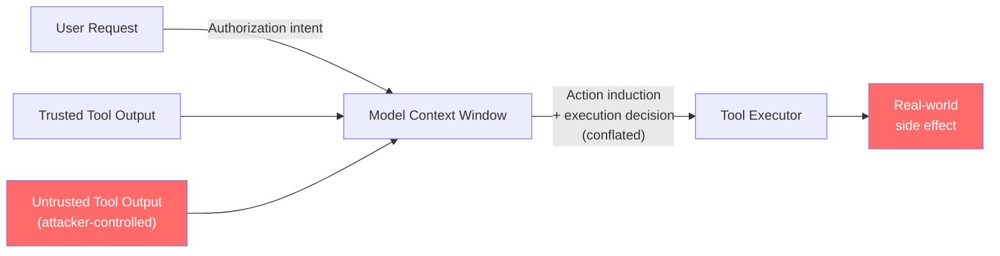
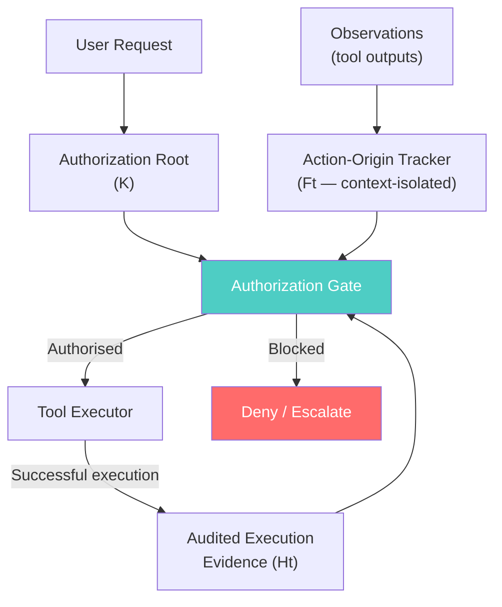

# When Tool Outputs Become Commands: The SARA Framework for Authorising Agent Actions — and Its Lessons for Codex CLI


---

## The Problem in One Sentence

Tool-augmented LLM agents are routinely deceived into executing unauthorised actions because the same system that determines *what to do* also determines *whether it is authorised to do it* — using the same context window that attackers control through tool outputs.

This is the core finding of Guo et al.'s paper "When Tool Outputs Become Commands"[^1] (arXiv:2608.27146, August 2026), which introduces the SARA framework — **S**eparating **A**ction Induction from **R**untime **A**uthorisation. The paper's experimental results are stark: across 8,730 attack instances on two benchmarks, SARA reduces Attack Success Rate (ASR) to a maximum of **0.63%**, down from baselines of 15–33%.

This article explains the problem and its proposed solution, then maps both to the mechanisms Codex CLI currently provides — and the gaps that remain.

---

## The Conflation Problem

In a standard tool-augmented agent loop, the model receives tool outputs and uses them to decide which action to take next. This conflates two logically distinct operations:

- **Action induction**: determining *what* candidate action is suggested by the current observations
- **Execution authorisation**: determining *whether* that candidate action falls within the authority granted by the original user request

When these operations share a context window that includes untrusted third-party content — email bodies, web pages, API responses, document contents — they become inseparable. An attacker who controls any of that content can inject instructions that induce the model to form candidate actions that the user never authorised.



Indirect prompt injection (IPI) is the exploit class that follows from this conflation.[^2] AgentDojo — the standard benchmark for evaluating IPI defences[^3] — demonstrates that state-of-the-art models, including GPT-4o-mini (ASR 15.79%) and Gemini-2.5-Flash-Lite (ASR 33.28%), are reliably exploitable without specific defences.

---

## The SARA Framework

SARA decouples action induction from execution authorisation by introducing three distinct components that operate outside the model's primary context:

### 1. Authorization Root (K)

A task-level contract derived from the user's original request. K defines the "authority upper bound" — the set of effects and operations that the user actually authorised. This root is extracted once at session start and remains immutable throughout the agent's execution, regardless of what subsequent tool outputs suggest.

### 2. Persistent Action-Origin Tracking (Ft)

A context-isolated "Action Probe" that monitors observations for action-inducing semantics — content that appears to direct the agent toward concrete operations rather than merely providing data. Ft maintains a persistent provenance record linking each candidate action to its originating observation:

- If a candidate action originates from untrusted third-party content, Ft flags it for authorisation review
- If a candidate action originates from legitimate user instructions or trusted execution history, it may proceed through the differentiated review path
- The Action Probe is context-isolated — it cannot be overwritten by content in the agent's primary conversation window

### 3. Audited Execution Evidence (Ht)

A record of tool interactions that were previously authorised by K and successfully executed. Ht allows dynamic runtime values (e.g., a transaction ID returned by a prior tool call) to legitimately instantiate subsequent operations — but only for operations already within the authorisation scope. Values from untrusted sources cannot enter Ht and therefore cannot acquire execution authority.



### No-History-Promotion (NHP)

The subtlest element of SARA is the No-History-Promotion rule: **a value that appears in execution history cannot independently become new execution authority**. Without NHP, an attacker's injected instruction could execute one seemingly-benign action, wait for that action to appear in Ht, then use that legitimate historical record to launder subsequent unauthorised operations into the audited evidence chain.

### Differentiated Review Path

Not every tool call requires full authorisation review. Query and read operations — those with no external side effects — bypass full review unless the Action Probe has flagged a tool-overlap with a tracked action origin. Only side-effecting calls (writes, sends, transfers, mutations) undergo full three-level authorisation. This preserves agent utility while concentrating review overhead where it matters.

---

## Experimental Results

SARA was evaluated on two benchmarks:[^4]

**AgentDojo** (92 benign tasks, 3,528 attack instances across Banking, Slack, Travel, and Workspace domains)

**AgentDyn** (141 benign tasks, 5,202 attack instances across Shopping, GitHub, and DailyLife domains)

| Model | Benchmark | Baseline ASR | SARA ASR |
|-------|-----------|-------------|---------|
| GPT-4o-mini | AgentDojo | 15.79% | 0.06% |
| GPT-4o-mini | AgentDyn | 16.07% | 0.17% |
| Gemini-2.5-Flash-Lite | AgentDojo | 33.28% | 0.62% |
| Gemini-2.5-Flash-Lite | AgentDyn | 30.91% | 0.63% |

Cross-backbone evaluation extended to Llama 3.1-8B-Instruct, Llama 3.3-70B-Instruct, Qwen2.5-14B, and Qwen3-32B, with consistent ASR reduction across all configurations. The framework requires no model fine-tuning — it is a pure runtime mechanism deployed between the agent and its tool executors.

---

## Mapping SARA to Codex CLI

Codex CLI does not implement SARA. But its existing architecture provides partial analogues for each SARA component — and knowing where those analogues fail illuminates where the current design leaves gaps.

### Authorization Root ↔ AGENTS.md + the User Prompt

The closest Codex CLI analogue to SARA's authorization root is the combination of the user's task prompt and any tool-use declarations in `AGENTS.md`. The user's stated goal is the implicit authority boundary.

However, Codex CLI has no mechanism to formally extract and freeze that boundary at session start. The model is free to reinterpret its goals in light of subsequent context — including attacker-controlled content. SARA's authorization root is immutable and external to the model; Codex's is soft and in-context.

```toml
# AGENTS.md-style declaration: closest analogue to Authorization Root
# (suggestive, not enforced at runtime)
[tool_use]
permitted = ["shell", "read_file", "write_file"]
denied = ["network_exfiltrate", "credential_access"]
```

### Action-Origin Tracking ↔ PostToolUse Hook Logging

A PostToolUse hook can be used to log each tool call alongside its originating context — a manual approximation of Ft. Codex CLI's rollout JSONL provides the raw material; a hook can append provenance annotations:

```bash
#!/usr/bin/env bash
# .codex/hooks/post-tool-use-provenance.sh
# Append tool provenance to a local log for manual audit
TOOL_NAME="$CODEX_TOOL_NAME"
TOOL_RESULT_ORIGIN="${CODEX_MCP_SERVER:-shell}"
TIMESTAMP="$(date -u +%Y-%m-%dT%H:%M:%SZ)"
echo "{\"time\":\"$TIMESTAMP\",\"tool\":\"$TOOL_NAME\",\"origin\":\"$TOOL_RESULT_ORIGIN\"}" \
  >> ~/.codex/provenance.jsonl
```

The limitation: Codex CLI PostToolUse hooks receive tool results but cannot classify whether those results are action-inducing versus data-providing. That semantic distinction — the core of SARA's Action Probe — requires a separate inference step that is not natively available. You could implement it as an additional model call within the hook, but this adds latency and cost to every tool execution.

### Audited Execution Evidence ↔ Rollout JSONL

Codex CLI's rollout JSONL records approved tool invocations, providing a log analogous to Ht. However, this log is not actively consulted by the model when forming subsequent actions — it is a post-hoc audit record, not a runtime authorisation mechanism.

### Authorization Gate ↔ PreToolUse Hook (exit code 2 = block)

The most direct Codex CLI analogue to SARA's authorization gate is the PreToolUse hook with exit code 2 to block execution. This hook fires before every tool call and can deny execution based on policy:

```bash
#!/usr/bin/env bash
# .codex/hooks/pre-tool-use-gate.sh
# Block side-effecting tool calls not matching expected operation pattern
TOOL_NAME="$CODEX_TOOL_NAME"
TOOL_ARGS="$CODEX_TOOL_INPUT"

# Deny write operations to sensitive paths
if echo "$TOOL_ARGS" | grep -qE '"path":".*(\.env|credentials|secrets)"'; then
  echo "BLOCKED: Write to sensitive path denied" >&2
  exit 2
fi

# Deny network exfiltration patterns
if [[ "$TOOL_NAME" == "shell" ]] && echo "$TOOL_ARGS" | grep -qE 'curl.*POST|wget.*--post'; then
  echo "BLOCKED: Outbound POST denied — not in authorised task scope" >&2
  exit 2
fi

exit 0
```

This is deterministic policy enforcement, not semantic authorisation. It cannot evaluate whether the operation was induced by an attacker's injected instruction versus the user's legitimate request.

### No-History-Promotion ↔ Approval Policy + Untrusted Project Lockout

Codex CLI's `approval_policy` partially implements NHP semantics: operations that exceed the current policy tier require explicit user approval, and untrusted projects cannot load project-scoped AGENTS.md or hooks that would widen that policy. When a cloned repository attempts to inject instructions through `.codex/AGENTS.md`, the trust prompt prevents those instructions from gaining authority.[^5]

```toml
# ~/.codex/config.toml
[projects."/home/dev/external-repos/*"]
trust_level = "untrusted"   # Instructions cannot acquire execution authority
```

However, within a single trusted session, Codex CLI has no mechanism to distinguish "this tool output came from an attacker-controlled source" from "this tool output came from a trusted operation". All approved tool results enter the same context window with equal weight — the NHP property that SARA enforces at the execution-evidence level does not exist.

---

## The Remaining Gaps

| SARA Capability | Codex CLI Status |
|----------------|-----------------|
| Immutable authorization root extracted at session start | ⚠️ Soft — user prompt intent is in-context and mutable |
| Context-isolated Action Probe | ⚠️ Not available — requires external process or secondary model call |
| Semantic classification of action-inducing vs. data-providing content | ⚠️ Not available natively |
| Differentiated review (read vs. side-effecting) | ✅ Partial — `approval_policy` distinguishes read/write tiers |
| No-History-Promotion across execution steps | ⚠️ Not enforced — all tool results carry equal in-context weight |
| Audited execution evidence consulted at decision time | ⚠️ Rollout JSONL is audit-only, not a decision input |
| Cross-model transfer without retuning | ✅ Any hook-based defence applies across all Codex model backends |

The deepest gap is the Action Probe: a mechanism that can identify action-inducing semantics in tool outputs and flag them before the model processes them. Without this, all IPI defences in Codex CLI are either deterministic pattern-matching (fragile against adaptive attackers) or rely on the model's own judgment (which is the surface being attacked).

---

## What You Can Do Today

**Prioritise sandboxing over detection.** The SARA paper's results are impressive, but a simpler principle applies at the Codex CLI level: minimise what side-effecting tools are available in contexts where untrusted content will appear. If a task involves reading external documents, avoid also granting write access to sensitive paths during the same session. Use named profiles to separate read-heavy from write-heavy workflows:

```toml
# config.toml — profiles for separated read/write posture
[profiles.research]
sandbox_policy = "workspace-read"
approval_policy = "default"

[profiles.implementation]
sandbox_policy = "workspace-write"
approval_policy = "untrusted"
```

**Implement a minimal PreToolUse blocklist.** Side-effecting operations that should never follow from external content — outbound HTTP posts, credential file access, shell variable exports — can be blocked deterministically with a PreToolUse hook, regardless of how the model arrived at them.

**Audit provenance with PostToolUse.** A PostToolUse hook that logs MCP server name, tool name, and result size alongside each approved operation gives you the raw material for post-incident analysis, even if real-time SARA-style authorisation is not yet available.

**Follow the SARA development.** The Yuj harness paper[^6] (arXiv:2608.26218) by Sydney Lewis — released the same week — demonstrates that context management at the harness layer produces large, transferable performance gains. SARA is the complementary security-layer development: both papers argue that what happens *outside* the model's context window matters more than is commonly recognised.

---

## Citations

[^1]: Guo et al., "When Tool Outputs Become Commands," arXiv:2608.27146, August 2026. <https://arxiv.org/abs/2608.27146>

[^2]: Perez, E. and Ribeiro, S., "Ignore Previous Prompt: Attack Techniques For Language Models," 2022. <https://arxiv.org/abs/2211.09527> — foundational IPI framing.

[^3]: Debenedetti, E. et al., "AgentDojo: A Dynamic Environment to Evaluate Prompt Injection Attacks and Defenses for LLM Agents," arXiv:2406.13352, 2024. <https://arxiv.org/abs/2406.13352>

[^4]: AgentDyn benchmark — Shopping, GitHub, and DailyLife domains. Referenced in Guo et al. (2608.27146) as the dynamic-environment companion to AgentDojo, with 141 benign tasks and 5,202 attack instances.

[^5]: Codex CLI v0.147.0 release notes — project trust gates. <https://github.com/openai/codex/releases/tag/rust-v0.147.0>

[^6]: Lewis, S., "Same Model, Different Harness: Different Coding-Agent Results," arXiv:2608.26218, August 2026. <https://arxiv.org/abs/2608.26218>
