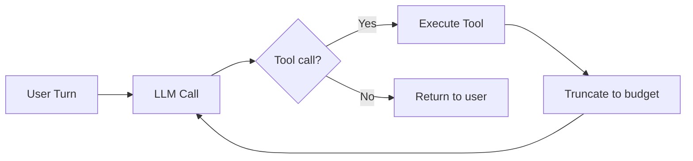
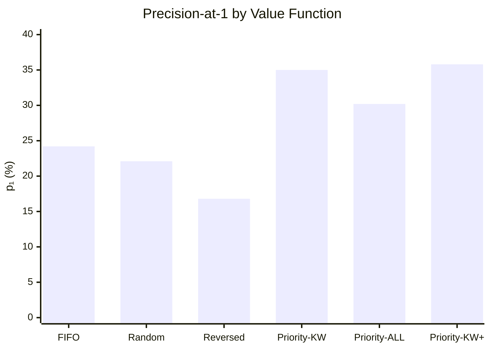
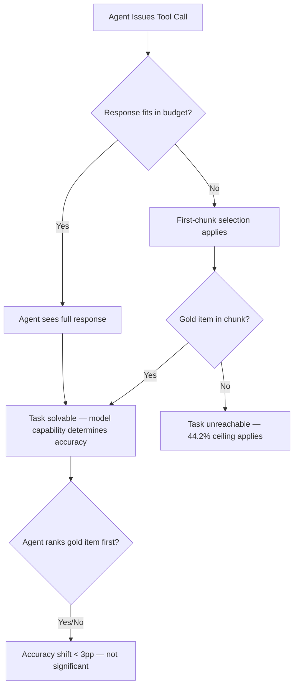

# Agents Don't Paginate: What First-Chunk Selection Means for Codex CLI Tool Output Design


A new University of Luxembourg preprint confirms something practitioners already suspected but rarely discussed openly: when a coding agent receives a tool response that exceeds its per-turn token budget, it simply does not ask for more.[^1] Not in one observed session. Not once across the entire production MCP telemetry the paper examined.

The paper — "Agents Don't Paginate: First-Chunk Selection for LLM Tool Responses" by Petrova, Mazniak, and State — reframes what looks like a retrieval problem into a selection problem, and the distinction has direct consequences for how you configure Codex CLI's shell commands, MCP servers, and PostToolUse hooks.[^1]

## The Empirical Observation

Pagination is part of the MCP specification. Most file-listing and search tools expose `cursor`/`nextPage`/`offset` parameters. Directory enumeration, symbol search, and grep output all support multi-chunk delivery. The assumption embedded in those designs is that an agent will request chunk 2 when chunk 1 is insufficient.

Petrova et al. examined MCP middleware telemetry spanning Claude Code, Cursor, OpenAI Codex, GitHub Copilot, and Aider sessions. Across every over-budget tool response observed, the count of agent-initiated pagination requests was zero.[^1]

This is not surprising once you think about it. Agent control loops are typically constructed as:



The truncation at step E happens silently inside the framework. The LLM receives a complete-looking JSON payload with no indication that items were dropped. It has no signal to act on.

## The Research Design

The paper treats first-chunk selection as a **0/1 knapsack problem**: given a set of candidate tool-response items with associated token costs, select the subset that maximises value subject to a budget constraint B.[^1] The greedy density heuristic (value/cost sorting) gives a 1/2-approximation.

Six value functions are compared across 500 SWE-bench Verified tasks at four budget levels (1K–8K tokens):[^1]

| Function | Description |
|---|---|
| FIFO | Preserve CLI/filesystem order. No ranking signal. Production baseline. |
| Random | Uniform shuffle. Variance control. |
| Reversed | Inverse FIFO. Adversarial lower bound. |
| Priority-KW | Cosine similarity between item path tokens and task query. |
| Priority-ALL | Composite: keyword overlap + depth prior + extension prior + recency + filename match. |
| Priority-KW+ | Priority-KW with FIFO fallback for zero-score items. |

The primary metric is **precision-at-1 (p₁)**: the probability that the item containing the required information is ranked first by the value function, and therefore survives truncation when budget is tight.

A downstream experiment (E2) then wires the best-performing value function into a live file-localisation probe — 100 tasks, five models, 4,800 LLM calls — to measure whether a p₁ improvement translates to solve-rate improvement.[^1]

Models tested span the frontier and local tiers: Claude Opus 4.7, Claude Sonnet 4.5, GLM-5.1, Gemma 4 26B (local via Ollama), and GPT-OSS 20B (local via Ollama).[^1]

## The Numbers



Priority-KW raises p₁ from 24.2% to 35.0%, a gain of **+10.8 percentage points** (p = 3.9 × 10⁻⁸).[^1] Priority-KW+ with FIFO fallback reaches 35.8%.

Priority-ALL — the more elaborate composite scorer — scores *worse* than simple keyword matching: **−4.8 pp** against Priority-KW (p = 0.001).[^1] Adding file-metadata signals (depth, extension, recency) introduces noise that overwhelms the query signal. The lesson: for short-context selection, simplicity beats sophistication.

### The Downstream Surprise

Here is where the paper delivers its most counter-intuitive result. Despite a statistically significant p₁ improvement of 10.8 pp, the downstream accuracy shift is **−2.8 to +2.2 pp across all five models** — with no directional consistency and no statistical significance.[^1]

Improving where the right item ranks within the first chunk does not move the needle on task completion.

The explanation is precision-at-1 versus precision-at-k. What the model needs is for the target item to *appear anywhere in the chunk*, not necessarily first. Once the gold item is present in the context window, the model recovers it regardless of position. The binding constraint is inclusion, not rank.

This becomes clear when you look at the conditional accuracy: for tasks where p₁ = 1 (the gold item is ranked first), the accuracy gap between the weakest and strongest model collapses from 7.8 pp to 1.9 pp.[^1] Retrieval failure is the equaliser. When retrieval succeeds, model capability reasserts itself.

### The Real Ceiling

The paper identifies a harder limit: **44.2% of the 500 SWE-bench Verified tasks are retrieval-unreachable** under any first-chunk strategy at the budgets tested.[^1] The gold item exists but does not survive any budget-constrained selection.

For the 221 tasks that *are* winnable:

- FIFO selection: 43.4% of winnable tasks solved
- Priority-KW selection: 64.2% of winnable tasks solved
- **Selection lift: +20.8 pp** within the retrieval-possible ceiling[^1]

The headline improvement (10.8 pp across all 500 tasks) undersells the real gain because it averages over unreachable tasks where no selector can help.

## What This Means for Codex CLI

### Silent Truncation Is the Default

Codex CLI's shell execution sandbox imposes output limits on `run_command` and related tools. When a command produces output beyond the limit, the tail is silently dropped. The agent receives a truncated string with no truncation marker by default.

The paper's finding — zero pagination requests across all observed sessions — confirms this is universal. The agent will never ask for the rest. Your grep output, your build log, your test runner output: if it overflows the budget, what arrives is all the agent will ever see.

### PostToolUse Hooks Are Your First-Chunk Selector

The paper's Priority-KW result maps directly to what you can implement today in a Codex CLI PostToolUse hook. A hook that receives tool output can reorder, filter, and compress before the LLM sees it.

```bash
#!/usr/bin/env python3
"""
PostToolUse hook: keyword-priority first-chunk selector.
Receives tool output via CODEX_TOOL_RESPONSE env var.
Rewrites it to surface query-relevant lines first.
"""
import os, json, sys
from pathlib import Path

MAX_LINES = 200  # budget proxy

payload = json.loads(os.environ.get("CODEX_TOOL_RESPONSE", "{}"))
tool_name = payload.get("tool", "")
output = payload.get("output", "")
query = payload.get("session_query", "")  # injected via SubagentStart hook

if not output or not query or tool_name not in ("run_command", "shell"):
    sys.exit(0)  # pass through unchanged

query_tokens = set(query.lower().split())
lines = output.splitlines()

def score(line: str) -> float:
    words = set(line.lower().split())
    return len(words & query_tokens) / max(len(words), 1)

scored = sorted(enumerate(lines), key=lambda x: -score(x[1]))
top_indices = sorted(idx for idx, _ in scored[:MAX_LINES])
selected = [lines[i] for i in top_indices]

print("\n".join(selected))
sys.exit(0)
```

This is a rough approximation of Priority-KW. The exact gain will vary — the paper's +10.8 pp is over a specific benchmark with specific budget constraints — but the principle holds: surfacing query-relevant lines improves inclusion probability for what the model needs.

### File Reads and the 55.8% Ceiling

The retrieval ceiling finding has a specific implication for large-file reads. When Codex CLI reads a file too large to fit in one turn's token budget, it truncates from the tail. If the relevant code is in the middle or end of a 3,000-line file, it may never reach the model.

```toml
# config.toml — example tool output budget
[sandbox]
max_tool_output_tokens = 8192   # cap per tool call
```

⚠️ Codex CLI does not currently expose a `max_tool_output_tokens` config key at stable release — this is a schematic illustration. The actual truncation limit is set per tool in the sandbox implementation.

For critical large-file reads, the practical remediation is AGENTS.md guidance:

```markdown
## File Reading Policy

When reading files larger than 500 lines:
1. Use `grep -n <pattern> <file>` to locate the relevant section first.
2. Read only the specific line range with `sed -n '<start>,<end>p' <file>`.
3. Never read an entire file when a targeted subsection suffices.

Do not rely on file-read truncation to deliver the relevant section.
```

This pushes the agent toward tool calls with naturally smaller, targeted outputs — side-stepping the first-chunk selection problem by avoiding large first chunks in the first place.

### MCP Server Design

The paper's MCP telemetry finding has a concrete implication for anyone writing MCP servers consumed by Codex CLI: **do not expose paginated endpoints expecting the client to iterate**. The client won't.

If your MCP server returns a directory listing that exceeds the tool's token budget, the excess is gone. Design for bounded-size responses from the start:

```json
{
  "tools": [
    {
      "name": "list_files",
      "description": "List files matching a glob pattern. Returns at most 50 results. Use a more specific pattern to narrow the set.",
      "inputSchema": {
        "type": "object",
        "properties": {
          "pattern": { "type": "string" },
          "max_results": { "type": "integer", "default": 50, "maximum": 100 }
        },
        "required": ["pattern"]
      }
    }
  ]
}
```

Embedding the bound in the schema sets the agent's expectation and prevents silent partial results from being treated as complete results.

### Build and Test Output: The Worst Offender

The paper identifies `run_command` and `run_build` failure modes as particularly expensive — failed builds inject **7–8× more diagnostic tokens** than successful ones (this figure comes from the GitHub Copilot production trace study[^2] rather than the Petrova et al. paper, but the two findings compound).

A build failure in a large monorepo can produce hundreds of kilobytes of output. The model sees the first N tokens. If the relevant error is buried in dependency resolution output several thousand lines in, the model will attempt a fix based on incomplete information.

PostToolUse hook pattern for build output:

```bash
#!/usr/bin/env bash
# Compress build output: keep first 50 lines + last 100 lines
# (errors are typically at the end; context at the start)
output="$CODEX_TOOL_RESPONSE"
line_count=$(echo "$output" | wc -l)

if [ "$line_count" -gt 200 ]; then
    head_lines=$(echo "$output" | head -50)
    tail_lines=$(echo "$output" | tail -100)
    echo "$head_lines"
    echo "... [$(($line_count - 150)) lines omitted] ..."
    echo "$tail_lines"
else
    echo "$output"
fi
```

The Petrova et al. paper's framing applies here: you are making a first-chunk selection decision. For build output the right heuristic is tail-priority, not keyword-priority — errors propagate to the end of the log.

## The Accuracy Plateau

The paper's downstream result — that p₁ improvements do not translate to accuracy — carries a sobering implication. Even if Codex CLI operators implement perfect first-chunk selection in their PostToolUse hooks, the overall solve rate improvement will be modest unless the retrieval ceiling itself is addressed.

Improving *which* items appear in the chunk is a second-order problem. The first-order problem is ensuring the relevant item is *retrievable at all* — meaning the agent issues a targeted enough tool call that the item exists somewhere in the response.

This maps to instruction quality in AGENTS.md. Vague instructions like "read the codebase to understand the structure" lead to broad tool calls with large, low-precision responses. Specific instructions like "read `src/auth/` first; grep for the symbol you need before reading any file" lead to narrow, high-precision responses where the selection problem largely disappears.



The actionable takeaway: invest in AGENTS.md instruction precision and targeted tool-call patterns first; invest in PostToolUse response reranking second. They address different parts of the stack, and the first yields larger absolute gains.

## Summary

| Finding | Paper Result | Codex CLI Implication |
|---|---|---|
| Agent pagination requests | Zero across all observed sessions | Never design MCP flows expecting agents to iterate chunks |
| Priority-KW vs FIFO | +10.8 pp p₁ (p < 10⁻⁸) | PostToolUse hooks can implement keyword-priority selection |
| Priority-ALL vs Priority-KW | −4.8 pp (p = 0.001) | Avoid complex metadata signals; simple keyword match dominates |
| Downstream accuracy shift | −2.8 to +2.2 pp (non-significant) | Reranking is a second-order fix; retrieval scope matters more |
| Retrieval ceiling | 44.2% unreachable tasks | AGENTS.md must enforce targeted tool calls to keep gold in scope |
| Winnable-task selection lift | +20.8 pp (43.4% → 64.2%) | Selection matters when the target is retrievable — invest in hooks |

The code and benchmark pipeline are available at `github.com/meteora-pro/devboy-tools` under an open licence.[^1] The authors report a reproducible Docker-based setup with approximately £20 in cloud API costs.

## Citations

[^1]: Petrova, T., Mazniak, A., & State, R. (2026). *Agents Don't Paginate: First-Chunk Selection for LLM Tool Responses*. arXiv:2608.26130 [cs.CL]. University of Luxembourg, SnT. https://arxiv.org/abs/2608.26130

[^2]: Liu, B., Qiu, H., Goiri, Í., Fonseca, R., Bianchini, R., & Choukse, E. (2026). *Agentic Coding in the Wild: Characterizing GitHub Copilot Traces at Production Scale*. arXiv:2608.00101 [cs.DC]. Microsoft Azure Research / UIUC. https://arxiv.org/abs/2608.00101

[^3]: SWE-bench Verified. Princeton NLP Group. https://www.swebench.com

[^4]: Model Context Protocol specification. Anthropic, 2026. https://modelcontextprotocol.io/specification/2026-07-28

[^5]: OpenAI Codex CLI hooks documentation. https://github.com/openai/codex/blob/main/codex-rs/docs/hooks.md
