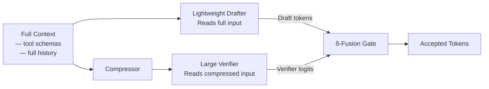
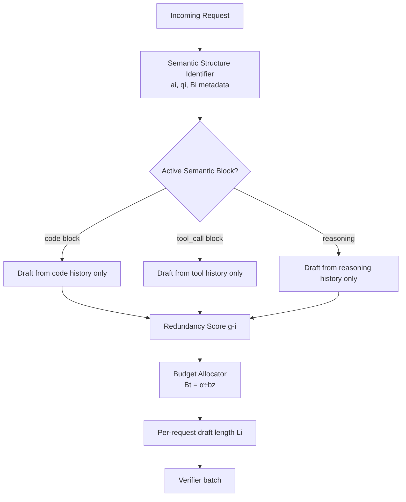

# Speculative Decoding Meets Agentic LLMs: How AsymSpec and AgentSpec Close the Tool-Use Inference Gap


Two papers accepted at EMNLP 2026 — AsymSpec[^1] (arXiv:2608.26004) and AgentSpec[^2] (arXiv:2608.24004) — attack the same root problem from opposite angles: as Codex CLI sessions deepen and tool outputs accumulate, inference latency and compute cost spiral upward. Standard speculative decoding can help, but it assumes both the drafter and verifier share an identical context window. In agentic pipelines, that assumption breaks badly.

## The Problem: Agentic Context Breaks Standard Speculative Decoding

Speculative decoding works by running a cheap drafter ahead of an expensive verifier. The verifier accepts or rejects the drafter's tokens in a single forward pass, yielding a net throughput gain when acceptance rates are high. The catch is that drafter and verifier must see the same input — which means neither can independently compress what it reads.

Agentic pipelines violate this constraint in two ways:

1. **Context inflation**: Each tool call appends both the invocation and its response to the history. Retrieval-augmented queries, MCP tool payloads, and multi-turn exchanges drive context lengths that make the verifier's full-context forward passes increasingly expensive.[^1]

2. **Batch-size degradation**: Production inference servers handle many concurrent agent sessions. At batch size 256, standard speculative decoding algorithms (NGram, SuffixDecoding, EAGLE-3) degrade below autoregressive throughput because their draft candidates come from a shared global history across requests — generating cross-query token predictions that are almost always rejected.[^2]

AsymSpec solves problem 1. AgentSpec solves problem 2.

## AsymSpec: Breaking the Symmetry Constraint

AsymSpec, from Huawei Technologies and the University of Science and Technology of China, keeps the drafter on the full uncompressed context while the verifier operates on a compressed view.[^1] The symmetry constraint is broken deliberately.



The drafter generates logits from both the full context (`a_i`) and the compressed context (`b_i`). The difference `δ_i = a_i − b_i` isolates context-induced shifts — the additional signal the drafter gains from reading the full history. On rejection, this delta steers the verifier:

```
d'_i = argmax(t_i + β · δ_i)
```

where `t_i` are the verifier's own logits and `β` controls injection strength.

A **Context-Divergence Acceptance (CDA) gate** adapts the acceptance threshold proportionally to the Jensen-Shannon divergence between full and compressed contexts:

```
γ_eff(i) = γ · exp(−D_i)
```

This relaxes strictness where divergence is high — exactly where the drafter has the most information the verifier lacks. No per-dataset hyperparameter tuning is required; bounds are `γ_eff ∈ [γ/2, γ]`.[^1]

### AsymSpec Results

| Benchmark | Floor | Ceiling | AsymSpec | Gap Closed |
|-----------|-------|---------|----------|------------|
| HotpotQA | 49.4% | 64.9% | 64.0% | 87% |
| API-Bank (tool use) | 57.7% | 66.1% | 63.5% | 94% |
| GAIA (agent loop) | 19.4% | 20.0% | 24.2% | >100% |
| MuSiQue | 32.7% | 55.0% | 48.4% | 70% |

Throughput gains are 1.3–1.7× at 0.2–0.3× the compute of running the verifier on full context.[^1] On GAIA's file-attachment subset — where agents read and reason over attached documents — AsymSpec reaches 31.6% against a ceiling of 23.7%, because the drafter extracts signal the compressed verifier view misses.

A critical implication for tool-use systems: the API-Bank tool-use task shows 94% gap closure. The drafter's access to full tool schemas lets it redirect the verifier toward schema-compliant output formats even when the verifier's compressed view lacks the schema definition. The paper's case study shows a `RecordHealthData` API call where δ-fusion preserves the correct `%Y-%m-%d %H:%M:%S` time format that exists only in the full specification.[^1]

**Constraint**: AsymSpec requires access to verifier logits — not available through proprietary APIs. It targets self-hosted inference stacks.

## AgentSpec: Agent-Aware Batch Inference in vLLM

AgentSpec, from Ohio State, Michigan, and Microsoft Research, targets the batch-size collapse that afflicts production serving.[^2] Its implementation lives in vLLM v0.12.0, making it immediately deployable for teams running local inference.

The core insight: repetition in agentic generation is structurally localised. Repeated token sequences within `<tool_call>...</tool_call>` blocks, code fences, or reasoning chains almost never span across queries or semantic block boundaries. Standard speculative decoding ignores this structure — it draws candidates from the entire shared history, generating mostly cross-boundary tokens that get rejected.



The **Pushdown Automaton (PDA)** tracks which semantic block is active per request, using delimiter pairs passed at inference time. For an agent with tool invocations:

```python
structure = [
    ("```python", "```"),
    ("<tool_call>", "</tool_call>"),
    ("<reasoning>", "</reasoning>")
]
```

The **redundancy-aware budget allocation** then distributes the dynamic token budget according to per-request acceptance likelihood:

```
g(c, n) = (c/n) · p(n)    # redundancy score
Li = max(|CT_i|, Bt · gi / Σgj)   # per-request draft length
```

where `c` is the count of continuations agreeing on the most frequent prefix, `n` is total candidate count, and `Bt = ⌊α/bz⌋` scales the global budget inversely with batch size.[^2]

### AgentSpec Results

| Model | Workload | Speedup | Tokens/sec |
|-------|----------|---------|-----------|
| GPT-OSS-20B | Code Generation | **2.02×** | 584.43 |
| GPT-OSS-20B | SWE-Bench | 1.69× | 595.20 |
| DeepSeek-Distill-8B | SWE-Bench | 1.59× | 2,281.87 |
| Qwen-3-8B | Code Generation | 1.30× | 828.10 |
| Qwen-3-8B | Deep Research | 1.07× | 661.43 |

The rejection rate drops from 50–85% (NGram/EAGLE-3) to 26.4%.[^2] Drafting overhead is less than 2 ms per batch — the PDA maintenance and redundancy scoring are negligible.

Crucially, AgentSpec maintains these gains at batch size 256 where competitors fall below 1.0× (slower than autoregressive). For SWE-bench workloads — the closest analogue to Codex-style repository-level coding tasks — GPT-OSS-20B shows 1.69× throughput.

## What This Means for Codex CLI Users

Codex CLI sends requests to OpenAI's inference infrastructure. Neither paper's techniques are directly accessible through the standard API today — both target self-hosted or infrastructure-layer deployments.[^1][^2] However, three practical takeaways apply now:

**1. Tool schema completeness reduces latency at your inference layer.** AsymSpec's central finding is that the drafter's full-schema access preserves format compliance at the verifier. When you design MCP server tool schemas — or write tool descriptions in `.codex/config.toml` — completeness of parameter descriptions, type annotations, and example values directly enables AsymSpec-style correction at the inference layer.[^3]

**2. Semantic delimiters matter for batch efficiency.** AgentSpec treats `<tool_call>` and code fences as structural boundaries. MCP tool responses that include clear delimiters around executable content (JSON bodies, file paths, command strings) help batch-level speculative decoding concentrate candidates within the right semantic block. This is already implicit in MCP's wire format — clean, delimited tool responses are also better for AgentSpec.[^3]

**3. Local inference via `provider_base_url`.** Teams running Codex CLI against local providers — Ollama, LM Studio, or vLLM endpoints — can enable AgentSpec directly on their vLLM v0.12.0 instance. The `provider_base_url` config key in `~/.config/codex/config.toml` routes requests to that endpoint:

```toml
[model]
provider = "openai"
name = "qwen3-8b"
provider_base_url = "http://localhost:8000/v1"
```

With AgentSpec deployed on that vLLM instance, Codex CLI sessions gain 1.3–1.59× throughput on SWE-bench-class coding tasks — without any change to CLI configuration beyond the URL.[^2]

## Gaps and Limitations

Neither approach is a drop-in replacement for hosted API access. AsymSpec requires verifier logit access — ruled out by OpenAI, Anthropic, and Google's APIs.[^1] AgentSpec requires vLLM infrastructure and semantic block metadata injection from the caller.[^2]

On accuracy: AsymSpec's MultiChallenge results (23.5% vs 23.4% floor) show that lossless compression leaves almost no room for δ-fusion gains. When the context compressor achieves high fidelity, the drafter's marginal contribution is minimal. ⚠️ The GAIA above-ceiling result (24.2% vs 20.0% ceiling) is an outlier driven by the drafter surfacing information the verifier's compressed view actively suppresses — it should not be expected to generalise universally.[^1]

AgentSpec's semantic structure identifier requires callers to inject block metadata at inference time. In vLLM deployments where the framework generates tool calls transparently (rather than the caller assembling the full prompt), this metadata may not be available without instrumentation.[^2]

## Conclusion

AsymSpec and AgentSpec each chip away at a different failure mode of applying speculative decoding to agentic workloads. AsymSpec breaks the context-symmetry assumption to preserve tool-schema compliance under compression; AgentSpec breaks the agent-agnostic assumption to keep batch-level acceptance rates high in production serving. Together they sketch the architectural pattern for low-latency, cost-efficient agentic inference — and both landed at EMNLP 2026 within 48 hours of each other, pointing to how seriously the inference community is taking the agent-specific optimisation problem.

## Citations

[^1]: Liang, S., Zhang, Y., Brian, N., Lv, H., Wang, H., Zhang, C., & Liu, Y. (2026). *AsymSpec: Context-Asymmetric Speculative Decoding for Agentic LLMs*. EMNLP 2026. arXiv:2608.26004. <https://arxiv.org/abs/2608.26004>

[^2]: Wang, X., Miao, Z., Zhu, Y., Shen, H., Wan, Z., Yang, F., & Zhang, M. (2026). *AgentSpec: Speculative Decoding for Batch Inference of LLM Agents*. EMNLP 2026. arXiv:2608.24004. <https://arxiv.org/abs/2608.24004>

[^3]: OpenAI. (2026). *Model Context Protocol integration — Codex CLI documentation*. <https://github.com/openai/codex>
