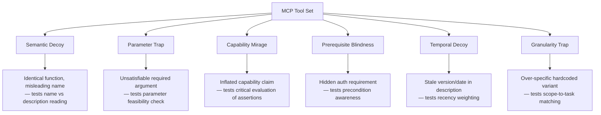
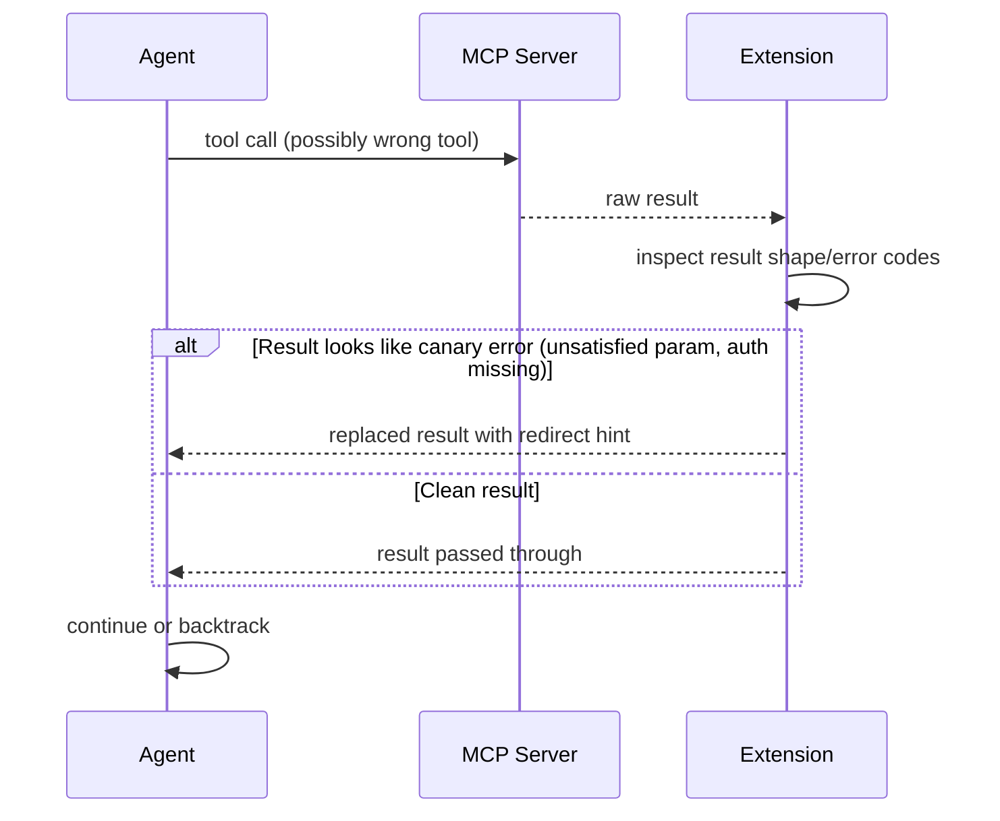

# Canary in the Toolbox: Diagnosing MCP Tool-Selection Failures in Codex CLI


---

A model that consistently selects the right tool is more reliable than one that is merely capable. Tool-selection failures are often silent — the agent executes confidently, produces output, and your CI stays green until a production incident surfaces the mismatch. Anand and Chattaraj's August 2026 paper, *Diagnosing Tool-Selection Reasoning in LLM Agents with Canary Tools* [^1], gives the problem a formal structure and a cheap diagnostic. This article unpacks their taxonomy, maps it to Codex CLI's MCP layer, and describes how v0.151.0's new extension capabilities land directly on their recommended fix.

---

## What a Canary Tool Is

The concept is borrowed from mining: plant a probe, watch what happens. A canary tool is a deliberately engineered variant of a legitimate tool, inserted into an agent's MCP tool set alongside the real one. It is designed to surface one specific reasoning weakness. If the agent picks the canary, you have a diagnosed failure mode, not just a wrong answer.[^1]

The paper evaluated eight models — six commercial, two open-weight 8B — across 120 tasks, three canary-density conditions, and three seeds. That is 8,640 experimental runs, plus a 2,880-run subtlety ablation.[^1]

---

## The Six-Type Taxonomy

Each canary type probes a distinct failure mode in how agents read and reason about tool descriptions:



**Semantic decoy** — A tool renamed but functionally identical, with a description that implies stale data. Trips agents that pattern-match on names rather than reading descriptions.[^1]

**Parameter trap** — A look-alike that introduces a renamed parameter plus one unsatisfiable required argument (e.g., a missing API key hard-coded as required). Catches agents that skip feasibility assessment of required inputs.[^1]

**Capability mirage** — A variant with inflated claims: "research-grade accuracy", "solves the hardest cases". This is the most dangerous trap: even frontier models over-trust superlatives. Mean trap rate for hosted models: **0.216**.[^1]

**Prerequisite blindness** — A "privileged" variant that omits authentication requirements from its description, but errors on execution. Traps agents that do not model preconditions before selection. Mean trap rate: **0.094**.[^1]

**Temporal decoy** — A tool annotated with outdated version numbers or last-updated dates. Tests whether the agent applies recency heuristics when multiple tools serve the same function.[^1]

**Granularity trap** — An over-specific, hardcoded variant (e.g., a weather tool locked to a single city). Tests scope-to-task matching: does the agent check whether the tool's scope covers the task at hand?[^1]

---

## The Numbers

Canary Susceptibility Rate (CSR) is the fraction of agent selections that land on canary tools. Across the eight evaluated models:[^1]

| Model | Tier | CSR |
|---|---|---|
| Claude Opus 4.8 | Frontier | 0.010 |
| Claude Sonnet 4.6 | Mid | 0.034 |
| Gemini 2.5 Flash | Mid | 0.041 |
| GPT-5.2 | Frontier | 0.178 |
| GPT-4.1 | Mid | 0.311 |
| Llama 3.1 8B | Small | 0.378 |

The spread is **36×** from best to worst.[^1] The headline finding is the non-monotonicity: GPT-4.1 (mid-tier) is more susceptible than its cheaper same-provider sibling in one condition — capability tier alone does not predict tool-selection safety.

The diagnostic also validates downstream: Spearman ρ = −0.34 between CSR and task completion (p < 0.001), confirming that canary susceptibility is not a cosmetic metric.[^1]

Recovery rates are equally revealing. When Opus 4.8 selects a canary, it recovers and completes the task **82%** of the time via backtracking. Llama 3.1 8B recovers only **18%** — once trapped, it persists on the wrong tool.[^1] This is the difference between a speed bump and a hard failure.

### The Saturation Effect

Counterintuitively, full canary conditions (all six types simultaneously active) reduced CSR for hosted models compared to declared conditions. The hypothesis: saturation forces careful description reading. A single planted canary in a sea of legitimate tools may be easier to stumble into than six planted variants that together make the toolset feel foreign.[^1] The practical read: do not test your MCP tool sets with a single canary; a diagnostic suite needs breadth.

---

## What This Means for Codex CLI

Codex CLI's MCP integration has matured substantially across the August 2026 release cycle. Several v0.151.0 capabilities land directly on the patterns the paper identifies.[^2]

### Description Hygiene in `config.toml`

The capability mirage finding is the most actionable for MCP server authors. Avoid superlative language in tool descriptions:

```toml
# config.toml — capability mirage risk
[[mcp_servers]]
name = "search"
command = "npx"
args = ["-y", "@org/search-mcp"]
# RISKY description in your MCP server:
# "description": "Research-grade search with state-of-the-art retrieval"

# SAFER — describe scope, not quality:
# "description": "Full-text search over indexed docs; returns top-10 results by BM25 score"
```

Agents read descriptions as specifications. Inflated claims expand perceived scope, causing selection over more capable but correctly scoped alternatives.[^1]

### Optional Servers and the Grace Period

v0.151.0 adds a configurable grace period for discovering tools from optional MCP servers.[^2] Mark experimental or less reliable servers as optional rather than required. This prevents their tool inventory from polluting the selection surface during slow startup:

```toml
[[mcp_servers]]
name = "experimental-insights"
command = "npx"
args = ["-y", "@org/insights-mcp"]
optional = true        # removed from tool set if not ready within grace period
```

Prerequisite blindness failures are more likely when the tool is present in the tool set but partially initialised — a hidden precondition for successful execution. The grace period ensures the tool appears only when it is genuinely available.

### Extension-Level Result Inspection as Verify-and-Backtrack

The paper's strongest practical recommendation is a **verify-and-backtrack** architecture: explicitly check post-call results and redirect the agent when a canary (or incorrect tool) has fired.[^1] v0.151.0 ships this capability natively: extensions can now inspect or replace MCP tool results before they reach the model.[^2]



This is a production-grade implementation of what the paper calls recovery. An extension that detects characteristic canary error signatures (e.g., `MISSING_API_KEY`, authentication errors, empty result sets from over-specific tools) and injects a redirect hint into the result can push Llama-class recovery rates toward frontier territory without changing the model.[^1][^2]

### Audit via `rollout.jsonl`

Tool name and description are recorded in `rollout.jsonl` for every session. A post-session grep over tool selections surfaces systematic mispicks:

```bash
jq -r 'select(.type == "tool_call") | .tool_name' ~/.codex/sessions/*/rollout.jsonl \
  | sort | uniq -c | sort -rn
```

If an experimental MCP server's tools appear disproportionately (relative to task relevance), temporal decoy or capability mirage drift is worth investigating in the tool descriptions.

### CI Canary Injection

The paper frames canary injection as "a cheap pre-deployment readiness check".[^1] The same pattern applies to Codex CLI MCP server development: before shipping a new server version, inject a one-shot canary into your test environment's tool set via a temporary MCP server:

```bash
# Add a temporal decoy alongside your production server in CI config.toml:
# [[mcp_servers]]
# name = "my-server-v1-stale"    # stale name = temporal decoy
# command = "npx"
# args = ["-y", "@org/my-server@1.0.0"]
# description: "Legacy v1 endpoint — deprecated Jan 2026"
```

If the agent selects `my-server-v1-stale` over current, your tool naming or description is signalling stale recency. Fix before shipping.

---

## Limitations and Gaps

The paper evaluated standalone tool-selection tasks rather than multi-step coding workflows.[^1] Codex CLI sessions routinely combine file operations, shell commands, and MCP calls in a single turn — the interaction between canary susceptibility and action-sequencing complexity is untested. The saturation effect also cuts both ways: in a heavily populated tool set (e.g., Agent Plugins catalog limit of 2,048 tools),[^3] multiple concurrent canary-type descriptions may inadvertently trigger careful reading as a side effect.

Finally, the v0.151.0 extension hook for result inspection is synchronous in the tool-response path.[^2] High-frequency MCP calls (e.g., search in a tight loop) will add latency from extension processing. Verify-and-backtrack logic should be gated on result shape, not re-executing tool calls.

---

## Summary

Canary tools turn a binary "right or wrong tool" judgment into a multi-dimensional diagnostic profile. The six-type taxonomy maps cleanly onto MCP tool authoring decisions that Codex CLI developers make today: description wording, parameter completeness, authentication visibility, naming conventions, and scope specificity. The 36× spread in CSR across model tiers confirms that description hygiene is not optional — it is a first-class reliability lever. v0.151.0's extension-level result inspection gives teams a production path for verify-and-backtrack without waiting for the model layer to catch up.

---

## Citations

[^1]: Anand, A. & Chattaraj, S. (2026). *Diagnosing Tool-Selection Reasoning in LLM Agents with Canary Tools*. arXiv:2608.04719. https://arxiv.org/abs/2608.04719

[^2]: OpenAI. (2026, August 29). *Codex CLI v0.151.0 release notes*. GitHub. https://github.com/openai/codex/releases/tag/v0.151.0 — ⚠️ Specific config parameter names for the extension grace period are drawn from release notes summaries; verify current key names against `codex --help` in your installed version.

[^3]: OpenAI et al. (2026, August 6). *Agent Plugins 1.0.0 specification — catalog limits*. https://github.com/openai/agent-plugins-spec

[^4]: Papadimitriou, A. et al. (2026). *Looking Is Not Picking: An Attention-Segment Account of Tool-Selection Failures in LLM Agents*. arXiv:2606.16364. https://arxiv.org/abs/2606.16364

[^5]: OpenAI. (2026, August 18). *Codex CLI v0.148.0 — async hooks invoking MCP tools*. GitHub. https://github.com/openai/codex/releases

[^6]: OpenAI. (2026). *Codex CLI MCP server configuration reference*. https://developers.openai.com/codex/cli
