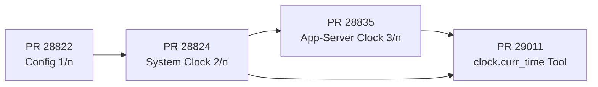
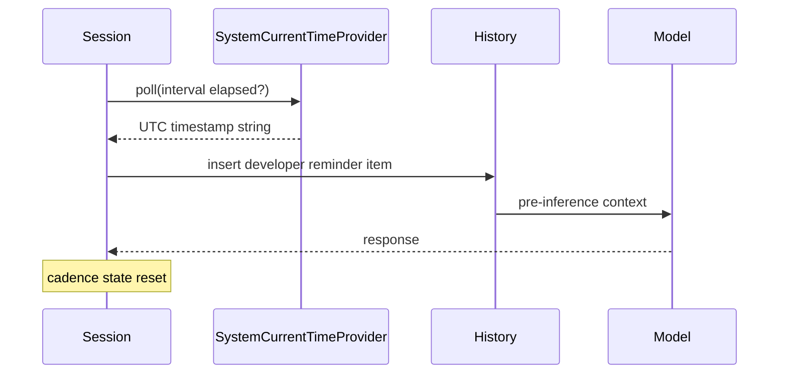

# Giving Codex CLI a Clock: Time-Reminder Architecture, the clock.curr_time Tool, and the Timezone Trap


LLM agents are temporally blind by default. Their training data ends at a cutoff; they receive no wall-clock signal at inference time; and every token of their session context is equally "now" regardless of when it was written. For most stateless tasks this barely matters. For anything that touches scheduling, deadlines, cron automations, daily reports, deploy timing, or date-relative prompts ("fix all tickets opened *this week*"), it matters a great deal.

Codex CLI's 0.151.0 alpha series is landing a four-PR answer to this problem: a `CurrentTimeProvider` architecture that injects UTC reminders into the model's history on a configurable cadence, a protocol for external (app-server) clock delegation, and an on-demand `clock.curr_time` tool the model can call directly.[^1][^2][^3][^4] Here is how it works, how to configure it, and where the sharp edges remain.

## Why Agents Cannot Be Trusted to Know the Time

A Codex CLI session has no ambient clock. The model may infer an approximate date from context it has seen — changelog mentions, file timestamps, conversation metadata — but this inference is unreliable and the model cannot distinguish between "the repo was last touched six months ago" and "we are having this conversation six months ago."

The practical failures this causes are well-documented. Relative date phrases such as "today", "tomorrow", and "yesterday" resolve against whatever date the model happens to believe it is.[^5] Cron expressions authored by the model drift from intent when the model's assumed date is off by even half a day. A GitHub issue tracker open at 9 PM PDT on 4 June looks, to the model, like it is already 5 June UTC — one documented class of bugs Codex Desktop shipped before this fix.[^5]

The deeper problem is that injecting the current date manually via the user prompt is fragile: it only covers the first turn, it requires the operator to remember, and it survives neither context compaction nor multi-agent subagent spawning.

## The Four-PR Architecture

The implementation landed in four pull requests, all merged June 2026 and shipping in the 0.151.0 alpha line.[^1][^2][^3][^4]



### PR #28822 — Configuration Infrastructure

The first PR adds the `[features.current_time_reminder]` table to `config.toml`.[^1] Three fields:

```toml
[features.current_time_reminder]
enabled = true
reminder_interval_model_requests = 1
clock_source = "system"
```

- **`enabled`** — feature gate; defaults off.
- **`reminder_interval_model_requests`** — how many model requests between reminder injections. Setting `1` means every request receives a fresh timestamp; larger values reduce noise in long conversations.
- **`clock_source`** — `"system"` (default) or `"external"` (app-server delegated, see below).

### PR #28824 — System Clock Implementation

The second PR implements the `CurrentTimeProvider` trait and its `SystemCurrentTimeProvider`.[^2] The injection mechanism works as follows:



Critically, the reminder is written as a *developer role* history item — not a user message, not a system prompt insertion. This means it survives subsequent turns as a persistent fact in the conversation record. The cadence state resets to zero after each injection, and a **forced refresh occurs after every compaction event** — the one moment the time context would otherwise be silently dropped.[^2]

Reminder text format: `"Current time: YYYY-MM-DD HH:MM:SS UTC"`. Deliberately minimal; no timezone localisation at this layer (see caveats below).

### PR #28835 — App-Server External Clock

For sessions driven through `codex app-server`, the `clock_source = "external"` setting delegates time queries to the connected client rather than reading the local system clock.[^3] The JSON-RPC 2.0 exchange is:

```json
// Server → Client
{
  "id": 42,
  "method": "currentTime/read",
  "params": { "threadId": "11111111-1111-1111-1111-aaaaafdc2c11" }
}

// Client → Server
{
  "id": 42,
  "result": { "currentTimeAt": 1781717655 }
}
```

`currentTimeAt` is a Unix epoch integer (seconds). The server converts it to the same UTC reminder string format used by the system clock path.

This is marked **experimental** — the protocol may change before stable release.[^3] The implementation enforces a single-client constraint: multiple app-server clients on the same thread represent an unsupported configuration. For subagent threads created asynchronously, the implementation waits for subscriber attachment before the inference pipeline attempts a time read, avoiding a race condition that would otherwise cause fatal failures.

### PR #29011 — The `clock.curr_time` Tool

The final PR exposes a callable tool when the feature is enabled.[^4] The model can invoke `clock.curr_time` at any point during a turn — not only at pre-inference injection time — and receive the configured provider's current value.

In code mode, the tool returns structured output:

```json
{ "current_time": "2026-08-29 14:32:07 UTC" }
```

In standard mode it returns the existing UTC reminder text directly. Clock lookup failures remain fatal errors rather than graceful degradations, matching the behaviour of the pre-inference injection path. This design choice is deliberate: silent time failures are worse than visible crashes in scheduling and deadline contexts.

## Configuration in Practice

A minimal always-on setup in `~/.config/codex/config.toml`:

```toml
[features.current_time_reminder]
enabled = true
reminder_interval_model_requests = 5
clock_source = "system"
```

`interval = 5` is a reasonable default for most interactive sessions — the model receives a refresh every five model requests without cluttering the context on every short exchange.

For app-server integrations where the client controls the authoritative clock (e.g., a deployment pipeline that needs to inject the pipeline's scheduled start time rather than the server's wall clock):

```toml
[features.current_time_reminder]
enabled = true
reminder_interval_model_requests = 1
clock_source = "external"
```

Your app-server client must then handle `currentTime/read` RPC calls and return a Unix epoch value.

## AGENTS.md Implications

With time reminders enabled, you can safely write time-relative instructions in `AGENTS.md`:

```markdown
## Temporal Conventions
- All deadlines in this repository are in UTC.
- "This sprint" means the 14-day period ending on the next even Friday.
- If asked to schedule a task, confirm the current time via clock.curr_time before committing to a slot.
```

Without the feature enabled, these instructions are aspirational at best. With it enabled, the model receives a grounded UTC timestamp before every model request and can invoke `clock.curr_time` to double-check mid-turn.

For multi-agent sessions (`multi_agent_v2`), subagents inherit the parent's time provider configuration. The subscriber-wait mechanism in PR #28835 ensures subagent threads do not race the clock attachment even when spawned asynchronously.[^3]

## The Timezone Trap

UTC-only reminders solve the *temporal grounding* problem but introduce a different one: **timezone mismatch**. Codex Desktop's existing date injection already demonstrates this failure mode.[^5] A session running at 22:00 PDT receives a reminder that the current time is 05:00 UTC the next day. When the user says "schedule the deploy for tomorrow morning", the model resolves "tomorrow" against the UTC date — a full day ahead of local intent.

The implementation as shipped does not include timezone localisation. The reminder string is always UTC. For operators in non-UTC timezones running scheduling or calendar-adjacent workflows, the correct mitigation is:

1. Set your `AGENTS.md` to declare the authoritative timezone explicitly.
2. Use `clock_source = "external"` and have your app-server client inject a timezone-adjusted timestamp — the client can convert `currentTimeAt` to local ISO-8601 before the server formats the reminder.
3. Add explicit AGENTS.md instructions: "Interpret all time references in `Europe/London` unless otherwise stated."

Option 2 is the only architectural solution; options 1 and 3 are prompt-engineering mitigations.

## Current Limitations

The feature is **alpha-only** as of v0.151.0-alpha.12 (29 August 2026). It is not available in the v0.150.x stable channel.[^1]

Additional gaps:

- No timezone field in the `CurrentTimeReminderConfig` — UTC is hardcoded in the system clock path.
- `reminder_interval_model_requests` is a flat integer, not a wall-time duration; a very long-running agent at `interval = 5` could go many real-world hours between refreshes if it uses few model requests.
- The `clock.curr_time` tool is only exposed when the feature is enabled; there is no lightweight fallback for sessions without the config change.
- Hook scripts (`PreToolUse`, `PostToolUse`) receive the hook payload JSON but no `current_time` field — you cannot use shell hooks as a time-injection mechanism without invoking `date` separately.

## Summary

The `CurrentTimeProvider` architecture solves a real and underappreciated failure mode in agentic workflows. The three-tier design — config gate, injection cadence, on-demand tool — gives operators meaningful control over the cost/accuracy tradeoff. The app-server external clock path is the right foundation for production scheduling pipelines where the authoritative clock should be the pipeline scheduler, not the Codex process's wall clock.

What remains unfinished is timezone-aware localisation. Until that lands, treat UTC reminders as *necessary but not sufficient* for any workflow where "today" and "tomorrow" are load-bearing concepts.

## Citations

[^1]: OpenAI, "Add Config for Time Reminders (1/n)", PR #28822, github.com/openai/codex, merged June 2026. <https://github.com/openai/codex/pull/28822>
[^2]: OpenAI (rka-oai), "current time reminders impl for system clock (2/n)", PR #28824, github.com/openai/codex, merged June 2026. <https://github.com/openai/codex/pull/28824>
[^3]: OpenAI (rka-oai), "Add app-server current-time impl (3/n)", PR #28835, github.com/openai/codex, merged June 2026. <https://github.com/openai/codex/pull/28835>
[^4]: OpenAI (rka-oai), "[codex] add clock current-time tool", PR #29011, github.com/openai/codex, merged June 2026. <https://github.com/openai/codex/pull/29011>
[^5]: OpenAI community, "Codex Desktop injects UTC current date despite America/Los_Angeles timezone", Issue #26524, github.com/openai/codex. <https://github.com/openai/codex/issues/26524>
