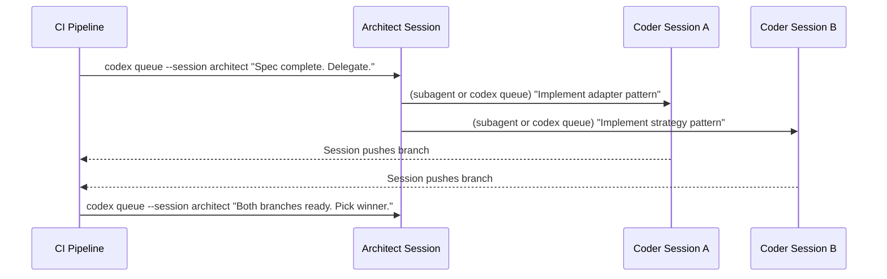
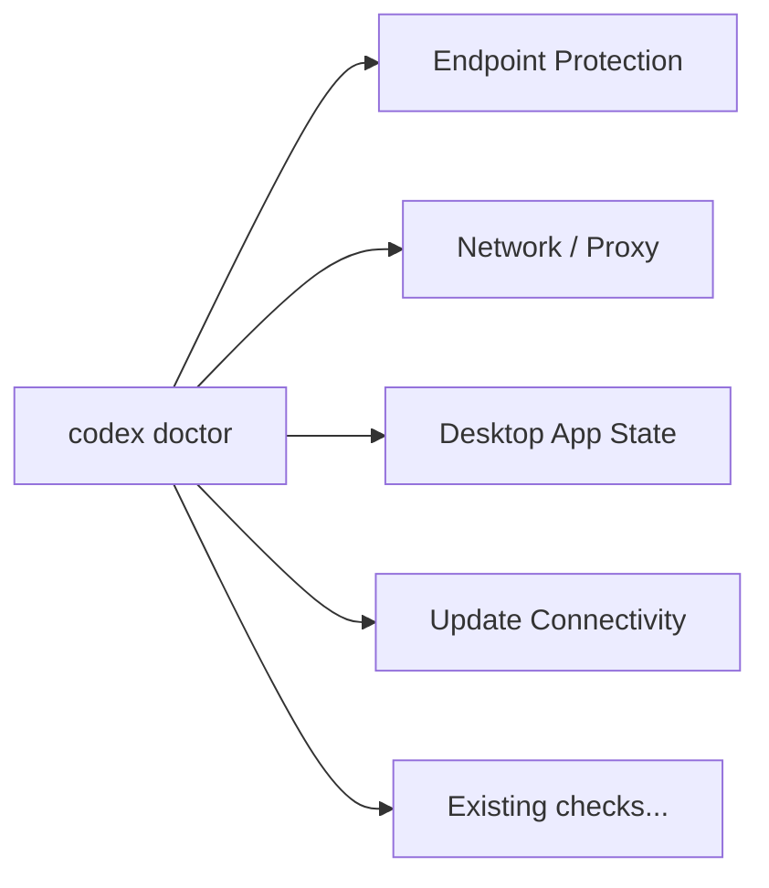

# Codex CLI v0.149.0: The Multi-Session Upgrade — agents Dashboard, codex queue, and Working Directory Commands


Released on 20 August 2026, Codex CLI v0.149.0 is the release that turns isolated sessions into a coordinated fleet.[^1] Three interconnected additions — the `codex agents` dashboard, the `codex queue` cross-session messaging primitive, and the `/cd`/`/pwd`/`/cwd` TUI working directory commands — address a real operational gap: running multiple concurrent agent sessions without losing the thread. This article covers all three, plus SDK reasoning effort options and `codex doctor` expansions introduced in the same release.

## The Problem v0.149.0 Solves

Before this release, Codex CLI sessions were effectively islands. You could run multiple agents in parallel windows, but there was no first-class way to:

- See all running sessions in one place without leaving the current TUI
- Send a message from a CI job or script into an already-running session
- Redirect a session at a different directory without restarting it and losing context

The result was that multi-session patterns — coder/architect splits, parallel implementation variants, background long-running agents — required ad-hoc glue: shell scripts polling session state, copying messages by hand, or relying on subagent orchestration for tasks that didn't justify full task-tree overhead.

v0.149.0 adds the missing glue at the CLI level.

## The `codex agents` Dashboard

The new `codex agents` command launches a full-screen interactive dashboard listing all root sessions on the shared local app server.[^1] You can reach it in two ways:

```bash
# From a terminal
codex agents

# From inside a running Codex TUI
/agents
```

The default keyboard shortcut is `Alt+A`.[^2] It can be remapped via the keymap configuration, and the system disables the default when it would conflict with an existing custom binding, so you won't silently lose a shortcut you've already set.

Within the dashboard, the core operations are:

| Action | Description |
|--------|-------------|
| Search | Filter sessions by name or project — essential once you have more than a handful |
| Start  | Launch a new session without leaving the dashboard |
| Open   | Jump into an existing session's TUI |
| Rename | Update a session title for clarity |
| Stop   | Terminate a session directly |

Sessions are grouped by project or status, and subagent status is surfaced inline so you can see whether a session's child agents are active without drilling in.

### Configuration

Dashboard shortcut binding lives in `~/.codex/config.toml` under the keymap context:

```toml
[tui.keymap.global]
open_agents = "alt-a"   # default; remap as needed

[tui.keymap.agents]
# dashboard-specific bindings
search      = "/"
new_task    = "n"
rename      = "r"
stop        = "ctrl-d"
```

## The `codex queue` Command

`codex queue` sends a message to an existing local or remote session from *outside* that session.[^1] The canonical use case is CI/CD: a pipeline job that doesn't want to create a new agent session from scratch but needs to feed instructions into an agent that's already holding project context.

### Basic Usage

```bash
# By session name
codex queue --session my-refactor "The migration tests are green. Proceed with the schema change."

# By UUID (safer in scripts — no ambiguity)
codex queue --session "3f2b1c4a-..." "LGTM. Deploy to staging."

# Load a long prompt from a file
codex queue --session coder-backend --text-file /tmp/spec.md

# Remote session
codex queue --session my-refactor --remote wss://ci-host:7432 "Ready to merge."
```

### Session Resolution and Validation

The resolution model is strict by design:[^3]

- Sessions are matched by UUID or **exact** name. Partial or substring matches are rejected.
- If multiple sessions share the same name, the command fails rather than silently targeting one. This prevents misdirected messages in shared environments.
- Incompatible server configurations are reported explicitly — the command will not silently reroute to a different target.
- Empty messages and image attachments are rejected at validation time.

### Delivery Semantics

v0.149.0 fixes three reliability issues that made the previous queuing mechanisms fragile:[^1]

1. **Idle wake-up.** If the target session has finished its last turn and is waiting, a queued message reliably activates it and starts a new turn.
2. **Mid-turn queueing.** If the agent is currently processing, the message waits in queue and appears as the next user turn once the current one completes — no turn is interrupted.
3. **Permission restoration.** Resumed or forked sessions correctly restore their permission profile before processing queued input.

### Multi-Session Orchestration Patterns



For fork-based parallel variants (introduced in v0.148.0), `codex queue` pairs naturally with `codex exec fork`:

```bash
# Create two variants from the same base
codex exec fork --session my-task --fork-name variant-a
codex exec fork --session my-task --fork-name variant-b

# Feed different implementations to each
codex queue --session variant-a "Implement the adapter pattern"
codex queue --session variant-b "Implement the strategy pattern"
```

Security note: queued messages inherit the target session's existing permission profile. No permission escalation occurs via the queue path.[^4]

## Working Directory Commands: `/cd`, `/pwd`, `/cwd`

Three new TUI slash commands address a mundane but frequently painful limitation: once you start a session in a directory, you're stuck there unless you restart.[^1]

```text
/pwd           # Print the session's current working directory
/cwd           # Synonym for /pwd
/cd path       # Change the session's working directory
```

The immediate use case is monorepos. If you start a session at the repo root while debugging a backend issue, then discover the fix requires touching the frontend package, `/cd packages/frontend` redirects the session without destroying the existing conversation context.

```bash
# Inside Codex TUI
/pwd
# → /home/user/my-monorepo

/cd packages/auth
# → Changed working directory to /home/user/my-monorepo/packages/auth

/cd ../api
# Relative paths work; resolves to /home/user/my-monorepo/packages/api
```

Note that the session's **context** — the conversation history, permission profile, loaded AGENTS.md files, and active MCP servers — is preserved across a `/cd`. What changes is only the base directory that relative file paths and shell commands resolve against.

## SDK Enhancements: `max` and `ultra` Reasoning Effort

v0.149.0 extends the SDK surface for programmatic Codex CLI usage.[^1] SDK callers can now pass exact CLI configuration overrides and select `max` or `ultra` reasoning effort levels:

```typescript
import { CodexClient } from "@openai/codex";

const client = new CodexClient({
  model: "o4-pro",
  reasoningEffort: "ultra",   // "low" | "medium" | "high" | "max" | "ultra"
  configOverrides: {
    approval_policy: "on-failure",
    sandbox: { network: "off" }
  }
});
```

`ultra` maps to the highest reasoning budget the selected model supports — useful for architectural tasks where token cost is secondary to correctness.[^5] `max` is equivalent to the `high` effort level with additional reasoning steps enabled on supported models.

## Expanded `codex doctor` Diagnostics

`codex doctor` gains four new check categories in v0.149.0:[^1]



| Check | What It Validates |
|-------|-------------------|
| Endpoint protection | Confirms the selected API endpoint is reachable and authenticated |
| Network/proxy failures | Detects proxy misconfigurations that silently drop MCP or app-server connections |
| Desktop app state | Verifies the shared app server daemon is running and responsive |
| Update connectivity | Checks whether the CLI can reach the update channel (catches air-gapped environments before a session starts) |

Run `codex doctor --verbose` to see the raw check output. In CI environments where the desktop app is absent, `codex doctor` now correctly suppresses the desktop-app checks rather than reporting false failures.

## What This Release Means for Workflow Design

```mermaid
graph TD
    A[codex agents dashboard] -->|visibility| B[All sessions in one view]
    C[codex queue] -->|coordination| D[CI/scripts feed running sessions]
    E[/cd /pwd /cwd] -->|flexibility| F[Redirect session without restart]
    B --> G[Multi-agent fleet management]
    D --> G
    F --> G
```

v0.149.0 is less about new agent capabilities and more about operational maturity. Once you routinely run three or more concurrent Codex sessions — which is normal at o4-mini throughput costs — the absence of a session overview and cross-session messaging becomes a genuine friction point. This release removes that friction without requiring subagent overhead for simple coordination tasks.

The `codex queue` primitive in particular opens up event-driven patterns: a CI webhook can feed test results into a running refactor session; a cron job can inject a daily summary into a long-running background agent; a separate terminal can deliver corrective input to a session that's going off-track without interrupting its current turn.

## Citations

[^1]: OpenAI. "Release 0.149.0." GitHub. 20 August 2026. <https://github.com/openai/codex/releases/tag/rust-v0.149.0>

[^2]: openai/codex. "Add configurable shortcuts for the agents dashboard." Pull Request #39142. GitHub. <https://github.com/openai/codex/pull/39142>

[^3]: openai/codex. "Add a command to queue messages for existing sessions." Pull Request #39092. GitHub. <https://github.com/openai/codex/pull/39092>

[^4]: Vaughan, Daniel. "codex queue and Inter-Session Messaging: What v0.149.0's New Primitive Means for Orchestration and Automation." Codex Knowledge Base. 21 August 2026. <https://codex.danielvaughan.com/2026/08/21/codex-queue-inter-session-messaging-codex-cli-v0149-orchestration-automation-agent-to-agent/>

[^5]: OpenAI. "Codex CLI 0.149.0: Task Dashboard Explained." Get Claude Skills. 2026. <https://www.getclaudeskills.com/blog/codex-cli-task-dashboard-0-149-0>
