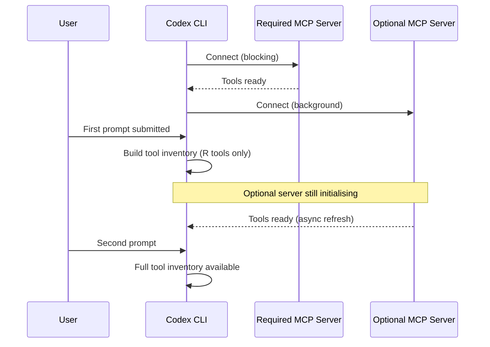
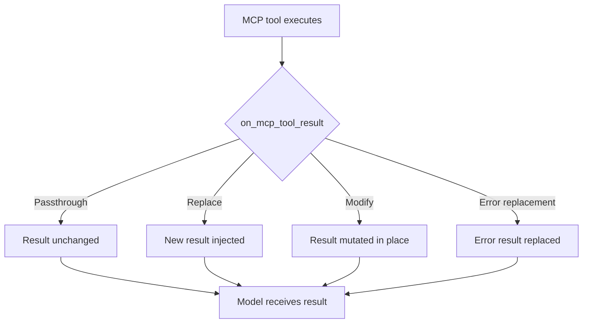

# Codex CLI v0.151.0: MCP Tool Result Middleware and the Optional-Server Grace Period


Codex CLI v0.151.0, released on 29 August 2026, ships two complementary MCP reliability improvements that address problems at opposite ends of the tool lifecycle.[^1] The first — a configurable grace period for optional MCP servers — fixes a long-standing startup bottleneck that caused the first turn to block while slow or unreachable servers finished initialising. The second — a new `on_mcp_tool_result` hook in the extension API — gives extensions a middleware slot between tool execution and model consumption, enabling result inspection, sanitisation, enrichment, and replacement. Together they close the reliability gap for production MCP deployments that depend on heterogeneous server fleets.

## The Blocking Problem

Issue #21318 documented the root cause precisely: Codex modelled MCP as an eager global tool inventory that had to be fully known before tool construction.[^2] With a single fast server this was unnoticeable. With six project-scoped servers accumulating 156 tools, startup times of 1.78–5.03 seconds per server were measured — all serialised before the first prompt could be submitted. Optional servers marked as non-critical received no preferential treatment; a slow database introspection server could delay the entire session just as effectively as a required one.

The practical consequence was that teams managing rich MCP stacks — an LSP server, a GitHub integration, a Jira connector, an internal API gateway, a Postgres introspection server, and a documentation indexer — were waiting 10–30 seconds on cold starts regardless of which tools the forthcoming task would actually use.

## The Grace Period Solution

PR #41199 decouples optional MCP server initialisation from first-turn readiness.[^1] The implementation retains blocking behaviour exclusively for servers that are explicitly marked `required = true`; all other servers enter a background discovery phase and refresh the tool inventory incrementally as they complete.

Configuration is in `~/.codex/config.toml` or the project-level override:

```toml
[mcp_servers.postgres-introspect]
command = "npx"
args = ["-y", "@modelcontextprotocol/server-postgres", "postgresql://localhost/mydb"]
required = false                    # opt-in to background discovery
grace_period_sec = 8                # override the default (no default specified in docs)

[mcp_servers.github]
command = "npx"
args = ["-y", "@modelcontextprotocol/server-github"]
required = true                     # blocks first turn — tools guaranteed at prompt submission
```

The model sees whichever tools are ready at the point of first prompt submission. As background servers finish negotiating, the tool inventory is refreshed and becomes available from the next turn onward. The TUI surfaces pending server state without blocking interaction, so the developer knows which tools are still coming online.



The practical implication is that your session is interactive immediately, and tools from slow servers become available without restarting. For servers that fail entirely — because an OAuth token has expired or a remote endpoint is down — the grace period expires silently and the server is surfaced in `codex doctor` output rather than blocking the session.

## Extension MCP Tool Result Middleware

PR #41202 adds `ToolLifecycleContributor::on_mcp_tool_result` to the extension API.[^1] This hook runs at two points in the result lifecycle: before publishing MCP completion events, and before preparing results for model consumption. An extension contributor receives the executed MCP tool context, the rewritten arguments, the extension's own data stores, and a mutable handle on the server result.

The hook supports four result paths:



**Passthrough** — the contributor returns `None` (or the equivalent unit variant) and the result is forwarded as-is. This is the correct default for contributors that only need to observe without modifying.

**Replacement** — the contributor returns a new `McpToolResult` value. The original is discarded. Use this for normalisation (stripping PII before the model sees it), enrichment (appending structured context the tool omitted), or security filtering (replacing results that contain credentials or internal hostnames).

**In-place mutation** — the contributor modifies the mutable result reference. Prefer this over replacement when only a field or two needs adjusting to avoid reconstructing large payloads.

**Error replacement** — successful results and error results are both interceptable. An extension can replace a cryptic upstream error with a structured diagnostic that helps the model recover rather than failing the turn.

### Practical Use Cases

**Credential scrubbing.** A database introspection tool that returns connection strings in error messages can have those strings redacted before the model sees them. A hook that applies the same regex patterns as your DLP policy closes the gap between what the MCP server emits and what you want in the model's context window.

**Response normalisation.** REST-backed MCP servers frequently return inconsistent field naming or nesting across API versions. A middleware extension can canonicalise the structure so AGENTS.md instructions and subsequent tool calls operate on a stable schema.

**Latency injection for testing.** During load testing of multi-agent workflows, a hook that artificially delays specific tool results helps characterise how the agent handles slow downstream dependencies without spinning up a real degraded environment.

**Audit sinks.** The `on_mcp_tool_result` hook fires before the result reaches the model, making it an appropriate interception point for writing tool outputs to an append-only audit log. Combined with the existing `PostToolUse` hook (which fires after native shell tools), this closes the logging gap for MCP-sourced results.

### Extension Structure

Extensions implementing `ToolLifecycleContributor` wire into the existing plugin manifest format introduced in v0.147.0:[^3]

```toml
# .codex/plugins/result-scrubber/plugin.toml
name = "result-scrubber"
version = "1.0.0"
description = "Redacts credentials and internal hostnames from MCP tool results"

[contributor]
type = "tool_lifecycle"
entry = "scrubber.wasm"          # or a Node/Python entry point per the plugin runtime
hooks = ["on_mcp_tool_result"]
```

The hook receives a typed context object; the exact schema is in the extension SDK reference.[^1] Because the hook is synchronous within the result pipeline, contributors should avoid I/O-heavy operations — offload to an async PostToolUse hook if you need to write to a remote audit service.

## Supporting Reliability Fixes

v0.151.0 ships several fixes that harden the broader execution model alongside the two headline features.

**Guardian stale classification fix (PR #41196).** The Guardian auto-review subagent caches risk classifications to avoid re-evaluating identical tool invocations. The fix prevents a stale classification from authorising an action whose risk profile changed because the session's permission state changed mid-task — for example, after a `requirements.toml` policy update or a manual approval-mode switch.[^1]

**Permission profile preservation (PR #41192).** Restored permission profiles were not persisted across TUI turns, meaning `/cd` could silently weaken sandbox restrictions by resetting the profile to defaults. This is fixed: the active profile is now carried through the turn boundary correctly.[^1]

**Nested subagent token accounting (PR #41183).** Token usage from nested subagents was not counted toward the root goal budget, meaning a multi-tier delegation tree could consume far more tokens than the configured `limit_tokens` for the rollout budget. Usage now aggregates from child to parent correctly.[^1]

**Sandbox executor home directory (PRs #41196, #41204, #41207, #41209).** Remote executor sandboxing now resolves the executor's actual home directory and operating system conventions rather than assuming a fixed path, fixing permission enforcement for non-default home configurations on Linux and macOS remote executors.[^1]

## Deployment Checklist

Upgrading to v0.151.0:

```bash
npm install -g @openai/codex@latest
codex --version    # confirm 0.151.0
codex doctor       # surfaces any MCP servers that failed during the grace period
```

For teams adopting the grace period:

1. Audit `config.toml` and mark only genuinely blocking servers as `required = true`.
2. Set `grace_period_sec` conservatively for servers with known slow cold-start times (OAuth flows, heavy schema introspection).
3. Use `codex doctor` output after session start to verify which optional servers connected successfully.

For extension authors adopting `on_mcp_tool_result`:

1. Default to passthrough — only intercept results you need to modify.
2. Keep the hook synchronous and fast — defer I/O to async hooks.
3. Test error-path interception explicitly; error results follow a different type branch than success results.

## Summary

The optional-server grace period and the MCP tool result hook address two distinct reliability failure modes: slow startup blocking interactive sessions, and uncontrolled tool output reaching the model. Both are production concerns that grow in severity as MCP server fleets expand. v0.151.0 makes the first turn reliably fast regardless of server fleet size, and gives extensions a principled interception point for everything a server emits.

## Citations

[^1]: OpenAI, "Release 0.151.0," GitHub, 29 August 2026. https://github.com/openai/codex/releases/tag/rust-v0.151.0

[^2]: OpenAI Codex Issue #21318, "MCP startup/tool discovery can block first turn when many MCP servers are configured," GitHub, 2026. https://github.com/openai/codex/issues/21318

[^3]: OpenAI, "Release 0.147.0 — Portable Agent Plugins, Multi-Catalog Federation, and the --approve-for-me Flag," Codex Knowledge Base, 10 August 2026. https://codex.danielvaughan.com/2026/08/10/codex-cli-v0147-portable-agent-plugins-multi-catalog-federation-approve-for-me-conversation-sections/
