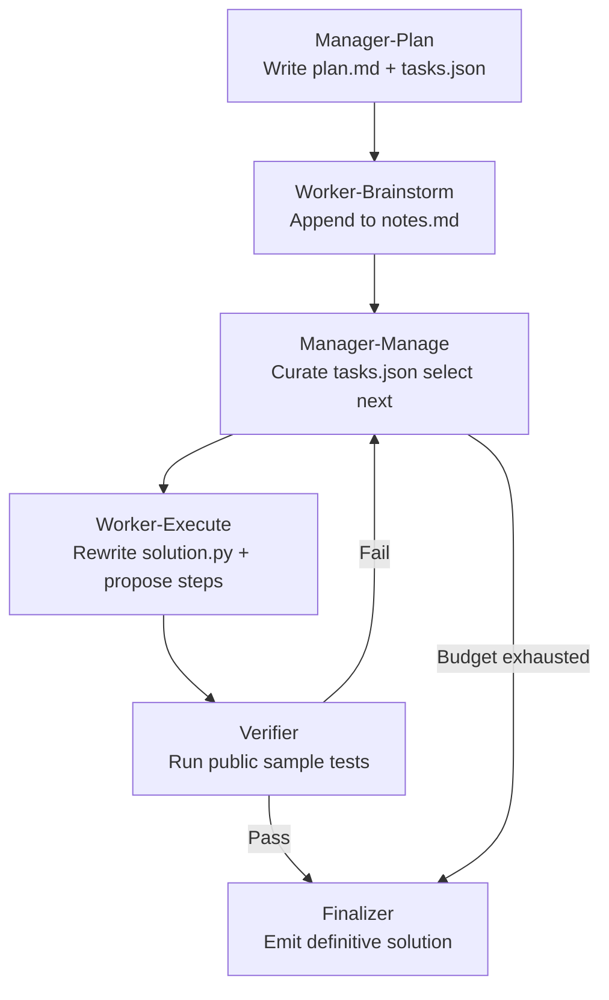

# Ledger-Based Self-Orchestration: What a Shared Filesystem Workspace Does for Parallel Coding Agents


A new preprint dropped 27 August 2026 that deserves attention from anyone running multi-agent Codex CLI workflows.[^1] "Zero-Shot Self-Orchestration with Ledger-Based Control for Improved LLM Coding Performance" by Victor Gao et al. runs nine frontier and open-weight models through 100 hard LiveCodeBench problems under two conditions: single-call baseline versus a zero-shot manager-worker scaffold that externalises coordination into a shared filesystem workspace. The gains are real, conditional, and directly map to primitives already present in Codex CLI's multi_agent_v2 configuration.

## The Core Idea: Externalise the Working Memory

The paper's central observation is that coding models collapse under three compounding pressures: finite context windows, poor self-organisation under long reasoning budgets, and the inability to hand state off between invocations. The proposed fix is architectural rather than training-based — externalise all intermediate state into a five-file ledger on disk.[^1]

The ledger schema is deliberately minimal:

| File | Role |
|---|---|
| `task.md` | Verbatim problem statement, immutable once written |
| `plan.md` | Manager's 3–6 sentence strategy and seed task list |
| `tasks.json` | Structured list of `{id, desc, status, result}` objects |
| `notes.md` | Accumulated findings, failed approaches, partial proofs |
| `solution.py` | Current best attempt, overwritten on each improve pass |

Every worker invocation reads the full ledger, performs exactly one task, and writes one or more files back. No agent retains in-context memory between invocations. Coordination happens through the filesystem, not through message passing.

## Control Flow

The v2 scaffold cycles through six phases:[^1]



The 10-cycle budget cap is enforced by the manager. A no-progress guard terminates the loop early if the manager re-queues an identical task — a cheap safeguard against infinite deliberation.

Temperature is tuned by role: execution workers run at 0.2, planning at 0.3, and brainstorm at 0.4. The verifier uses sample test execution, not model judgement — pass/fail overrides any manager `done` declaration.

## Experimental Results

Tested on LiveCodeBench release\_v6 (100 hard problems) with five workers per manager cycle:[^1]

| Model | Context / Reasoning | Baseline | Manager | Δ |
|---|---|---|---|---|
| Kimi-K3 | 16k, off | 32.2 | 62.6 | **+30.4pp** |
| Qwen3.8-27B | 128k, on | 63.0 | 86.4 | **+23.4pp** |
| GPT-5.6-Luna | 128k, on | 67.2 | 77.8 | **+10.6pp** |
| GPT-5.6-Terra | 128k, on | 77.0 | 85.0 | **+8.0pp** |
| Minimax-M3 | 16k, off | 21.2 | 32.2 | **+11.0pp** |
| Qwen3.6-35B | 128k, off | 27.8 | 26.6 | **−1.2pp** |
| Claude Fable 5 | — | 87.4 | — | (no manager tested) |

The cost comparison is the notable finding: GPT-5.6-Terra with a manager reaches 85.0% accuracy at \$11.71 per pass. Claude Fable 5 solo reaches 87.4% at \$61.11 per pass — statistically indistinguishable (p=0.59) at one-fifth the cost.[^1]

Qwen3.8 benefits from a secondary mechanism: its single-arm produced zero-code output on 35 of 500 problems due to context truncation. The manager arm recovered 25 of those 35 by keeping each worker invocation short. That rescue accounts for approximately 5pp of the +23.4pp gain; the remaining 18pp comes from genuine coordination benefit.[^1]

### When the Manager Hurts

Qwen3.6-35B at 128k/off regressed 1.2pp. The failure mode is instructive: the model settled on a correct O(n²) algorithm in its first brainstorm pass, then "talked itself out" of it across subsequent notes accumulation, converging on an O(n³) alternative. External deliberation can entrench errors when the ledger accumulates confident-but-wrong intermediate reasoning.[^1]

The take-away: manager scaffolds work best for models with context management problems or those that benefit from role separation. Tight, capable reasoning models may regress if the deliberation structure imposes plan overhead without truncation rescue benefit.

## Mapping to Codex CLI

Codex CLI's `multi_agent_v2` configuration already provides the primitives needed to implement this pattern. The ledger files map cleanly to a shared writable directory.

### Configuration Skeleton

```toml
[agent]
model = "o4-mini"

[sandbox]
writable_roots = ["/repo/.codex/ledger"]
network_access = false

[multi_agent]
enabled = true

[profile.manager]
model = "o3"
model_reasoning_effort = "high"

[profile.worker]
model = "o4-mini"
model_reasoning_effort = "medium"

[features.rollout_budget]
enabled = true
limit_tokens = 200000
```

The ledger directory lives inside `writable_roots`, keeping all file writes sandboxed. The manager profile uses a higher-capability model for planning; worker profiles use a cheaper model for execution — matching the paper's cost-efficiency finding.

### AGENTS.md Ledger Protocol

```markdown
## Ledger Protocol

Shared workspace: `/repo/.codex/ledger/`

Files:
- `task.md` — problem statement, READ ONLY after Manager-Plan phase
- `plan.md` — strategy and seed tasks, written by manager only
- `tasks.json` — task list with status; manager curates, workers update their task's result field
- `notes.md` — append only; prefix each entry with your role and timestamp
- `solution.py` — current best attempt; worker rewrites on every improve pass

Rules:
- Workers execute exactly ONE task per invocation, then stop
- Manager declares done only after Verifier phase passes public tests
- If you re-queue the same task twice without a result change, halt and declare failure
- Do not read notes.md beyond the last 2000 tokens to avoid truncation bias
```

The no-progress guard in AGENTS.md is the prose equivalent of the paper's hard loop-termination rule.

### SubagentStart Hook for Role Injection

You can inject role context at subagent launch via `SubagentStart`:

```bash
#!/usr/bin/env bash
# hooks/inject-role.sh
ROLE=$(jq -r '.env.CODEX_AGENT_ROLE // "worker"' <<< "$1")
echo "You are a $ROLE agent. Follow the ledger protocol in AGENTS.md."
```

```toml
[[hooks]]
event = "SubagentStart"
command = ["bash", "hooks/inject-role.sh"]
```

### Verifier as PostToolUse Hook

The paper's sample-test verifier can be approximated with a `PostToolUse` hook on `apply_patch`:

```toml
[[hooks]]
event = "PostToolUse"
tool = "apply_patch"
command = ["bash", "hooks/verify-solution.sh"]
async = true
```

```bash
#!/usr/bin/env bash
# hooks/verify-solution.sh — async, so cannot block the turn
if python -m pytest .codex/ledger/solution.py --tb=no -q 2>/dev/null | grep -q "passed"; then
  echo "VERIFY_PASS" >> .codex/ledger/notes.md
else
  echo "VERIFY_FAIL" >> .codex/ledger/notes.md
fi
```

Because `PostToolUse` async hooks cannot block the turn, the verification result lands in `notes.md` for the manager to read on the next cycle — closely matching the paper's verifier-override behaviour.

## Gaps and Caveats

The paper notes reproducibility limitations: OpenRouter gateway instability introduced variance across runs; the §2.1 pinned-backend results are the most reliable figures.[^1] The LiveCodeBench evaluator had a bug in `sys.stdin.buffer.readline()` mocking that was corrected before final results — check any community reimplementation for that fix.[^1]

For Codex CLI specifically: there is no native phase-tagging in `rollout.jsonl`, so distinguishing manager vs worker token spend requires tagging via `notes.md` entries rather than automated ledger instrumentation. The `PostToolUse` verify hook is asynchronous and therefore cannot hard-stop an incorrect solution from being emitted within the same turn — the manager loop must check `notes.md` on the following invocation.

Finally, the regression case for Qwen3.6-35B warrants caution: before enabling the manager scaffold, run a baseline task set on your target model and compare. The benefit is real but not universal.

## Citations

[^1]: Gao V, Khosrowshahi V, Khosrowshahi A, Sun X, Lee J, Lee S. "Zero-Shot Self-Orchestration with Ledger-Based Control for Improved LLM Coding Performance." arXiv:2608.26480. 27 August 2026. https://arxiv.org/abs/2608.26480
