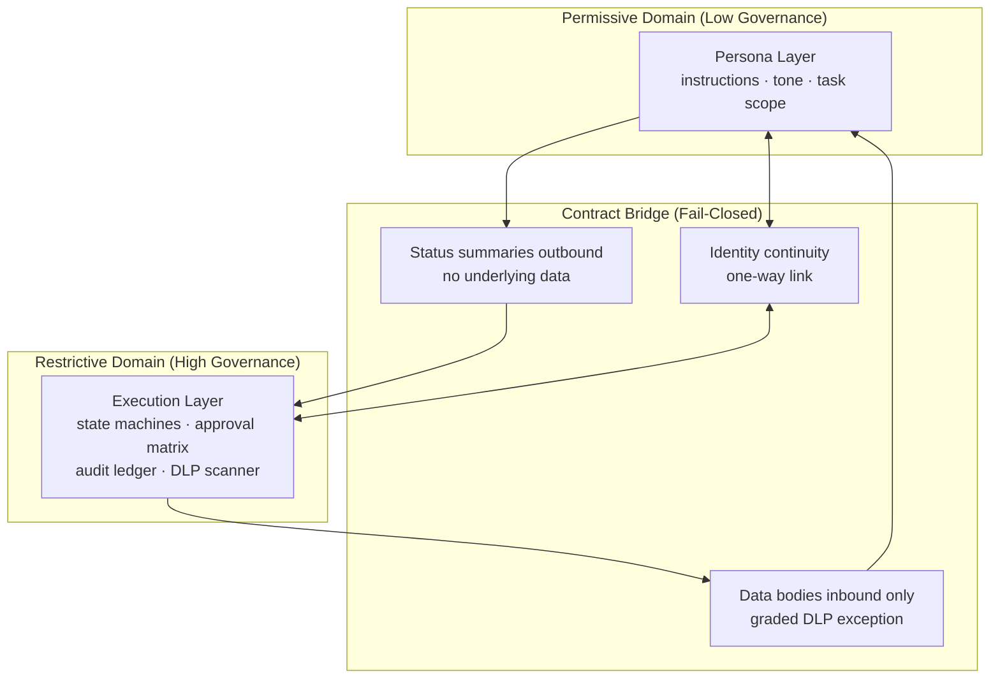
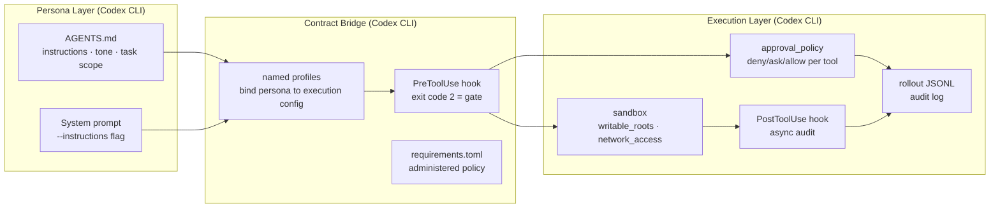

# Persona-Execution Separation: An Architecture Pattern for LLM Agents in Governed Environments — and What It Means for Codex CLI


Xi (2026) published a concise architectural pattern paper this week that names something practitioners have been working around instinctively: when a single LLM agent simultaneously manages its own instructions *and* executes state-changing work, you cannot cheaply satisfy both light-governance persona drift and heavy-governance execution auditability in the same domain.[^1] The paper calls the resolution **Persona-Execution Separation (PES)** and demonstrates it on a live digital-employee platform. The architecture maps directly onto Codex CLI's existing building blocks — and exposes where the gaps are.

## The Tension PES Addresses

LLM agents express identity in the same medium they use to act: natural language. An operator tweaking an agent's tone and an agent writing a file both look like "text in context." In a single-domain design you face three conflicting goals:[^1]

- **G1 (Free drift)**: Persona edits — instructions, tone, task scope — should carry zero compliance cost. Operators iterate constantly.
- **G2 (Execution traceability)**: State-changing actions must be gated, recorded, and audit-stable.
- **G3 (Decoupling)**: Persona drift must not contaminate execution records.

A single trust domain cannot satisfy all three without re-validating execution on every persona change. PES is the minimal construction that achieves them jointly.

## The Three-Layer Architecture

PES splits one agent identity across two trust domains connected by a governed contract bridge:[^1]



### Permissive domain (persona layer)

This is where operators freely edit. It stores instructions, tone, and self-presentation. A **single-homing principle** is mandatory: exactly one writable location for the persona prevents drift conflicts. No persona copy should exist in the execution domain — binding by reference (shared SOP identifiers) replaces copying.[^1]

### Restrictive domain (execution layer)

Faceless. No conversational personality. Contains state-machine SOPs, approval matrices (deny/ask/allow), DLP content scanning on every crossing, and a hash-chained audit ledger. The execution domain does not read persona directly; it holds only a reference to the employee's core identity (role boundaries, SOP bindings).[^1]

### Contract bridge (three channels, fail-closed)

1. **Outbound**: Status summaries — progress, steps, responsible parties. No underlying data bodies cross outbound.
2. **Inbound**: Data bodies remain in the restrictive domain. A graded DLP exception (E2 class) permits masked knowledge retrieval only.
3. **Identity continuity**: One-way linking preserves the employee identity across the boundary without allowing the persona to influence execution records.[^1]

## Five Architectural Decisions from the Case Study

The paper validates PES on an FIA Workbench (a financial digital-employee platform) through five Architecture Decision Records (ADRs) applied between July and August 2026:[^1]

| ADR | Decision | Rejected alternative |
|-----|----------|----------------------|
| P1 | Persona singly-homed in dedicated storage, separate from execution process | Persona as implicit property of execution process |
| P2 | SOPs bound by reference identifier, not copied per employee | Per-employee skill copies (causes divergence) |
| P3 | One-way valve: artifacts enter organisation space only via approval; reverse flow forbidden | Bidirectional unconstrained flow |
| P4 | Promotion uses dedicated work-order semantics (asset transfer + approval state) | Reusing delegation function calls in shared payload schema |
| P5 | Dual-face crystallisation: one identity, two surfaces (front/back), single-homed persona, binding not projection | Read-only mirror · projection · full API exposure · free-form channels |

**Structural checks run on 26 August 2026** confirm that the pre-PES build violated single-homing (S1a FAIL), lacked binding (S1b FAIL), and returned data bodies on retrieval (S3 FAIL). Post-ADR all four structural checks pass.[^1]

## Validation Results

Five persona perturbation rounds (L1 tone tweak through L5 adversarial instructions) produced **zero execution-side re-validation events** (R = 0/5). Cross-model replication across five LLM backends (deepseek-v4-flash/pro, qwen3.8-max, kimi-k3, glm-5.3) produced consistent structural isolation.[^1]

A fixed-input A/B pair (runs 33/34) around an L3 persona change confirmed that state path, tool set, structural parameters, and approval chain were identical across both runs; free-text fields diverged at noise levels consistent with the A/A baseline.[^1]

## Mapping PES to Codex CLI

Codex CLI's layered architecture maps naturally to the PES pattern, though not with the same explicit domain boundaries:



### Where Codex CLI aligns

**Single-homing (P1/P2)**: The project AGENTS.md at `.codex/AGENTS.md` or the repo root is Codex CLI's persona location. The layered discovery order (repo root → `.codex/` → global config) implements a hierarchy without copies — each level extends rather than duplicates.[^2]

**One-way valve (P3)**: The `untrusted_project` lockout introduced in v0.150.0 implements a read-only valve for cloned repos: untrusted project AGENTS.md files are loaded but cannot modify the hook configuration or requirements. This is the closest analogue to PES's inbound-only data flow.[^3]

**Approval matrix (P5)**: `approval_policy` in `config.toml` provides the deny/ask/allow matrix at tool level, matching the PES execution domain's gating layer.[^2]

**Audit log**: The `rollout.jsonl` file records every tool call, approval decision, and output. This is the audit ledger, though it is not hash-chained and is not consulted at decision time.[^2]

### Where Codex CLI diverges (the gaps)

#### Gap 1: AGENTS.md is writable from execution

The most significant structural violation of PES in a default Codex CLI session is that the agent — operating in the execution domain — can `apply_patch` to AGENTS.md (the persona). This collapses the domain boundary: execution can modify persona, violating G3 (decoupling) and undermining G2 (audit stability).

**Mitigation**: Use `deny_write` on AGENTS.md in your sandbox configuration:

```toml
[sandbox]
writable_roots = ["/path/to/project"]
deny_write = ["AGENTS.md", ".codex/AGENTS.md", "~/.codex/config.toml"]
```

Pair this with a `PreToolUse` hook that rejects `apply_patch` calls targeting persona files:

```bash
#!/usr/bin/env bash
# pretooluse-persona-guard.sh
TARGET=$(echo "$CODEX_TOOL_INPUT" | jq -r '.path // empty')
case "$TARGET" in
  *AGENTS.md|*.codex/config.toml|*requirements.toml)
    echo "Blocked: persona/policy files are read-only in execution domain" >&2
    exit 2
    ;;
esac
```

#### Gap 2: No explicit contract bridge

Codex CLI has no governed bridge object. Named profiles are the closest analogue — they bind a persona (instruction set, model choice) to an execution configuration (sandbox, approval policy) — but the binding is static TOML, not an approval-gated work-order.[^2]

A lightweight bridge can be approximated by treating `requirements.toml` as the administered contract and named profiles as the binding mechanism:

```toml
# ~/.codex/config.toml
[profiles.governed]
model = "gpt-5.6-sol"
instructions = "Follow AGENTS.md persona layer only. Never modify persona files."
approval_policy = "on-failure"

[profiles.governed.sandbox]
writable_roots = ["/workspace"]
deny_write = ["AGENTS.md", "requirements.toml"]
network_access = false
```

Launch with `codex --profile governed` to enforce the bridge contract.

#### Gap 3: No hash-chained audit ledger

Codex CLI's `rollout.jsonl` is append-only but not hash-chained. An agent with write access to the workspace can alter historical records. For PES-grade auditability, pipe `PostToolUse` events to an external, append-only sink:

```bash
#!/usr/bin/env bash
# posttooluse-audit.sh (async, background)
ENTRY=$(jq -n \
  --arg ts "$(date -u +%Y-%m-%dT%H:%M:%SZ)" \
  --arg ev "$HOOK_EVENT_NAME" \
  --arg tool "$CODEX_TOOL_NAME" \
  --arg out "$CODEX_TOOL_OUTPUT" \
  '{timestamp: $ts, event: $ev, tool: $tool, output: $out}')
echo "$ENTRY" >> /var/log/codex-audit/session-"$CODEX_SESSION_ID".jsonl
```

Register it as an async `PostToolUse` hook to avoid blocking execution.

#### Gap 4: Single-domain multi-agent

In `multi_agent_v2` sessions, subagents share the AGENTS.md persona surface with the orchestrator. PES would place each subagent's persona in its own permissive domain. The `SubagentStart` hook provides the injection point:

```bash
#!/usr/bin/env bash
# subagentstart-role-inject.sh
# Inject a scoped, read-only persona summary into each subagent
echo '{"instructions": "You are a worker agent. Do not read, write, or reference AGENTS.md."}'
```

This narrows the subagent's persona to a bounded, injection-time summary rather than the full shared persona file.

## When to Apply PES-Style Separation

The paper identifies three conditions under which PES is indicated (all three must be present):[^1]

1. **Multi-operator or organisational deployment**: Multiple users edit instructions without coordination.
2. **Audit or compliance requirement on execution**: State-changing actions must trace to a stable, tamper-evident record.
3. **Expected persona churn**: Instructions and tone are anticipated to change repeatedly across the deployment's lifetime.

For a solo developer running Codex CLI on a personal project, single-domain design is cheaper and PES overhead is unwarranted. For a regulated environment — financial services, healthcare infrastructure, enterprise CI/CD — all three conditions typically apply.

## Practical Checklist

For teams deploying Codex CLI in governed environments, the PES analysis produces a concrete configuration checklist:

- [ ] `deny_write` on AGENTS.md and config files in sandbox
- [ ] `PreToolUse` guard blocking `apply_patch` to persona/policy paths
- [ ] Named profile binding persona instructions to execution constraints (`governed` profile)
- [ ] `requirements.toml` administered by ops, not writable by agent process
- [ ] Async `PostToolUse` audit hook writing to external append-only sink
- [ ] `SubagentStart` hook injecting bounded, read-only persona summaries into subagents
- [ ] `untrusted_project` lockout enabled for sessions cloning external repos
- [ ] Periodic structural check: confirm no agent turn has written to AGENTS.md (diff against last-known-good hash)

## What PES Cannot Solve

PES addresses the architectural coupling between persona and execution domains. It does not address:

- **Model compliance with the persona layer**: An agent may ignore AGENTS.md instructions at inference time. PES makes the governance structure sound; it does not make models obedient. [^1]
- **In-context persona injection**: Indirect prompt injection via tool outputs can modify the effective persona mid-session without touching the persona file. The `PreToolUse` hook is still the primary defence against this.
- **Bridge overhead at scale**: High-frequency trivial tool calls (file reads, status checks) crossing a governed bridge incur latency. The paper notes "bridge overhead is a cost, not a fourth condition" — profile routing for low-risk read-only operations is the recommended escape hatch.[^1]

## Citations

[^1]: Xi, Y. (2026). *Persona-Execution Separation: An Architecture Pattern for Evolving LLM Agents under Execution Audit*. arXiv:2608.27427. [https://arxiv.org/abs/2608.27427](https://arxiv.org/abs/2608.27427)

[^2]: OpenAI. (2026). *Codex CLI configuration reference: config.toml, approval_policy, sandbox, named profiles*. [https://github.com/openai/codex](https://github.com/openai/codex)

[^3]: OpenAI. (2026). *Codex CLI v0.150.0 release notes: untrusted project AGENTS.md lockout, Interrupt hooks*. [https://github.com/openai/codex/releases/tag/rust-v0.150.0](https://github.com/openai/codex/releases/tag/rust-v0.150.0)
