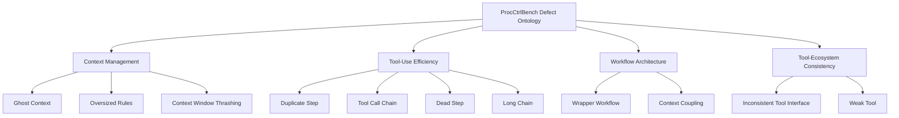
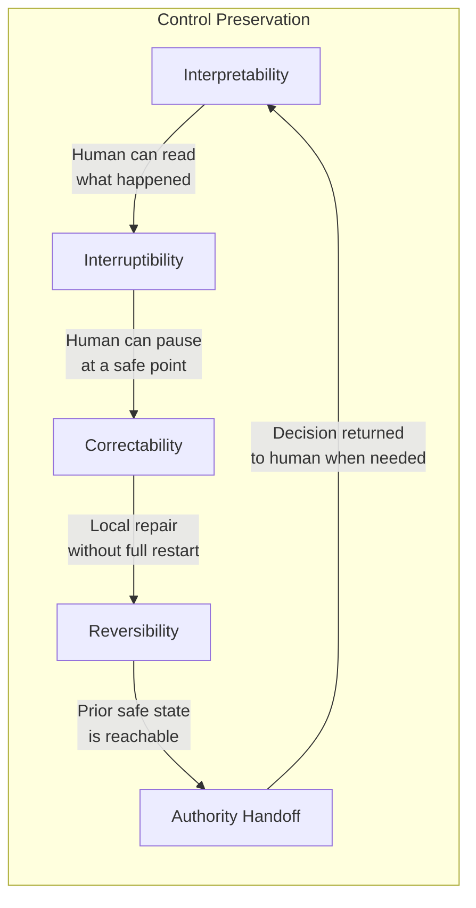

# ProcCtrlBench: Beyond Pass Rates — Measuring Process-Level Defects and Control Preservation in Codex CLI


---

Your agent's SWE-bench pass rate tells you whether it landed the plane. ProcCtrlBench asks whether the flight was flown well. Jiawei He, Jie Jia, Chenbo Liu, Chaoyi Xue, Yapeng Song, Xikai Yang, and Dong Sun (Amap / Alibaba Group) published *ProcCtrlBench: Evaluating Process-Level Defects and Control Preservation in LLM Coding Agents* in May 2026, with a fourth revision on 26 May 2026.[^1] Their central claim is unambiguous: outcome metrics conceal a category of execution failure that only process-level analysis can surface.

The benchmark evaluated eleven agent configurations — including Codex CLI with GPT-5.4 and Claude Code with Sonnet 4.6 — across 200 cases drawn from AndroidBench, TerminalBench, and SWE-bench-Verified.[^1] Codex CLI placed second overall (0.731 PB score) and first on TerminalBench (0.742), which is the domain closest to its daily workload.[^1]

This article unpacks their 11-defect ontology, the control preservation framework, the "fragile success" problem, and what each finding means for Codex CLI operators.

---

## Why Outcome Metrics Miss the Problem

A test suite is binary. Either the patch applies and the tests pass or they do not. That binary signal is useful, but it hides two failure modes that matter enormously in production:

1. **Fragile success**: the agent reaches the correct answer via a wasteful, brittle, or unobservable execution path. The next token-budget increase, model update, or slightly-different task breaks it silently.
2. **Invisible cost bleed**: the agent accumulates ghost context, cycles through duplicate tool calls, and constructs unnecessarily long chains — all at your API budget, all undetected by the outcome metric.

ProcCtrlBench quantifies both by converting raw agent logs into a unified trajectory representation and running calibrated detectors against that representation.[^1] The calibration step is the methodological contribution: rather than binarising detector output at a fixed threshold, the framework maps continuous evidence scores to posterior defect risks in three semantic severity bands — *error*, *warning*, and *none* — reducing Expected Calibration Error by 39% compared to direct thresholding (overall ECE 0.138 vs 0.227).[^1]

---

## The Defect Ontology: 11 Types, 4 Categories



### Context Management

**Ghost Context** — redundant, outdated, or already-summarised content that persists in the active context window for an extended period.[^1] In Codex CLI terms, this manifests as AGENTS.md directives loaded at session start that have been superseded by later sub-task context, or compaction summaries that retain verbatim tool outputs instead of structured conclusions.

**Oversized Rules** — excessively large system prompts creating a persistent baseline token tax on every model call.[^1] If your `.codex/instructions.md` concatenates every project's coding standards into a monolithic block, you are paying for Ghost Context before the first user turn.

**Context Window Thrashing** — rapid saturation-and-compaction cycles that prevent stable reasoning chains from forming.[^1] This is the pathological case of `model_auto_compact_token_limit` set too low, forcing continuous lossy compression before the agent can build meaningful state.

### Tool-Use Efficiency

**Duplicate Step** — repeated execution of substantively identical tool calls without meaningful state change between them.[^1] The strongest detector in the suite (AUROC 0.92), because the signal is locally observable: the same tool, the same arguments, consecutive turns.

**Tool Call Chain** — cyclic or oscillatory patterns in local call sequences.[^1] The agent is stuck in a micro-loop, issuing tool A in response to tool B's output, which triggers tool A again. Distinguished from Duplicate Step by the presence of state change that fails to break the cycle.

**Dead Step** — actions executed but producing no downstream influence on later decisions.[^1] The tool call returns, the agent acknowledges the result, and then never uses it. Common in Codex CLI sessions where `cat` or `grep` results are read but the subsequent `apply_patch` is derived entirely from prior context.

**Long Chain** — disproportionately elongated execution paths that lack effective decomposition.[^1] The agent could reach the same result in four steps but takes twenty-two, accumulating token cost and reducing auditability.

### Workflow Architecture

**Wrapper Workflow** — pass-through behaviour between agent layers without validation, aggregation, or genuine functional gain.[^1] In a `multi_agent_v2` configuration, this is the subagent that receives a task, calls one tool, and returns the result verbatim — no synthesis, no error-checking, no scope enforcement.

**Context Coupling** — excessively deep context sharing and unclear boundaries across agents or workflow units.[^1] The subagent can see and act on state it was never meant to receive. This overlaps with the trust-domain concerns in PES architecture but is diagnosed here from trajectory evidence rather than static configuration review.

### Tool-Ecosystem Consistency

**Inconsistent Tool Interface** — substantial inconsistency in parameter naming, types, or output structures across related tools.[^1] In an MCP setup, this arises when two servers independently expose an `execute` tool with incompatible schemas. The agent learns heuristics from one and misapplies them to the other.

**Weak Tool** — tools that are technically available but chronically underutilised due to poor discoverability.[^1] Low detector confidence (AUROC 0.68–0.73) because absence of evidence is harder to calibrate than evidence of misuse. Maps directly to the capability mirage / Semantic Decoy concerns raised by the Canary Tools paper.[^2]

---

## Control Preservation: Five Dimensions

ProcCtrlBench treats control preservation as orthogonal to defect burden.[^1] A trajectory may exhibit several efficiency defects but remain highly controllable; conversely, a clean, efficient execution path can be opaque and irreversible.



**Interpretability** — execution remains legible to an external observer. In Codex CLI, this is whether `rollout.jsonl` combined with the visible diff tells a coherent story without requiring you to replay the full session transcript.

**Interruptibility** — meaningful intervention points exist throughout execution. Codex CLI's `approval_policy = ask` provides coarse-grained interruptibility, but the benchmark measures whether those intervention points are semantically meaningful, not merely syntactically present.

**Correctability** — local deviations can be repaired without a full trajectory restart.[^1] The PostToolUse hook's exit code 2 mechanism — which halts execution and surfaces the validation error to the model — is the primary correctability lever in Codex CLI's current architecture.

**Reversibility** — prior safe states are reachable.[^1] Git-based rollback after `apply_patch` is Codex CLI's answer here, but only if the agent commits at sensible checkpoints rather than accumulating a massive working-tree diff across fifty tool calls.

**Authority Handoff** — decision authority can be returned to the human when execution uncertainty exceeds the agent's competence.[^1] Codex CLI surfaces this partially through `approval_policy = ask` escalation, but there is no graduated uncertainty signal — the agent either acts autonomously or blocks entirely.

---

## The Fragile Success Problem

The most practically significant finding is the **fragile success rate** — tasks completed with objectively weak process quality.[^1] Across the eleven agent configurations evaluated:

| System | PB Score | Fragile Success Rate |
|--------|----------|---------------------|
| Claude Code / Sonnet 4.6 | 0.742 | 10.8% |
| Codex CLI / GPT-5.4 | 0.731 | 12.3% |
| Claude Code / Sonnet 4.5 | 0.721 | 14.1% |
| OpenCode / Qwen3 Coder Plus | 0.687 | 20.2% |

A 12.3% fragile success rate means that roughly one in eight "passing" Codex CLI sessions is a brittle outcome — the agent got there, but via a path that is unlikely to generalise.[^1] In a CI pipeline with 100 agent-assisted PRs per sprint, that is twelve PRs shipping with hidden quality debt.

The domain breakdown also matters for Codex CLI operators: GPT-5.4 leads on TerminalBench (shell tasks, direct filesystem operations) but trails on SWE-bench-Verified (structured codebase surgery).[^1] If your Codex CLI deployment handles both task types, the benchmark suggests different risk profiles by domain.

---

## Applying ProcCtrlBench Thinking to Your Codex CLI Sessions

You cannot run ProcCtrlBench's calibrated detectors directly in Codex CLI today — the framework requires offline trajectory analysis. But the defect taxonomy provides actionable heuristics you can encode in AGENTS.md and hooks right now.

### Addressing Ghost Context

```toml
# config.toml — aggressive compaction to prevent ghost context accumulation
[model]
model_auto_compact_token_limit = 120000

[features]
experimental_compact_prompt_file = ".codex/compact-template.md"
```

The `compact-template.md` should instruct the summariser to discard tool outputs once conclusions are extracted, retain only structured state (file path, line range, diagnosis), and never re-include superseded sub-task context.

### Detecting Dead Steps via Rollout Analysis

Dead Steps are invisible during execution but auditable post-session. A simple script against `~/.codex/rollout.jsonl`:

```bash
# Flag tool calls whose output never appears in subsequent message content
jq -c 'select(.type == "tool_result")' ~/.codex/rollout.jsonl \
  | python3 scripts/dead_step_detector.py --threshold 0.85
```

The detector looks for tool result content that has zero lexical overlap with the subsequent five model turns. This is a coarse approximation of ProcCtrlBench's calibrated approach but catches the most egregious cases.

### Preventing Context Coupling in Multi-Agent Configurations

```yaml
# AGENTS.md — explicit boundary declaration for multi_agent_v2
## Subagent Scope Boundaries
Each subagent operates on the file set listed in its task description only.
Subagents MUST NOT read, reference, or modify files outside their designated scope.
Before any tool call, verify the target path is within scope.
Report out-of-scope requests as tool errors, not silent skips.
```

This is the AGENTS.md equivalent of ProcCtrlBench's Context Coupling detection: enforcing boundary declarations statically rather than detecting violations dynamically.

### MCP Schema Consistency (Inconsistent Tool Interface)

Keep MCP server tool schemas consistent across servers your agent accesses. Enforce it in CI:

```bash
# scripts/check-mcp-schema-consistency.sh
codex mcp list --json \
  | jq '[.tools[] | {name: .name, input_keys: [.inputSchema.properties | keys[]]}]' \
  | python3 scripts/schema_consistency_audit.py
```

Flag tools with the same semantic name but different parameter conventions. The audit catches the source of Inconsistent Tool Interface defects before they enter a live session.

---

## Detection Reliability and What It Implies

ProcCtrlBench's detectors are not uniformly reliable:[^1]

- **Strong (AUROC 0.89–0.92)**: Duplicate Step, Long Chain, Ghost Context — locally observable from trajectory structure
- **Moderate (AUROC 0.73–0.85)**: most efficiency and context defects
- **Challenging (AUROC 0.68–0.73)**: Workflow Architecture, Weak Tool — require semantic interpretation, not just structural pattern matching

The challenging detectors are precisely those that require understanding of intended agent behaviour, not just observed behaviour. This is why control preservation cannot be fully automated: Interpretability and Authority Handoff require a human model of what the agent was trying to accomplish.

The practical implication for Codex CLI operators: invest your review effort asymmetrically. Duplicate Step and Long Chain are automatable; Wrapper Workflow and Context Coupling require manual session review.

---

## Limitations and Gaps

ProcCtrlBench's 200-case evaluation, while carefully stratified, is small relative to the diversity of real Codex CLI workloads.[^1] The three benchmarks used — AndroidBench, TerminalBench, SWE-bench-Verified — skew toward discrete task completion rather than extended, multi-session engineering work. Long-horizon sessions (100+ turns, multiple compaction cycles) are not represented.

The fragile success metric is also defined at the task level, not the step level. A companion paper by the same group (arXiv:2608.22960) addresses the causal attribution problem at step level, introducing SCAE — a replay-based estimator derived from a structural causal model of agent execution — but this is not yet integrated into ProcCtrlBench's scoring.[^3]

Finally, the control preservation framework measures potential (is this execution interruptible in principle?) rather than actual human behaviour (did the operator actually intervene effectively?). Closing that gap requires longitudinal study of human-agent sessions, which no current benchmark provides.

---

## Citations

[^1]: He, J., Jia, J., Liu, C., Xue, C., Song, Y., Yang, X., & Sun, D. (2026). *ProcCtrlBench: Evaluating Process-Level Defects and Control Preservation in LLM Coding Agents*. arXiv:2605.20251v4. <https://arxiv.org/abs/2605.20251>

[^2]: Anand, S., & Chattaraj, A. (2026). *Diagnosing Tool-Selection Reasoning in LLM Agents with Canary Tools*. arXiv:2608.04719. <https://arxiv.org/abs/2608.04719>

[^3]: He, J., Shi, M., Jia, J., Yang, X., & Sun, D. (2026). *What Process Evaluation of Coding Agents Actually Measures: Action, Task, and Step Are Three Different Levels*. arXiv:2608.22960. <https://arxiv.org/html/2608.22960v1>

[^4]: OpenAI. (2026). *Codex CLI v0.151.0 Release Notes*. GitHub. <https://github.com/openai/codex/releases>

[^5]: OpenAI. (2026). *Codex CLI v0.150.1 Release Notes*. GitHub. <https://github.com/openai/codex/releases/tag/rust-v0.150.1>
