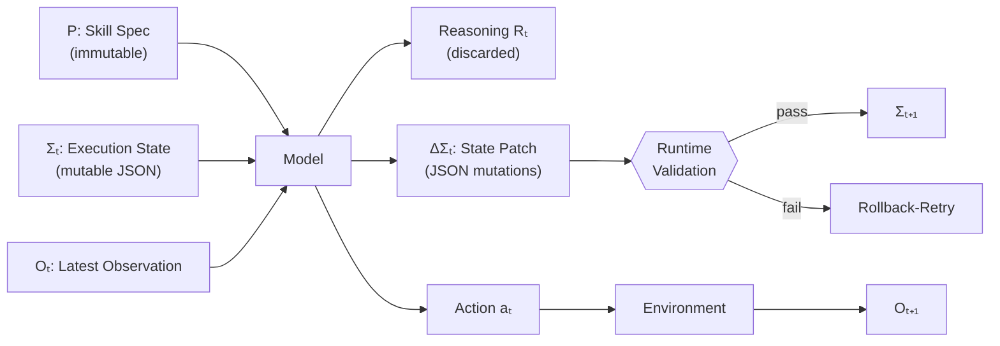
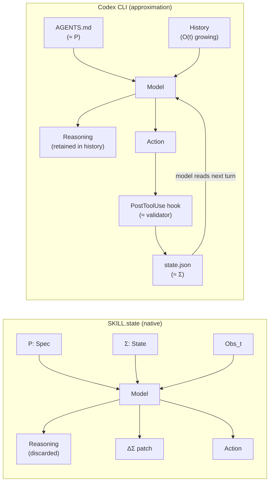

# SKILL.state: O(T) Agent Memory — What Structured Execution State Means for Codex CLI Long-Horizon Tasks


---

Every senior engineer who has run a Codex CLI session to completion on a large refactoring task has encountered the same failure mode: the agent starts strong, slows halfway through, then hallucinates file names it read two hundred turns ago. The root cause is architectural, not model capacity. Conventional agent runtimes append every observation, action, and chain-of-thought fragment to an ever-growing conversation history. Prompt length grows as O(T), cumulative token cost grows as O(T²), and prefix-cache hit rates collapse as the history exceeds the KV-cache window.[^1]

SKILL.state (arXiv:2608.26263), accepted at EMNLP 2026, proposes a principled replacement: discard intermediate reasoning immediately after it produces a validated state update, and pass only a bounded triple — immutable skill specification, structured execution state, and the latest observation — to the model at each step.[^2] The result is O(T) cumulative token cost, 16.2× token reduction on synthetic long-horizon benchmarks, and double-digit accuracy gains on real tasks including Linux CTF exploitation and customer-service workflows.

This article explains the architecture, examines the benchmark results in detail, maps the ideas to what Codex CLI can do today, and identifies the gaps that remain.

## The O(T²) Problem in Conventional Runtimes

The standard agent loop — popularised by ReAct[^3] and implemented in almost every agent harness — works by concatenating the full history of `(thought, action, observation)` triples into the model's context:

```
C_t = [system_prompt, turn_0, turn_1, ..., turn_{t-1}, observation_t]
```

At step *t*, prompt length is proportional to *t*. Summed over *T* steps, total token consumption is:

```
∑_{t=1}^{T} t ∝ T²
```

This quadratic growth is why Codex CLI fires compaction at the `model_auto_compact_token_limit` boundary and why post-compaction sessions show a 66% drop in prefix-cache hit rates.[^1] Compaction is a mitigating hack, not a solution: it replaces exact history with a lossy summary, erasing facts the model may need later.

TraceLab data (arXiv:2606.30560) confirms the cost structure empirically: compaction was triggered in 18.4% of Codex sessions versus 4.5% for Claude Code, with each compaction consuming 22% of total session turn time and destroying cache locality.[^1]

## The SKILL.state Architecture

SKILL.state replaces the accumulating history with a bounded triple at every step *t*:





Each component has a fixed role:

- **P (skill specification)**: Immutable procedural instructions — the task goal, available actions, and the state schema. Analogous to a function signature. It never changes during execution.
- **Σₜ (execution state)**: A structured JSON dictionary capturing all task-relevant facts accumulated so far. The model reads the current state and writes a *patch* (key mutations and deletions), not a new full document.
- **Oₜ (latest observation)**: Only the *most recent* environment output — tool results, command stdout, API responses. Prior observations are not re-presented; relevant facts from them must have been captured in Σ.
- **Rₜ (reasoning)**: Chain-of-thought generated by the model. Crucially, this is *discarded* immediately after the state patch is extracted. It never appears in future prompts.

The prompt size at each step is `|P| + |Σ_t| + |O_t|`. Assuming P and the observation are bounded (finite action space and output truncation), and assuming Σ grows sublinearly in practice because facts overwrite rather than accumulate, total token cost approximates O(T) — or in many cases better.[^2]

The InterCode CTF benchmark uses a single 5-field state schema across all 100 diverse challenges:

```json
{
  "discovered_flags": [],
  "tested_hypotheses": [],
  "active_files": [],
  "working_dir": "/root",
  "cmd_summary": ""
}
```

One schema, 100 different CTF environments, zero per-task customisation.[^2] This is the practical evidence that schema design does not need to be exhaustive — it needs to be *sufficient* to prevent the model from needing to re-read history.

### Validation and Rollback

State patch validation is handled by the deterministic runtime, not the model. The runtime applies the patch to Σ, checks field types and key membership against the schema, and either commits or rolls back. On failure, the model is given its malformed output and asked to retry — a rollback-retry loop. For smaller open-weight models prone to syntactic JSON errors, the authors recommend grammar-constrained decoding.[^2]

This separation — model owns *what* to update, runtime owns *whether* the update is valid — prevents the model from corrupting the state through hallucinated field names or type mismatches.

## Benchmark Results

### SkillExecBench (Synthetic)

The paper constructs two deterministic synthetic environments to isolate long-horizon behaviour:

- **Warehouse**: 500 independent shelves with Store, Ship, Move, Wait actions
- **Software Repository**: Git branches, commits, and PRs with CherryPick, Merge, RunTests actions

At T=100 steps with Gemini-3-Flash:

| Runtime | Accuracy | Avg tokens/step | Total tokens |
|---------|----------|-----------------|--------------|
| SKILL.state | 0.94 | 1,905 | 65,408 |
| Stateful baseline | 0.84 | 36,362 | 1.24M |
| ReAct | 0.78 | 28,100 | ~984K |

The **16.2× token reduction** versus the stateful baseline is not a compression trick — an ablation study at matching token budgets (sliding-window and LLMLingua compression) degraded to 0.18–0.22 accuracy, while SKILL.state maintained 0.94.[^2] Structure, not brevity, drives the accuracy gain.

At T=200, SKILL.state consumed 122K tokens while the Memory baseline inflated to 6.1M — a 50× gap.

### InterCode CTF

100 Linux Capture-The-Flag challenges requiring multi-step terminal exploitation:

| Runtime | Pass rate | Total tokens |
|---------|-----------|--------------|
| SKILL.state | **54.2%** | 387K |
| ReAct | 43.2% | 977K |
| Stateful (LangGraph) | 41.8% | 1.13M |

A +11pp accuracy gain at 2.5× lower token cost.[^2]

### Sierra τ-Bench Retail

Customer-service workflow automation (product returns, exchanges, policy lookups):

| Runtime | Pass rate | Total tokens |
|---------|-----------|--------------|
| SKILL.state | **58.3%** | 3.47M |
| ReAct | 48.2% | 4.48M |

+10.1pp accuracy at 23% lower cost.[^2]

### Open-Weight Model Error Analysis

For smaller models (Gemma-4-31B-it, Qwen-3-8B-it), 68% of failures in the SkillExecBench were caused by "premature state overwrite" — the model mutates a field before its value is needed later, effectively creating self-inflicted amnesia. This suggests SKILL.state's gains depend on model instruction-following quality: the schema cannot protect against a model that destroys state it should preserve.[^2]

## Where SKILL.state Fails

The paper is clear about its boundaries. Three task classes fall outside the guarantee:

1. **Dynamic schema discovery**: When no fixed schema is known in advance and relevant state structure must be discovered during execution, the runtime cannot validate patches against an unknown schema.
2. **Retroactive relevance**: When the importance of an early observation becomes clear only many steps later, that observation has already been discarded and cannot be recovered.
3. **Trajectory-dependent tasks**: Auditing, debugging, and compliance checking — where the execution *history* is the artefact of interest — cannot function when that history is continuously discarded.[^2]

Coding tasks often involve all three failure modes simultaneously: understanding an unfamiliar codebase requires retroactive relevance detection, schema discovery happens organically as the model explores the repository, and debugging sessions require examining the sequence of actions that produced a bug. SKILL.state is better suited to *well-defined procedural workflows* than to open-ended software engineering.

## Mapping to Codex CLI

Codex CLI does not implement SKILL.state natively. But the architecture points clearly at what the tool's existing primitives can approximate — and where the gaps are.

### AGENTS.md as the Skill Specification (P)

The immutable skill specification maps cleanly to `AGENTS.md`. Like P in SKILL.state, AGENTS.md is:

- Injected at every turn without growing in size
- Scoped to the project (directory-local, `.codex/` override)
- Outside the model's write path (sandbox `deny_write` on `AGENTS.md` prevents self-modification)

The practical implication: AGENTS.md should contain the *state schema* for long-horizon tasks — not only what the agent should do, but *what structured facts it must maintain*:

```markdown
## Session State Contract

Maintain a file `state.json` in the project root at all times.
Schema (do not add or remove top-level keys):
{
  "completed_modules": [],
  "pending_modules": [],
  "failed_tests": [],
  "last_action_summary": ""
}

After every tool use, update state.json with any changes.
Read state.json before deciding the next action.
```

This gives the model a persistent, bounded state container without requiring runtime enforcement.

### PostToolUse Hooks as State Capture

A PostToolUse hook can enforce state persistence independently of the model's compliance:

```jsonc
// hooks.json
{
  "hooks": [
    {
      "event": "PostToolUse",
      "matcher": ".*",
      "command": "python3 .codex/validate_state.py"
    }
  ]
}
```

```python
# .codex/validate_state.py — exits 2 to steer the model if state is missing or malformed
import json, sys

try:
    with open("state.json") as f:
        state = json.load(f)
    required = {"completed_modules", "pending_modules", "failed_tests", "last_action_summary"}
    if not required.issubset(state.keys()):
        print(f"State schema violation: missing keys {required - state.keys()}", file=sys.stderr)
        sys.exit(2)
except (FileNotFoundError, json.JSONDecodeError) as e:
    print(f"State file error: {e}", file=sys.stderr)
    sys.exit(2)
```

Exit code 2 causes Codex CLI to surface the error as additional context and steer the model to fix it — the same rollback-retry semantics that SKILL.state implements in its deterministic runtime.[^4]

### Structured Compaction via `experimental_compact_prompt_file`

The nearest equivalent to SKILL.state's "only pass the current state, not the history" is custom compaction. Codex CLI's `experimental_compact_prompt_file` lets you define the prompt used when the context is compacted:

```toml
# config.toml
[features]
experimental_compact_prompt_file = ".codex/compact_prompt.md"
```

```markdown
<!-- .codex/compact_prompt.md -->
Summarise the session into the following structured JSON.
Do not include reasoning or intermediate steps.
Output only the JSON:

{
  "completed_modules": [...],
  "pending_modules": [...],
  "failed_tests": [...],
  "last_action_summary": "..."
}
```

This approximates SKILL.state's state-only handoff at compaction boundaries. The critical difference: Codex CLI compacts on a threshold trigger, so history accumulates until that threshold rather than being discarded at every step. The approach reduces O(T²) to a piecewise O(T²/K) for compaction interval K — better, but not O(T).[^4]

### The Architecture Gap



The key gap: Codex CLI retains reasoning in the conversation history. The model reads `state.json` each turn, but the full history also remains in context — accumulating, poisoning prefix-cache locality, and eventually triggering compaction. True O(T) behaviour requires the runtime to strip reasoning from the history after each step, which Codex CLI does not support.[^2][^4]

## Identified Gaps

| SKILL.state feature | Codex CLI today | Gap severity |
|---|---|---|
| Per-step reasoning discard | Not supported | **High** — history grows until compaction |
| Schema-validated state patches | PostToolUse hook exit code 2 approximation | Medium |
| O(T) cumulative token cost | O(T²) with piecewise compaction | High on very long sessions |
| Bounded prompt size at every step | Unbounded between compaction triggers | High |
| Rollback-retry on invalid state | PostToolUse exit code 2 + model retry | Medium |
| Retroactive observation access | History available until compaction | Advantage over SKILL.state |

The last row is worth noting: SKILL.state's discard policy is also a *loss* — Codex CLI's retained history handles retroactive relevance naturally, something SKILL.state explicitly cannot do.

## Practical Guidance

For long-horizon Codex CLI workflows where history size is the limiting factor:

1. **Define a state schema in AGENTS.md** for any session expected to exceed 50 turns. List the fields, their types, and the update protocol.
2. **Add a PostToolUse hook** that validates `state.json` on every tool use. Exit code 2 if the file is missing or malformed.
3. **Set `model_auto_compact_token_limit`** conservatively — fire compaction earlier rather than later, before the model has lost meaningful state.
4. **Set `experimental_compact_prompt_file`** to a schema-aware compact prompt that outputs structured JSON rather than a prose summary.
5. **Reserve full-history sessions** for tasks where retroactive relevance is likely: debugging unknown failures, auditing changes, or exploring an unfamiliar codebase.

SKILL.state's central insight — that *structure beats brevity* and that *the model should own what to update, not own the history* — is directly applicable even without native runtime support.

## Citations

[^1]: Zhu et al., "TraceLab: Characterizing Coding Agent Workloads for LLM Serving," arXiv:2606.30560, June 2026. <https://arxiv.org/abs/2606.30560>

[^2]: SKILL.state authors, "SKILL.state: Scalable Long-Horizon Agent Skills," arXiv:2608.26263, August 26, 2026. Accepted at EMNLP 2026. <https://arxiv.org/abs/2608.26263>

[^3]: Yao et al., "ReAct: Synergizing Reasoning and Acting in Language Models," ICLR 2023. <https://arxiv.org/abs/2210.03629>

[^4]: OpenAI Codex CLI documentation — hooks reference, PostToolUse exit codes, `experimental_compact_prompt_file`, `model_auto_compact_token_limit`. <https://github.com/openai/codex>
