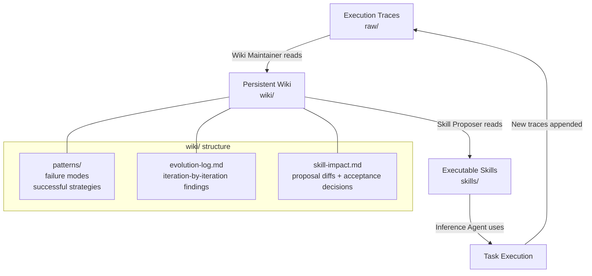
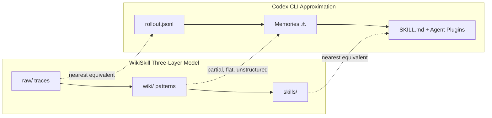

# WikiSkill: Compiling Agent Experience into Persistent Knowledge — What It Means for Your Codex CLI Skill Library


Every self-evolving coding agent faces the same fundamental problem: how do you make lessons from one run available to the next without losing their context? Prior approaches — EvoSkill, Trace2Skill, SkillOpt — iterate over skills but scatter the reasoning that drove each change across optimisation histories that nobody reads. WikiSkill, a new framework from Google Research and Virginia Tech (arXiv:2608.27454, August 27, 2026)[^1], addresses this directly by inserting a *persistent wiki* between raw execution traces and the executable skills themselves. The implications for how you structure your Codex CLI skill library are substantial.

## The Problem WikiSkill Solves

Standard skill-evolution pipelines produce a sequence of SKILL.md versions but discard the failure analysis that explains why each version differed from its predecessor. The next iteration starts from the current skill text without access to the accumulated diagnostic evidence that informed prior rewrites. Insights remain *scattered across optimisation histories*, preventing systematic reuse.[^1]

This matters in practice. When a skill update fails validation and gets rolled back, subsequent iterations have no record of what was tried, why it was tried, or why it failed. The Skill Proposer effectively starts each iteration partially blind — it can read the current skill and recent traces, but it cannot answer the question "has this approach already been tried?"

## The Three-Layer Architecture

WikiSkill separates skill state into three layers:[^1]



**Raw layer (`raw/`):** Immutable storage of execution traces from training episodes — step-by-step interactions including reasoning, tool usage, and outcomes. This layer is append-only and never modified after a trace is written.

**Wiki layer (`wiki/`):** A persistent knowledge repository with three components: a pattern directory documenting failure modes and successful strategies by name, an evolution log tracking iteration-by-iteration findings, and a skill-impact tracker recording proposal diffs and acceptance decisions. Critically, wiki state is *always retained* even when skill proposals fail validation. A rejected proposal leaves a permanent record in `skill-impact.md`.

**Skills layer (`skills/`):** Active procedural instructions available to agents. Each skill contains a `SKILL.md` with the full procedural content and a `PURPOSE.md` mapping the skill back to the motivating patterns in the wiki.

## The Evolutionary Loop

Four components drive the cycle:[^1]

**Inference Agent** executes tasks using current skills. Crucially, it is *restricted from wiki access during training*. This is the counter-intuitive design decision central to WikiSkill's performance: if the Inference Agent can consult the wiki to solve problems directly, the resulting traces are less informative for the Wiki Maintainer — the agent is solving via knowledge lookup rather than skill execution.

**Wiki Maintainer** analyses sampled execution traces, performs root-cause analysis on failures, extracts successful strategies, and updates pattern pages via incremental edits. It has full wiki access and writes to `patterns/` and `evolution-log.md`.

**Skill Proposer** operates in ReAct style with access to the wiki index and skill-impact history. It selectively inspects specific patterns and traces, then proposes *atomic* skill modifications — targeted changes rather than full rewrites.

**Gating and rollback** validates proposals on held-out data. Only proposals that exceed prior validation scores are accepted into the skills layer. However, the wiki retains all evidence regardless of acceptance outcome.

## Performance Results

WikiSkill was evaluated across five benchmarks — LiveMathematicianBench, SealQA, SpreadsheetBench, OfficeQA, and ALFWorld — using Qwen-3.5 (4B, 9B), Qwen-3.6-27B, Gemma-4-31B, and Gemini-3.5-Flash.[^1]

The headline result is average accuracy after skill evolution:[^1]

| Model | No-skill baseline | WikiSkill | Gain |
|---|---|---|---|
| Qwen-3.5-4B | ~26% | 38.5% | +12.3pp |
| Qwen-3.5-9B | ~30% | 47.4% | +17.5pp |
| Qwen-3.6-27B | ~39% | 63.3% | +23.9pp |
| Gemini-3.5-Flash | ~55% | 68.1% | +13.1pp |

Notable task-specific gains include Gemini-3.5-Flash improving from 33.0% to 72.6% on LiveMath (+39.6pp) and from 50.5% to 76.6% on SpreadsheetBench.[^1]

### Smaller Models Beat Bigger Ones

The scale complementarity result is striking: **Qwen-3.5-9B with WikiSkill-evolved skills (47.4% average) outperforms Qwen-3.6-27B without skills (39.4%).**[^1] A 3× smaller model with evolved skills beats the larger model running on raw capability alone. This quantifies the practical ROI of skill investment relative to simply upgrading your model tier.

### Cross-Model Skill Transfer

WikiSkill skills transfer across model families — and transferred skills can exceed self-evolved skills:[^1]

- Qwen-3.6-27B skills improve Qwen-3.5-9B from 24.3% to 50.5% on SpreadsheetBench
- Qwen-3.6-27B skills improve Gemma-4-31B from 33.9% to 73.7% on LiveMath

However, negative transfer is real. On SpreadsheetBench, Qwen-3.5-4B skills reduce Gemini-3.5-Flash performance from 50.5% to 18.1%. Smaller models encode low-level workarounds that constrain stronger models' capabilities rather than extending them.[^1] Skills evolved with a weaker model can be harmful when applied to a stronger one — the abstraction level does not generalise.

### The Counter-Intuitive Ablation

The most operationally important finding is what happens when the Inference Agent gets wiki access during evolution (Table 3, Gemini-3.5-Flash):[^1]

| Wiki access configuration | Average accuracy |
|---|---|
| No wiki access (baseline) | 45.3% |
| Inference Agent only | 48.7% |
| Skill Proposer only (default WikiSkill) | 63.7% |
| Both agents have wiki access | 60.9% |

Giving the Inference Agent wiki access during *evolution* **reduces final skill quality** by 2.8pp relative to the Skill Proposer-only configuration. The reason: when the Inference Agent solves problems by consulting the wiki rather than exercising skills, the resulting traces contain less information about what the skills themselves can and cannot do. The Wiki Maintainer receives less diagnostic signal, and subsequent skill updates are less well-targeted.

Wiki access for the Inference Agent during *inference* (after evolution is complete) is a separate question the paper does not answer — this is an acknowledged limitation.[^1]

## Mapping WikiSkill to Codex CLI

Codex CLI's skill infrastructure is richer than it appears but lacks the middle tier WikiSkill treats as load-bearing.



### Skills Layer → SKILL.md and Agent Plugins

Codex CLI has a direct structural equivalent to WikiSkill's skills layer. `SKILL.md` files in `~/.agents/skills/` are auto-loaded when the task matches.[^2] Agent Plugins 1.0 (v0.147.0) wrap skills with MCP servers and metadata into distributable packages.[^2] The skills layer is well-served.

What the skills layer lacks is a connection back to the diagnostic evidence that should inform skill updates. SKILL.md files are edited by hand or by an agent following explicit instructions — there is no automated path from execution failures to skill refinement proposals.

### Wiki Layer → The Missing Middle Tier

This is where the gap is structural. Codex CLI's Memories system[^3] is the closest approximation:

```toml
# ~/.config/codex/config.toml
[memories]
enabled = true
max_unused_days = 30
```

Memories accumulate per-task observations into a flat `MEMORY.md` file consolidated into `memory_summary.md` at session start. This covers the *accumulation* function but not the *structure* WikiSkill treats as essential. The wiki organises evidence into named pattern pages, tracks iteration-by-iteration evolution, and links rejected proposals to the patterns that motivated them. Memories is a flat append — there is no pattern taxonomy, no rejection history, no link between a memory and the skill section it informed.

The 5,000-token consolidation budget for `memory_summary.md` imposes an additional constraint: as the wiki grows, lower-priority memories are pruned without any equivalent to WikiSkill's permanent retention of skill-impact history.

### Raw Layer → rollout JSONL

Codex CLI's rollout JSONL files (`~/.codex/logs/rollout-*.jsonl`) are the nearest equivalent to WikiSkill's raw layer.[^4] They capture typed events — tool calls, model outputs, approval decisions, hook invocations — for every session. However:

- The format is write-once and not indexed for pattern analysis
- There is no built-in mechanism for a Wiki Maintainer analogue to query rollouts by failure type
- Rollout files are not surfaced to the agent unless explicitly read via a tool call

A PostToolUse async hook can approximate a lightweight Wiki Maintainer — extracting failure signals after each tool invocation and appending structured observations to a project-scoped wiki file:

```json
{
  "hooks": {
    "PostToolUse": [
      {
        "name": "wiki-maintainer",
        "matcher": ".*",
        "command": "~/.codex/hooks/wiki-maintainer.sh",
        "async": true
      }
    ]
  }
}
```

The hook script reads the tool result from stdin, classifies success/failure, and appends to a structured `wiki/patterns/` directory. This is a substantial approximation — it runs synchronously per call rather than batching traces for root-cause analysis, and it lacks the Skill Proposer's ability to cross-reference patterns with the skill-impact history.

### The Gating Function → Manual Validation

WikiSkill's validation gate accepts or rejects skill proposals based on held-out performance. Codex CLI has no equivalent automated gate for skill updates. The nearest approximation is:

1. Maintain a `validation_tasks/` directory in your project with representative test cases
2. Run them via `codex exec` against a fork before merging skill changes into the primary SKILL.md
3. Use a named profile that disables skill loading during this test run to simulate the WikiSkill condition of measuring skill-only performance

```bash
# Test skill change without wiki access
codex exec --profile skill-validation \
  "Run all validation tasks in validation_tasks/ and report pass/fail"
```

This approximates the validation gate but requires explicit human orchestration.

## What Codex CLI Cannot Do Today

The WikiSkill paper's most actionable implications are structural gaps:

1. **No wiki persistence between sessions.** The 30-day Memories decay and 5,000-token budget mean long-running pattern evidence gets pruned. WikiSkill's wiki grows indefinitely across the full evolution run without pruning (acknowledged as a limitation by the authors[^1]).

2. **No automatic Skill Proposer.** When you update SKILL.md, you are acting as both Wiki Maintainer and Skill Proposer. There is no system that reads your Memories and rollout history to propose specific skill modifications.

3. **No skill-impact tracking.** Rejected skill changes leave no persistent record in Codex CLI. The next agent editing SKILL.md has no way to know what was tried and failed.

4. **No Inference Agent access isolation.** WikiSkill deliberately prevents the Inference Agent from reading the wiki during evolution to preserve trace informativeness. In Codex CLI, a running agent always has access to Memories, AGENTS.md, and any loaded skills simultaneously. There is no mechanism to selectively restrict wiki access during a skill evaluation run while preserving it for normal operation.

5. **No cross-model skill validation.** The transfer results show that skills evolved with a small model can harm a large model. If you use a fast model (e.g., GPT-5.6-Luna) to evolve skills and then apply them to a capable model (e.g., o4 with high reasoning effort), the transfer risk is real and currently undetectable without explicit validation.

## Practical Approximations for Today

Given the structural gaps, a pragmatic WikiSkill-inspired setup for Codex CLI:

**Three-directory structure in `.codex/`:**
```
.codex/
  skills/          ← SKILL.md files (skills layer)
  wiki/
    patterns/      ← named markdown files per recurring pattern
    evolution-log.md
    skill-impact.md
  raw/             ← symlink to ~/.codex/logs/ for rollout access
```

**AGENTS.md wiki-awareness directive:**
```markdown
## Skill Evolution Protocol
When updating any SKILL.md, first read wiki/skill-impact.md to check if this
approach has been tried. Document your proposed change in wiki/skill-impact.md
BEFORE testing, including the pattern from wiki/patterns/ that motivated it.
After validation, update wiki/evolution-log.md with the outcome.
```

**Async PostToolUse failure extraction:**
The async hook appends structured failure observations to `wiki/patterns/` without blocking tool execution. The Wiki Maintainer role is approximated by prompting the agent explicitly at the end of a session to review failures and update the pattern pages.

**Cross-model validation before transfer:**
Before applying skills evolved with one model configuration to another, run the `validation_tasks/` set explicitly. The negative transfer risk is highest when moving from a smaller/weaker model to a larger/stronger one.

## Limitations of the WikiSkill Research

The paper acknowledges several gaps relevant to Codex CLI users:[^1]

Skill retrieval is not evaluated — all experiments use full-injection (all skills loaded), which isolates skill quality from retrieval performance. At scale, with many skills in an Agent Plugins catalogue, the retrieval mechanism matters. The 2,048-plugin catalogue limit in Codex CLI v0.147.0 creates a retrieval problem WikiSkill's evaluation does not address.

Validation gating is strict — requiring immediate improvement excludes neutral proposals that might enable future gains. In a Codex CLI approximation where you are acting as the gating function, this suggests erring toward accepting skill changes with neutral or marginally positive results rather than requiring clear improvement.

Wiki pruning is absent — pattern pages and logs accumulate indefinitely. For long-running projects, the wiki can grow until the Skill Proposer's context is saturated. A monthly pruning pass on `wiki/patterns/` is advisable.

## Citations

[^1]: Tang, L., Rashtchian, C., Ferng, C.-S., Tomkins, A., Juan, D.-C., & Vu, T. (2026). *WikiSkill: Compiling Agent Experience into Persistent Knowledge for Skill Evolution*. arXiv:2608.27454. [https://arxiv.org/abs/2608.27454](https://arxiv.org/abs/2608.27454)

[^2]: ITECS (2026). *Codex CLI Agent Skills: 2026 Install and Usage Guide*. [https://itecsonline.com/post/codex-cli-agent-skills-guide-install-usage-cross-platform-resources-2026](https://itecsonline.com/post/codex-cli-agent-skills-guide-install-usage-cross-platform-resources-2026)

[^3]: OpenAI (2026). *Codex CLI Memories System*. Codex Knowledge Base. [https://codex.danielvaughan.com/2026/04/12/codex-cli-customisation-stack-unified-system/](https://codex.danielvaughan.com/2026/04/12/codex-cli-customisation-stack-unified-system/)

[^4]: Huang, Y., Wang, B., Wang, S., Jurayj, J., Gutiérrez, B.J., Khashabi, D., & Andrews, N. (2026). *Better, Faster, Stronger: Programmatic Skill Learning Best Reduces Agent Cost*. arXiv:2608.11338. [https://arxiv.org/abs/2608.11338](https://arxiv.org/abs/2608.11338)

[^5]: Jain, N. et al. (2026). *CODESKILL: Learning Self-Evolving Skills for Coding Agents*. arXiv:2605.25430. [https://arxiv.org/abs/2605.25430](https://arxiv.org/abs/2605.25430)
