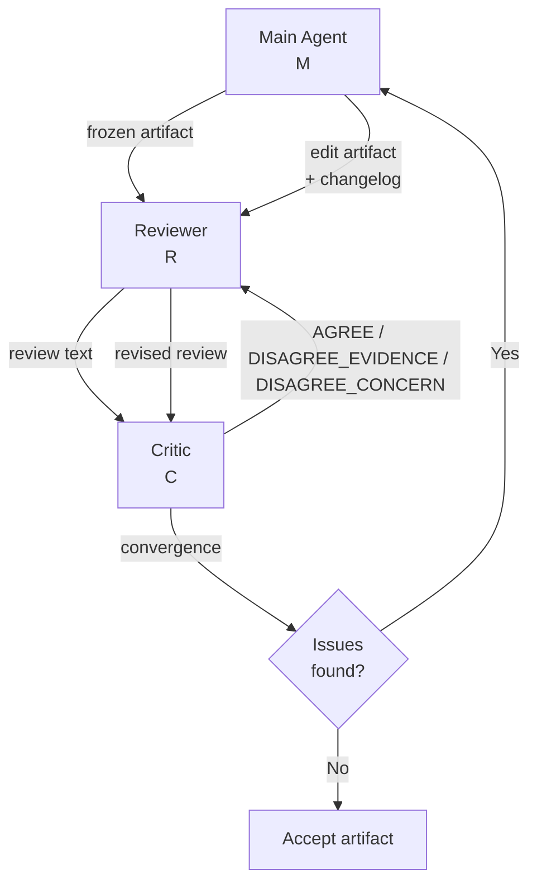

# Adversarial Review: Why Structured Disagreement Beats Consensus in Agentic Code Review — and How to Wire It in Codex CLI


A new paper from Cornell and Stanford — accepted at ICML 2026 Workshop on DL4C — provides the clearest empirical evidence yet that the number of agents in a review loop matters far less than whether those agents are structurally compelled to disagree.[^1] *Adversarial Review* (AR) introduces a minimal three-agent protocol that outperforms a five-agent baseline across three independent benchmarks, and does so through a mechanism directly applicable to Codex CLI's `multi_agent_v2` subagent model.

## The False-Consensus Problem

Standard multi-agent review pipelines pair a generator with one or more reviewer agents and expect them to catch what the generator missed. In practice, LLMs asked to agree tend to agree — even when a concern is unsupported by evidence.

The authors identified two specific failure patterns on SWE-PRBench:[^2]

- **Over-decomposition**: the reviewer hedges, the critic confirms the hedge, producing a long list of thin, unactionable comments.
- **Critic capitulation**: the critic raises a legitimate objection but accepts a weak rebuttal, dropping a real bug from the final review.

Both stem from consensus-seeking in the absence of an evidence obligation.

## The Adversarial Review Protocol

AR addresses this with a three-agent system — main agent (M), reviewer (R), and critic (C) — organised into an inner and outer loop:



The **inner loop** exchanges review text only. R generates a structured review of the frozen artifact; C audits that review and must respond with one of three verdict types:

- `AGREE` — accept the reviewer's flags unchanged.
- `DISAGREE_EVIDENCE` — cite a specific line or block of code that contradicts a flag.
- `DISAGREE_CONCERN` — raise an objection that requires R to either cite code confirming the flag or retract it.

The inner loop runs to convergence (capped at five rounds). If R and C immediately converge with no issues, the artifact is accepted. If issues remain, the **outer loop** triggers: M edits the artifact, produces a changelog entry, and the inner loop restarts.

The critical design choice is the structured verdict taxonomy. Removing the binary AGREE/DISAGREE option in favour of evidence-grounded variants raised SWE-PRBench F1 from 0.457 to 0.533 — a 16.6-point absolute gain — with no change to the underlying model.[^1]

## Benchmark Results

All experiments used Claude Sonnet 4.5 Medium Reasoning. Baselines: zero-shot, two-reviewer (two parallel R agents, no critic, no structured protocol), and MARS (five agents: parallel reviewers + meta-reviewer).[^3]

| Benchmark | Method | Score | Agents |
|---|---|---|---|
| LiveCodeBench (hard, 57 problems) | **AR** | **87% pass** (43/57) | 3 |
| | MARS | 82% pass (39/57) | 5 |
| | Two-reviewers | 75% pass (34/57) | 3 |
| SWE-PRBench (350 PRs) | **AR with text constraint** | **F1 = 0.533** | 3 |
| | MARS | F1 = 0.501 | 5 |
| | Two-reviewers | F1 = 0.503 | 3 |
| | AR naive (binary verdict) | F1 = 0.457 | 3 |
| SWE-bench Verified | **AR** | **75.2% resolve** | 3 |
| | MARS | 72.6% resolve | 5 |
| | Zero-shot | 71.6% resolve | 1 |

AR occupies the Pareto frontier: highest performance in every category with fewer agents than the five-agent baseline. Token cost is approximately 4.5× the zero-shot baseline.[^1]

The SWE-PRBench numbers merit attention. SWE-PRBench is 350 real pull requests with human-annotated review comments, evaluating review quality rather than generation.[^2] Frontier models detect only 15–31% of human-flagged issues — AI code review is harder than AI code generation. The F1 gap between naive AR (0.457) and text-constrained AR (0.533) shows that the verdict schema accounts for more improvement than adding two extra agents.

## Portable Protocol and Mapping to Codex CLI

The paper evaluates two orchestration modes: a Python orchestrator for strict protocol enforcement (LiveCodeBench, SWE-PRBench), and a `SKILL.md` file delegated to the main agent for autonomous subagent coordination (SWE-bench Verified). The SKILL.md result (75.2%) matches the orchestrated baseline, confirming that autonomous execution does not introduce protocol drift when the skill is precisely specified.[^1]

### AGENTS.md protocol definition

The reviewer and critic roles can be defined directly in `AGENTS.md` for a repository requiring code review automation:

```markdown
## Review Protocol

### Roles
- **Reviewer (R)**: Evaluate proposed diffs for correctness, security, and maintainability.
  Produce a structured review with numbered flags. Each flag must cite a specific file and
  line range.
- **Critic (C)**: Audit the reviewer's output. Your verdict must be one of:
  - `AGREE` — accept all flags as stated.
  - `DISAGREE_EVIDENCE <file>:<lines>` — cite code that contradicts a flag.
  - `DISAGREE_CONCERN <flag_id>` — require the reviewer to produce a code citation
    or retract the flag.
  Do NOT accept flags that cite no evidence. Do NOT confirm hedges without verification.

### Inner Loop
Reviewer and critic exchange until convergence (max 5 rounds). Convergence requires
zero outstanding DISAGREE_CONCERN verdicts. Only agreed, evidence-grounded flags
proceed to the main agent.

### Outer Loop
If agreed flags identify actionable issues, the main agent edits the artifact and
records a changelog entry. The inner loop then restarts on the revised artifact.
```

### Subagent spawn pattern

The orchestrator spawns R and C with distinct role instructions. Subagents communicate via the `codex_tui` `send_message` tool (v0.150.0), allowing the inner-loop exchange to proceed without returning to the orchestrator on each round.[^4]

```bash
codex --model gpt-5.4-mini \
      --system "You are the Reviewer (R). $(cat .agents/review-role-R.md)" \
      --output-schema review-schema.json --non-interactive < artifact.diff
```

### PostToolUse hook as an outer-loop gate

The most important safety property of AR is that M edits the artifact only after the inner loop has converged on evidence-grounded issues. A `PostToolUse` hook enforces this boundary:

```toml
# .codex/hooks.json
[[hooks]]
event = "PostToolUse"
command = "review-gate-check.sh"
tool_names = ["apply_patch"]
```

```bash
#!/usr/bin/env bash
# review-gate-check.sh
# Exit 2 to block apply_patch if REVIEW_GATE is not set to "converged"
if [[ "${REVIEW_GATE}" != "converged" ]]; then
  echo "apply_patch blocked: inner-loop not yet converged" >&2
  exit 2
fi
```

The orchestrator sets `REVIEW_GATE=converged` only after the critic's final verdict contains no outstanding `DISAGREE_CONCERN` entries. This prevents M from incorporating hedged, unverified flags — the precise failure the paper identifies.[^1]

### Named profiles for review workloads

Separate named profiles keep review sessions distinct from standard coding sessions:

```toml
# .codex/config.toml
[profile.review]
model = "gpt-5.6-sol"
approval_policy = "suggest"
notify = true

[profile.review.features]
rollout_budget = 150000   # inner-loop exchanges are token-intensive
```

The paper reports AR uses approximately 4.5× the tokens of a zero-shot baseline. Explicit budget accounting via `rollout_budget` prevents uncapped loops from consuming unbounded context.

## Scope Creep Risk

The paper flags one failure mode worth planning for: scope creep. When the critic raises disagreement on a stylistically imperfect but functionally correct section, the outer loop can redirect M beyond the original diff boundary. Mitigations: set `approval_policy = "suggest"` so M proposes before applying, restrict `writable_roots` to the diff's directories, and include an explicit scope constraint in the reviewer's system prompt.

## Upgrade Path Summary

If you currently use a single reviewer subagent, the AR results suggest five concrete changes: (1) add a critic with the three-verdict schema; (2) enforce convergence via `PostToolUse` hook before `apply_patch`; (3) encode the protocol in `AGENTS.md` for autonomous skill delegation; (4) set `rollout_budget` for the 4.5× token overhead; (5) restrict `writable_roots` to the diff scope.

The MARS five-agent baseline AR consistently outperforms is not a straw man — it is a reasonable production pattern. AR beats it with two fewer agents via a single structural change: the critic must cite code to disagree.[^1]

## Citations

[^1]: Qiu, E. S. & Gill, J. (2026). *Adversarial Review: Structured Disagreement for Grounded Agentic Code Review*. arXiv:2608.18167. ICML 2026 Workshop on DL4C. <https://arxiv.org/abs/2608.18167>

[^2]: SWE-PRBench: *Benchmarking AI Code Review Quality Against Pull Request Feedback*. 350 PRs with human-annotated ground truth; frontier models detect 15–31% of human-flagged issues on diff-only configuration. Foundry AI, 2026. <https://huggingface.co/datasets/foundry-ai/swe-prbench>

[^3]: Wang, X. et al. (2025). *MARS: Toward More Efficient Multi-Agent Collaboration for LLM Reasoning*. arXiv:2509.20502. Five-agent role-separated framework: author, parallel reviewers, meta-reviewer. <https://arxiv.org/abs/2509.20502>

[^4]: OpenAI. *Codex CLI v0.150.0 Release Notes* (August 26, 2026). Introduces `codex_tui` tool namespace including `send_message` for cross-task and subagent messaging. <https://github.com/openai/codex/releases/tag/rust-v0.150.0>

[^5]: LiveCodeBench: Holistic and contamination-free evaluation of large language models for code. Continuously updated from competitive programming platforms; hard category problems represent unsolved challenges for all current LLMs without external tools. <https://livecodebench.github.io/>

[^6]: OpenAI. *Codex CLI Multi-Agent Orchestration v2*. Documentation for `multi_agent_v2`, subagent spawning, `writable_roots` sandbox configuration, and `codex_tui` coordination tools. <https://codex.danielvaughan.com/2026/04/11/codex-cli-multi-agent-orchestration-v2-complete-guide/>
