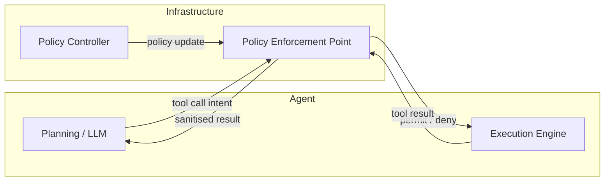
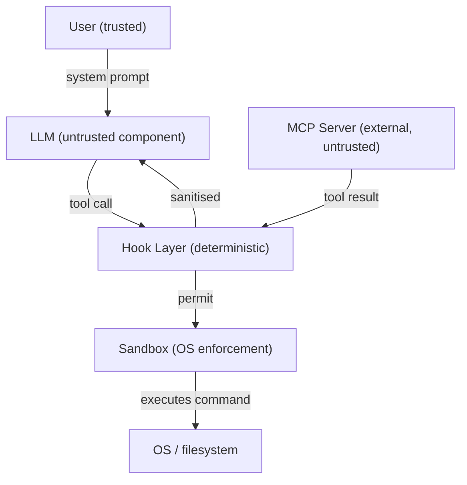

# Agent Security as a Networking Problem: Infrastructure-Level Controls for Codex CLI


A position paper published this month argues that the entire conceptual frame for AI agent security is wrong. Tran, Sharma, Dhesi, and Feamster at the University of Chicago (arXiv:2608.12172)[^1] contend that existing defences are predominantly agent-centric — they rely on the agent itself to detect, report, and refuse malicious instructions — and that this is structurally unsound because LLM behaviour is nondeterministic and inherently vulnerable to prompt injection. The proposed remedy is borrowed from networking and distributed systems: move enforcement outside the agent entirely, and treat the model as an untrusted component within a larger, policy-governed infrastructure.

This framing sits alongside a growing cluster of papers that treat agent security as a systems-level concern rather than a modelling problem. "Agent Security is a Systems Problem" (arXiv:2605.18991)[^2] articulates the same premise from an operating-systems perspective, proposing analogues to NX-bit memory protection and instruction–data separation for context windows. This article examines what the networking lens specifically adds, and maps both papers' prescriptions to Codex CLI's current capability set.

## Why Agent-Centric Defences Fail

The dominant mitigation strategies for prompt injection and tool misuse — better system-prompt wording, model-level refusals, RLHF hardening — all share a common flaw: they trust the agent to police itself. This is precisely what network engineers would never accept for a firewall. No serious network security architecture asks the endpoint to decide unilaterally whether a packet should reach the internet.

The same logic applies to agents. When a malicious tool response arrives via MCP and instructs the model to exfiltrate credentials, the model's context window becomes the attack surface. Whether the model complies or refuses depends on stochastic inference, the precise wording of the payload, and the system prompt at that moment — none of which constitute a security invariant. Tran et al. put it plainly: "relying on the agent itself to detect threats fails because LLM behaviour is inherently nondeterministic and susceptible to attacks such as prompt injection."[^1]

## Three Networking Principles, Translated

The paper draws three analogies from classical network security and re-applies them to agent infrastructure.

### 1. Centralised Control, Distributed Enforcement

In software-defined networking, a central controller sets policy while distributed data-plane enforcement points (switches, firewalls) apply rules deterministically. No individual switch decides whether a flow is permitted — it consults policy. Agent architectures should do the same: planning, execution, and verification should be architecturally separated, with policy enforced at boundaries, not inside the model.



The enforcement point sits between the model's intent and the tool execution, and between the tool result and the model's context — preventing both outbound abuse and inbound injection.

### 2. Isolation and Compartmentalisation

Network segmentation prevents lateral movement: a compromised host in a DMZ cannot reach internal databases without crossing an explicit boundary. The equivalent for agents is capability-based access: each agent function operates in the narrowest possible capability scope, and capabilities are not implicitly inherited.

Concretely, this means the agent's planning component should not have write access to the filesystem. The shell execution component should operate in a network segment that cannot reach credential stores. The MCP client should consume tool results through a sanitisation boundary that normalises response structure before it enters the context window.

### 3. Threat-Model Awareness Through Topology

Network threat modelling reasons from topology: once you know which components communicate over which paths, you can enumerate the attack surface. Tran et al. argue that agent threat modelling should follow the same discipline — mapping trust zones, communication paths, and privilege propagation chains — rather than performing ad hoc reasoning about individual prompts.



Mapping this topology immediately reveals where agent-centric defences have no leverage: the path from `MCP → LLM` and the path from `LLM → Sandbox` both bypass the model's refusal capability if the payload is crafted to evade detection.

## Codex CLI as a Case Study

Codex CLI's existing security architecture partially implements the networking paper's prescriptions — sometimes deliberately, sometimes incidentally.

### What Codex CLI Gets Right

**Sandbox as distributed enforcement.** The sandbox layer (macOS Seatbelt / Linux Landlock / Windows DACL)[^3] is the strongest implementation of deterministic distributed enforcement in Codex CLI today. When `network_mode = "off"` is configured, no amount of model-generated shell code can open a socket — the kernel enforces the policy, not the LLM. This is exactly the networking principle: deterministic enforcement at the boundary, independent of model intent.

**PreToolUse hooks as policy enforcement points.** PreToolUse hooks fire before Bash tool execution and can deny the call with a non-zero exit code.[^4] This is a policy enforcement point sitting at the `LLM → Sandbox` boundary. Its limitation — it currently intercepts only Bash tool calls, not MCP calls — corresponds directly to the gap in the topology diagram above: the `MCP → LLM` path has no enforcement point today.

**Untrusted project gate as capability boundary.** When Codex CLI encounters an unfamiliar project directory, the trust prompt prevents loading of project-scoped configuration — AGENTS.md, hooks, MCP server entries, skills — until the user explicitly grants trust.[^5] This is isolation: the project layer is a capability boundary, not a soft recommendation.

**Named profiles as role compartmentalisation.** Different `[profile.*]` stanzas in `config.toml` can assign different approval policies, tool sets, and network modes to different workloads. A read-only research profile and a write-enabled implementation profile are capability-isolated configurations — coarse-grained compartmentalisation.[^4]

### What's Missing

The paper's reference architecture requires a **sanitisation boundary on the `MCP → LLM` path** — precisely what the `ToolLifecycleContributor::on_mcp_tool_result` extension hook introduced in v0.151.0[^6] now enables. A hook registered at this point can inspect or replace an MCP tool result before it enters the model's context. Used correctly, it is the enforcement point that closes the gap in the topology diagram.

However, two structural gaps remain:

1. **No policy language.** Codex CLI has no declarative security policy layer — no ACL syntax for specifying which tools a given profile may call, which MCP servers may supply results for which tool categories, or what data flows are permitted between components. The current model is binary (permit/deny) at coarse granularity.

2. **No inter-component monitoring.** The networking approach requires observing communication patterns between components to detect anomalies. Codex CLI's `rollout.jsonl` records execution history, but no component currently reads this stream in real time to identify suspicious tool call sequences or privilege escalation chains.

## Practical Recommendations

Given the networking frame, the highest-leverage hardening actions for Codex CLI are those that move enforcement out of the model and into infrastructure:

```toml
# .codex/config.toml — infrastructure-level controls
[sandbox]
network_mode = "off"          # kernel enforcement: no socket access regardless of model intent

[approval_policy]
mode = "unless-allow-listed"  # default deny: require explicit permit for each tool action

[[mcp.servers]]
name = "internal-db"
url  = "http://localhost:5432"
required = false
grace_period_sec = 5          # non-blocking startup; failure does not grant fallback access
```

For the MCP result path, a `ToolLifecycleContributor` extension can strip sensitive keys before they reach the context window:

```rust
// extension: on_mcp_tool_result
fn on_mcp_tool_result(&self, result: &mut McpToolResult) -> HookOutcome {
    // Strip credential-shaped values from tool results before LLM consumption
    if let Some(content) = result.content_mut() {
        content.sanitise_credentials();
    }
    HookOutcome::Passthrough
}
```

This is the agent equivalent of a DMZ firewall rule: deterministic, operating at the boundary, independent of model behaviour.

## Conclusion

The networking framing offers practitioners a more stable mental model than prompt-level defences. Network engineers do not ask "will the model refuse this?" — they ask "does the policy permit this path?" and "who enforces the policy?" Applied to Codex CLI, the checklist is: sandbox for OS-level enforcement, PreToolUse hooks for the `LLM → tool` boundary, `on_mcp_tool_result` for the `MCP → LLM` boundary, untrusted project gate for project capability isolation, and named profiles for workload compartmentalisation. The two remaining gaps — a declarative policy language and real-time inter-component monitoring — represent the practical research agenda for the next iteration of agent harness security.

## Citations

[^1]: Tran V., Sharma T., Dhesi T.S., Feamster N. "Rethinking Agent Security as a Networking Problem." arXiv:2608.12172 (August 2026). <https://arxiv.org/abs/2608.12172>
[^2]: Christodorescu M. et al. "Agent Security is a Systems Problem." arXiv:2605.18991 (May 2026). <https://arxiv.org/abs/2605.18991>
[^3]: OpenAI. "Codex CLI Sandbox Architecture." Codex CLI documentation. <https://github.com/openai/codex>
[^4]: OpenAI. "Codex CLI Configuration Reference — Hooks and Profiles." Codex CLI documentation. <https://github.com/openai/codex>
[^5]: OpenAI. "Codex CLI v0.147.0 Release Notes — Project Trust Gates." GitHub Releases. <https://github.com/openai/codex/releases>
[^6]: OpenAI. "Codex CLI v0.151.0 Release Notes — ToolLifecycleContributor." GitHub Releases. <https://github.com/openai/codex/releases>
