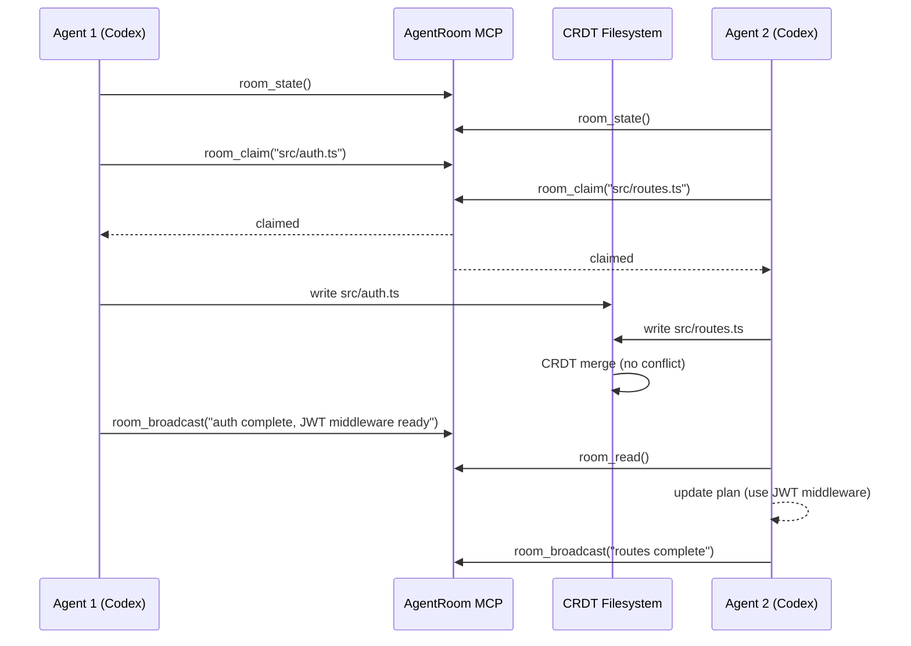
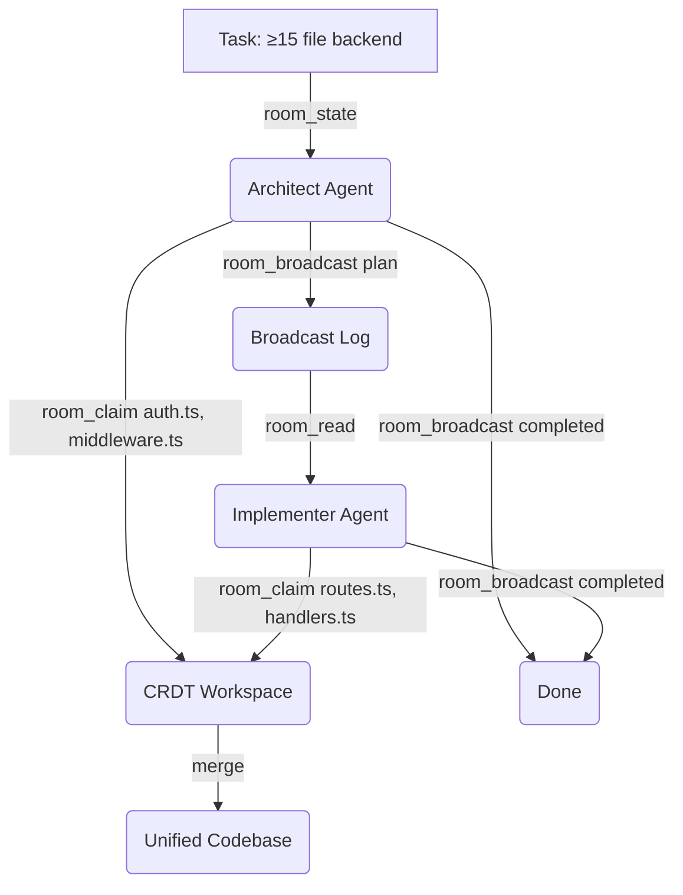

# AgentRoom: CRDT-Backed Concurrent Coding Agents — What 13.7× Abandonment Suppression Means for Your Codex CLI Multi-Agent Setup


Running two Codex CLI agents at the same time is not the same as running two of them *together*. Cho and Lee's AgentRoom (arXiv:2608.23740, August 2026)[^1] isolates this difference with matched-compute ablations across five frontier models and four complex backend tasks. The headline result: coordinated concurrent agents suppress task abandonment odds by **13.7×** compared to solo agents (p<10⁻⁵)[^1], while naïve concurrent agents — no coordination, just two processes writing to the same workspace — *underperform* a single agent (0.456 vs 0.544 LLM-judge quality)[^1].

The paper's central finding is deceptively simple: **coordination, not parallelism, bears the load.** The CRDT substrate prevents byte-level data loss; the MCP coordination layer is what prevents semantic disasters.

## The 1-File Abandonment Problem

Before examining what AgentRoom does, it is worth understanding what it fixes. The dominant failure mode across all solo-agent runs is labelled *1-file abandonment*: the agent emits a one-file source skeleton and exits early, typically when confronted with large, multi-file tasks (≥10 files, ≥300 s budgets)[^1]. For the financial-ledger task (T4, ≥15 files), Codex specifically exhibited abandonment in 9 of 17 runs under solo conditions — a 52.9% abandonment rate[^1].

This is not a context or reasoning failure. It is a motivational-scope failure: the agent assesses the breadth of work remaining, finds it unbounded, and terminates rather than committing to partial progress. Two coordinated agents can decompose that scope, each committing to a bounded slice, with the other filling gaps.

Under AgentRoom, Codex abandonment on T4 fell to 2 of 21 runs (9.5%, p=0.005)[^1].

## System Architecture

AgentRoom comprises three components[^1]:

**1. CRDT-merged workspace.** All agents share a single filesystem managed by `pycrdt` (a Rust Yrs port). Concurrent character-level writes merge within 2 seconds with brace-balance sanity checks. This achieves *Strong Eventual Consistency* (SEC): any two replicas that receive the same operations converge to identical state[^1]. SEC eliminates data loss under simultaneous edits — but it is a property over byte sequences, not semantic intent. Two agents writing to `server.ts` from different logical starting points will *converge*, but the result may be semantically incoherent.

**2. MCP coordination interface.** Five tools expose structured coordination state:

| Tool | Purpose |
|------|---------|
| `room_claim(path)` | Atomically assigns file ownership; rejects if already claimed |
| `room_release(path)` | Relinquishes a claim |
| `room_broadcast(msg)` | Appends to append-only shared message log |
| `room_read()` | Returns full message log and claimed-file map |
| `room_state()` | Reports peer status and workspace summary |

**3. Advisory protocol.** Agents are instructed to follow a six-step workflow: read room state, claim files needed, revise plans if claims conflict, write only claimed files, poll for peer updates, and broadcast completion via `room_broadcast`[^1]. The protocol is advisory — agents can deviate — but deviation is visible to peers through the state tools.



The collision probability without coordination at N=2 with a ~5-file candidate pool is approximately p≈0.20[^1]. File-level claims drive this to zero at O(1) cost per edit.

## Quantitative Results

The six-condition ablation on T4 (Sonnet 4.6, matched compute, N=245 runs) gives a clean ordering:

| Condition | Mean Quality (LLM-judge) | n | σ |
|-----------|--------------------------|---|---|
| ChatDev-style sequential | 0.333 | 6 | 0.197 |
| Parallel-merge (naive concurrent) | 0.456 | 12 | 0.178 |
| Solo | 0.544 | 32 | 0.222 |
| Shared-only (CRDT, no protocol) | 0.575 | 11 | 0.155 |
| Shared+collab (no MCP tools) | 0.588 | 7 | 0.188 |
| **AgentRoom (full)** | **0.669** | **14** | **0.140** |

Source: Table 2, AgentRoom[^1]

Two effects stand out:

**Naïve parallelism regresses.** Parallel-merge (0.456) is worse than solo (0.544). Uncoordinated concurrent agents overwrite each other's in-progress work; the timestamp-based post-hoc merge retains whichever agent committed last, discarding the other's progress. Adding a CRDT substrate without the coordination protocol (shared-only: 0.575) partially recovers this, but still underperforms solo on quality.

**MCP tools drive the marginal gain.** Removing MCP tools while retaining CRDT+prompt (shared+collab: 0.588) gives only +0.013 over shared-only. The full AgentRoom stack adds +0.081 more[^1]. Explicit claim/broadcast signals are the mechanism.

### Variance Reduction

Standard deviation compression at N=2 versus solo[^1]:

- Sonnet T4: 0.222→0.140 (37% reduction)
- Haiku T4: 0.25→0.17 (32% reduction)
- Codex T4: 0.27→0.15 (44% reduction)

For production use, this is arguably as important as mean improvement: a system that occasionally produces good output but frequently fails is difficult to rely on.

### Cost Parity: 2×Haiku vs 1×Sonnet

At ~50% dollar cost, 2×Haiku AgentRoom (0.662, n=17) outperforms 1×Sonnet solo (0.544, n=32): Welch t=2.10, p=0.036[^1]. This is not a claim that Haiku outperforms Sonnet in capability — the T4 task is chosen to make the point where abandonment suppression, not raw intelligence, is the binding constraint. On tasks where reasoning quality dominates, the picture will differ.

### Scaling Past N=2

Quality under LLM-judge peaks at N=2; tests-passing peaks at N=3[^1]. Beyond N=3, `room_broadcast` traffic rises superlinearly — each agent reads the full message log on every `room_read` call, so broadcast log length scales O(N×T) in agent count and turns. The current single-channel architecture has a saturation ceiling the authors acknowledge explicitly[^1].

## Codex CLI Integration

AgentRoom ships as an MCP server installable via pip:

```bash
pip install agentroom
python -m agentroom.selftest   # verify CRDT substrate
```

Register it in `~/.config/codex/config.toml` for use across sessions:

```toml
[mcp_servers.agentroom]
command = "python"
args = ["-m", "agentroom.server"]
env = { AGENTROOM_WORKSPACE = "/path/to/shared/workspace" }
required = true
```

Or as an optional server with grace period (v0.151.0 pattern[^2]):

```toml
[mcp_servers.agentroom]
command = "python"
args = ["-m", "agentroom.server"]
required = false
grace_period_sec = 10
```

### Enabling Shared Writable Roots

For Codex CLI's `multi_agent_v2`, the shared workspace must be inside `writable_roots`:

```toml
[sandbox]
writable_roots = ["/path/to/shared/workspace"]
network_access = "workspace-only"
```

### AGENTS.md Collaboration Directives

The advisory protocol only works if agents actually follow it. Add explicit directives:

```markdown
## AgentRoom Coordination Protocol

When multiple agents are active in this workspace:
1. Call room_state() at session start and after each turn
2. Call room_claim(path) before writing any file; retry if rejected
3. Broadcast progress after completing each file: "completed <file>: <one-line summary>"
4. Read room_read() before planning to avoid duplicating in-progress work
5. Release claims before session end via room_release()
6. Do not modify files claimed by peers
```

### Named Profiles for Heterogeneous Pairings

The heterogeneous pairing result (Sonnet+Codex: 0.721 vs paired Sonnet: 0.669[^1]) suggests matching model strengths to task roles. Define specialist profiles:

```toml
[profiles.architect]
model = "o4-high"
instructions = "You are the planning agent. Decompose the task, assign file ownership, and broadcast the decomposition before writing."

[profiles.implementer]
model = "o4-mini"
instructions = "You are the implementation agent. Read room state first, claim your assigned files, implement, then broadcast completion."
```

Launch with:

```bash
codex --profile architect "implement a JWT auth + marketplace API backend"
# In a second terminal:
codex --profile implementer
```



## Codex-Specific Considerations

The paper notes that Codex exhibits *architectural resistance to decomposition*: left unprompted, it defaults to monolithic single-file outputs even when given multi-file tasks[^1]. This aligns with observed behaviour in long solo sessions — Codex tends to consolidate logic rather than distribute it.

Under AgentRoom, this bias is a liability: an agent that monolithically drafts a single large file will hold one claim for a long time, blocking peers. The AGENTS.md directive should explicitly require narrow, incremental claims:

```markdown
Prefer to claim and complete one file at a time.
Do not claim files you will not write within the next turn.
```

The paper also notes GPT-5.4-mini was excluded from headline results due to concurrent MCP execution crashes[^1]. If you are using a mini-tier model in a multi-agent setup, verify MCP stability before relying on it in production workflows.

## Comparison with Sequential Pipelines

ChatDev-style sequential pipelines (design→implementation→review) scored 0.333 vs AgentRoom's 0.669[^1] — half the quality at equivalent compute. The sequential approach amplifies the abandonment failure mode: if the design phase produces an underspecified skeleton, the implementation phase inherits that skeleton as ground truth and has no mechanism to fill gaps.

CoAgent (arXiv:2606.15376)[^3] addresses the same concurrency problem from a different angle: a MTPO (Monotonic Trajectory Pre-Order) protocol that serialises agent access and uses saga-style compensation for conflicting writes. CoAgent achieves 1.4× speedup while staying within 5% of serial correctness on contended workloads[^3]. AgentRoom and CoAgent represent complementary points in the design space: AgentRoom favours explicit coordination (claim before write), CoAgent favours post-hoc conflict detection and repair. For codebases with sparse per-file contention — the typical profile for backend API generation — AgentRoom's claim model should dominate; for dense multi-agent rewrites of existing code, CoAgent's repair model may be preferable.

## Gaps and Caveats

**TypeScript/Express dominance.** All headline results use a single runtime; Python DevBench and Rust+axum spot-checks (n≤5) are described as mechanism-portability probes, not magnitude claims[^1]. The abandonment suppression odds ratio may differ substantially on lower-file-count tasks or dynamically typed codebases with different abandon patterns.

**N=2 optimum.** The quality peak at N=2 and superlinear broadcast cost beyond N=3 suggest single-channel broadcast is not production-ready for larger teams[^1]. Multi-channel or hierarchical coordination architectures are listed as future work.

**Oracle-free evaluation.** LLM-judge quality scores are the primary metric; agent-authored test suites lack held-out oracles[^1]. The exec-oracle replay in Appendix B.18 corroborates endpoint ordering but does not cover the full result space.

**Model version drift.** Results are pinned to specific hosted model versions (Sonnet 4.6, GPT-5.4); server-side changes can shift outcomes without replication[^1].

## Summary

AgentRoom's contribution is methodological as much as technical: by ablating coordination from concurrency from CRDT substrate, it shows that explicit MCP signalling — not parallelism or merge semantics — explains multi-agent quality gains. For Codex CLI practitioners, the practical takeaways are:

1. **Do not run two Codex processes on the same workspace without coordination.** Naïve parallel-merge underperforms solo.
2. **Add AgentRoom or equivalent claim/broadcast tooling** for tasks spanning ≥10 files or ≥300 s budgets — the regimes where abandonment dominates.
3. **Write narrow claims.** Codex's monolithic bias requires explicit AGENTS.md instruction to decompose work into per-file increments.
4. **Consider 2×Haiku over 1×Sonnet** for large, abandonment-prone tasks where scope decomposition is the binding constraint.
5. **Cap agent count at N=2 or N=3** with current single-channel broadcast architecture.

The paper is available at <https://arxiv.org/abs/2608.23740>; the MCP server is at <https://glama.ai/mcp/servers/seonglae/agentroom>[^4].

## Citations

[^1]: Cho S. and Lee D., "AgentRoom: Concurrent Multi-Agent Coding in a CRDT-Backed Shared Workspace," arXiv:2608.23740, August 24, 2026. <https://arxiv.org/abs/2608.23740>

[^2]: OpenAI, "Codex CLI v0.151.0 Release Notes," GitHub, August 29, 2026. <https://github.com/openai/codex/releases/tag/rust-v0.151.0>

[^3]: Kim et al., "CoAgent: Concurrency Control for Multi-Agent Systems," arXiv:2606.15376, June 2026. <https://arxiv.org/abs/2606.15376>

[^4]: Cho S., "AgentRoom MCP Server," Glama, 2026. <https://glama.ai/mcp/servers/seonglae/agentroom>

[^5]: OpenAI, "Codex CLI v0.152.0-alpha.1 Release," GitHub, August 29, 2026. <https://github.com/openai/codex/releases>
