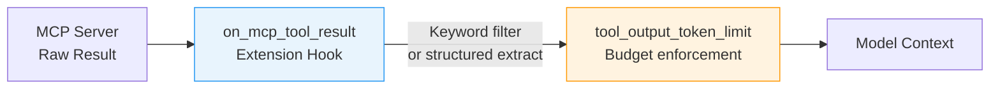
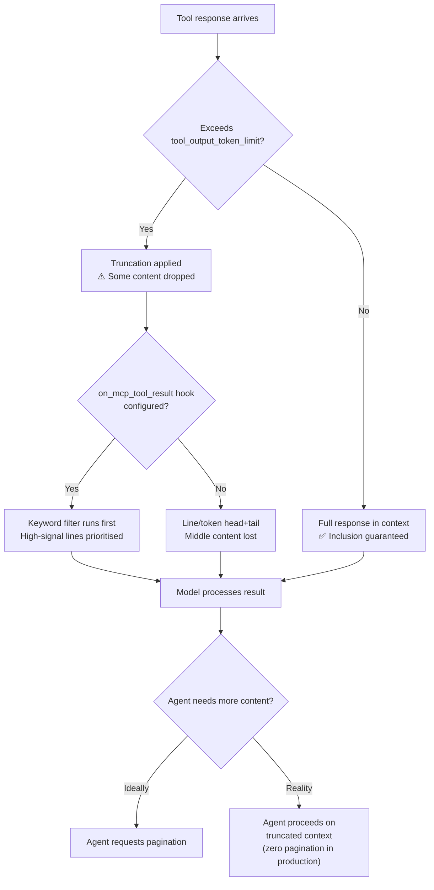

# Agents Don't Paginate: First-Chunk Inclusion Is What Drives Tool-Response Accuracy


A paper published in August 2026 by Petrova, Mazniak, and State (arXiv:2608.26130)[^1] delivers two findings that should reshape how Codex CLI teams reason about tool-output truncation. The first is an empirical observation about agent behaviour that borders on embarrassing: across a production corpus of session logs from an MCP middleware serving Claude Code, Cursor, Codex CLI, and Aider clients, the rate of agent-initiated second-chunk (pagination) requests is exactly zero.[^1] The second is a controlled experiment showing that improving where relevant content ranks *within* the first chunk provides no downstream accuracy benefit — what matters is whether the right content is *included* at all.

## The Pagination Blindspot

Every major tool-call protocol — MCP, function calling, shell exec — offers a mechanism for agents to request additional pages of output. The assumption baked into most middleware and harness designs is that agents will use this facility when truncated output proves insufficient. They don't.

Petrova et al. examined production session logs from a publicly released MCP middleware federating seven SaaS providers and found zero agent-initiated second-chunk requests across the entire corpus.[^1] The pagination path is implemented but never invoked. Agents appear to treat each tool response as a complete, authoritative answer and proceed accordingly — whether or not critical content was truncated.

This has a direct corollary for Codex CLI: the `tool_output_token_limit` key in `config.toml` and the line-based truncation used in earlier versions[^2] are the *only* mechanisms controlling what reaches the model. There is no recovery path once content is omitted. The first chunk is the only chunk.

## Methodology: First-Chunk Selection as a Knapsack Problem

The authors formalise the selection problem: given a tool response with *N* candidate items (files in a directory listing, log lines, search results), costs equal to token counts, and a per-response budget *B*, choose the subset that maximises value. They test six value functions against 500 SWE-bench Verified tasks, measuring *precision-at-1* (p₁) — whether the gold item (the file the agent actually needed) appears as the first selected item:

| Value Function | Description | p₁ |
|---|---|---|
| FIFO | Filesystem-traversal order (production baseline) | 24.2% |
| Random | Uniform random control | ~24% |
| Reversed | Adversarial inverse of FIFO | ~14% |
| Priority-KW | Cosine similarity between tokenised item path and query | **35.0%** |
| Priority-KW+ | Priority-KW with FIFO fallback | **35.8%** |
| Priority-ALL | Composite: keyword + depth + extension + mtime + filename | 30.2% |

Priority-KW improved p₁ by 10.8 percentage points over the production baseline (p = 3.9 × 10⁻⁸).[^1] Priority-ALL, despite incorporating five signals, *underperformed* Priority-KW by 4.8 percentage points (p = 0.001). More signal is not monotone.

## The Central Negative Result

Having established that Priority-KW meaningfully improves where relevant content ranks in the first chunk, the authors then measured whether that ranking improvement translates into downstream accuracy gains. They ran a file-localisation probe on a 100-task subset across five language models (4,800 LLM calls total).[^1]

The result: per-model accuracy deltas ranged from −2.8 to +2.2 percentage points. No model showed statistically significant improvement.

```
Model               FIFO accuracy   KW accuracy   Delta
Claude Opus 4.7     94.0%           93.8%         −0.2pp
Claude Sonnet 4.5   90.8%           93.0%         +2.2pp
GLM-5.1             93.3%           90.5%         −2.8pp
gemma4:26b          86.3%           87.3%         +1.0pp
gpt-oss:20b         81.8%           82.5%         +0.7pp
```

The explanation the authors offer: "The agent recovers the gold from anywhere in the chunk it reads; so what reaches its answer is first-chunk *inclusion*, not the gold's *rank* within it."[^1] Modern frontier models are robust enough to find needed content anywhere in the context — what they cannot do is read content that was never included.

## What This Means for Codex CLI Configuration

The implication is a shift in where engineering effort belongs: from *reranking* to *inclusion*. Codex CLI exposes several levers.

### tool_output_token_limit

The `tool_output_token_limit` key caps how many tokens a single tool response can contribute to context.[^3] Setting this too low discards content that will never be recovered. Setting it too high risks crowding out other context that drives accuracy on subsequent turns.

```toml
[model]
model = "codex-1"

# Inclusion budget — make this as generous as your context window allows
tool_output_token_limit = 16000

# Full compaction triggers only when needed
model_auto_compact_token_limit = 180000
```

The paper's finding suggests that raising `tool_output_token_limit` (maximising inclusion) is a higher-leverage intervention than any reranking approach applied at the middleware layer.

### Codex CLI's Historical Truncation Behaviour

Codex CLI has historically used a line-based truncation strategy (256 lines or 10 KiB, whichever is smaller), with a head-plus-tail approach that omitted the middle of long outputs.[^2] A community-driven effort (issue #6426) pushed for token-based truncation with configurable limits, arguing that 25k tokens may represent over 500 lines of dense code — content that would be silently discarded under the line-based regime.[^4]

The paper provides empirical grounding for that argument: the middle of a truncated output is not recoverable, and agents will not ask for it.

### on_mcp_tool_result as a Quality Gate

Codex CLI v0.151.0 introduced the `on_mcp_tool_result` extension hook, which fires before a tool result reaches the model.[^5] This hook can be used to apply inclusion-maximising transformations — stripping low-signal boilerplate, extracting structured subsets, or applying keyword-based selection — before the budget limit is applied.



A minimal keyword-extraction hook in Python:

```python
#!/usr/bin/env python3
"""
on_mcp_tool_result hook: strips lines with no query-term overlap
before the budget cap is applied.
stdin: {"tool_name": str, "result": str, "query_terms": [str]}
stdout: {"result": str}  or exit non-zero to reject
"""
import json, sys

payload = json.load(sys.stdin)
terms = [t.lower() for t in payload.get("query_terms", [])]
result = payload["result"]

if not terms:
    print(json.dumps({"result": result}))
    sys.exit(0)

filtered = "\n".join(
    line for line in result.splitlines()
    if any(t in line.lower() for t in terms)
)
# Fall back to full result if filter removes everything
output = filtered if filtered.strip() else result
print(json.dumps({"result": output}))
```

Register via `plugin.toml`:

```toml
[plugin]
name = "keyword-result-filter"
type = "tool_lifecycle"
hooks = ["on_mcp_tool_result"]
command = ["python3", "hooks/mcp_result_filter.py"]
```

The paper's finding that Priority-KW (parameter-free cosine similarity between item path and query) outperforms all composite approaches suggests that simple keyword overlap is sufficient — no embeddings, no learned weights.

## Practitioner Recommendations

Three clear directives emerge from the paper:

**1. Maximise inclusion before worrying about ranking.**
Increasing `tool_output_token_limit` delivers measurable benefit; reranking within that limit does not. If budget is the constraint, widen it.

**2. Report retrieval and accuracy separately.**
p₁ (does the right item rank first?) and downstream accuracy are empirically decoupled. A tool-result preprocessing layer that improves p₁ but not accuracy is providing no real value.

**3. Prefer simple keyword overlap over composite scorers.**
Priority-ALL underperformed Priority-KW despite incorporating five signals. Metadata (modification time, depth, extension) added noise. Parameter-free keyword matching is the reliable baseline.

**4. Do not rely on pagination as a recovery path.**
Agents in production do not paginate. Design truncation policies on the assumption that the first chunk is the final chunk.

## Mapping to the Codex CLI Decision Surface



The diagram captures the current production reality: truncation decisions are permanent, pagination is theoretical, and the `on_mcp_tool_result` hook is the only intervention point between truncation and model consumption.

## Conclusion

Petrova, Mazniak, and State's paper settles a question that has shaped significant middleware engineering effort: does it matter where in a tool response the relevant content appears? The answer is no — provided it appears at all. The practical engineering priority is maximising inclusion within the available budget, applying lightweight keyword filtering at the `on_mcp_tool_result` hook boundary, and treating `tool_output_token_limit` as the primary quality dial. Pagination, as a recovery mechanism, does not exist in practice.

## Citations

[^1]: Petrova, T., Mazniak, A., & State, R. (2026). *Agents Don't Paginate: First-Chunk Selection for LLM Tool Responses*. arXiv:2608.26130. https://arxiv.org/abs/2608.26130

[^2]: OpenAI. (2026). *MCP tool responses truncated after 10 KiB/256 lines (regression in v0.56+)*. GitHub Issue #6544. https://github.com/openai/codex/issues/6544

[^3]: OpenAI. (2026). *Make default shell tool output token limit configurable*. GitHub Issue #20861. https://github.com/openai/codex/issues/20861

[^4]: OpenAI. (2026). *Replace line-based tool output truncation with token-based limits*. GitHub Issue #6426. https://github.com/openai/codex/issues/6426

[^5]: OpenAI. (2026). *Codex CLI v0.151.0: MCP Extension Middleware, Configurable Grace Periods, and Subagent Budget Accounting*. GitHub Releases. https://github.com/openai/codex/releases/tag/v0.151.0
