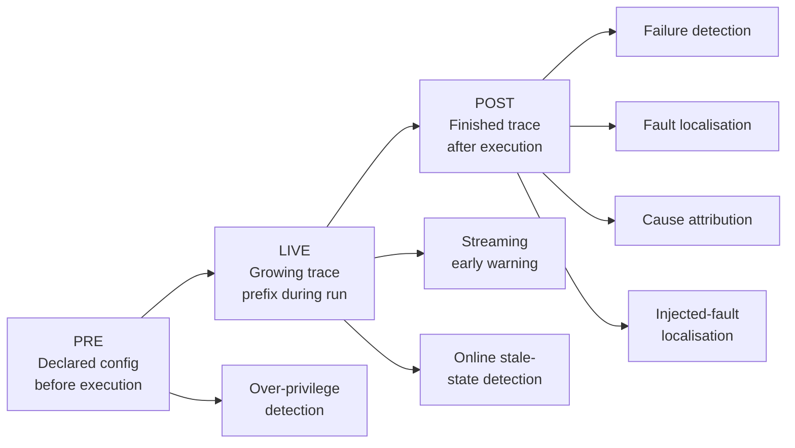
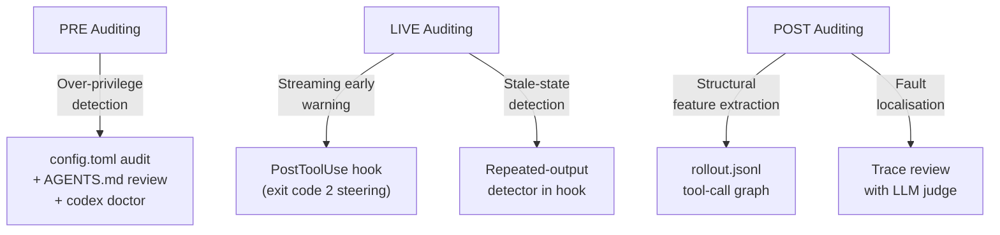

# CatchBench: Auditing Agent Failures at PRE, LIVE, and POST — What It Means for Codex CLI Observability


## Overview

Most coding-agent monitoring is opportunistic: something breaks visibly, you investigate the logs. Yue Zhao's CatchBench[^1] — arXiv:2608.22808, published August 2026, currently in progress — makes the auditing question rigorous. It asks: *at what point in an agent's lifecycle can a failure actually be detected?* The answer is structured around three temporal information states — PRE (declared configuration before execution), LIVE (a growing trace prefix during execution), and POST (the finished trace after execution) — with seven scored boards across five failure scenarios and 72 entrants including rule-based scanners and LLM judges from nine model families.

The headline finding is deliberately uncomfortable: of 118 registered statistical contrasts, only one cleared multiplicity correction.[^1] Detection is harder than it looks, and benchmark scores can be measuring corpus construction artefacts as readily as genuine method capability. For teams running Codex CLI in production, CatchBench is a calibration instrument: it tells you which signals are real, which are coincident, and where your monitoring dollars are actually earned.

## The Three Information States



**PRE** auditing operates on the harness declaration alone — AGENTS.md content, config.toml settings, MCP server registrations, approval policies, tool lists — before a single turn executes. It answers: does this configuration exceed the minimum privilege the task requires?

**LIVE** auditing taps a growing prefix of the execution trace: tool call names, exit codes, token counts, timing, and partial output. The key constraint is that "an audit is usually limited by the record rather than by the method"[^1] — whatever your detector, it can only observe what has already happened.

**POST** auditing has access to the complete trace. This is the richest information state, but also the most expensive: you cannot act to prevent the failure, only attribute and remediate it.

## Seven Boards, Five Scenarios

The benchmark defines seven scored boards across five scenarios.[^1]

| Stage | Board | Task contract |
|-------|-------|---------------|
| PRE   | Over-privilege | Classify whether declared capabilities exceed task requirements |
| LIVE  | Streaming early warning | Predict run outcome from trace prefix (≤25%) |
| LIVE  | Online stale-state detection | Flag loops and deadlocks in-progress |
| POST  | Failure detection | Binary: did this run fail? |
| POST  | Fault localisation | Top-1: which step caused the failure? |
| POST  | Cause attribution | Map failure to a root cause category |
| POST  | Injected-fault localisation | Identify deliberately injected faults in controlled traces |

Datasets: Who&When (126 naturally occurring failures), SWE-Gym (376 runs), tau-bench (660 runs), and 1,187 declared configurations from six real harness sources.[^1]

## What the Numbers Actually Say

### PRE: Position, Not Permission

A combined rule scanner reached 0.654 F1 on PRE over-privilege detection versus a 0.601 flag-all baseline. An LLM judge reached 0.695 F1 on common support.[^1] These are modest gains over a trivial baseline.

The critical finding: one rule ignored every permission name and flagged any capability declared after the first in a configuration list. On one of the six configuration sources, this rule reached perfect F1.[^1] The score was measuring list-ordering in the labelling process, not genuine over-privilege recognition. This is why the paper rejects that substrate from evidential claims entirely. The lesson: PRE detection numbers are not interpretable without the labelling methodology.

### LIVE: Structural Outperforms Learned

At 25% trace completion, unsupervised ECOD anomaly detection reached 0.756 ROC-AUC on SWE-Gym; supervised methods reached 0.742; the run-length-only baseline reached 0.629.[^1] LIVE detection is possible early, but tau-bench remained below the 0.70 resolution threshold — suggesting the signal varies substantially by task type.

Graph-based detectors exhibited excessive seed sensitivity: a 91–164 point spread in AUC depending on random seed.[^1] Off-the-shelf detectors showed no consistent lead across boards.

### POST: The One Result That Held

POST failure detection (binary outcome) using auditable structural features — patch size plus tool-call dependency graph — reached 0.804 ROC-AUC. Size features alone reached 0.663. The structural gain: +0.141 ROC-AUC.[^1] This is the only effect that survived Bonferroni multiplicity correction across all 118 registered contrasts.

POST fault localisation is harder. GPT-5.5 reached 0.452 Top-1 accuracy. An execution-ranking baseline that sorted steps by call count reached 0.211 Top-1 but 0.614 Top-3.[^1] Eight LLM judges formed an unresolved band between 0.333 and 0.452 — none statistically separable.

Cause attribution and injected-fault localisation results were partially redacted due to substrate quality concerns. One injected substrate was rejected outright after evidential shortcuts were identified.

### The Uncomfortable Implication

118 contrasts. 47 separated. 71 unresolved. 1 cleared multiplicity correction.[^1] The paper publishes all results without ranking the unresolved cases. This is methodologically honest and practically sobering: most of what agent monitoring platforms present as "detection capability" has not been tested against this standard.

A companion study, AgentChaosBench[^2], corroborates the difficulty: local fault detectors up to 14B parameters reached only 13.6–19.2% top-1 accuracy on injected faults; DeepSeek-v4-pro reached 24.8%. Guardrail-bypass detection remained "near-unsolved."

## Mapping CatchBench to Codex CLI

Codex CLI exposes observability primitives at each stage. Here is how they map:



### PRE: Configuration Audit Before You Run

The PRE stage maps to your harness declaration:

```toml
# config.toml — over-privilege checklist
[sandbox]
mode = "workspace-write"        # minimum sufficient; not "full-auto"

[approval]
policy = "on-request"           # not "never" for untrusted contexts

[[mcp_servers]]
name = "filesystem"
required = true
# Only declare tools actually needed for the task
```

Codex CLI v0.151.0's `codex doctor` command performs static validation of the declared configuration. The CatchBench insight: avoid accumulating capabilities across releases. A FORTIS-style[^3] over-privilege test — does every declared MCP server tool map to a concrete task requirement? — is worth running before each session profile.

Per CatchBench's finding that position alone predicted over-privilege on one corpus: review the *order* as well as the *content* of your MCP server declarations. Capabilities declared later in a config list may attract lower scrutiny than the first.

### LIVE: PostToolUse as Early-Warning Auditor

The LIVE boards map to Codex CLI's `PostToolUse` hook. At 25% trace completion, anomaly detectors achieved 0.756 ROC-AUC.[^1] Your hook fires after every tool call, giving you the equivalent of a 25%+ prefix at every step.

```toml
# hooks.json
[hooks]
post_tool_use = [
  { command = "bash -c '~/.codex/hooks/live-audit.sh'" }
]
```

```bash
#!/usr/bin/env bash
# live-audit.sh — minimal structural anomaly detector
TRACE="$CODEX_ROLLOUT_PATH"
CALL_COUNT=$(jq '[.[] | select(.type == "tool_call")] | length' "$TRACE" 2>/dev/null || echo 0)
LAST_TWO=$(jq -r '[.[-2:][].tool_name] | join(",")' "$TRACE" 2>/dev/null)

# Stale-state: same tool called consecutively
if [[ "$LAST_TWO" =~ ^([^,]+),\1$ ]]; then
  echo "AUDIT: repeated tool call detected — possible stale state" >&2
  exit 2   # steer the agent with a correction turn
fi

# Budget gate
if (( CALL_COUNT > 80 )); then
  echo "AUDIT: call count $CALL_COUNT exceeds warning threshold" >&2
fi
```

The hook's `exit 2` convention delivers a structured correction message to the model, implementing CatchBench's "streaming early warning" in a deterministic, zero-LLM-cost way.

### POST: rollout.jsonl as Structural Feature Source

CatchBench's sole multiplicity-corrected result is that structural features — patch size and tool-call dependency topology — predict failure outcomes with +0.141 ROC-AUC advantage over run-length alone.[^1] Codex CLI's `rollout.jsonl` is the natural source for these features.

```bash
# Extract structural features for post-session audit
jq -r '
  [.[] | select(.type == "tool_call")] |
  {
    call_count: length,
    unique_tools: ([.[].tool_name] | unique | length),
    file_writes: ([.[] | select(.tool_name == "write_file")] | length),
    patch_lines: ([.[] | select(.tool_name == "write_file") | .args.content // "" | split("\n") | length] | add // 0)
  }
' "$CODEX_ROLLOUT_PATH"
```

For fault localisation, GPT-5.5 at 0.452 Top-1 accuracy outperformed execution-ranking (0.211). But execution-ranking reached 0.614 Top-3.[^1] In practice: reviewing the three highest-call-count steps in a failed run captures the fault more than half the time, without any LLM call.

## Gaps: Where Codex CLI Falls Short of the Framework

CatchBench reveals three structural gaps in the current Codex CLI observability model:

1. **No PRE privilege-minimisation enforcement.** `codex doctor` validates syntax; it does not compare declared tool scope against task requirements. A PRE auditor would need to read AGENTS.md, enumerate declared MCP tools, and flag any tool whose description scope exceeds the stated task.

2. **No multiplicity-aware anomaly baseline.** The current hook system fires on individual tool calls. CatchBench's LIVE boards test detectors against an unresolved baseline population — your live-audit.sh needs the run-length baseline as a reference point, not just an absolute threshold.

3. **rollout.jsonl is append-only with no dependency extraction.** Structural features require a tool-call dependency graph: which tool call's output was used as input by which later call. The JSON log records calls sequentially but does not encode data flow edges. Extracting them requires heuristic argument matching.

These are engineering gaps, not architectural ones. The hook system and rollout format already provide the right substrate; the question is whether your monitoring tooling has been built against CatchBench's precision standard.

## Takeaways for Practitioners

- **POST structural detection is real; most else is unresolved.** The +0.141 ROC-AUC gain from dependency features on SWE-Gym is the only CatchBench result that cleared statistical testing. Everything else should be treated as signal-in-progress.
- **PRE auditing is worth doing, but interpret scores carefully.** A rule that flags capabilities declared after the first in a list is not the same as a rule that understands permission semantics.
- **LIVE early warning at 25% is feasible.** Your PostToolUse hook fires well before 25% trace completion for most sessions; use structural signals (repeated tools, call count, timing anomalies) rather than LLM-based classification.
- **Fault localisation: check the top-3 high-frequency steps first.** The execution-ranking baseline at 0.614 Top-3 is a practical starting point that requires no model invocation.

CatchBench does not offer a complete monitoring stack. It offers something more valuable: a rigorous audit of which monitoring methods actually work, and a reminder that "a benchmark number is not interpretable until the process behind its labels is published."[^1]

## Citations

[^1]: Zhao, Y. "CatchBench: When Can an Agent Failure Be Caught?" arXiv:2608.22808 (August 2026). https://arxiv.org/abs/2608.22808

[^2]: Authors. "When Agentic Executions Fail: Detecting and Localizing Runtime Faults from Telemetry." arXiv:2608.14680 (August 2026). https://arxiv.org/abs/2608.14680

[^3]: Kim, S., et al. "FORTIS: Benchmarking Over-Privilege in Agent Skills." arXiv:2605.09163 (May 2026). https://arxiv.org/abs/2605.09163

[^4]: Jarmak, S. "Engineering Reliable Coding Agents: Evaluating and Operating the System Around the Model." arXiv:2608.13867 (August 2026). https://arxiv.org/abs/2608.13867

[^5]: He, Y., et al. "ProcCtrlBench: Evaluating Process-Level Defects and Control Preservation in LLM Coding Agents." arXiv:2605.20251 (May 2026). https://arxiv.org/abs/2605.20251

[^6]: OpenAI. "Codex CLI v0.151.0 Release Notes." GitHub Releases (August 2026). https://github.com/openai/codex/releases/tag/rust-v0.151.0
