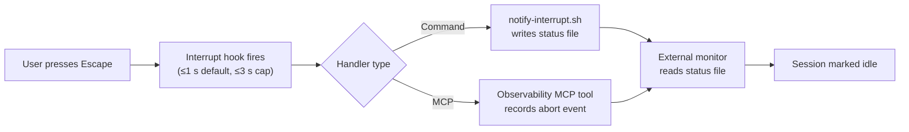
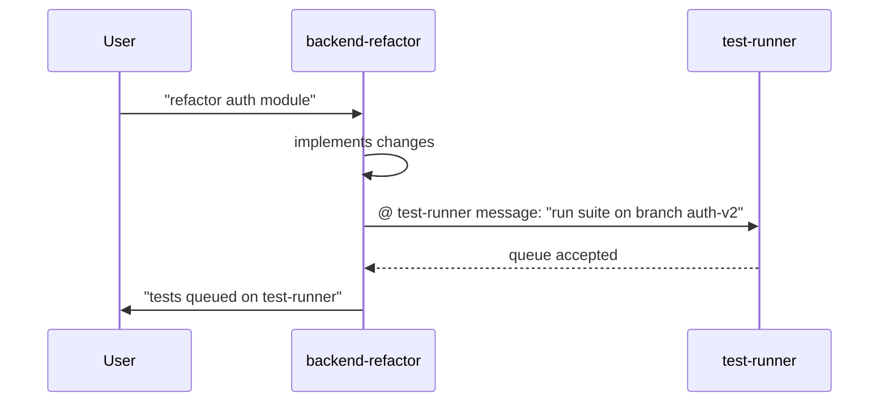
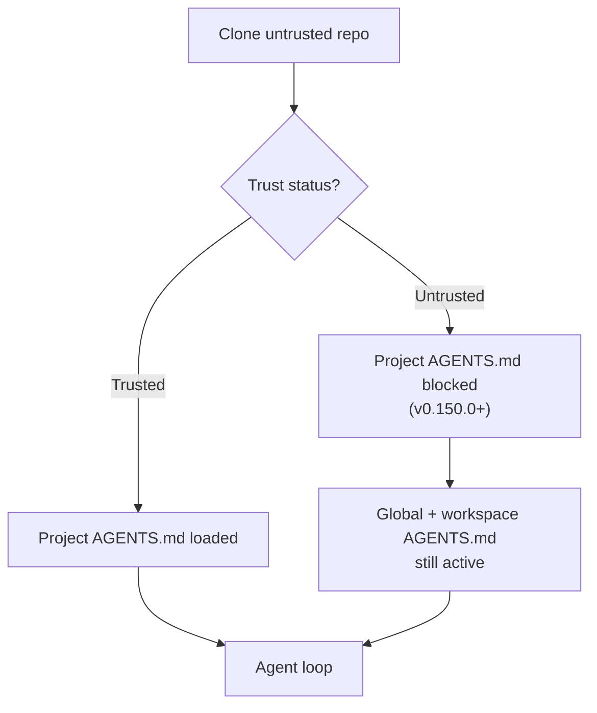

# Codex CLI v0.150.0: Interrupt Hooks, @Task Mentions, the /copy Picker, and Smarter Permission Keybindings


Codex CLI v0.150.0 shipped on 26 August 2026[^1] as a dense quality-of-life release bridging the multi-agent infrastructure of v0.149.0 and the MCP middleware of v0.151.0. Its centrepiece is the `Interrupt` hook — the twelfth event in `HOOK_EVENT_NAMES` — which closes a long-standing gap in the hook lifecycle and unlocks a class of external-state-management patterns that were previously impossible without polling. Alongside that, v0.150.0 tightens terminal ergonomics with `@`-mention task references, a richer `/copy` picker, automatic task titling, clickable Markdown links, and a composable permission-mode keybinding. It also lands two security fixes that reinforce the untrusted-project boundary.

The v0.150.1 patch (27 August 2026) followed immediately with a single targeted fix: remote compaction now counts retained images toward its token budget.[^2]

---

## The Interrupt Hook: Closing the Lifecycle Gap

### Why Stop hooks fell short

Since v0.117.0, Codex hooks have covered five lifecycle events: `SessionStart`, `UserPromptSubmit`, `PreToolUse`, `PostToolUse`, and `Stop`. The `Stop` event fires when a turn concludes normally — but until v0.150.0, a turn cancelled by pressing Escape exited through an abort path inside `run_turn` that bypassed `run_turn_stop_hooks` entirely.[^3] External integrations tracking session state (notification bridges, CI status reporters, workflow orchestrators) had no deterministic signal that a turn had been aborted.

### What Interrupt adds

`Interrupt` is now the twelfth entry in `HOOK_EVENT_NAMES` and fires specifically when a top-level turn is interrupted by the user.[^1] Key behaviour constraints:

- **Timeout:** 1-second default, hard-capped at 3 seconds.
- **Scope:** Top-level turns only — it never fires for subagents.
- **Signal:** Distinct from `Stop`, so a handler can differentiate a natural completion from a mid-flight cancellation.

Declare it in `config.toml` alongside your other hooks:

```toml
[hooks]
Interrupt = [
  { type = "command", command = ["bash", "-c", "/usr/local/bin/notify-interrupt.sh"] }
]
Stop = [
  { type = "command", command = ["bash", "-c", "/usr/local/bin/notify-stop.sh"] }
]
```

Or route it through an MCP tool for richer structured payloads:

```toml
[hooks]
Interrupt = [
  { type = "mcp", server = "observability-mcp", tool = "record_interrupt" }
]
```

### Practical patterns

Because the timeout budget is tight (1–3 s), `Interrupt` handlers should be fast and non-blocking. Three idioms work well:



**State-file pattern** — write a JSON blob to `~/.codex/status/current.json` marking the session `interrupted`. A sidecar process reads this file rather than polling for tool activity.

**Queue drain** — if your workflow queues follow-up prompts via `codex queue`, an `Interrupt` handler can flush the queue before the next turn starts.

**Notification bridge** — fire a `curl` to a webhook or local Unix socket; the 1-second default is sufficient for a non-blocking HTTP POST to `localhost`.

---

## @Task Mentions: Cross-Session Orchestration from the Terminal

v0.150.0 introduces `@`-mention addressing for Codex tasks.[^1] From any terminal session you can reference another running task by name or ID:

```
@ backend-refactor read current status
@ api-agent create subtask: "add rate-limiting middleware"
@ test-runner message: "cancel current run, switch to fast mode"
```

Agents handling these mentions can read state, create child tasks, or send messages into another session's input queue — the same mechanism exposed by `codex queue` but accessible inline during a conversation turn.

This matters most when running several named profiles in parallel. The `backend-refactor` agent can call `@ test-runner message: "run suite against branch X"` without any human-in-the-loop handoff. Combined with the multi-agent dashboard introduced in v0.149.0, this creates a lightweight orchestration layer that lives entirely inside the Codex TUI.



One practical caution: `@`-mention instructions flow into the target agent's conversation as user-level messages. Review the AGENTS.md privilege posture of your receiving agent before enabling unguarded cross-session writes — especially relevant given the privilege escalation research covered in the recent IPE analysis.[^4]

---

## The /copy Picker: Surgical Clipboard Control

The original `/copy` command copied the full last response. v0.150.0 replaces it with an interactive picker:[^1]

```
/copy
  → Full response
  → Code block 1: main.rs (lines 12–47)
  → Code block 2: Cargo.toml
  → Blockquote: "The key insight is..."
```

Arrow keys navigate, Enter selects, Escape cancels. The picker is particularly useful in sessions where the agent has produced multiple code blocks in a single response — you can cherry-pick one file's diff without pulling in unrelated snippets.

---

## Auto-Titling and /rename Suggestions

Unnamed sessions (those started with `codex` or `/new` without an explicit title) now receive descriptive titles automatically, derived from the first substantive exchange.[^1] The TUI uses this title in the thread picker, the agents dashboard, and `@`-mention completion.

`/rename` now suggests an editable title rather than presenting a blank field:

```
/rename
  Suggested: "Refactor auth module — JWT validation"
  > █
```

Accept with Enter or edit in-place. For automation-heavy setups where many sessions start headlessly, auto-titling means the agents dashboard remains navigable without manual bookkeeping.

---

## Permission-Mode Keybinding

Since v0.117.0, cycling permission modes during a live session required running `/permissions` or restarting with a different `--approval-policy` flag. v0.150.0 allows you to bind a keyboard shortcut that cycles modes from the composer:[^1]

```toml
# config.toml
[keymap]
"ctrl+shift+p" = "cycle_permission_mode"
```

Configure via `/keymap` inside the TUI or edit `config.toml` directly. The cycle order follows the standard escalation ladder: `suggest` → `auto-edit` → `full-auto`, then back to `suggest`. Full-access is excluded from the default cycle to prevent accidental escalation; include it explicitly if needed:

```toml
[keymap]
"ctrl+shift+p" = { action = "cycle_permission_mode", include_full_access = true }
```

This aligns with the Shift+Tab pattern from Claude Code and addresses a long-standing community request tracked since early 2026.[^5]

---

## Vim Mode `.` Repeat

A smaller ergonomic addition: Vim mode now supports `.` to repeat the last edit.[^1] For developers writing AGENTS.md files or making repetitive edits across multiple files in the same session, this brings Codex's TUI editor closer to a minimal Vim behaviour surface.

---

## Security Fixes: Untrusted Projects and Deny-Read Persistence

Two security fixes accompany the UX improvements.

### Untrusted projects no longer supply project-level instructions

Before v0.150.0, an untrusted project could still contribute AGENTS.md instructions at the project level, potentially injecting guidance into the agent loop without user awareness. PRs #39837 and #40004 close this:[^6]

> Untrusted projects no longer supply project-level instructions; deny-read rules persist across permission changes.



### Deny-read rules persist across permission changes

Previously, managed `deny-read` rules — file-path exclusions set by the operator — could be silently dropped when the user changed permission modes mid-session. They now survive permission transitions, keeping sensitive path exclusions (credentials, private keys, internal configs) enforced regardless of approval policy changes.

Both fixes are directly relevant to the multi-agent and `@`-mention patterns introduced in this release: cross-session messaging and concurrent agents make it more likely that an untrusted project's AGENTS.md could propagate influence into a trusted agent's context.

---

## v0.150.1 Patch: Image Token Budget in Remote Compaction

The v0.150.1 patch (PR #41003, 27 August 2026) fixes a token accounting gap in remote compaction:[^2] retained images were not counted toward the compaction token budget, meaning a context window heavy with screenshots or diagrams could exceed intended limits after compaction. The patch trims older images as needed to stay within budget, consistent with the half-life compression approach documented for tool outputs in recent harness research.

Operators running vision-heavy workloads (UI testing, diagram generation, screenshot analysis) should upgrade to v0.150.1 or later to avoid silent budget overruns.

---

## Configuration Checklist for v0.150.0

```toml
# ~/.config/codex/config.toml

[hooks]
# New: handle interrupted turns separately from natural completion
Interrupt = [
  { type = "command", command = ["bash", "-c", "echo 'interrupted' > /tmp/codex-status"] }
]

[keymap]
# New: cycle permission mode without restarting
"ctrl+shift+p" = "cycle_permission_mode"

# Existing hooks — unchanged
[hooks.PostToolUse]
command = ["bash", "-c", "/usr/local/bin/post-tool-audit.sh"]
```

No configuration changes are required for auto-titling, the `/copy` picker, `@`-mention resolution, Vim `.` repeat, or the security fixes — these activate automatically on upgrade.

---

## Summary

| Feature | What Changed |
|---|---|
| `Interrupt` hook | New hook event (12th in `HOOK_EVENT_NAMES`); fires on user-initiated turn abort; 1 s default / 3 s cap; top-level only |
| `@`-mention task references | Reference, read, create, or message other tasks from the terminal inline |
| `/copy` picker | Granular clipboard: full response, individual code blocks, blockquotes |
| Auto-titling / `/rename` | Unnamed sessions get descriptive titles; `/rename` suggests editable default |
| Permission-mode keybinding | Bind shortcut to cycle `suggest → auto-edit → full-auto` via `/keymap` |
| Vim `.` repeat | Dot-repeat support in TUI Vim mode |
| Untrusted project AGENTS.md | Project-level instructions blocked for untrusted projects (PRs #39837, #40004) |
| Deny-read persistence | Managed deny-read rules survive permission-mode changes |
| v0.150.1: image compaction | Retained images counted toward remote compaction token budget |

---

## Citations

[^1]: OpenAI, "Release rust-v0.150.0," GitHub Releases, 26 August 2026. <https://github.com/openai/codex/releases/tag/rust-v0.150.0>

[^2]: OpenAI, "Release rust-v0.150.1," GitHub Releases, 27 August 2026. <https://github.com/openai/codex/releases/tag/rust-v0.150.1>

[^3]: openai/codex Issue #22858, "Clarify or fire Stop hook when a turn is interrupted with Esc," GitHub. <https://github.com/openai/codex/issues/22858>

[^4]: He et al., "When Context Gets Root: Privilege Escalation in LLM Harnesses," arXiv:2608.27299, August 2026.

[^5]: openai/codex Issue #34073, "Add a configurable shortcut to cycle permission modes," GitHub. <https://github.com/openai/codex/issues/34073>

[^6]: openai/codex, "Release 0.150.0 security fixes," PRs #39837 and #40004, August 2026. <https://github.com/openai/codex/releases/tag/rust-v0.150.0>
