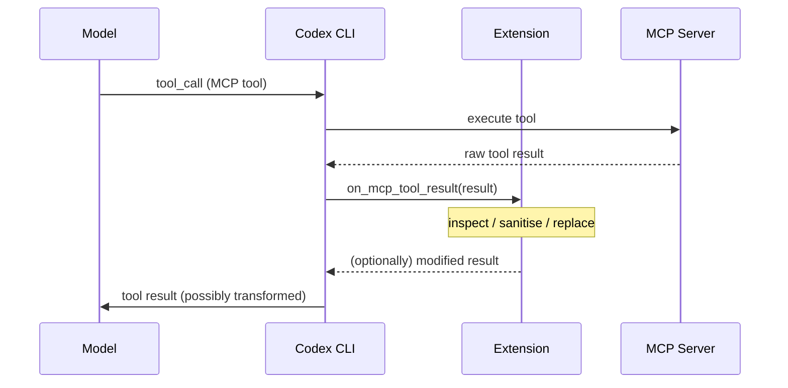
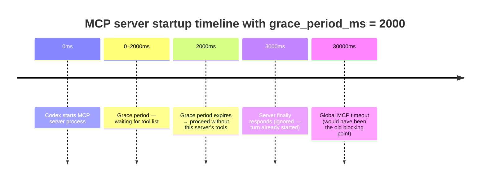
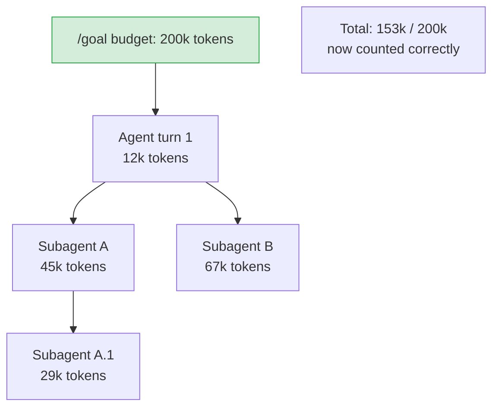

# Codex CLI v0.151.0: MCP Extension Middleware, Configurable Grace Periods, and Subagent Budget Accounting


Released on 29 August 2026, Codex CLI v0.151.0 is a focused quality release with one headline architectural addition — the ability for extensions to intercept and rewrite MCP tool results before the model ever sees them — plus a cluster of hardening fixes that close real operational gaps around MCP startup latency, permission drift, and subagent cost attribution.[^1]

## Extension-Based MCP Tool Result Inspection (PR #41202)

The most significant new capability in this release is middleware-style processing of MCP tool results at the extension layer. Prior to v0.151.0, an extension could only observe what the model did *after* receiving a tool result; now it can transform the result *before* the model processes it.[^2]

This is structurally analogous to the hook system's `PostToolUse` event, but targeted specifically at the MCP connector path rather than the Codex native tool dispatch path. The practical distinction matters: native tools (shell, file read/write) have always been interceptable via `PostToolUse` hooks declared in `config.toml`, but results flowing back from external MCP servers were previously opaque to extension code — they arrived in context without an interception point.



### What extensions can do with this hook

**Sanitisation** — strip PII or secrets from tool output before they enter the context window. A database-query MCP server returning rows with email addresses can have those values redacted before the model sees them.

**Format normalisation** — convert verbose JSON payloads into compact summaries, reducing context window bloat from large API responses.

**Observability injection** — append structured metadata (latency, server identity, schema version) to every tool result without modifying the MCP server itself.

**Fault injection for testing** — replace a real tool result with a fixture during CI runs, enabling deterministic agent behaviour tests without live MCP servers.

### Configuration pattern

Extensions declare their interest in MCP tool results via the extension manifest. No hook configuration in `config.toml` is required for this path — the extension registration alone is sufficient:

```toml
# ~/.codex/extensions/result-sanitiser/manifest.toml
[extension]
name = "result-sanitiser"
version = "1.0.0"

[hooks]
on_mcp_tool_result = "sanitise.sh"
```

The handler receives the raw result on stdin as JSON and writes the (optionally modified) result to stdout. Returning a non-zero exit code rejects the result and surfaces an error to the agent.[^2]

## Configurable MCP Server Grace Period (PR #41199)

Optional MCP servers have always been a latency hazard: if a server is slow to initialise or temporarily unreachable, tool discovery blocks the first turn until the connection attempt times out. Prior to this release the only levers were the global MCP timeout and marking servers as `optional`, which skipped them on failure but did not control the wait time before giving up.[^3]

v0.151.0 adds `grace_period_ms` as a per-server configuration key. Codex waits up to this duration for the server to report its tool list; if the server hasn't responded within the grace period, it proceeds without that server's tools rather than waiting for the global timeout:

```toml
# ~/.codex/config.toml

[[mcp_servers]]
name = "slow-internal-api"
command = "npx"
args = ["-y", "@company/internal-mcp-server"]
optional = true
grace_period_ms = 2000   # give up after 2 s, not the global 30 s default
```

For fast servers on reliable infrastructure, tighten this to a few hundred milliseconds. For genuinely slow servers with a large tool catalogue, a generous grace period avoids tools silently disappearing because the server was marginally late.[^3]



## Plugin Catalog Merging (PR #41208)

Plugin catalog resolution now correctly merges per-repository configuration with the user-level catalog. A repository-level `AGENTS.md` marketplace declaration no longer silently hides globally-configured plugins.[^4]

Invalid marketplace entries are now reported distinctly in `codex doctor` output without suppressing valid entries. Previously a single invalid entry could cause the entire catalog fetch to fail silently.

## Security and Reliability Fixes

### Permission profiles survive `/cd` (PR #41192)

A regression in v0.150.x allowed the `/cd` command to reduce the active sandbox profile when changing into a directory outside the original project root. The permission system correctly widened scope for paths inside the project tree but was incorrectly narrowing it — dropping managed deny-read rules — when navigating out. This is now fixed; the sandbox profile set at session start persists regardless of subsequent `/cd` calls.[^1]

### Model switching respects tool availability (PRs #41195, #41206)

When the active model was changed mid-session (via `/model` or automatic fallback), tool availability and reasoning effort tracking were not reset consistently. In practice this meant an agent could attempt to call a tool that the new model did not support, or inherit an incorrect token budget from the previous model. Both are now corrected at the point of model substitution.

### Remote sandbox enforcement hardened (PRs #41196, #41204, #41207, #41209)

Codex Cloud and SSH executor sessions were constructing sandbox rules using the *local* user's home directory rather than the remote executor's actual home. On executors where the remote home path differs from `~` on the client (a common enterprise configuration), this produced sandbox policies that either failed to apply or were too broad. The executor's own home directory, OS conventions, and path layout are now correctly propagated into sandbox context construction.[^1]

### Guardian classification staleness eliminated (PR #41196)

The Guardian classification cache — which pre-approves recurring tool calls based on historical risk assessments — was not being invalidated on mid-session permission profile changes. A Guardian-approved call could therefore proceed under a tighter profile that would normally require explicit confirmation. Classifications are now re-evaluated against the current profile on every turn boundary.

## Subagent Token Accounting (PR #41183)

Token consumption in nested subagent hierarchies now rolls up correctly to the root `/goal` budget. Previously, tokens spent by a subagent spawned within a goal-directed session were tracked against the subagent's own budget only; the root goal could exhaust the model's context window without the goal budget detecting it.[^5]

With this fix, a `/goal` session with `budget_tokens = 200000` will pause or terminate correctly when the cumulative token spend across all nested subagents reaches that ceiling, not just when the top-level agent's own token use does:



This matters for long-horizon autonomous workflows where the bulk of compute is delegated to subagents — precisely the workloads where unchecked token spend causes the largest bills.

## Upgrading

```bash
# npm global install
npm install -g @openai/codex@latest

# Verify
codex --version   # should report 0.151.0
```

Codex Cloud and app-server deployments update automatically within 24 hours of the tag. No configuration migration is required.

## Summary

v0.151.0 is not a headline-grabbing feature release but it closes several meaningful gaps. The extension MCP middleware opens a new customisation surface that security-conscious teams have been asking for — the ability to sanitise or audit what MCP servers return without forking the server. The grace period configuration unblocks teams with heterogeneous MCP server fleets where a single slow server was degrading every session. And the subagent budget accounting fix makes `/goal` a reliable cost control primitive for multi-agent workflows rather than a leaky approximation.

## Citations

[^1]: OpenAI, "Release 0.151.0," GitHub Codex releases, 29 August 2026. <https://github.com/openai/codex/releases/tag/rust-v0.151.0>
[^2]: OpenAI Codex CLI PR #41202, "Extensions can now inspect or replace MCP tool results before they reach the model," merged August 2026. Referenced in the v0.151.0 release notes.
[^3]: OpenAI Codex CLI PR #41199, "Added a configurable grace period for discovering tools from optional MCP servers," merged August 2026. See also GitHub issue #21318 "MCP startup/tool discovery can block first turn when many MCP servers are configured." <https://github.com/openai/codex/issues/21318>
[^4]: OpenAI Codex CLI PR #41208, "Plugin catalogs now combine per-repository configuration and report invalid project marketplaces," merged August 2026. Referenced in the v0.151.0 release notes.
[^5]: OpenAI Codex CLI PR #41183, "Nested subagent token usage now counted toward root goal budgets," merged August 2026. Referenced in the v0.151.0 release notes.
[^6]: ChatGPT & Codex Changelog, learn.chatgpt.com, accessed 30 August 2026. <https://learn.chatgpt.com/docs/changelog>
