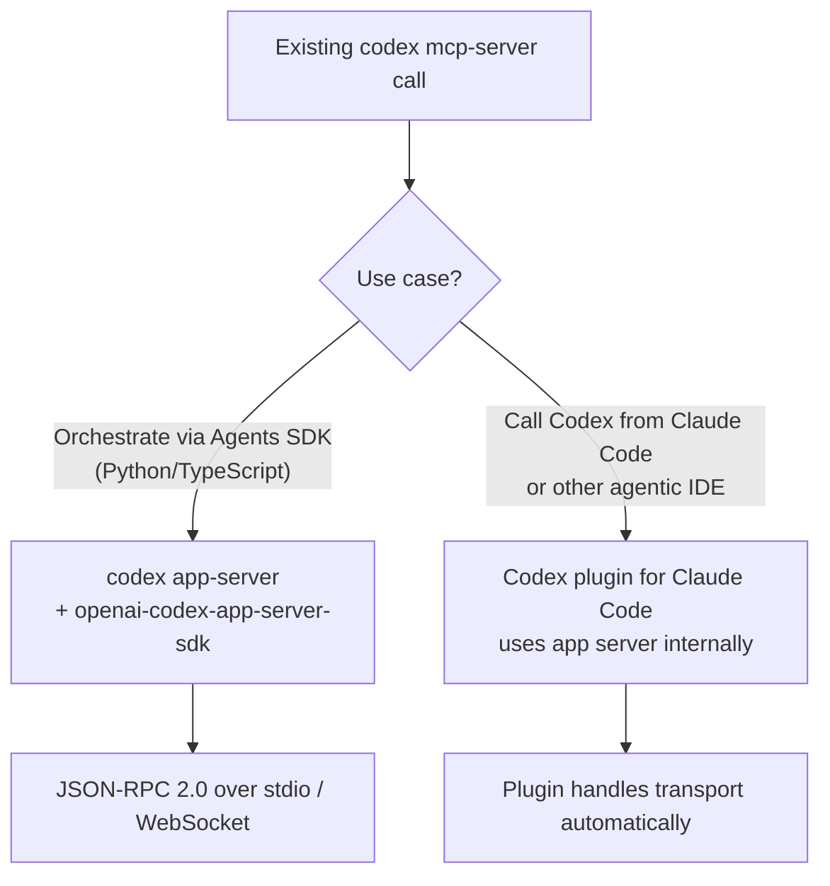

# codex mcp-server Is Deprecated: Migrate to the App Server Before It Disappears


On 24 August 2026, OpenAI officially deprecated the `codex mcp-server` command.[^1] PR #39657 added a deprecation warning printed to `stderr` every time the subcommand is invoked — the server still launches, but the clock is ticking.[^2] If your Agents SDK workflows, CI pipelines, or multi-agent orchestrators call Codex through its MCP server interface, you need a migration plan now.

This article explains why the change happened, what you lose (and gain), and how to replace every `codex mcp-server` call pattern with the app server's JSON-RPC interface.

---

## Why `mcp-server` Is Going Away

The `codex mcp-server` subcommand wrapped the entire Codex agent into two MCP tool definitions:

- **`codex`** — starts a new session with a prompt and optional overrides (`approval-policy`, `sandbox`, `model`, `cwd`, `base-instructions`)
- **`codex-reply`** — continues an existing session given a `thread-id` and a new prompt[^3]

This made it easy to drop Codex into any MCP-aware orchestrator, including agents built with the OpenAI Agents SDK. The problem is structural: MCP is a request/response tool-call protocol, while Codex's native model is stateful, bidirectional, and stream-oriented. Mapping a long-lived agent onto stateless tool calls requires the caller to manage thread IDs, poll for results, and handle approval gates out-of-band — producing brittle glue code that never fully exposed Codex's capabilities.

The app server solves this properly. It is a long-lived JSON-RPC 2.0 process that owns thread state, streams agent events, and supports bidirectional messaging so the server can request approvals from the client mid-turn.[^4] The VS Code extension, the desktop app, and all first-party clients have used the app server since early 2026. The MCP server was effectively an unmaintained compatibility shim.

---

## What the Migration Involves

There are two migration targets depending on your use case:



### Path 1: Replace `codex mcp-server` with `codex app-server` + SDK

The app server speaks JSON-RPC 2.0 over newline-delimited stdio (default) or WebSocket (experimental).[^4] OpenAI ships a Python SDK (`openai-codex-app-server-sdk`) that wraps the wire protocol:

```python
# Before: subprocess calling codex mcp-server tool invocation
import subprocess, json

result = subprocess.run(
    ["codex", "--approval-policy=never", "Fix the failing test in auth.py"],
    capture_output=True, text=True
)
print(result.stdout)
```

```python
# After: app-server SDK
from codex_app_server import Codex

with Codex() as codex:
    thread = codex.thread_start(
        model="gpt-5",
        approvals_reviewer="auto_review",   # replaces approval-policy=never
        sandbox_policy={"mode": "network-disabled"},
    )
    result = thread.run("Fix the failing test in auth.py")
    print(result.final_response)
```

The SDK handles the mandatory `initialize`/`initialized` handshake automatically.[^4] You no longer manage thread IDs manually — the `thread` object is your handle.

### Path 2: Codex plugin for Claude Code

If the orchestrator is Claude Code rather than a custom Agents SDK agent, install the official Codex plugin for Claude Code. It uses the app server under the hood and removes the need to manage the transport layer at all.[^1] Configuration lives in your Claude Code plugin manifest rather than in `config.toml` MCP stanzas.

---

## Detailed Migration: Agents SDK Workflows

If you previously registered `codex mcp-server` as an MCP server inside an Agents SDK agent, the old config looked roughly like:

```python
# Old: Agents SDK + codex mcp-server
from agents import Agent, Runner
from agents.mcp import MCPServerStdio

codex_mcp = MCPServerStdio(
    params={"command": "codex", "args": ["mcp-server"]},
    cache_tools_for_secs=300,
)

agent = Agent(
    name="orchestrator",
    model="gpt-5",
    mcp_servers=[codex_mcp],
)

result = Runner.run_sync(agent, "Refactor the payments module")
```

The replacement uses the app server SDK directly, bypassing the MCP translation layer entirely:

```python
# New: Agents SDK orchestrator calling app-server directly
from agents import Agent, Runner, function_tool
from codex_app_server import Codex

_codex = Codex()
_codex.__enter__()  # persistent process — start once

@function_tool
def run_codex_task(prompt: str, cwd: str = ".") -> str:
    """Run a Codex coding task and return the final agent response."""
    thread = _codex.thread_start(
        model="gpt-5",
        approvals_reviewer="auto_review",
        sandbox_policy={"mode": "network-disabled"},
        cwd=cwd,
    )
    result = thread.run(prompt)
    return result.final_response or "(no textual response — check items)"

agent = Agent(
    name="orchestrator",
    model="gpt-5",
    tools=[run_codex_task],
)

result = Runner.run_sync(agent, "Refactor the payments module")
_codex.__exit__(None, None, None)
```

The gain here is direct access to the thread object — you can call `thread.run(...)` multiple times with full conversation context preserved between calls, implement proper follow-up turns, and inspect `result.items` for structured data rather than scraping stdout.

### Multi-turn conversations

The old `codex-reply` tool threaded sessions via a `thread-id` string that the caller had to store and pass back. The app server preserves this natively:

```python
# Multi-turn with preserved context
thread = codex.thread_start(model="gpt-5", approvals_reviewer="auto_review")

r1 = thread.run("Add unit tests for the UserService class")
r2 = thread.run("Now add integration tests that use a real Postgres container")
r3 = thread.run("Generate a test coverage report and suggest the top three gaps")
```

Each `.run()` call submits a new user turn on the same thread; the agent sees the full prior history without the caller serialising or forwarding it.

### Parallel fan-out

The `thread/fork` method branches a thread without mutating the original — useful for parallel evaluation:

```python
import asyncio
from codex_app_server import AsyncCodex

async def main():
    async with AsyncCodex() as codex:
        parent = await codex.thread_start(model="gpt-5")
        await parent.run("Load the product catalogue dataset")

        # Fork and run two strategies in parallel
        results = await asyncio.gather(
            parent.fork().run("Optimise for query latency"),
            parent.fork().run("Optimise for storage footprint"),
        )

        for r in results:
            print(r.final_response)

asyncio.run(main())
```

---

## Handling Bidirectional Approvals

The MCP server's approval model was limited to what you could express in the `approval-policy` string. The app server makes approval handling explicit and programmable — when Codex needs a decision, it sends a JSON-RPC request *to your client*:

```json
{"id": 42, "method": "execCommandApproval", "params": {
  "command": "rm -rf dist/",
  "cwd": "/home/user/project"
}}
```

Your client responds:

```json
{"id": 42, "result": {"decision": "reject"}}
```

For CI contexts where no human is present, `approvals_reviewer="auto_review"` lets Codex resolve approvals automatically based on sandbox policy — equivalent to `approval-policy=never` in the old MCP surface, but with finer-grained control per tool type.[^4]

---

## Transport and Schema Versioning

The default transport is newline-delimited JSON over stdio — the same wire format used by the MCP server, so existing process-management code (spawn, pipe, kill) transfers directly. Note that the app server's JSON-RPC omits the standard `"jsonrpc":"2.0"` field on the wire.[^5]

Schema types are versioned to the CLI binary. After upgrading `codex`, regenerate TypeScript or JSON Schema definitions:

```bash
codex app-server generate-ts --out ./types/codex
codex app-server generate-json-schema --out ./schemas/codex
```

If you see error code `-32001` with message `"Server overloaded; retry later"`, back off with exponential jitter. The official SDK includes a `retry_on_overload` helper for this.[^5]

---

## State Persistence and Resumability

Codex writes every thread to disk as newline-delimited JSONL under `~/.codex/sessions/YYYY/MM/DD/`:

```
rollout-2026-08-30T10:15:42Z-<thread-id>.jsonl
```

Each line is a session event. To resume a previous thread — for example, after a CI job restart — call `thread_resume` with the stored ID:

```python
thread = codex.thread_resume("thread-abc123")
result = thread.run("Continue from where we left off")
```

This was not possible with `codex-reply` without external state management; the app server owns the rollout and handles reconstruction.[^4]

---

## Checklist: Before Removing `codex mcp-server`

```mermaid
flowchart LR
    A[Audit codex mcp-server usages] --> B[Replace with app-server SDK calls]
    B --> C[Port approval-policy flags to approvals_reviewer]
    C --> D[Port sandbox flag to sandbox_policy dict]
    D --> E[Replace thread-id tracking with thread object]
    E --> F[Add retry_on_overload handling]
    F --> G[Regenerate schema types for new CLI version]
    G --> H[Remove codex mcp-server from config.toml MCP stanzas]
    H --> I[Test with codex app-server generate-json-schema]
```



Key flag mappings:

| Old `codex mcp-server` parameter | App server equivalent |
|---|---|
| `approval-policy=never` | `approvals_reviewer="auto_review"` |
| `approval-policy=on-failure` | `approvals_reviewer="auto_review"` with heuristics |
| `approval-policy=always` | Leave `approvals_reviewer` unset (interactive) |
| `sandbox=off` | `sandbox_policy={"mode": "disabled"}` |
| `sandbox=read-only` | `sandbox_policy={"mode": "read-only"}` |
| `model=o4-mini` | `model="o4-mini"` |
| `base-instructions=<text>` | `system_prompt=<text>` in `thread_start` |

---

## Summary

The `codex mcp-server` deprecation (August 24, 2026, PR #39657) removes a stateless compatibility shim in favour of the richer, stateful app server protocol. The migration cost is modest — mostly replacing subprocess invocations and tool-call registrations with SDK calls — and the payoff is access to multi-turn context preservation, bidirectional approvals, parallel forking, and structured result streaming that the MCP surface could never expose.

The server still starts with a `stderr` warning today. It will not start at all once the removal ships. Start the migration now.

---

## Citations

[^1]: OpenAI. *ChatGPT & Codex changelog* — August 24, 2026 entry: "`codex mcp-server` is now deprecated. Use the Codex app server instead." <https://learn.chatgpt.com/docs/changelog>
[^2]: openai/codex PR #39657. *Warn when launching the deprecated MCP server*. <https://github.com/openai/codex/pull/39657>
[^3]: OpenAI. *MCP Server — Use Codex with the Agents SDK* (deprecated docs). <https://learn.chatgpt.com/docs/mcp-server>
[^4]: openai/codex. *codex-rs/app-server/README.md*. <https://github.com/openai/codex/blob/main/codex-rs/app-server/README.md>
[^5]: Oner Yalcin. *Building on codex app-server: a developer's guide to OpenAI Codex's JSON-RPC interface*. GitHub Gist. <https://gist.github.com/oneryalcin/ee2c27e2d8aa040da8fbe7eebcc2ecea>
[^6]: releasebot.io. *Codex Updates by OpenAI — August 2026*. <https://releasebot.io/updates/openai/codex>
