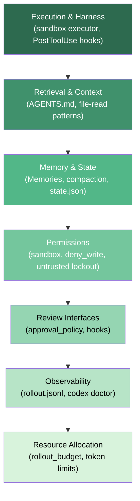
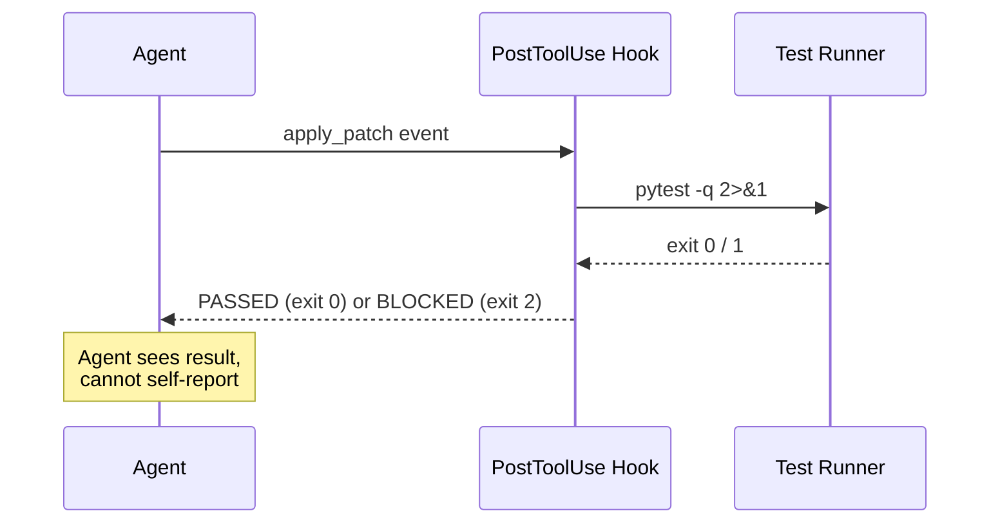

# The System Around the Model: Jarmak's Reliability Framework for Coding Agents and What It Means for Codex CLI


---

The dominant discourse around coding agent failures frames them as model problems: the LLM hallucinated a path, misread a spec, or lost context mid-task. Stephanie Jarmak's 314-page technical monograph — arXiv:2608.13867, published August 2026 — challenges that framing directly. Her central claim is stark: **many apparent model failures originate elsewhere in the system**.[^1]

The work synthesises 164 scholarly works, 100 practitioner records, 29 benchmarks, and 17 author-system case studies into 206 reliability records across 19 chapters, covering everything from run-to-run variance measurement to fleet scheduling.[^2] It is the most comprehensive systems-level treatment of coding agent reliability to date, and it maps with uncomfortable precision onto Codex CLI's architecture gaps.

---

## The Distributed Systems Reframe

Jarmak's organising metaphor is deliberate: the software factory (a coding agent pipeline producing commits, tests, and PRs) is a **distributed system**, subject to the same failure modes — partial failure, split-brain, causal ordering violations, and backpressure exhaustion — that make distributed systems hard.[^1]

This framing matters because distributed systems have four decades of reliability engineering literature behind them. Circuit breakers, bulkheads, idempotency keys, consensus protocols: these exist because distributed systems fail *structurally*, not randomly. The insight is that coding agent pipelines fail the same way.

A release gate that reads 10 inputs but receives 4 of them as self-reports from the component being gated is, in distributed systems terms, a consistency violation — the gating signal and the gated component are not independent.[^3] Jarmak's audit found this pattern was common. In Codex CLI terms: an AGENTS.md that instructs the agent to confirm it has run tests before calling a build tool, and then trusts that confirmation, has the same structural defect.

---

## The Seven-Layer Reliability Stack

The 19 chapters organise into four broad categories, but the operational picture is better understood as a vertical stack where weaknesses propagate upward:



**Layer 1 — Execution and Harness.** The harness is everything the agent runs inside: the sandbox, tool runners, shell permissions, and exit-code handling. Jarmak's key finding is that harness failures are silent — they produce a successful-looking tool response with no model error, so the agent proceeds on corrupted state. In Codex CLI, the sandbox executor enforces filesystem and network policy; `deny_write` paths block writes silently if misconfigured. PostToolUse hooks that exit with code 2 are the primary reliability gate here.[^4]

**Layer 2 — Retrieval and Context.** The monograph dedicates four chapters to retrieval — not because retrieval is unsolved, but because it is *over-trusted*. Agents treat first-retrieved context as ground truth. The recommended gate: retrieval must produce *localisation* (an identified line or symbol), not just *approximate proximity* (a file mention). An AGENTS.md `grep-then-read` directive is a localisation gate; a bare `cat` instruction is not.

**Layer 3 — Memory and State Management.** Jarmak distinguishes three failure modes: *local recovery* (agent re-derives lost state from scratch each turn), *replay pollution* (agent re-ingests stale compacted context as fresh), and *consolidation gaming* (agent self-reports durable learning that does not persist). Her gating rule: **freeze consolidation before deployment evaluation** — never credit test-time adaptation as long-term memory.[^2] Codex CLI's 5,000-token Memories store with 30-day decay is structurally flat; it has no eviction policy tied to validation outcomes.

**Layer 4 — Permissions.** Permissions are not a one-time setup; they are a per-task contract. The monograph recommends scoping permissions to the *narrowest surface required by the task*, not the broadest surface the agent might need. Codex CLI's `deny_write` key in `config.toml`, `untrusted_project` lockout (v0.150.0), and named profiles (which bind a model, sandbox policy, and approval mode together) compose into a per-task permission contract — but only if teams use named profiles per task type rather than a single global config.[^5]

**Layer 5 — Review Interfaces.** The monograph's chapter on verification interfaces identifies a critical failure: agents present diffs that are technically correct but *semantically misleading* — the explanation of what changed does not match what changed. The recommended pattern is to separate the diff view from the explanation and verify them against each other. Codex CLI's `approval_policy = "ask"` mode gives a human the diff; the explanation is the agent's summary, which may diverge from the diff in exactly the way Jarmak warns about.

**Layer 6 — Observability.** `rollout.jsonl` is Codex CLI's primary observability artefact: a JSONL log of every tool call, result, and turn transition in a session. Jarmak's monograph frames observability not as a debugging convenience but as a **reliability gate input** — observability data should feed back into task allocation and autonomy calibration.[^1] The `codex doctor` command provides point-in-time diagnostics; it does not yet feed session-level rollout data into routing decisions.

**Layer 7 — Resource Allocation.** The turn budget is not a cost control; it is a reliability primitive. Jarmak recommends setting turn ceilings at the **75th percentile of observed successful-run lengths** for a task class, with explicit success and failure exits at that boundary.[^2] Codex CLI's `rollout_budget` key maps directly. Most teams leave it unset.

---

## The Four Gated Practices

Across 193 gated practices, four appear as load-bearing across all layers:

### 1. Execution-Based Evaluation

> "Run candidate work in resource-bounded, network-isolated environments and allow propagation only when executable oracles succeed."[^2]

In Codex CLI: every commit-and-PR workflow should run tests inside the sandbox before the human-review step, not after. PostToolUse hooks that call `npm test` or `pytest` and return exit code 2 on failure are executable oracles. If they are not wired, the evaluation gate is missing.

```toml
# config.toml
[hooks]
post_tool_use = "scripts/verify.sh"
```

```bash
#!/usr/bin/env bash
# scripts/verify.sh — run tests after every write tool, block on failure
if [[ "$CODEX_TOOL" =~ ^(apply_patch|write_file)$ ]]; then
  npm test --silent 2>&1 || exit 2
fi
```

### 2. External Feedback Coupling

Each correction step must connect to **new information from a test, tool, verifier, or other external source**. A correction step that relies solely on the agent re-reading its own previous output is not external feedback — it is self-report. Jarmak flags this as the most common source of apparent model improvement that does not generalise.

In Codex CLI: an AGENTS.md instruction to "re-check your work before committing" produces self-report. An instruction to "run `pytest -x` and re-check only if it fails" produces external feedback coupling.

### 3. Layered Signal Evaluation

> "Combine any optimised proxy with at least one independent signal the agent cannot directly optimise against."[^2]

Test-pass rate is a proxy the agent can game (by deleting tests or special-casing test inputs). Combine it with `git diff --stat` line count, cyclomatic complexity metrics via a shell tool, or a second-agent review using a separate model profile. Named profiles in Codex CLI make dual-model review configurations straightforward.

```toml
# .codex/profiles.toml

[profiles.reviewer]
model = "o4-mini"
approval_policy = "never"  # fully autonomous reviewer pass
sandbox.deny_write = ["."]  # read-only: reviewer cannot modify output
```

### 4. Turn Budgets with Evidence

Set `rollout_budget` using observed session data from `rollout.jsonl`, not intuition. Parse successful runs to find the 75th percentile turn count per task class; set the ceiling there with an explicit AGENTS.md failure-exit directive for tasks that exhaust the budget without a verified artefact.

```bash
# Parse rollout.jsonl for p75 turn count across completed sessions
jq -s '
  map(select(.event == "turn_end" and .success == true) | .turn_count)
  | sort
  | .[(length * 0.75 | floor)]
' ~/.codex/logs/rollout.jsonl
```

---

## The Self-Report Problem in Codex CLI

The distributed systems audit Jarmak describes — four of ten release gate inputs being self-reports from the gated component — has a direct Codex CLI analogue.

An AGENTS.md file that says "after applying a patch, confirm the tests pass" relies on the agent confirming. The confirmation is a self-report. If the sandbox executor silently failed to execute the test runner (wrong interpreter path, missing dependency), the agent will still confirm. The harness failure is invisible to the agent.

The fix is to move the oracle outside the conversation loop. A PostToolUse hook that executes tests and returns a machine-readable result to the agent is external. An agent instruction that says "tell me the test output" is not — because the agent can interpolate, truncate, or misread the output before reporting it.



---

## Gaps in the Codex CLI Reliability Stack

Mapping Jarmak's 206 practices to Codex CLI's current feature set reveals structural gaps:

| Practice Layer | Codex CLI Feature | Gap |
|---|---|---|
| Execution oracle | PostToolUse exit 2 | No per-tool oracle configuration in config.toml |
| External feedback coupling | Hooks returning stdout | Agent sees full unstructured output — no schema |
| Layered signals | Named profiles | No built-in diff/complexity signal collection |
| Consolidation freeze | Memories 5K token | No validation gate before memory write |
| Observability feedback | rollout.jsonl | Not parsed into routing/allocation decisions |
| Autonomy calibration | approval_policy | Static config, not per-task adaptive |
| Turn budgets with evidence | rollout_budget | No p75 tooling; most teams leave unset |

The monograph's companion catalog is available open access.[^3] The 150 companion-only practices not developed in the book — covering contamination defence, benchmark protection, fleet scheduling, and cross-session memory — are worth reading against your AGENTS.md before your next production deployment.

---

## Recommendations for Codex CLI Operators

1. **Audit your harness first.** Before blaming the model, read your PostToolUse hook exit codes. A hook that exits 0 unconditionally is not a gate; it is decoration.

2. **Replace AGENTS.md self-confirmation instructions with external oracle calls.** "Confirm the tests pass" → "run `make test` and stop if it exits non-zero."

3. **Set `rollout_budget` from evidence.** Parse `rollout.jsonl` for your task class's p75 turn count. Default to 40 turns for feature tickets, 20 for bug fixes, 10 for refactors — then refine.

4. **Use dual profiles for layered signal evaluation.** A read-only reviewer profile on `o4-mini` running after the primary profile's commit provides an independent signal the primary agent cannot directly optimise against.

5. **Treat permissions as per-task contracts.** One `config.toml` with broad sandbox permissions is the distributed-systems equivalent of a single mutable shared resource — every task contends on it, and failures compound.

---

## Citations

[^1]: Jarmak, S. "Engineering Reliable Coding Agents: Evaluating and Operating the System Around the Model." arXiv:2608.13867 (August 14, 2026). <https://arxiv.org/abs/2608.13867>

[^2]: Jarmak, S. Companion Catalog — Engineering Reliable Coding Agents. Sjarmak.ai (2026). <https://www.sjarmak.ai/books/engineering-reliable-coding-agents/companion>

[^3]: Jarmak, S. [@sgjarmak]. "Software Factories are Distributed Systems." X (August 14, 2026). <https://x.com/sgjarmak/status/2089454647857869136>

[^4]: OpenAI. "Codex CLI v0.151.0 Release Notes." GitHub (August 29, 2026). <https://github.com/openai/codex/releases/tag/v0.151.0>

[^5]: OpenAI. "Codex CLI: Sandboxing and Permissions." Codex CLI Documentation (2026). <https://github.com/openai/codex?tab=readme-ov-file#sandbox-permissions>
