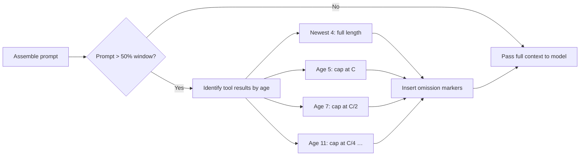
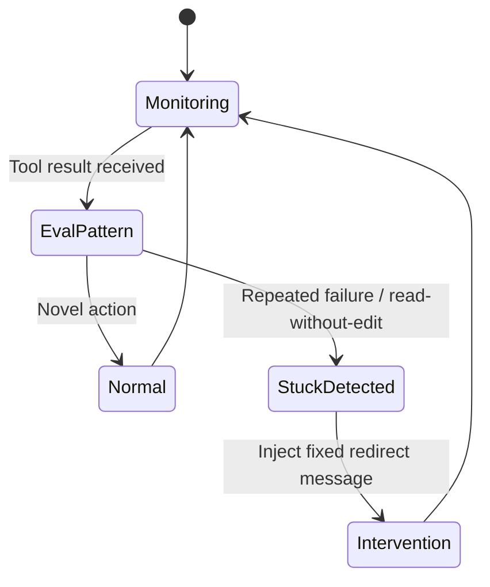
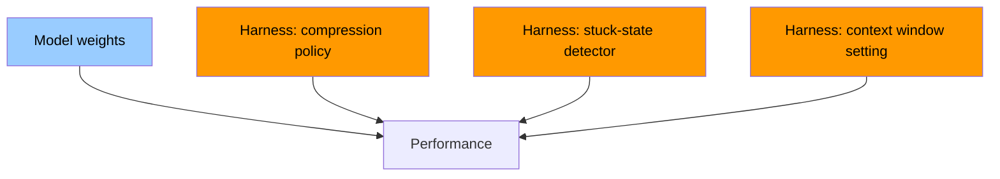

# Same Model, Different Harness: How Tool-Output Half-Life Compression Determines Coding-Agent Performance


---

A paper submitted to arXiv on 26 August 2026 poses a question that every Codex CLI practitioner should sit with: if you hold the model, the tasks, and the tools constant, can a different harness configuration change the outcome? The answer, per Sydney Lewis's "Same Model, Different Harness: Different Coding-Agent Results" (arXiv:2608.26218)[^1], is unambiguously yes — and the magnitude is uncomfortable.

On a 20,480-token window with Qwen3.6-35B-A3B, a single harness intervention lifts mean per-task fail-to-pass fraction (F2PF) from **28% to 49%** and raises complete SWE-bench Verified solutions from **43 to 72**.[^1] The only change is how the harness presents the model's own prior tool outputs to itself.

## The Core Finding

The study compares two configurations of the same harness — the Yuj framework — across three benchmarks (SWE-bench Verified, SWE-bench Pro, FeatureBench) and four open-weight models. The control arm supplies the full conversation in chronological order. The treatment arm applies a *half-life policy* to old tool results as the context fills.[^1]

The performance gap is consistent across models and window sizes:

| Model | Window | F2PF Control | F2PF Treatment | Solutions Δ |
|---|---|---|---|---|
| Qwen3.6-35B-A3B | 20,480 | 28% | 49% | +29 |
| Devstral | 20,480 | 17% | 37% | +31 |
| Nemotron (Mamba-2/Attn MoE) | 20,480 | 12% | 18% | +9 |
| Qwen3.8-27B (DeltaNet) | 20,480 | 20% | 35% | +22 |

On SWE-bench Pro at 49,152 tokens, the primary model moved from 15% to 33% F2PF and from 31 to 72 solutions. The treatment package was frozen — no per-model tuning.[^1]

## The Half-Life Policy

The compression mechanism is deliberately mechanical, requiring no model inference:

- The newest **four** tool results are preserved at full length.
- Older results receive caps that **halve logarithmically as age doubles**: the fifth-oldest is capped at *C* characters, the seventh at *C/2*, the eleventh at *C/4*, and so on.
- Within each capped result, the beginning and end are preserved and an omission marker inserted mid-body.
- The policy activates when the assembled prompt reaches **half** the configured context window.



No separate model call is needed; the harness reprocesses already-stored in-memory text before assembling the prompt for the next turn.[^1] At a 262,144-token window (effectively unconstrained), treatment and control F2PF values converge — but the treatment arm still serves approximately **7% fewer prompt tokens per turn**, because it never sends a full verbatim file-read from fifteen turns ago when a summary suffices.

## The Detector: Zero-Token Stuck-State Intervention

A second component addresses the stuck-turn problem: when the model issues the same failing command repeatedly, or reads files without making edits, the harness detects the pattern deterministically (no model tokens consumed) and inserts a fixed intervention message pointing toward a different approach.



The reading-boundary metric — the turn at which the model stops new file reads — moved to **two or more times the control location** across all three benchmarks, indicating that models in the treatment arm explore farther before converging.[^1]

## Evaluation Consequences

Lewis's central methodological claim is that benchmarks which report model-level scores without harness specification are incomplete: "coding-agent evaluations should treat the model and harness together as the tested solver."[^1]

This echoes an earlier longitudinal study (arXiv:2607.03691) that tracked 35 sequential Qwen Code CLI releases and found that resolve rates were uncorrelated with harness release velocity (ρ = 0.208, p = 0.231) whilst token consumption rose monotonically.[^2] Harness quality and harness quantity are orthogonal axes.

ProcCtrlBench (arXiv:2605.20251v4) independently documented the same failure modes Lewis targets — "Dead Step" (tool calls producing no new state change) and "Duplicate Step" (identical repeated calls) are two of its eleven defect categories, contributing to a Fragile Success Rate of 10.8–20.2% across measured systems.[^3] The half-life policy and detector address both mechanically.

## Mapping to Codex CLI

Codex CLI does not implement the half-life policy verbatim, but its configuration surface offers three points of contact:

### `tool_output_token_limit`

```toml
# ~/.codex/config.toml
[model]
tool_output_token_limit = 12000        # hard cap per stored tool output
model_auto_compact_token_limit = 180000 # full compaction trigger
```

`tool_output_token_limit` applies a **uniform cap** to every tool output regardless of age.[^4] Lewis's half-life policy is age-discriminating — recent outputs stay full — which is preferable: a grep result from thirty turns ago is less valuable than the file you edited two turns ago, even if both fit within the uniform cap. Consider a more conservative limit for the baseline and let hooks handle age-discriminating truncation.

### PostToolUse Hooks as a Detector

The stuck-state detector maps directly to a PostToolUse hook with exit code 2:

```toml
# .codex/config.toml  (project-level)
[hooks.post_tool_use]
  [[hooks.post_tool_use.entries]]
    command = "scripts/stuck-detector.sh"
    # exit 2 → inject message into next turn; exit 0 → pass through
```

```bash
#!/usr/bin/env bash
# scripts/stuck-detector.sh
# Receives CODEX_TOOL_NAME, CODEX_TOOL_OUTPUT, CODEX_TURN_INDEX via env
STATE_FILE=".codex/last-tool-$CODEX_TOOL_NAME.txt"
PREV=$(cat "$STATE_FILE" 2>/dev/null)
echo "$CODEX_TOOL_OUTPUT" > "$STATE_FILE"

if [[ "$CODEX_TOOL_OUTPUT" == "$PREV" ]]; then
  echo "⚠️  Identical output to previous $CODEX_TOOL_NAME call. Change approach: read a different file, edit rather than read, or search for the root cause rather than re-running the failing command." >&2
  exit 2
fi
exit 0
```

Unlike the model-based intervention used in some prior work, this costs zero inference tokens — the harness re-evaluates based on stored output strings, exactly as Lewis's implementation does.[^1]

### Named Profiles for Context Pressure

The paper's three window sizes map naturally to Codex CLI named profiles:

```toml
[profiles.tight]
model = "gpt-5.6-sol"
model_context_window = 20480
model_auto_compact_token_limit = 10000
tool_output_token_limit = 4000

[profiles.standard]
model = "gpt-5.6-terra"
model_context_window = 131072
model_auto_compact_token_limit = 100000
tool_output_token_limit = 12000

[profiles.generous]
model = "gpt-5.6-sol"
model_context_window = 262144
model_auto_compact_token_limit = 200000
tool_output_token_limit = 20000
```

Use `tight` for batch `codex exec` runs where token cost matters; `standard` for interactive TUI sessions; `generous` for long-horizon tasks where context preservation is paramount. The paper's results suggest that `tight` with a good age-discriminating compression policy can outperform `generous` with naive context accumulation.[^1]

### AGENTS.md Directives for the Model's Side

Complementing the deterministic detector, AGENTS.md can direct the model's own metacognition:

```markdown
## Stuck-State Recovery

If you observe yourself issuing the same shell command or reading the same file
for the second time without an intervening edit or new information, STOP.
Explain what hypothesis you expected to confirm, what the output revealed instead,
and propose a different approach before continuing.
```

This pairs with the hook: the hook catches exact output repetition; the AGENTS.md directive addresses semantic repetition (same intent, slightly varied command) that the deterministic check cannot see.

## The Architectural Implication

Lewis frames the result as a **completeness problem for benchmarks**, but the operational implication for practitioners is more direct: your Codex CLI configuration is as consequential as your model choice.



The orange nodes are under your control without any model retraining. A 21-percentage-point F2PF gain — from 28% to 49% — was achieved without touching model weights, fine-tuning, or prompting strategy.[^1] It came entirely from mechanical context management.

## Practical Checklist

Before your next Codex CLI session or `codex exec` batch run:

1. **Set `tool_output_token_limit`** to a value appropriate for your window — 10–15% of the context window is a reasonable heuristic.
2. **Set `model_auto_compact_token_limit`** to no more than 70% of the window, giving compaction room to produce quality summaries rather than forced truncation.
3. **Deploy a stuck-state PostToolUse hook** that exits 2 on identical consecutive tool output.
4. **Add an AGENTS.md stuck-state recovery directive** for semantic repetition the hook cannot catch.
5. **Version your `.codex/config.toml`** with the codebase — harness configuration is part of the solver, and your results are only reproducible if both are pinned.

The paper's key empirical point bears repeating: at a 262,144-token window, treatment and control F2PF values converge — but the treatment arm still consumes 7% fewer prompt tokens per turn. Good compression policy is not just a compensatory measure for tight windows; it is a baseline efficiency improvement for all window sizes.[^1]

## Citations

[^1]: Lewis, S. (2026). *Same Model, Different Harness: Different Coding-Agent Results*. arXiv:2608.26218. https://arxiv.org/abs/2608.26218
[^2]: Ben Sghaier, M. et al. (2026). *Don't Blame the Large Language Model: How Agent Harness Evolution Shapes Coding Agent Quality*. arXiv:2607.03691. https://arxiv.org/abs/2607.03691
[^3]: He, L. et al. (2026). *ProcCtrlBench: Evaluating Process-Level Defects and Control Preservation in LLM Coding Agents*. arXiv:2605.20251v4. https://arxiv.org/abs/2605.20251
[^4]: OpenAI. (2026). *Codex CLI Context Compaction: Architecture, Configuration, and Managing Long Sessions*. Codex Knowledge Base. https://codex.danielvaughan.com/2026/03/31/codex-cli-context-compaction-architecture/
[^5]: OpenAI. (2026). *Diagnosing and Reducing Codex CLI Token Consumption*. Codex Knowledge Base. https://codex.danielvaughan.com/2026/06/10/codex-cli-token-consumption-diagnosis-reduction-quota-drain-practitioner-toolkit/
[^6]: OpenAI. (2026). *Codex CLI Releases*. GitHub. https://github.com/openai/codex/releases
