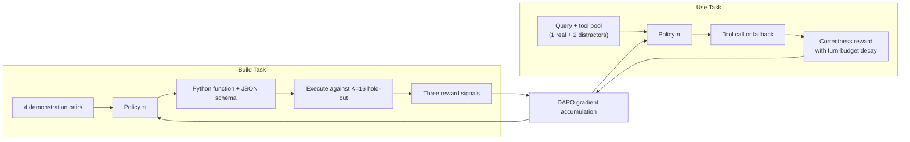
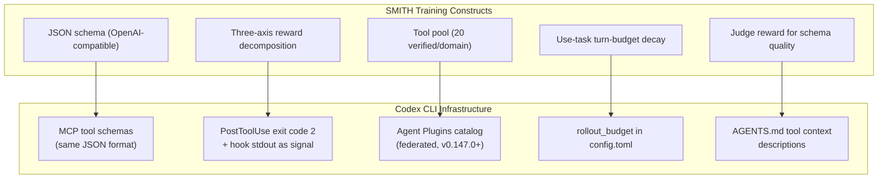

# SMITH: When a 4B Tool-Writer Beats a Frozen 30B — Implications for Codex CLI MCP Schema Design


## The Tool-Creation Gap

Every LLM agent is bounded by its tool inventory. Pre-written APIs handle what the developer anticipated; everything else is left to ad-hoc code generation inside the model's context window. The obvious fix — having the model write its own tools — has been explored since LATM[^1] and CRAFT[^2], but those approaches share a structural flaw: a *frozen* large model creates tools at inference time, and a (usually cheaper) smaller model then uses them. The tool-writer never receives feedback about whether the schemas it produces are actually invocable, so ambiguous interfaces accumulate without correction pressure.

SMITH (Schema-grounded Multi-task Iterative Tool Honing), from Tam, Lin, Chen, Sun, and Lee (arXiv:2608.24571), proposes a different answer: train tool creation and tool use inside a *single* RL policy so that every schema failure flows back as a gradient.[^3]

The headline result is striking: a 4B Qwen3 model trained with SMITH outperforms a frozen 30B model on held-out procedural reasoning benchmarks, while generating tools that — when handed to a separate 30B model — lift that model from 0.7% to 38.8% on TabMWP-Hard.

## How SMITH Works

The training loop alternates between two task types:

- **Build tasks**: The model receives N=4 question-answer demonstration pairs and must synthesise a Python function plus an OpenAI-compatible JSON schema — the same `{"type": "function", "function": {...}}` format used by Codex CLI's MCP tool surface.[^4] Tools are validated against K=16 held-out questions without access to ground-truth answers during generation.
- **Use tasks**: The model draws from a cached pool of 20 verified tools per domain (1 in-domain + 2 distractor schemas injected) and must invoke the correct tool within a 5-turn budget.

A single backward pass accumulates gradients from both task batches: `ℒ = ℒ_DAPO(ℬ_build) + ℒ_DAPO(ℬ_use)`.



### Three-Axis Reward Decomposition

SMITH separates failure modes that prior work collapsed into a single scalar:

**1. Execution reward (`r^env_build`)**: A format component (binary, 0.5 for parseable Python + valid JSON, matching signatures) plus an evaluation component (fraction of hold-out questions answered correctly). Schema ambiguity and signature mismatches surface here as direct execution failures.

**2. Judge reward (`r^judge`)**: An independent 30B LLM scores code correctness (`s_code`), schema quality (`s_schema`), and overall quality (`s_overall ∈ [0,1]`). Penalties: −0.5 for syntax errors, 0.5× reduction for signature misalignment. This signal is kept *separate* from execution reward so each failure mode contributes its own gradient — the ablation in Table 7 shows that removing the judge degrades RG (Unseen) from 79.9% to 67.8%.

**3. Correctness reward (`r^correct`)**: Efficiency-weighted accuracy with turn-budget decay: `r^correct = 2c · η(ρ)`, where `η(ρ)` interpolates between η_min=0.3 and η_mid=0.7 as turn fraction ρ grows. The model is penalised for burning turns, not just for failing.

## Results

### Benchmark performance (Qwen3-4B, LoRA r=64)

| Benchmark | SMITH | Best frozen baseline | Gap |
|-----------|-------|---------------------|-----|
| RG Seen (13 tasks) | 85.2% | 92.2% (ReTool 32B) | −7.0pp |
| RG Unseen (10 held-out) | **79.9%** | 76.5% (CRAFT) | +3.4pp |
| TabMWP-Hard | **40.4%** | 36.4% (TroVE) | +4.0pp |
| GQA (out-of-domain) | 42.6% | 56.0% (LATM-distill GPT-4.1) | −13.4pp |
| BFCL v4 (external) | **48.6%** | 45.1% (baseline) | +3.5pp |

ReTool achieves 92.2% seen-task accuracy by distilling from a 32B model, but its unseen-task score collapses to 63.2% — 16.7pp below SMITH. The 4B policy has learned to *generalise* tool schemas, not memorise training-distribution patterns.[^3]

### Cross-model transfer

The trained 4B model's tools transfer without modification to other model families:

- **4B writer → LFM2.5-350M user**: 42.9% RG Unseen — matching a frozen 30B writer (41.5%)
- **4B writer → Qwen3-30B user**: TabMWP-Hard 0.7% → 38.8% (+38.1pp)
- **8B SMITH**: RG Unseen 72.2% → 81.7%; TabMWP 42.4% → 56.7%

This cross-model transfer result matters for teams running heterogeneous model fleets — the policy that learns to write usable schemas writes them in a way that benefits *any* model that invokes them.

### Token efficiency

SMITH generates an average of 100 output tokens per tool invocation. Chain-of-thought reasoning requires 3,206 tokens (32× more). ReTool averages 633 tokens (6× more). For context-budget-constrained workflows this difference is meaningful.[^3]

## Codex CLI Mapping



### 1. MCP tool schemas: schema quality is execution quality

SMITH's execution reward fires directly when schema ambiguity prevents invocation. Codex CLI's MCP servers expose tools in precisely the same OpenAI-compatible JSON format.[^4] A schema with underspecified `required` arrays, vague parameter descriptions, or type mismatches between the JSON declaration and the Python implementation will produce identical failure modes in production as SMITH observed in training — incorrect argument construction, fallback to code generation, and turn-budget exhaustion.

Concretely: if your MCP server declares a `path` parameter as `type: string` but accepts both absolute and relative paths, the model must infer the convention from context. SMITH's execution reward would penalise this by failing validation against hold-out questions; in Codex CLI, you'll see it as repeated retries or patched calls before the model lands on the correct form.

```toml
# config.toml — name MCP servers clearly; their tool schemas are the primary signal
[[mcp.servers]]
name = "file-ops"
command = "npx"
args = ["-y", "@company/file-ops-mcp"]
# Tools in this server should have explicit enum constraints and required arrays
```

### 2. AGENTS.md as an approximation of the judge reward

SMITH's judge reward scores schema *quality* independently of execution outcomes. In Codex CLI, `AGENTS.md` is the closest available mechanism: it lets you assert tool conventions, expected parameter formats, and usage constraints that the model factors into its tool-construction decisions before any execution occurs.[^5]

```markdown
<!-- AGENTS.md — document MCP tool conventions -->
## Tool Usage Conventions

### file-ops MCP
- `read_file`: `path` must be absolute. Relative paths are rejected.
- `write_file`: Always specify `mode` ("create" | "append" | "overwrite"). Default is NOT assumed.
- `search_files`: `pattern` follows glob, not regex. Use `**/*.ts` not `.*\.ts`.

Ambiguous calls will fail silently. Resolve schema questions from this file before invoking.
```

### 3. PostToolUse hooks as the correctness signal

SMITH's correctness reward with turn-budget decay is a training-time analogue of what `PostToolUse` hooks enable at runtime. A hook that exits with code 2 on detecting invalid tool output, stalled state, or schema mismatch is the closest production equivalent to SMITH's closed-loop correction pressure.[^6]

```bash
#!/usr/bin/env bash
# PostToolUse: mcp-schema-validator.sh
# Exits 2 if MCP tool output is empty or contains a known schema-mismatch error
output="$CODEX_TOOL_OUTPUT"
if echo "$output" | jq -e '.error.code == -32602' > /dev/null 2>&1; then
  echo "Schema mismatch: invalid params. Check AGENTS.md for correct argument types." >&2
  exit 2
fi
```

### 4. Agent Plugins catalog as a tool pool

SMITH maintains a verified pool of 20 tools per domain. Codex CLI's Agent Plugins (v0.147.0+) with federated catalog search — local, personal, workspace, and remote catalogs — is the runtime equivalent.[^4] The SMITH finding that distractor schemas reduce use-task accuracy when they share parameter names with the correct tool has a direct implication: plugin naming collisions in multi-catalog environments will cause the same confusion.

## Practical Recommendations

Three changes that follow directly from SMITH's architecture:

1. **Audit every MCP tool schema for `required` completeness and type precision.** Run `codex doctor` and inspect the tool schemas your MCP servers export. Parameters that are effectively required but marked optional will trigger the equivalent of schema-format failures SMITH saw in early training iterations.

2. **Write AGENTS.md conventions *before* you connect a new MCP server.** SMITH's judge reward fires on schema quality even when the execution reward does not — documenting conventions in AGENTS.md provides a similar early signal to the model before any invocation attempt.

3. **Set `rollout_budget` when your MCP tools are deterministic.** SMITH's turn-budget decay (`η(ρ)`) penalises unnecessary turns. Tools that return structured, verifiable verdicts allow tighter budgets; tools that return free-text responses that require interpretation consume more turns. Match your `rollout_budget` to the tool quality, not the task size.

```toml
# config.toml
[features]
rollout_budget = 40        # tight budget for structured MCP tool workflows
model_auto_compact_token_limit = 60000
```

## Gaps and Open Questions

SMITH has limitations that map onto open problems in Codex CLI:

- **No parallel tool calls**: SMITH's policy never issued parallel invocations. Codex CLI supports concurrent MCP calls; whether jointly-trained schemas degrade under concurrency is untested.[^3]
- **Python + JSON only**: SMITH does not address multi-file packages, shell scripts, or MCP server manifests. Agent Plugins extend the artifact scope significantly beyond what SMITH's training covers.
- **Judge dependency**: The 30B judge is not self-hosted. Teams with proprietary tool ecosystems cannot reproduce the judge reward without an equivalent internal model. ⚠️

The core insight — that schema quality and tool-use capability must be optimised together, not sequentially — is directly actionable for MCP server design regardless of whether you train your own policy.

## Citations

[^1]: Cai et al., "Large Language Models as Tool Makers" (LATM), ICLR 2024. <https://arxiv.org/abs/2305.17126>
[^2]: Yuan et al., "CRAFT: Customizing LLMs by Creating and Retrieving from Specialized Toolsets", arXiv:2309.17428. <https://arxiv.org/abs/2309.17428>
[^3]: Tam, Lin, Chen, Sun, Lee, "Joint Optimization of Tool Creation and Use for Large Language Model Agents" (SMITH), arXiv:2608.24571, August 2026. <https://arxiv.org/abs/2608.24571>
[^4]: OpenAI Codex CLI — MCP Integration documentation and Agent Plugins v0.147.0 release notes. <https://github.com/openai/codex/releases/tag/rust-v0.147.0>
[^5]: OpenAI Codex CLI — AGENTS.md specification and tool conventions. <https://github.com/openai/codex/blob/main/docs/agents-md.md>
[^6]: OpenAI Codex CLI — Hooks reference (PostToolUse, exit code semantics). <https://github.com/openai/codex/blob/main/docs/hooks.md>
